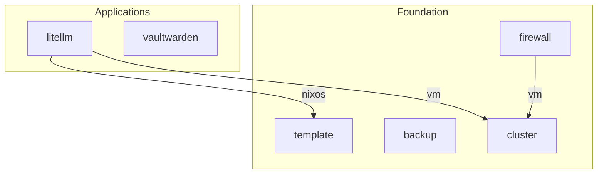

Generate a Mermaid dependency graph of all TAPPaaS modules and write it to `src/module-dependencies.md`.

## Steps

### 1. Load the module registry

Read `src/modules.json` and collect modules from these lists only:
- `foundationModules`
- `applicationModules`

Also scan for provider-only modules not in the registry (e.g., `src/foundation/cluster/cluster.json`) that have a `provides` array.

**Exclude** `proxmoxTemplates` and `testModules` from the graph entirely.

### 2. Read each module's JSON file

For each module entry, read the JSON file at the `moduleJson` path and extract:
- `vmname` (or `moduleName` as fallback)
- `dependsOn` array (list of `"provider:service"` strings, may be empty or absent)
- `provides` array (list of service name strings, may be empty or absent)

Skip any module whose JSON file does not exist on disk.

### 3. Build the provider index

Create a mapping of `"module:service"` to the provider module name by iterating all modules and their `provides` arrays. For example, if `cluster.json` has `"provides": ["vm", "ha"]`, record:
- `cluster:vm` -> `cluster`
- `cluster:ha` -> `cluster`

Include providers from proxmoxTemplates in the index (so arrows to `template:nixos` etc. resolve correctly), but do NOT include proxmoxTemplates as consumer nodes in the graph.

### 4. Build the dependency edges

For each module (foundation + application only), iterate its `dependsOn` entries. For each `"provider:service"` string:
- Look up the provider module name from the provider index
- Record an edge: `consumer` --service_name--> `provider`

### 5. Generate the Mermaid graph

Create a Mermaid `graph TD` (top-down) diagram with:

- **Subgraphs** listed in this order (top to bottom):
  1. `Applications` for applicationModules (consumers at the top)
  2. `Foundation` for foundationModules plus any provider-only modules like cluster and template
- **Within Foundation**, list `cluster` last so it renders at the bottom (it is the lowest-level provider)
- **Nodes** for each module, using the module name as both ID and label
- **Arrows** pointing from consumer down to provider, labeled with the service name:
  ```
  consumer -->|service| provider
  ```
- Deduplicate edges (if multiple modules create the same consumer→provider→service triple, show only one arrow)

Example Mermaid output:


### 6. Write the output file

Write the complete markdown file to `src/module-dependencies.md` with:
- A title: `# TAPPaaS Module Dependency Graph`
- A brief description explaining what the graph shows (arrows point from consumer to provider, labeled with the service used)
- The date it was generated
- The Mermaid code block
- A summary table listing each module, what it provides, and what it depends on

### 7. Report

Show the user a summary of:
- How many modules were processed
- How many dependency edges were found
- The path to the generated file
