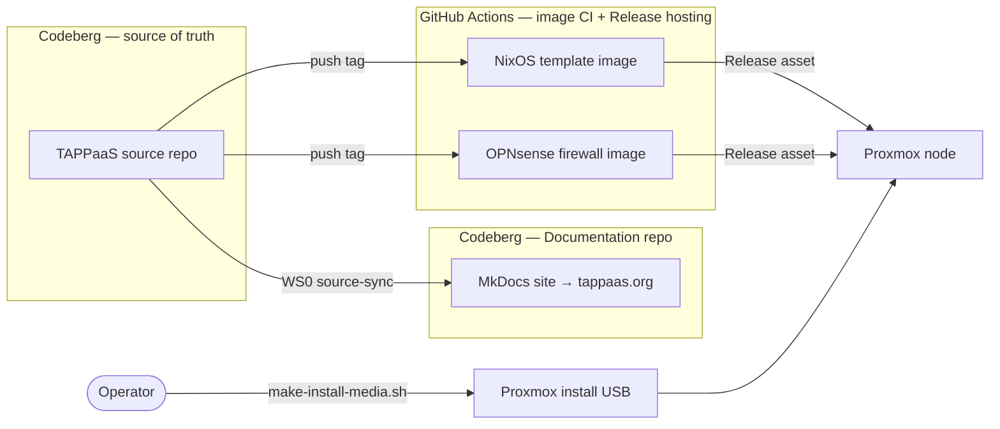

# Building TAPPaaS

How the artifacts that make up a TAPPaaS deployment are produced: the Proxmox
install media, the prebuilt VM images (NixOS template, OPNsense firewall), and —
in a separate repo — the documentation site.

Two facts shape everything below:

- **Codeberg (`codeberg.org/TAPPaaS/TAPPaaS`) is the source of truth** for code,
  issues and PRs. See [docs/codeberg-migration.md](docs/codeberg-migration.md).
- **GitHub (`github.com/TAPPaaS/TAPPaaS`) is a mirror** of the Codeberg source —
  it holds no independent history. The one thing that runs there is the **image
  build CI (GitHub Actions)**, whose output is hosted as **GitHub Release
  assets**. That lives on the mirror *only* because open-source repos get free
  Actions minutes and free Release bandwidth for the multi-GB images; nothing
  else depends on GitHub.

---

## 1. Proxmox install media

There is **no custom Proxmox host image**. TAPPaaS installs *stock* Proxmox VE and
layers configuration on top via the `cluster` foundation module. The only build
step is turning the stock ISO into an unattended installer stick.

- **Script:** [src/foundation/cluster/make-install-media.sh](src/foundation/cluster/make-install-media.sh)
- **Tech:** Proxmox's own `proxmox-auto-install-assistant` (`validate-answer` +
  `prepare-iso --fetch-from iso`), driven by a generated `answer.toml` (four
  operator answers: email, locale, root password, boot disk). On macOS the
  Linux-only assistant is run inside a `debian:trixie` Docker container; on Linux
  the `.deb` is fetched from `download.proxmox.com`. `xorriso`/`cpio` inject an
  ask-at-install boot-disk prompt into the installer initrd; `dd` writes the USB.
- **Runner:** none — this is a **manual operator script**, run anywhere (there is
  no PVE yet on the first node; chicken-and-egg).
- **Result:** a bootable USB stick. Not published anywhere.

See [docs/design/node-provisioning.md](docs/design/node-provisioning.md) (N2) and
the `cluster` module ([src/foundation/cluster/](src/foundation/cluster/)).

## 2. NixOS template image

The prebuilt, pre-configured NixOS VM template that every foundation/app VM is
cloned from.

- **Source:** [src/foundation/templates/flake.nix](src/foundation/templates/flake.nix)
  — a Nix flake pinning `nixpkgs` to `nixos-25.11`, baking in
  [tappaas-common.nix](src/foundation/templates/tappaas-common.nix) (the
  hardware-agnostic TAPPaaS baseline; no `hardware-configuration.nix` — the image
  format module supplies disk/fs/EFI). Output: `packages.x86_64-linux.image`, an
  EFI qcow2 (`nix build .#image`, i.e. `nixos-rebuild build-image
  --image-variant qemu-efi`).
- **Runner / CI:** GitHub Actions,
  [.github/workflows/build-nixos-template-image.yml](.github/workflows/build-nixos-template-image.yml),
  on a hosted `ubuntu-latest`. Nix is installed via
  `DeterminateSystems/nix-installer-action`; the image is built with `nix build`,
  compressed with `zstd -19 --long=27`, and published with
  `softprops/action-gh-release`.
- **Trigger:** push a tag `nixos-template-v<version>` (or manual `workflow_dispatch`).
- **Result:** a GitHub Release asset with the **stable, unversioned** name
  `tappaas-nixos.qcow2.zst` — the release *tag* carries the version. The consumer
  pointer is [tappaas-nixos.json](src/foundation/templates/tappaas-nixos.json)

```mermaid
flowchart LR
  TAG[git tag nixos-template-vX] --> GHA[GitHub Actions ubuntu-latest]
  GHA -->|nix build .#image| QCOW[EFI qcow2]
  QCOW -->|zstd -19| ZST[tappaas-nixos.qcow2.zst]
  ZST -->|action-gh-release| REL[(GitHub Release)]
  REL -->|Create-TAPPaaS-VM.sh: curl + zstd -d| NODE[Proxmox node]
  NODE -->|qm importdisk → tanka1| DISK[imported disk]
  DISK -->|qm template vmid 8080| TPL[VM template]
```

  (`imageLocation` → `releases/download/nixos-template-v<version>/`).

**Consumption** happens on the first Proxmox node during foundation install:
[install-platform.sh](src/foundation/cluster/install-platform.sh) (Phase A
`build_template`) calls
[Create-TAPPaaS-VM.sh](src/foundation/cluster/Create-TAPPaaS-VM.sh), which `curl`s
the asset, `zstd -d`s it, `qm importdisk`s it into the storage pool (`tanka1`),
and `qm template`s VMID 8080 into a reusable template.

## 3. OPNsense firewall image

The preconfigured firewall image (issue #231) — the OPNsense analog of the NixOS
template.

- **Source:** a base installed OPNsense qcow2 (pinned upstream:
  `maurice-w/opnsense-vm-images`) with TAPPaaS management config injected into
  `/conf/config.xml` from
  [src/foundation/firewall/firewall-config.xml.template](src/foundation/firewall/).
  It boots fully configured (LAN `10.0.0.1`, DNS/DHCP, hostname `firewall`, API).
- **Runner / CI:** GitHub Actions,
  [.github/workflows/build-opnsense-image.yml](.github/workflows/build-opnsense-image.yml).
  The config injection runs **inside a FreeBSD VM** (`vmactions/freebsd-vm`)
  because Linux cannot write UFS2; `zstd`-compressed and Release-published like the
  NixOS image.
- **Trigger:** push a tag `opnsense-firewall-v<version>` (or manual).
- **Result:** GitHub Release asset `tappaas-firewall.qcow2.zst`.
- **Secrets model — bootstrap-then-rotate:** the public image bakes a well-known
  bootstrap API key + root password; on first deploy `config-firewall.sh` rotates
  both to unique values over the API and deletes the bootstrap key. Never leave a
  deployed firewall on bootstrap creds.

## 4. Documentation build

The documentation site is built in a **separate repo** and published to
**Codeberg Pages** at [tappaas.org](https://tappaas.org). It is MkDocs (Material)
built by Woodpecker CI; a source-sync step copies allow-listed `README.md` /
`INSTALL.md` / `DESIGN.md` files out of *this* repo into the site at build time,
so upstream docs stay canonical here and are never hand-copied.

The full documentation build — the sync mechanism, the CI pipeline and the
Pages hosting — is documented in the Documentation repo:

**→ [Documentation/BUILD.md](https://codeberg.org/TAPPaaS/Documentation/src/branch/main/BUILD.md)**
