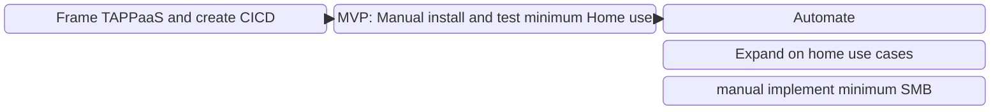

*© 2025. This work is openly licensed via [MPL-2.0](https://mozilla.org/MPL/2.0/.).*

# It is all there, nothing needs to be invented

Reading through the Vision for TAPPaaS it can easily be viewed as this is an impossible large mission that would be impossible to accomplish without a significant financial backing and a considerable time.

However we have identified that most of the vision can be realized using existing open source software.
The "only" task left is to:
- Curate the list of open source software to use
- Integrate it, again typically this have already been done
- Document and automate

# Design Principles

We have compiled a set of principles we want to follow in designing and constructing TAPPaaS:

- Every component of TAPPaaS must be Free and Open Source (FOSS). 
  - We do not mind software packages that are developed and "owned" by commercial companies, as long as the package is FOSS
- Reduce choice: Choice is good, but too much choice is barrier to entry. 
  - We if there are several good option for providing a functionality, then we make the decision in TAPPaaS. 
  - we will not prevent users of TAPPaaS to replace components/modules, but the default should be good enough
- Prefer tested, actively maintained and mature software
- Integrate and Automate: It is essential that a module in TAPPaaS is easy to install and once installed it integrate with relevant other modules. 
  - If the module require users to be set up, then it need to integrate with the TAPPaaS identity management systems
  - Modules should be integrated with the TAPPaaS backup system and the health monitoring system and the Security monitoring systems
  - any integration to the Firewall and reverse tunnel proxy of TAPPaaS should be done.
  - ...
- Separate experience of Develop, Deploy/Install, Maintain and Use!
  - Think about how modern heat exchange based house heating is done: DEveloping a new heat exchange is an engineering task. Deploying/Installing a heat exchange in you home, community, require some specialist knowledge and takes a few days. Maintaining a heat exchange is a service check every 1 year by service technician. Using a heat exchange is simply dialing in the temperature in each room.
  - we would like to initially get TAPPaaS to a state where installing still takes specialist knowledge and take a day or two. but maintenance is very low and use is intuitive and simple.

# Eating the elephant one bite at a time

(disclaimer: no elephants were harmed creating TAPPaaS)

Even though there is enough open source software out there to cater for most of the TAPPaaS needs then there is an almost endless amount of software modules and details to work out and integrate. For that reason we are following the following conceptual roadmap:

We are done with Framing, working hard on an MVP
