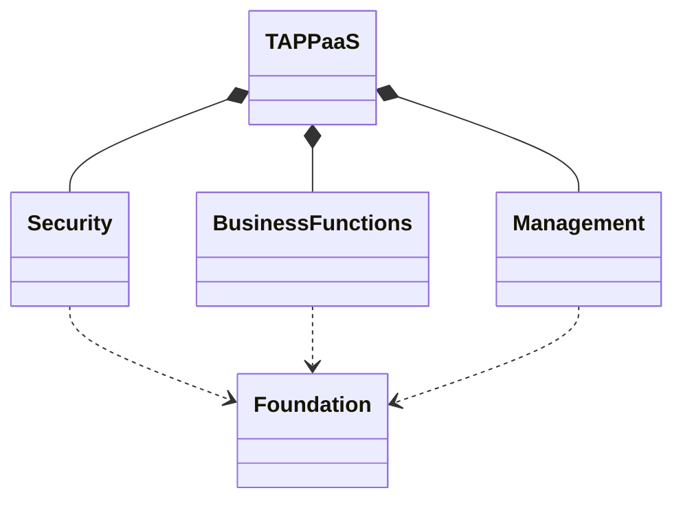
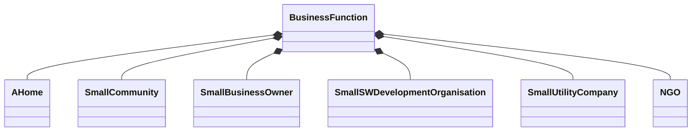
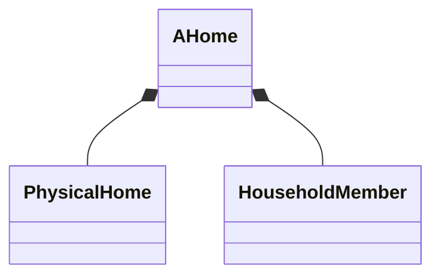

# A Capability Model for TAPPaaS

## Introduction

TAPPaaS is designed both top down and bottom up. Top down we looked at the capabilities needed to adress the needs described in the [Vision](../Vision.md). THe bottom up have been looking at real software and real implementations to determine what is possible and what makes sense

Here we are trying to bring this together in a structured manner. This is a description of WHAT we wnat TAPPaaS to deliver. The HOW to deliver it is in the [SoftwareStack](TheSoftwareStack.md)

## TAPPaaS high level structure

As with most complex IT solutions you can divide the capabilites of the solution into some dependen sub system.
At the very high level we structure the capabilities into the following groups

In the following we decompose the high level capabilities

## Busines Functions

Business Functions is what this is all about: providing functions to the users of TAPPaaS. all the other parts like foundation, Management and Security is just there to ensure that you can get the IT you need working in a stable, scalable, secure, private and maintainable way.

What Business function is essential to each deployment of TAPPaaS will differ, but we define a set of functions that TAPPaaS should support based on the typical deployment. You can configure what is relevant for you deployment.

Note we are using the word "small" a lot. Make no mistake, TAPPaaS as a core architecture can scale up, but our initial design criteria is to cater for the SMB/Home out of the box.

### Capabilites needed by a home

Functionality can be grouped into functionality that is linked to a physical home, and thus stays with home and functionality that is linked to a user but is not bound to the physical home (except through the foundation layer and possible integrations)

#### Physical Home Related

So the functions we are aiming at:

- smart lighting
- smart heat system
- Smart Sprinkler system
- Weather monitoring
- Smart AVR
- House Butler (AI)

#### Houshold Member Related

- Email: you want to own you emails and email adress
- Address book
- Calendering: need to be sharable within home and community and externally
- Note taking: must be sharable
- photo upload, storage and sharing: Need to have good indexing and sharing functionality
- music library: own your music, need to be streemable. and sharable
- video library
- podcast library
- Document store: Can be very private or shared across a user group
- Virtual Assistant: you personal AI in a box
- eBook bookshelf

### Small Community

Note a small community can start with a single home, and will contain all the functionality of a Home deployment of TAPPaaS

However with a Community deployment you would want to add a few more functionalities

- WiFi rooming: Make it possible to move around the comunit and preserve access to same Wifi
- Internet sharing (with redundancy): 10 households having 10 Internet connections is overkill
- Public book shelf: Local hosted wikiedia, gutenberghus, .... Ensure access to information in case of internet outage
- Community Social
- Video Conferencing

### SMB

- Corporate email
- Corporate web site
- ERP system
- Office WiFi: Ensure there is a dedicated WiFi for SMB workers and guests
- Corporate VPN
- Video Conferencing
- Chat

### Software Development

- Git Repository
- CI-CD
- Chat
- Backlog management
- Application Platform
- Reverse Proxy

### Small Utility

- Industrial Strength Firewall
- Network seperation (VLANs)
- VPN

### NGO

Generally an NGO need the same functionality out of the box as the SMB, but there are important design criterias
- Strict Privacy
- Easy to setup and maintain
- Cost efficient
- Remote deployment and backup
- must function without internet access

## Security

We separate between the physical security and virtual security measures we need in a Home.
The Physical security can be considered a Business function. 

#### Physical Security

- Video Surveillance
- Electronic locks
- Door Camera and Ring
- Neighborhood Threat monitoring

#### Virtual Security

- User and access Management
- 2FA
- Password and key management
- Backup
- Firewall
- Encryption 
  - at rest
  - in transit
- Remote access
- Threat detection
- Threat monitoring

## Management

- Dashboard
- Operational monitoring
- Update and patch management

## Foundation

- Unbreakable Power
- Compute
- Storage
- Connectivity 
  - VLAN seperations
  - WAN and Firewall
  - Switch and Access Points
  - DHCP and DNS
  - DMZ with Reverse Proxy
- User Management