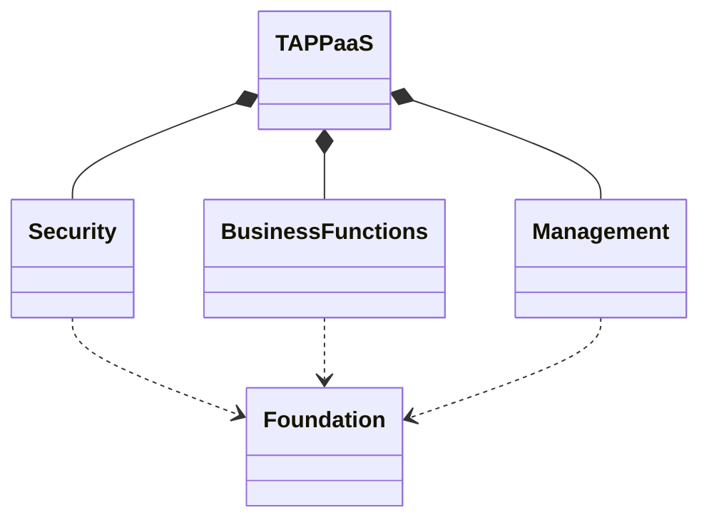
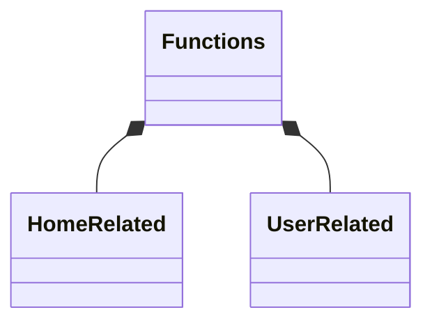

# A Capability Model for TAPPaaS

## Introduction

TAPPaaS is designed both top down and bottom up. Top down we looked at the capabilities needed to adress the needs described in the [Vision](../Vision.md). THe bottom up have been looking at real software and real implementations to determine what is possible and what makes sense

Here we are trying to bring this together in a structured manner. This is a description of WHAT we wnat TAPPaaS to deliver. The HOW to deliver it is in the [SoftwareStack](TheSoftwareStack.md)

## TAPPaaS high level structure

As with most complex IT solutions you can divide the capabilites of the solution into some dependen sub system.
At the very high level we structure the capabilities into the following groups

In the following we decompose the high level capabilities

## Busines Functions

Functions is what this is all about: providing functions to the members of your home. all the other parts like foundation, Management and Security is just there to ensure that you can get the IT you need working in a stable, scalable, secure and maintainable way

Functionality can be grouped into functionality that is linked to a physical home, and thus stays with home and functionality that is linked to a user but is not bound to the physical home (except through the foundation layer and possible integrations)

#### Home Related

So the functions we are aiming at:

- smart lighting
- smart heat system
- Smart Sprinkler system
- Weather monitoring
- Smart AVR
- House Butler (AI)

#### User Related

- email
- Address book
- Calendering
- Note taking
- photo storage and sharing
- music library
- video library
- podcast library
- Document store
- Virtual Assistant
- eBook bookshelf

## Security

We separate between the physical security and virtual security measures we need in a Home

#### Physical Security

- Video Surveillance
- Electronic locks
- Door Camera and  Ring
- Neighborhood Threat monitoring

#### Virtual Security

- User and access Management
- 2FA
- Password and key management
- backup
- Firewall
- Encryption 
  - at rest
  - in transit
- Remote access
- Threat detection
- Threat monitoring

## Management

- Dashboard
- Operational monitoring
- update and patch management
- manage friends and members of House
- Manage move of home

## Foundation

- Unbreakable Power
- Compute
- Storage
- Connectivity 
  - local
  - WAN