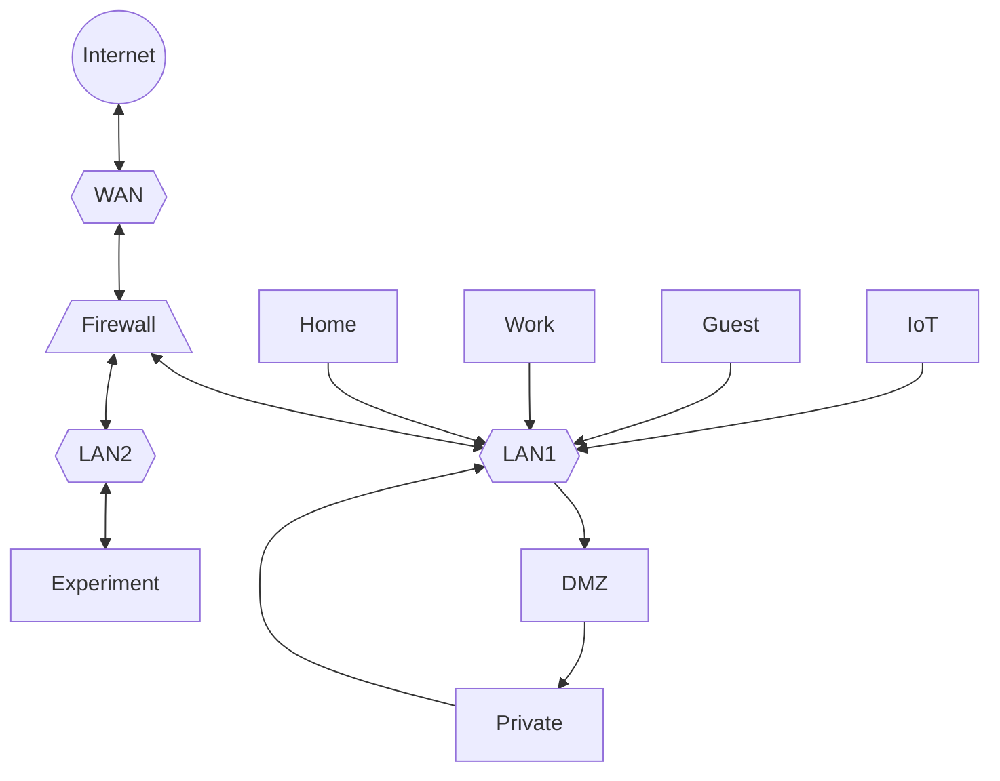

# Configuration

This define the configuration of the SW stack to deliver the capabilities

## Network and Firewall

### Firewall/Router

Virtual machine under Proxmox: 4G ram, 16G Disk, and 4 cores
3 Ethernet ports in passthrough mode. No virtual bridge
PfSense configured with Wan/Lan/Experimental ports

### IP Address management

We encourage using both IPv4 and IPv6. 
We assume that the upstream ISP gives 1 public IPv4 and a full /64 IPv6

IPv4 behind NAT we configure 192.168.x.y
x equals the VLAN and y gives a /24 per VLAN

/64 is divided into domains per VLAN

### VLANs

We need at least 4 Vlans. but potentially many more

With every VLAN there is an administrative overhead so only with decent automation will this work

The most important 4 are:
- Private: Where the service infrastructure live
    - Block: any incoming connections
    - accept access on defined services services from DMZ
    - Full outgoing internet access
    - Full access to all other VLANs
- Home: The regular home devices like iPads, PC, ...
    - Block: any incoming connections
    - Full outgoing internet access
    - Access to IoT VLAN
    - Printer sits on this network
- Guest: got guest of the house. separate from rest of infrastructure
    - Full outgoing internet access
    - Block: any incoming connections
- IoT: for unsecure Internet of things devices
    - Full outgoing internet access (or better block except defined ports and IP ranges, but difficult to maintain)
    - Block: any incoming connections

But in reality we should also have:

- Work: Separate from rest of the infrastructure of the house
    - configured as HOME, with a route to the printers in HOME
- DMZ: Proxy place for the services exposed to the internet
    - Block all from Internet except well defined service ports
    - Limited access to Internet, only open for needed ports
- Experiment: for stuff that is not safe yet. Not a VLAN but a physical port on the Firewall.
    - configured as Guests
    - use 10.0.0.0/8 IP (to make it clear it is different, and possible to attach a full IT4HOME server cascade)
- further IoT VLANS per unsafe home device: by separating IoT devices to a separate VLAN then we can prevent said devices to "hack" our home. By further separating each manufacturer we can prevent one IoT vendor to hack the rest of our IoT estate.

### Domain hosting

Register a top level domain to you home: (for instance family.home)

We want IT4HOME to have external access and an identity. (which you can bring with you if you move, change ISP or other provides)

There are two options for Domain hosting:
1) use one of the many fine provides.
2) Run your own DNS authoritative name hosting

The first options is easy to setup, however you are dependent on a commercial provider and importantly if there is global internet connectivity issues then even local name lookup will fail.

However in order to have a consistent uptime of DNS then need to have two DNS authoritative name servers preferably on different networks on the Internet. This imply this require collaborations with other IT4HOME users

### DNS 

We do not recommend using the local ISP DNS service. It is often not "clean" and will enable ISP to track activities

Run a recursive DNS server. Easy to setup in PFsense

### DHCP

Setup a masquerading DHCP server in each VLAN
Pin IP numbers for servers

### VPN

Use the build in PFSense VPN.

### Advertisement blocking: pfBlockerNG

alternative: PIhole, but pfblockingNG is native package to PFSense
COnfigure with standard setup

### Proxy: Traefik

Alternative: Nginx

Traefik is more modern in configuration and certificate management
together with Letsencrypt we configure a wildcard certificate for our domain
configure traffic to pass through 

## Proxmox basis

### Authentication: Authentik

User admin should potentially be via LDAP to be used by all services that needs user administration (NextCloud, Jellyfin, HomeAssistant, VPNs, ...)

This is a fundamental service and is configured in a separate LXC (Using docker)

It needs to be made available through Traefik

### Password management - Bitwarden

Create a Bitwarden server
Alternative is to buy the Bitwarden server, but we need to take backup of that service then

## Next Cloud

Configure in VM: VM disk must be on zfs
all Nextcloud storage is internal to the VM. this way we can use PFBackup server for the VM and get consistent backup.
Also it is possible to sync between two home servers to have a hot standby with fail over

### Core installation

### User Admin

### Calendar system

## Home Assistant

## Frigate

## Upgrade and Backup
