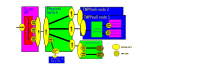

*© 2024. This work is openly licensed via [MPL-2.0](https://mozilla.org/MPL/2.0/.).*

# TAPPaaS Network design

## Introduction

There are a number of parts to the TAPPaaS network design:

- The local TAPPaaS network topology, managed as a VLAN overlay network
- The firewall and router: manage the routing and traffic control between elements of the TAPPaaS network topology as well as the access to and from the Internet
- The switching infrastructure: In very small TAPPaaS installations the switching is purely virtual but in most cases there is both virtual switching in the virtualization nodes of TAPPaaS and there is a need for physical switching equipment. 
- IP number allocations
- The Wifi access points (AP): It is not a priority to manage APs in TAPPaaS and advanced APs are difficult to get as open source. So TAPPaaS is making suggestions for what needs to be configured, not how to do it.
- The Network services: This is DNS, DHCP, 
- The connectivity proxies
- The network monitoring

We recognize that for some it will make sense to reuse existing firewall, switching and WiFI access points. in which case TAPPaaS just makes recommendations to how those components are configured. But in the ideal case TAPPaaS controls all of this infrastructure.

## TAPPaaS network topology

Moving to a self host setup introduce a number of security challenges, and to deal with this we are segmenting TAPPaaS.
The cost of segmentation is more challenges in connecting the relevant components together, and secondly a lot of "internal" traffic will now need to be routed between networks, draining resources that could have been used elsewhere. 

In the TAPPaaS design we are trying to reach a balance between simplicity and security, but we are leaning towards security more than simplicity

In the diagram the Arrow represent connectivity between segments. The direction indicate who can initiate the traffic (TCP)

The segments are:

- HOME: This is where alle the services for a home resides, such as Home Assistant, NextCloud for file sharing, .... There can be several "homes" in a TAPPaaS setup.
- IoT: This is where alle the IoT equipment in the environment lives. IoT is generally considered more insecure. Home can access IoT, but not the other way around. If you have particular problematic devices or manage several homes then you can have several IoT segments that are isolated from each other
- Mgmt: Management section, this is for self management of TAPPaaS. generally the management segment can connect to everything (except for Guest)
- DMZ: Demilitarized Zone, this is the only place traffic from the internet can enter a TAPPaaS system. it is a reverse tunnel proxy, so it will not be abel to access anything else in TAPPaaS: Services in HOME or other systems that needs to expose services externally will connect to the DMZ.

## Router and Switching infrastructure

The Router/switch infrastructure for TAPPaaS can be pictured this way

### About IP and VLAN numbers

TAPPaaS support IPv4 and IPv6. and in the ideal world the TAPPaaS system plugs into an Internet connection that hands out One public IPv4 and at least a /54 IPv6 range. TAPPaaS can function without IPv6 connectivity, and with no public IPv4.

For IPv4 TAPPaaS do NAT translation to an internal 10.0.0.0/8 network

Each of the network segments in the TAPPaaS network topology has its own IP sub range and traffic is tagged with VLAN tags when sent through the switching infrastructure. For the VLANs TAPPaaS is using a 3 digit tag, where the first digit indicate the type of VLAN traffic and the next two digits is used for further subdividing that kind of traffic.

This leads to the following setup of assignments in TAPPaaS:

| Segment         | VLAN | IPv4 Subnet  | IPv6 Subnet    | Description |
|-----------------|------|--------------|----------------|------- -----|
| Management      | none | 10.0.0.0/24  | <ipv6-prefix>:0::/64 | not tagged traffic is considered management traffic |
| DMZ             | 100  | 10.1.0.0/24  | <ipv6-prefix>:1::/64 | Demilitarized zone
| Home/Business   | 200  | 10.2.0.0/24  | <ipv6-prefix>:2::/64 | This is where services for consumption lives
| Guest           | 300  | 10.3.0.0/24  | <ipv6-prefix>:3::/64 | unconnected client network
| IoT             | 400  | 10.4.0.0/24  | <ipv6-prefix>:4::/64 | unsecure devices and systems

Notes:

- Management is generally untagged traffic. We might introduce dedicated isolated segments that are tagged. this will be in the 2-99 range (we will never use VLAN 1)
- Home/Business: is where services lives. if we cover several homes we can sub segment for each home, or for a business we might want sub segments for test, pre production and production workloads. 
  - subsegments will use vlan tags 201 to 299. the associated IPv4 will be 10.2.xx.0/24 for VLAN 2xx
- Guest: often you will only need one. But in a home it might be relevant to have one "guest" segment for friends and family, and another to use for working from home devices, so that hacking a work computer becomes more difficult.
- IoT: it is advisable to further subdivide IoT segments and for instance have all Cameras on a separate network from other IoT devices
- IPv6-prefix: this is the prefix handed out by your ISP, padded with 0 to be a /54 length

# Assorted notes

- **Best Practice:**  
  - Place media devices (TVs, set-top boxes, smart speakers) in the IoT VLAN
  - This isolates all less-trusted, consumer devices from user devices and critical infrastructure.
  - Use mDNS/SSDP relays or firewall rules to allow casting and streaming from user VLANs if needed.

