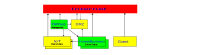

*© 2024. This work is openly licensed via [MPL-2.0](https://mozilla.org/MPL/2.0/.).*

# TAPPaaS Network design

## Introduction

There are a number of parts to the TAPPaaS network design:

- The local TAPPaaS network topology, managed as a VLAN overlay network
- The firewall and router: manage the routing and traffic control between elements of the TAPPaaS network topology as well as the access to and from the Internet
- The switching infrastructure: In very small TAPPaaS installations the switching is purely virtual but in most cases there is both virtual switching in the virtualization nodes of TAPPaaS and there is a need for physical switching equipment. 
- IP number allocations
- The Wifi access points (AP): It is not a priority to manage APs in TAPPaaS and advanced APs are difficult to get as open source. So TAPPaaS is making suggestions for what needs to be configured, not how to do it.
- The Network services: This is DNS, DHCP, 
- The connectivity proxies
- The network monitoring

We recognize that for some it will make sense to reuse existing firewall, switching and WiFI access points. in which case TAPPaaS just makes recommendations to how those components are configured. But in the ideal case TAPPaaS controls all of this infrastructure.

## TAPPaaS network topology

Moving to a self host setup introduce a number of security challenges, and to deal with this we are segmenting TAPPaaS.
The cost of segmentation is more challenges in connecting the relevant components together, and secondly a lot of "internal" traffic will now need to be routed between networks, draining resources that could have been used elsewhere. 

In the TAPPaaS design we are trying to reach a balance between simplicity and security, but we are leaning towards security more than simplicity

In the diagram the Arrow represent connectivity between segments. The direction indicate who can initiate the traffic (TCP)

The segments are:

- HOME: This is where alle the services for a home resides, such as Home Assistant, NextCloud for file sharing, .... There can be several "homes" in a TAPPaaS setup.
- IoT: This is where alle the IoT equipment in the environment lives. IoT is generally considered more insecure. Home can access IoT, but not the other way around. If you have particular problematic devices or manage several homes then you can have several IoT segments that are isolated from each other
- Mgmt: Management section, this is for self management of TAPPaaS. generally the management segment can connect to everything (except for Guest)
- DMZ: Demilitarized Zone, this is the only place traffic from the internet can enter a TAPPaaS system. it is a reverse tunnel proxy, so it will not be abel to access anything else in TAPPaaS: Services in HOME or other systems that needs to expose services externally will connect to the DMZ.

## Router and Switching infrastructure

The Router/switch infrastructure for TAPPaaS can be pictured this way

TODO: insert picture of Router with two physical ports, n number of virtual ports, a switch, three proxmox nodes each containing a few virtual switches, and finally a few AP's and a few switch ports with IoT equipment or other stuff connected

### About IP and VLAN numbers

TAPPaaS support IPv4 and IPv6. and in the ideal world the TAPPaaS system plugs into an Internet connection that hands out One public IPv4 and at least a /54 IPv6 range. TAPPaaS can function without IPv6 connectivity, and with no public IPv4.

For IPv4 TAPPaaS do NAT translation to an internal 10.0.0.0/8 network

For the VLANs TAPPaaS is using a 3 digit tag, where the first digit indicate the type of VLAN traffic and the next two digits is used for further subdividing that kind of traffic.

### VLANs

Corresponding to the TAPPaaS Network topology we have at least the following VLANs

TODO: list Native, Management, DMZ, IoT, Guest, Home, Work, Production, Test

TODO: describe examples of sub vlans

### VLAN to IP

# Appendix / to be cleaned up

---

## Table of Contents

1. [Executive Summary](#1-executive-summary)
2. [Network Topology Diagram](#2-network-topology-diagram)
3. [VLAN Matrix & Numbering Rationale](#3-vlan-matrix--numbering-rationale)
4. [Design Rationale & Examples](#4-design-rationale--examples)
5. [Alternative Options & Rationale](#5-alternative-options--rationale)
6. [Change Management & Self-Healing](#6-change-management--self-healing)
7. [Subnetting Rationale: 10.0.x.x vs 192.168.x.x](#7-subnetting-rationale-100xx-vs-192168xx)
8. [Security & Best Practices](#8-security--best-practices)
9. [Glossary](#9-glossary)
10. [Key Takeaways](#10-key-takeaways)

---

## 1. Executive Summary

| Segment         | Recommended VLAN | Subnet         | Rationale                                                                                       | Alternatives (see below)        |
|-----------------|-----------------|----------------|-------------------------------------------------------------------------------------------------|---------------------------------|
| Native/Bootstrap| VLAN 99         | 10.0.99.0/24   | Native VLAN for trunking, bootstrap, and initial setup.                                         | N/A                             |
| Management      | VLAN 10         | 10.0.10.0/24   | Isolate admin tools, HA with UniFi, least privilege, easy monitoring                             | Dual-homed HA, Server VLAN      |
| DMZ             | VLAN 20         | 10.0.20.0/24   | Expose only necessary services, strong firewalling                                              | N/A                             |
| Prod-Servers    | VLAN 30         | 10.0.30.0/24   | Segregate user-facing apps, restrict access                                                     | N/A                             |
| Prod-Storage    | VLAN 40         | 10.0.40.0/24   | Protect storage, enable backup, restrict access                                                 | N/A                             |
| Workstations    | VLAN 50         | 10.0.50.0/24   | User devices, enforce NAC, restrict lateral movement                                            | N/A                             |
| IoT/Media       | VLAN 60         | 10.0.60.0/24   | Isolate untrusted IoT, media, and set-top boxes; allow only required access                     | Separate Media VLAN (see below) |
| Guest           | VLAN 70         | 10.0.70.0/24   | Internet-only, strong isolation                                                                 | N/A                             |
| Camera (CCTV)   | VLAN 80         | 10.0.80.0/24   | Isolate cameras/NVR, allow only management and storage access                                   | N/A                             |
| Voice (VoIP)    | VLAN 90         | 10.0.90.0/24   | Dedicated for phones/PBX, enable QoS, restrict to call control                                 | N/A                             |

---

## 2. Network Topology Diagram

graph TDInternet –> FirewallFirewall –> SwitchSwitch –> NativeSwitch –> ManagementSwitch –> DMZSwitch –> ProdServersSwitch –> ProdStorageSwitch –> WorkstationsSwitch –> IoTMediaSwitch –> GuestSwitch –> CameraSwitch –> Voice

Native["VLAN 99 Native/Bootstrap"]
Management["VLAN 10 Management"]
DMZ["VLAN 20 DMZ"]
ProdServers["VLAN 30 Prod-Servers"]
ProdStorage["VLAN 40 Prod-Storage"]
Workstations["VLAN 50 Workstations"]
IoTMedia["VLAN 60 IoT/Media"]
Guest["VLAN 70 Guest"]
Camera["VLAN 80 Camera"]
Voice["VLAN 90 Voice"]

## 3. VLAN Matrix & Numbering Rationale

### VLAN Numbering Best Practices

- **Do not use VLAN 1** for anything (default/native VLAN, security risk)[4].
- **Start with a Native/Bootstrap VLAN** (e.g., VLAN 99) for initial switch/server setup and trunking[4].
- **Use logical, incrementing numbers** for core segments, leaving gaps for future growth (e.g., 10, 20, 30, ...)[4][2].
- **Align VLAN ID with third octet of subnet** for clarity (e.g., VLAN 30 = 10.0.30.0/24)[2][4].
- **Group similar device types** (e.g., IoT and Media in one VLAN unless scale or risk justifies separation)[2][8].
- **Reserve higher VLANs (e.g., 100+)** for future expansion or special projects.

### VLAN Matrix Table

| VLAN-ID | Segment        | Subnet         | Purpose                | Key Devices                  | Notes                                                                                     |
|---------|---------------|----------------|------------------------|------------------------------|-------------------------------------------------------------------------------------------|
| 99      | Native        | 10.0.99.0/24   | Native/Bootstrap VLAN  | Switch/host mgmt/trunking    | Use for initial setup, trunking, and native VLAN; not for production traffic              |
| 10      | Management    | 10.0.10.0/24   | Admin tools, HA/UniFi  | Proxmox, OPNsense, HA, NVR   | Least privilege, strict firewall, monitoring                                              |
| 20      | DMZ           | 10.0.20.0/24   | External services      | Web servers                  | Expose only necessary services, strong firewall                                            |
| 30      | Prod-Servers  | 10.0.30.0/24   | Production apps        | Nextcloud, n8n, Supabase     | Restrict access, monitor                                                                  |
| 40      | Prod-Storage  | 10.0.40.0/24   | Storage/backup         | TrueNAS, backup servers      | Encryption, backup, restrict access                                                       |
| 50      | Workstations  | 10.0.50.0/24   | User devices           | Laptops, desktops            | NAC, restrict lateral movement                                                            |
| 60      | IoT/Media     | 10.0.60.0/24   | IoT, media, set-top    | Cameras, TV, set-top, sensors| Isolate all untrusted/consumer devices; allow only required access; see rationale below   |
| 70      | Guest         | 10.0.70.0/24   | Guest internet         | Guest devices                | Internet-only, captive portal, no internal access                                         |
| 80      | Camera        | 10.0.80.0/24   | CCTV                   | Cameras, NVR                 | Cameras/NVR together, allow management from Mgmt VLAN, restrict outbound                  |
| 90      | Voice         | 10.0.90.0/24   | VoIP phones            | IP Phones, PBX               | Enable QoS, restrict to call control, secure switch ports                                 |

---

## 4. Design Rationale & Examples

### 4.1 Bootstrapping and Logical Build-Up

- **Start with Native/Bootstrap VLAN (99):**  
  - Use for initial Proxmox install, switch management, and trunking.
  - Move all production traffic out of VLAN 1 for security[4].
- **Management VLAN (10):**  
  - Isolate all admin tools, hypervisors, and network controllers.
  - Home Assistant with UniFi Controller belongs here for security and manageability.
- **Incrementally add**:  
  - DMZ (20) for public services.
  - Prod-Servers (30) for applications.
  - Prod-Storage (40) for backups and file servers.
  - Workstations (50) for user devices.
  - IoT/Media (60) for all consumer, smart, and entertainment devices.
  - Guest (70) for internet-only access.
  - Camera (80) for CCTV/NVR, if you want extra isolation from general IoT.
  - Voice (90) for VoIP, with QoS enabled.

### 4.2 Media and IoT Placement

- **Best Practice:**  
  - Place media devices (TVs, set-top boxes, smart speakers) in the IoT VLAN[2][8].
  - This isolates all less-trusted, consumer devices from user devices and critical infrastructure.
  - Use mDNS/SSDP relays or firewall rules to allow casting and streaming from user VLANs if needed.

- **When to Separate Media:**  
  - Only if you have a large number of media devices, or if you want even stricter segmentation for high-value environments.

### 4.3 Example: Adding a New VLAN

- **Scenario:** Add a VLAN for new IoT and media devices.
- **Steps:**
  1. Assign VLAN 60, subnet 10.0.60.0/24.
  2. Configure switch ports, DHCP, and firewall rules.
  3. Document in NetBox and diagrams.
  4. Allow only necessary outbound/inbound access (e.g., streaming, updates).
  5. Use relays for casting/streaming protocols as needed.

---

## 5. Alternative Options & Rationale

| Option                    | Security | Usability | Complexity | When to Use / Rationale                                     |
|---------------------------|----------|-----------|------------|-------------------------------------------------------------|
| Media in Workstations     | Low      | High      | Low        | For ease of use, low security need; not recommended for SMBs|
| Media in IoT/Media VLAN   | High     | Medium    | Medium     | **Best for security; recommended by experts**               |
| Separate Media VLAN       | Very High| Medium    | High       | For very large or high-value environments                   |
| HA in IoT VLAN            | Medium   | Medium    | Medium     | Only if HA is not running management functions              |
| Dual-homed HA             | High     | High      | High       | Advanced setups needing both management and IoT access      |
| Camera in IoT VLAN        | Medium   | Medium    | Medium     | Only if NVR is not critical; less secure than dedicated VLAN|

**Rationale:**  
- Experts and advanced home lab users (Tweakers, Cisco, Reddit) recommend isolating less-trusted devices (media, IoT, cameras) from user and management VLANs[2][4][8].
- Use relays (mDNS/SSDP) or firewall rules to enable necessary cross-VLAN communication without sacrificing security.

---

## 6. Change Management & Self-Healing

- **Documentation:**  
  - Update VLAN matrix and diagrams with every change.
  - Use version control (Git) for documentation and automation scripts.
- **Auditing:**  
  - Schedule quarterly reviews of VLANs, firewall rules, and logs.
- **Self-Healing:**  
  - Automate monitoring and alerting (e.g., Graylog, Monit).
  - Use configuration management (Ansible, NetBox) for auto-remediation.

---

## 7. Subnetting Rationale: 10.0.x.x vs 192.168.x.x

- **10.0.x.x/24 (RFC1918, Class A)** is preferred for enterprise and scalable home lab networks:
  - **More address space:** 10.0.0.0/8 allows for 16 million addresses, making future expansion, subnetting, and lab environments easier[2][4].
  - **Alignment with VLAN ID:** Using 10.0.VLANID.0/24 (e.g., VLAN 20 = 10.0.20.0/24) makes documentation, troubleshooting, and automation simpler[2][4][6].
  - **Less overlap:** 192.168.x.x is commonly used by consumer routers and ISPs, which can cause conflicts with VPNs or remote access[2][8].
  - **Industry best practice:** Many enterprises and advanced home labs use 10.0.x.x for internal segmentation[2][4][6].
- **192.168.x.x/24** is fine for small setups, but can lead to conflicts and less flexibility as you grow.

---

## 8. Security & Best Practices

- Use 802.1Q tagging for all VLANs.
- Avoid reserved VLAN IDs (0, 1, 4095)[1][4].
- Secure trunk ports; allow only necessary VLANs.
- Enable QoS on Voice VLAN.
- Use redundancy for uplinks and critical devices.
- Regularly audit ACLs and segmentation.
- Disable unused switch ports.
- Use strong passwords and 2FA for admin interfaces.
- Centralize logging and monitor for anomalies.

---

## 9. Glossary

- **VLAN:** Virtual LAN, logical network segmentation.
- **NVR:** Network Video Recorder.
- **QoS:** Quality of Service, prioritizes network traffic.
- **NAC:** Network Access Control.
- **ACL:** Access Control List.
- **mDNS/SSDP:** Protocols for device discovery.
- **PBX:** Private Branch Exchange, phone system.
- **DMZ:** Demilitarized Zone, for public-facing services.
- **Trunk:** Switch port carrying multiple VLANs.
- **Self-Healing:** Automated detection and correction of network issues.
- **Bootstrap VLAN:** Temporary VLAN for initial system setup and trunking.

---

## 10. Key Takeaways

- **Start with a Native/Bootstrap VLAN for initial setup and trunking; never use VLAN 1 for production.**
- **Use logical, incrementing VLAN IDs and align them with subnetting for clarity and scalability.**
- **Place all IoT, media, and set-top boxes in a single IoT/Media VLAN for strong security and simple management.**
- **Use the 10.0.VLANID.0/24 subnet scheme for flexibility, clarity, and future growth.**
- **Automate, document, and regularly review your network for enterprise-grade reliability and security.**
- **Follow both enterprise and advanced home lab best practices for a robust, future-proof design.**

---
