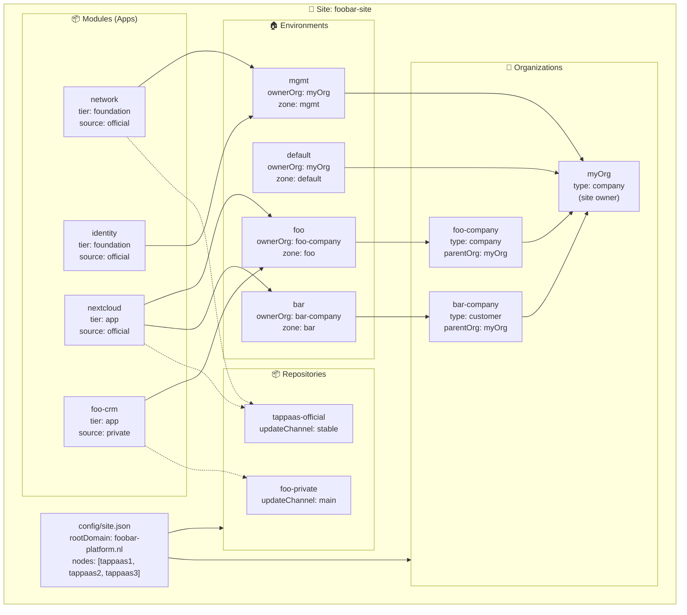
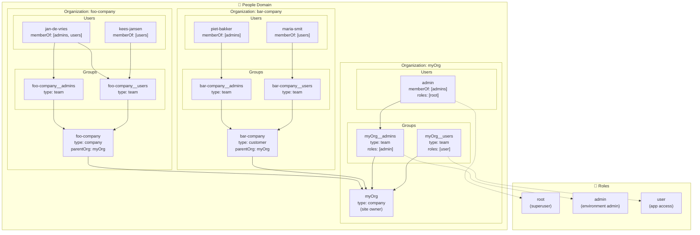

# ADR-007 Implementation Plan

**Issue**: #360
**Status**: Draft
**Version**: 0.2
**Date**: 2026-06-17

## Overview

This document describes the implementation packages for the ADR-007 series (TAPPaaS Taxonomy). Each package can be implemented and tested independently, with clear dependencies between packages.

**Key ADR Documents**:

- ADR-007 — TAPPaaS Taxonomy (overview) v2.3
- ADR-007a — People v1.1
- ADR-007b — Apps v1.2
- ADR-007c — Environments v1.2
- ADR-007d — Site v1.2
- ADR-007e — Health v1.0
- ADR-007f — Realization v0.8
- ADR-009 — Composition Meta-Model v0.3

**Related Issues**:

| Category | Issues |
|----------|--------|
| **Taxonomy** | #320 (tracking), #360 (this plan) |
| **Composition** | #171 (Module/Component), #297 (catalog facets) |
| **People** | #56 (default user/role profiles) |
| **Environments** | #318 (variant→environment), #319 (zone deletion), #294 (zone-aligned VMID), #313 (timezone→site) |
| **Apps/Modules** | #339 (module schema), #356 (source:local), #357 (local intent) |
| **Control-plane** | #364 (split opnsense-controller), #365 (managers/controllers layout) |
| **Cross-cutting** | #358 (backup) |
| **Deferred** | #354, #359 |

---

## High-Level Architecture Example

The following example shows the complete ADR-007 taxonomy in action with:
- **myOrg**: The site owner organization (runs mgmt environment)
- **Foo Company**: A subsidiary company
- **Bar Industries**: A hosted customer

### Configuration Relationship Diagram



> **Note**: Zones are now named the same as environments (sunsetting `srvHome`, `srvWork`, `srvCust`, etc.).
> The Nextcloud module is installed in both `foo` and `bar` environments.

---

## Implementation Packages

### Package Dependency Graph

> This graph shows **logical** package relationships (what content depends on what content). It is **not** the build order — read literally it is circular (P4 needs P1–P3's managers; P1–P3 need P4's layout). The **[Implementation Sequence](#implementation-sequence)** breaks the cycle by splitting P4 into a structure-only first step (S0) and adding the P10 template (S1). Build from the sequence, not from this graph.

```
                    ┌─────────────────────┐
                    │  P1: People Schema  │
                    └──────────┬──────────┘
                               │
                    ┌──────────┴──────────┐
                    ▼                     ▼
            ┌───────────────┐   ┌──────────────────┐
            │ P2: Site JSON │   │ P3: Environment  │   (P2 ∥ P3)
            │ (from config) │   │    Schema        │──┐
            └───────┬───────┘   └────────┬─────────┘  │ (only P3)
                    │                    │            ▼
                    │                    │   ┌─────────────────────┐
                    │                    │   │ P7: Default          │
                    │                    │   │    Environment       │
                    └──────────┬─────────┘   └─────────────────────┘
                               ▼
                    ┌──────────────────────┐
                    │  P4: tappaas-cicd    │   reorg BEFORE module updates —
                    │  Layout (managers)   │   the hub everything below needs
                    └──────────┬───────────┘
              ┌────────────────┼───────────────┬────────────────┐
              ▼                ▼                ▼                ▼
   ┌──────────────────┐ ┌─────────────┐ ┌─────────────┐ ┌──────────────────┐
   │ P5: Module       │ │ P6: Mgmt    │ │ P8: Rename  │ │ P9: Backup       │
   │ Updates          │ │ Zone → Env  │ │ firewall →  │ │ Configuration    │
   │ (tier/source)    │ │ (also P3)   │ │ network     │ │ (also P2, P3)    │
   └──────────────────┘ └─────────────┘ └─────────────┘ └──────────────────┘
```

---

## P1: People Schema

**Closes**: #56 (default user and role profiles)

**Purpose**: Create JSON schemas and file structure for Organizations, Groups, and Users (ADR-007a).

### People Structure Diagram



**Key ADR-007a Rules**:

- 4-level hierarchy: `Role → Organization → Group → User`
- The `name` field is the identity key — used to identify entities in Authentik (no separate `authentikTenant`/`authentikGroup`/`authentikUser` fields)
- Membership modeled on **User** (`memberOf`), NOT on Group
- Roles can be assigned to Groups (inherited by members) or directly to Users (sparingly)
- **Attribute discipline**: every field must justify reason/default/operational impact (no CRM-creep)

**Deliverables**:

1. `src/foundation/schemas/role-fields.json` - Role schema
2. `src/foundation/schemas/organization-fields.json` - Organization schema
3. `src/foundation/schemas/group-fields.json` - Group schema
4. `src/foundation/schemas/user-fields.json` - User schema
5. `config/people/` directory structure:
   - `config/people/roles/{name}.json`
   - `config/people/organizations/{name}.json`
   - `config/people/groups/{org}__{name}.json`
   - `config/people/users/{name}.json`
6. Default roles: `root.json`, `admin.json`, `user.json`
7. Example files for myOrg, Foo, and Bar
8. `src/modules/foundation/identity/people-manager.py` - Python module for CRUD + Authentik sync
9. `bin/user-setup.sh` - Bootstrap script for minimal myOrg setup
10. Validation script: `bin/validate-people.sh`

**Schema Design** (from ADR-007a):

Legend: **bold** = mandatory, *italic* = optional (default shown)

```
Role (config/people/roles/{name}.json):
├── **name**        : string   — slug identifier (e.g., root, admin, user)
├── **displayName** : string   — human-readable name
└── *description*   : string   — (default: "")
   (Note: Actual permissions configured in Authentik via policies/entitlements)

Organization (config/people/organizations/{name}.json):
├── **name**        : string   — slug, used as Authentik tenant identifier
├── *type*          : enum     — (default: "company") family | company | foundation | customer
├── **displayName** : string   — human-readable name
├── **owner**       : string   — reference to User.name
└── *parentOrg*     : string   — (default: null) reference to parent Organization.name

Group (config/people/groups/{org}__{name}.json):
├── **name**        : string   — e.g., myOrg__admins, used as Authentik group identifier
├── *type*          : enum     — (default: "team") team | department | family-members | access-set | ad-hoc
├── **displayName** : string   — human-readable name
├── **ownerOrg**    : string   — reference to Organization.name
└── *roles*         : string[] — (default: []) inherited by all members
   (Note: NO members list - membership is on User)

User (config/people/users/{name}.json):
├── **name**        : string   — slug, used as Authentik user identifier
├── **displayName** : string   — human-readable name
├── **primaryEmail**: string   — user's primary email address
├── *memberOf*      : string[] — (default: []) array of Group.name references
└── *roles*         : string[] — (default: []) direct role assignment, use sparingly
```

**people-manager.py**:

A Python module associated with the identity module. Like `zone-manager` and `switch-manager`, it keeps Authentik updated idempotently.

```python
# src/modules/foundation/identity/people-manager.py
#
# CRUD operations on JSON config files + Authentik sync
#
# Commands:
#   people-manager role list|get|create|update|delete
#   people-manager org list|get|create|update|delete
#   people-manager group list|get|create|update|delete
#   people-manager user list|get|create|update|delete
#   people-manager sync [--dry-run]  # sync all to Authentik
#
# Idempotent: running sync multiple times produces same result
# Validates references: group.ownerOrg exists, user.memberOf groups exist
```

**user-setup.sh**:

Bootstrap script that creates minimal myOrg setup with one admin user:

```bash
# bin/user-setup.sh
#
# Creates:
#   - Default roles (root, admin, user) if not present
#   - myOrg organization
#   - myOrg__admins and myOrg__users groups
#   - admin user with root role, member of myOrg__admins
#
# Usage: user-setup.sh --org myOrg --admin-email admin@example.com
```

**Test Criteria**:

- [ ] Schema validates example role/org/group/user files
- [ ] `validate-people.sh` catches missing required fields
- [ ] Group references valid organization (ownerOrg)
- [ ] User references valid groups (memberOf)
- [ ] Role references in groups/users are valid
- [ ] `people-manager.py sync` creates entities in Authentik
- [ ] `people-manager.py sync` is idempotent (re-run produces no changes)
- [ ] `user-setup.sh` creates minimal working setup

**Dependencies**: None (foundational package)

### P1 Examples

#### Example: people/roles/root.json

Roles are labels that identify permission sets. The `name` is used to identify the role in Authentik. Actual permissions are configured directly in Authentik via policies and application entitlements.

```json
{
  "name": "root",
  "displayName": "Platform Root",
  "description": "Full platform access - superuser privileges"
}
```

#### Example: people/roles/admin.json

```json
{
  "name": "admin",
  "displayName": "Administrator",
  "description": "Administrative access to assigned environments"
}
```

#### Example: people/roles/user.json

```json
{
  "name": "user",
  "displayName": "User",
  "description": "Standard user access to assigned applications"
}
```

#### Example: people/organizations/myOrg.json

Per ADR-007a, every attribute must justify its **reason**, **default**, and **operational impact** (no CRM-creep). The `name` is used to identify the organization (tenant) in Authentik.

```json
{
  "name": "myOrg",
  "type": "company",
  "displayName": "myOrg BV",
  "owner": "admin"
}
```

#### Example: people/organizations/foo-company.json

```json
{
  "name": "foo-company",
  "type": "company",
  "displayName": "Foo Company BV",
  "owner": "jan-de-vries",
  "parentOrg": "myOrg"
}
```

#### Example: people/organizations/bar-company.json

A **customer** organization adds `parentOrg` to indicate the hosting relationship.

```json
{
  "name": "bar-company",
  "type": "customer",
  "displayName": "Bar Industries BV",
  "owner": "piet-bakker",
  "parentOrg": "myOrg"
}
```

#### Example: people/groups/myOrg__admins.json

Groups are named `{org}__{groupname}`. The `name` is used to identify the group in Authentik.

```json
{
  "name": "myOrg__admins",
  "type": "team",
  "displayName": "myOrg Administrators",
  "ownerOrg": "myOrg",
  "roles": ["admin"]
}
```

#### Example: people/groups/myOrg__users.json

```json
{
  "name": "myOrg__users",
  "type": "team",
  "displayName": "myOrg Users",
  "ownerOrg": "myOrg",
  "roles": ["user"]
}
```

#### Example: people/groups/foo-company__admins.json

Per ADR-007a, membership is modeled on the **User** (`memberOf`), not on the Group.

```json
{
  "name": "foo-company__admins",
  "type": "team",
  "displayName": "Foo Administrators",
  "ownerOrg": "foo-company",
  "roles": ["admin"]
}
```

#### Example: people/groups/foo-company__users.json

```json
{
  "name": "foo-company__users",
  "type": "team",
  "displayName": "Foo Users",
  "ownerOrg": "foo-company",
  "roles": ["user"]
}
```

#### Example: people/users/admin.json

The platform administrator. The `name` is used to identify the user in Authentik. The `roles` field assigns direct roles (independent of group membership) — use sparingly.

```json
{
  "name": "admin",
  "displayName": "Platform Administrator",
  "primaryEmail": "admin@foobar-platform.nl",
  "memberOf": [
    "myOrg__admins"
  ],
  "roles": ["root"]
}
```

#### Example: people/users/jan-de-vries.json

Users belong to groups via `memberOf`. The same user can be in groups across multiple organizations. Roles are inherited from groups.

```json
{
  "name": "jan-de-vries",
  "displayName": "Jan de Vries",
  "primaryEmail": "jan@foo-company.nl",
  "memberOf": [
    "foo-company__admins",
    "foo-company__users"
  ]
}
```

#### Example: people/users/piet-bakker.json

```json
{
  "name": "piet-bakker",
  "displayName": "Piet Bakker",
  "primaryEmail": "piet@bar-industries.nl",
  "memberOf": [
    "bar-company__admins"
  ]
}
```

---

## P2: Site JSON Migration

**Closes**: #313 (timezone→site)

**Purpose**: **Fully replace** `configuration.json` with `site.json` (ADR-007d). This is not a split — `configuration.json` is retired.

**Key Design Decisions**:

- `configuration.json` is **fully replaced** by `site.json` — no split, no backward compat file
- Domain, DNS, and identity are **per-environment** (not site-wide)
- Storage pools are **per-node** (not a flat list)
- `updateSchedule` stays site-wide; `automaticReboot`/`snapshotRetention` move to environments in P3

**Deliverables**:

1. `src/foundation/schemas/site-fields.json` - Site schema
2. `config/site.json` - New site configuration file
3. `bin/migrate-configuration-to-site.sh` - Migration script (called by update-tappaas)
4. Update `validate-configuration.sh` → `validate-site.sh`
5. Delete `configuration-fields.json` after migration

**Field Migration**:

| From configuration.json | To site.json | Notes |
|------------------------|--------------|-------|
| `tappaas.version` | `version` | Site config version |
| `tappaas.nodeCount` | *(removed)* | Computed from `hardware.nodes[]` |
| `tappaas-nodes[]` | `hardware.nodes[]` | Now includes per-node `storagePools` |
| `tappaas.repositories[]` | `repositories[]` | Unchanged |
| `tappaas.updateSchedule` | `updateSchedule` | Stays site-wide |
| `tappaas.automaticReboot` | `automaticReboot` | Site-wide until P3 (then per-env) |
| `tappaas.snapshotRetention` | `snapshotRetention` | Site-wide until P3 (then per-env) |
| `tappaas.domain` | *(removed)* | Now per-environment: `domains.primary` |
| `tappaas.email` | *(removed)* | Now per-environment or per-org |
| `tappaas.variants` | *(removed)* | Migrated to `environments/` files |
| *(new)* | `name`, `displayName`, `owner` | Site identity |
| *(new)* | `location.country/timezone/locale` | Site location |
| *(new)* | `network.isp`, `publicIp` | WAN config (no rootDomain) |
| *(new)* | `backup.target`, `offsite` | Site-wide backup target |
| *(new)* | `environments[]`, `organizations[]` | References to config files |

**Schema Design** (from ADR-007d):

Legend: **bold** = mandatory, *italic* = optional (default shown)

```text
Site (config/site.json):
├── **name**              : string   — slug identifier (e.g., foobar-site)
├── **displayName**       : string   — human-readable name
├── **owner**             : string   — reference to Organization.name (site owner)
├── *version*             : string   — (default: "1.0") site config schema version
├── **location**          : object
│   ├── **country**       : string   — ISO 3166-1 alpha-2 (e.g., "NL")
│   ├── **timezone**      : string   — IANA timezone (e.g., "Europe/Amsterdam")
│   └── *locale*          : string   — (default: "en_US") e.g., "nl_NL"
├── **network**           : object
│   ├── *isp*             : string   — (default: null) ISP name for reference
│   └── *publicIp*        : string   — (default: "auto") public IP or "auto"
├── **hardware**          : object
│   └── **nodes**         : array    — list of Proxmox nodes
│       ├── **name**      : string   — node name (e.g., "tappaas1")
│       └── **storagePools**: string[] — pools on this node (e.g., ["tanka1", "tankb1"])
├── *backup*              : object   — (default: null)
│   ├── *target*          : string   — (default: null) backup server hostname
│   └── *offsite*         : string   — (default: null) offsite backup buddy
├── *updateSchedule*      : array    — (default: ["monthly", "Thursday", 2])
├── *automaticReboot*     : boolean  — (default: true) → moves to Environment in P3
├── *snapshotRetention*   : integer  — (default: 5) → moves to Environment in P3
├── **repositories**      : array    — module catalog repositories
│   ├── **name**          : string   — repo identifier
│   ├── **url**           : string   — repository URL
│   └── *updateChannel*   : string   — (default: "stable") stable | main | etc.
├── *environments*        : string[] — (default: []) paths to environment JSON files
└── *organizations*       : string[] — (default: []) paths to organization JSON files
```

**Auto-Migration**:

Migration runs automatically via `update-tappaas` or `update-module.sh tappaas-cicd`:

```bash
# In update-tappaas or update-module.sh tappaas-cicd:
if [[ -f "$CONFIG_DIR/configuration.json" && ! -f "$CONFIG_DIR/site.json" ]]; then
    info "Migrating configuration.json → site.json"
    migrate-configuration-to-site.sh
fi
```

**Migration Script Logic**:

```bash
# migrate-configuration-to-site.sh
1. Check if configuration.json exists
2. Read existing configuration.json
3. Transform to new site.json structure:
   - Restructure nodes with per-node storagePools
   - Move variants to environments/ files
   - Create default myOrg organization
   - Create mgmt environment
4. Write config/site.json
5. Write config/environments/*.json for each variant
6. Write config/people/organizations/myOrg.json
7. Backup configuration.json to configuration.json.backup
8. Delete configuration.json
9. Validate site.json
```

**Test Criteria**:

- [ ] Migration script is idempotent (re-running is safe)
- [ ] `site.json` validates against schema
- [ ] Auto-migration triggers on `update-tappaas`
- [ ] Auto-migration triggers on `update-module.sh tappaas-cicd`
- [ ] All scripts read from `site.json` (no configuration.json fallback)
- [ ] `configuration.json` is backed up and deleted

**Dependencies**: P1 (for organization references in site.json)

### P2 Example

#### Example: site.json (umbrella)

Site.json contains **site-wide** settings only. Domain, DNS, and identity are **per-environment** (defined in each environment's `domains` and managed by Caddy/Authentik).

```json
{
  "name": "foobar-site",
  "displayName": "Foo & Bar Shared Platform",
  "owner": "myOrg",
  "location": {
    "country": "NL",
    "timezone": "Europe/Amsterdam",
    "locale": "nl_NL"
  },
  "network": {
    "isp": "KPN Business",
    "publicIp": "auto"
  },
  "hardware": {
    "nodes": [
      { "name": "tappaas1", "storagePools": ["tanka1", "tankb1"] },
      { "name": "tappaas2", "storagePools": ["tanka2", "tankb2"] },
      { "name": "tappaas3", "storagePools": ["tanka3"] }
    ]
  },
  "backup": {
    "target": "backup.foobar-platform.nl",
    "offsite": "pbs-offsite-buddy"
  },
  "updateSchedule": ["monthly", "Thursday", 2],
  "automaticReboot": true,
  "snapshotRetention": 5,
  "repositories": [
    {
      "name": "tappaas-official",
      "url": "https://github.com/TAPPaaS/TAPPaaS",
      "updateChannel": "stable"
    },
    {
      "name": "foo-private",
      "url": "https://github.com/foo-company/tappaas-modules",
      "updateChannel": "main"
    }
  ],
  "environments": [
    "config/environments/mgmt.json",
    "config/environments/default.json",
    "config/environments/foo.json",
    "config/environments/bar.json"
  ],
  "organizations": [
    "config/people/organizations/myOrg.json",
    "config/people/organizations/foo-company.json",
    "config/people/organizations/bar-company.json"
  ]
}
```

> **Migration note**: `automaticReboot` and `snapshotRetention` will move to per-environment settings when P3 is implemented. Until then, they remain site-wide in `site.json`.

---

## P3: Environment Schema

**Closes**: #318 (variant→environment)

**Purpose**: Create environment schema and migrate variants to environments (ADR-007c).

**Key ADR-007c Rules**:

- `ownerOrg` **references** a People Organization by name (validated, not free string)
- `vlan` lives in `zones.json`, NOT in the environment schema (CR-09)
- `updateWindow`/`updateChannel` out of v1 — tracked as issues CR-12/13
- `backup` is a cross-level concern (site → env → apps) — tracked separately (CR-14)
- Old `identityOrganization`/tenant dropped: `ownerOrg` + `domains` define identity (CR-11)
- `legal`/processor is cross-cutting — under review for own ADR (CR-15)

**Deliverables**:

1. `src/foundation/schemas/environment-fields.json` - Environment schema
2. `config/environments/` directory
3. `bin/migrate-variants-to-environments.sh` - Migration script
4. `bin/environment-manager.sh` - CRUD for environments (replaces `variant-manager.sh` v0.1) — a **full manager** built on the P10 template (install/update/test/validate)
5. `bin/create-minimal-environments.sh` - Bootstrap that constructs the two environments every TAPPaaS system requires (`mgmt.json` + `default.json`); **linked into `install.sh`** so a fresh install always has them. This is the single owner of those two files — P6/P7 reference it, they do not re-author it (sibling of P1's `user-setup.sh`).
6. Update `install-module.sh` to accept `--environment` alongside `--variant`

**Schema Design** (from ADR-007c):

Legend: **bold** = mandatory, *italic* = optional (default shown)

```
Environment (config/environments/{name}.json):
├── **name**          : string — slug identifier (e.g., foo, bar, mgmt)
├── **displayName**   : string — human-readable name
├── **ownerOrg**      : string — reference to Organization.name (validated)
├── *domains*         : object — (default: null) not required for mgmt
│   ├── **primary**   : string — primary domain (e.g., foo-company.nl)
│   ├── *aliases*     : string[] — (default: []) alias domains
│   ├── *aliasMode*   : enum   — (default: "redirect") redirect | mirror
│   └── *dnsMode*     : enum   — (default: "per-service") per-service | wildcard
│       (decides cert ownership — see "TLS certificate handling" below.
│        NO tlsCertRefid is authored here; the refid, if any, is runtime state.)
├── **network**       : object
│   └── **zone**      : string — reference to zones.json (validated)
│   (Note: NO vlan here - lives in zones.json)
├── *dataResidency*   : enum   — (default: "eu-only") eu-only | global
├── *backup*          : object — (default: null)
│   └── *retention*   : string — (default: "7y") e.g., "5y", "1y"
└── *legal*           : object — (default: null)
    └── *processor*   : string — (default: null) legal processor name
```

**Variant → Environment Migration** (#318):

| configuration.json variants | environments/*.json |
|----------------------------|---------------------|
| `variants[""].domain` | `environments/default.json` → `domains.primary` |
| `variants[""].dnsMode` | `domains.dnsMode` (carried over; decides cert ownership) |
| `variants[""].tlsCertRefid` | *(dropped from authored config)* — see TLS note below |
| `variants[""].zone` | `network.zone` |
| `variants["foo"].domain` | `environments/foo.json` → `domains.primary` |

#### TLS certificate handling

`tlsCertRefid` is **not** an authored Environment field. Whether a cert ref exists at all is decided by `dnsMode`:

- **`per-service`** (default) — Caddy issues per-host certs itself (HTTP-01), auto-renews, and stores them keyed by hostname. There is **nothing for tappaas-cicd to store**; the hostname is the handle. (This already matches today's behaviour, where `tlsCertRefid` is empty for per-service variants.)
- **`wildcard`** — OPNsense's ACME client (not Caddy) issues one `*.{primary}` cert into the OPNsense Trust store and returns an opaque **refid**; the Caddy handler is wired to it via `--custom-certificate <refid>`. The refid is **reconciler-populated runtime state** owned by the network/cert layer (needed only for proxy wiring, idempotent re-issue, and Trust-store cleanup on environment teardown, #319) — it is **not** written into `environment.json` by an operator.

So migration does not copy `tlsCertRefid` into the Environment file. For wildcard environments the network layer re-discovers or re-derives the refid at reconcile time; for per-service environments there is no refid. This keeps the Environment schema lean and removes the ADR-005 coupling of authored config to an OPNsense-internal id.

> **Supersedes** the earlier ADR-007c note that "`cert_refid` moves onto the Environment's `domains`". The cert ref is runtime state, not taxonomy — only `dnsMode` is authored.

**Backward Compatibility**:

- `--variant` aliases to `--environment` and is supported **until cutover**. There is only one production TAPPaaS, so the alias stays until that site has been converted and we explicitly call "go" — not tied to a release count.
- After cutover go, `--variant` is removed (see Open Questions → Backward Compatibility Duration).

**Test Criteria**:

- [ ] Migration preserves all variant settings
- [ ] `--variant` and `--environment` both work (compat period)
- [ ] `ownerOrg` validates against existing organization
- [ ] Zone reference validates against zones.json
- [ ] Legacy environments default `ownerOrg` to family org
- [ ] Schema rejects an authored `tlsCertRefid` in `environment.json`
- [ ] `dnsMode` defaults to `per-service`; `wildcard` is accepted

**Dependencies**: P1, P2

### P3 Examples

#### Example: environments/foo.json

Per ADR-007c:

- `ownerOrg` **references** a People Organization (validated, not a free string)
- `vlan` lives in `zones.json`, not here (CR-09)
- `updateWindow`/`updateChannel` out of v1 (CR-12/13, tracked as issues)
- Zone name matches environment name (sunsetting `srvHome`, `srvWork`, etc.)
- `dataResidency` is per-environment (moved from Organization)

```json
{
  "name": "foo",
  "displayName": "Foo Company",
  "ownerOrg": "foo-company",
  "domains": {
    "primary": "foo-company.nl",
    "aliases": ["foocompany.com"],
    "aliasMode": "redirect"
  },
  "network": {
    "zone": "foo"
  },
  "dataResidency": "eu-only",
  "backup": {
    "retention": "7y"
  },
  "legal": {
    "processor": "myOrg BV"
  }
}
```

#### Example: environments/bar.json

```json
{
  "name": "bar",
  "displayName": "Bar Industries",
  "ownerOrg": "bar-company",
  "domains": {
    "primary": "bar-industries.nl"
  },
  "network": {
    "zone": "bar"
  },
  "dataResidency": "eu-only",
  "backup": {
    "retention": "5y"
  },
  "legal": {
    "processor": "myOrg BV"
  }
}
```

#### Example: environments/default.json

```json
{
  "name": "default",
  "displayName": "Default Environment",
  "ownerOrg": "myOrg",
  "domains": {
    "primary": "foobar-platform.nl"
  },
  "network": {
    "zone": "default"
  },
  "dataResidency": "eu-only",
  "backup": {
    "retention": "7y"
  }
}
```

#### Example: environments/mgmt.json (Management Environment)

The `mgmt` environment does not require a `domains` field — foundation modules are accessed via internal DNS only.

```json
{
  "name": "mgmt",
  "displayName": "Management",
  "ownerOrg": "myOrg",
  "network": {
    "zone": "mgmt"
  }
}
```

---

## P4: tappaas-cicd Layout

**Closes**: #365 (managers/controllers layout), #364 (split opnsense-controller)

**Purpose**: Organize the control-plane scripts under `tappaas-cicd` into a clear **managers** vs **controllers** structure. The overall `src/` layout remains unchanged — this package focuses on organizing scripts within `tappaas-cicd`.

### Managers vs Controllers

| Type | Purpose | Operates On | Examples |
|------|---------|-------------|----------|
| **Manager** | CRUD + lifecycle for domain objects (incl. cross-controller orchestration) | JSON config files + Authentik sync | people-manager, environment-manager, site-manager, module-manager, health-manager, **network-manager** |
| **Controller** | Direct control of infrastructure | APIs, VMs, network devices | opnsense-controller (+ dns/dhcp/firewall/caddy/nat subcontrollers), proxmox-controller, switch-controller, ap-controller, identity-controller |

> **network-manager** is the manager that **owns `zones.json`** and *orchestrates the network controllers*. It is the single front door for the network: it does CRUD on `zones.json` (add / delete / update / "does this zone exist?"), computes the delta against actual state, and reconciles every plane (opnsense, proxmox, switch, ap). There is **no separate `zone-controller`** — that desired-state authority lives **inside** network-manager. `environment-manager` calls network-manager when a zone must be created or checked; domain/cert lifecycle stays with `environment-manager`. See [Network Orchestration](#network-orchestration-network-manager) below.

**Key distinction**: Managers work with **config state** (JSON files, schemas, validation). Controllers work with **runtime state** (APIs, device configs, VM operations).

### What Changes

- Create `managers/` and `controllers/` directories under `tappaas-cicd`
- Organize existing scripts by their function
- Add planned scripts from P1-P3 (people/site/environment managers); the
  module-manager scripts move into this structure here, ahead of the P5 content updates

### What Stays the Same

- `src/foundation/` and `src/apps/` directory structure
- Module locations (`src/foundation/firewall/`, `src/apps/nextcloud/`, etc.)
- `bin/` entry points (symlinks to new locations)

### Target Layout (tappaas-cicd internal)

The annotations (`← was:`) show which **current** programs each target directory absorbs, so the reorg can be checked for completeness against [`src/foundation/PROGRAMS.csv`](../../src/foundation/PROGRAMS.csv) (the authoritative installed-program list) and [`src/foundation/DEPENDENCIES.csv`](../../src/foundation/DEPENDENCIES.csv) (caller graph). See **Reorg Coverage** below for the row-by-row checklist.

```
src/foundation/tappaas-cicd/
├── managers/                           # Domain object lifecycle (config state)
│   │
│   ├── people-manager/                 # 👥 People (P1)        ← was: user.sh, roles-ensure.sh
│   │   ├── people-manager.py           #   role/org/group/user CRUD
│   │   ├── validate-people.sh
│   │   └── user-setup.sh               #   bootstrap minimal myOrg
│   │
│   ├── site-manager/                   # 🏢 Site (P2)          ← was: create-configuration.sh,
│   │   ├── site-manager.sh             #     validate-configuration.sh, convert-json-to-config.sh,
│   │   ├── migrate-configuration.sh    #     repository.sh
│   │   └── validate-site.sh
│   │
│   ├── environment-manager/            # 🏠 Environments (P3)  ← was: variant-manager.sh,
│   │   ├── environment-manager.sh      #     migrate-to-variants.sh
│   │   ├── migrate-variants.sh
│   │   ├── create-minimal-environments.sh  # bootstrap mgmt.json + default.json (→ install.sh)
│   │   └── validate-environment.sh
│   │
│   ├── module-manager/                 # 📦 Apps/Modules (P5)  ← was: install/update/delete/
│   │   ├── install-module.sh           #     test-module.sh, copy-update-json.sh,
│   │   ├── update-module.sh            #     module-format.sh, snapshot-vm.sh
│   │   ├── delete-module.sh
│   │   ├── test-module.sh
│   │   ├── snapshot-vm.sh
│   │   └── validate-module.sh
│   │
│   ├── network-manager/                # 🌐 Network owner+orchestrator (P4/ADR-008)
│   │   ├── network-manager.sh          #   front door: zones.json CRUD + delta + reconcile ALL planes
│   │   ├── zone-state.sh               #   ← was: zone-reconcile, zone-controller.sh, zone-state.sh,
│   │   ├── migrate-zone-keys.sh        #     migrate-zone-keys-*.sh, apply-zones-merge.sh
│   │   └── zones.json (→ config/network/)  # OWNS the desired network state (see config/ below)
│   │
│   └── health-manager/                 # 🩺 Health (ADR-007e)  ← was: inspect-cluster.sh,
│       ├── health-manager.sh           #     inspect-vm.sh, check-disk-threshold.sh, update-os.sh
│       ├── inspect-cluster.sh
│       ├── inspect-vm.sh
│       ├── check-disk-threshold.sh
│       ├── update-os.sh
│       └── check-backup-status.sh
│
├── controllers/                        # Infrastructure control (runtime state)
│   │                                   # (no zone-controller — zones.json authority is in network-manager)
│   ├── opnsense-controller/            # OPNsense plane (Python pkg) + subcontrollers
│   │   ├── opnsense-controller.py      #   main          ← was: opnsense-controller (main.py)
│   │   ├── firewall/                   #   firewall rules ← was: opnsense-firewall, rules-manager
│   │   ├── zone/                       #   VLAN/zone     ← was: zone-manager/opnsense-manager (zone_manager.py)
│   │   ├── dns/                        #   Unbound DNS   ← was: dns-manager, unbound-manager
│   │   ├── dhcp/                       #   DHCP          ← was: dhcp_manager.py
│   │   ├── nat/                        #   NAT           ← was: nat-manager
│   │   ├── caddy/                      #   reverse proxy ← was: caddy-manager, setup-caddy.sh, acme-setup.sh
│   │   ├── acme/                       #   cert issuance ← was: acme-manager
│   │   └── syslog/                     #   syslog        ← was: syslog-manager
│   │
│   ├── proxmox-controller/             # hypervisor plane  ← was: proxmox-manager, migrate-vm.sh,
│   │   └── proxmox-controller.sh       #     migrate-node.sh, resize-disk.sh
│   │
│   ├── switch-controller/              # physical-switch plane  ← was: switch-manager, setup-switches.sh
│   │   └── switch-controller.py
│   │
│   ├── ap-controller/                  # wireless plane  ← was: ap-manager, setup-wlan-secrets.sh
│   │   └── ap-controller.sh
│   │
│   └── identity-controller/            # Authentik runtime  ← was: authentik-manager
│       ├── identity-controller.py
│       └── sync-{users,groups,tenants}.py
│
├── lib/                                # Shared libraries  ← was: common-install-routines.sh,
│   ├── common.sh                       #     apply-json-merge.sh, audit-jq-readers.sh
│   ├── component-runner.sh             #   generic install|update|test fan-out (P10)
│   ├── validation.sh
│   └── api-client.py
│
├── update-tappaas                      # umbrella updater (Python)  ← unchanged; now drives the
│                                       #   generic fan-out + auto-migrations
├── install.sh / update.sh / test.sh    # top-level: fan out over managers/* + controllers/* via lib/component-runner.sh
└── tappaas-cicd.json
```

> **Front-door change**: `environment-manager` calls **`network-manager`** to create a zone or test whether one exists (domains/certs stay with `environment-manager`). `network-manager` (generalized `zone-reconcile`) is the single owner+orchestrator: it owns `zones.json`, computes deltas, and reconciles every plane. The former `zone-controller` is **dissolved into network-manager** — there is no separate zones.json controller. `zones.json` itself moves out of the firewall/network *module* and into **`config/network/`**, owned by network-manager (see [config inventory](#new-files-created)). This is the layout realization of the [Network Orchestration](#network-orchestration-network-manager) narrative.

### Reorg Coverage (S0 checklist)

The S0 (structure-only) move **must account for every row** in [`PROGRAMS.csv`](../../src/foundation/PROGRAMS.csv). Mapping by current program:

| Current program(s) | Target |
|---|---|
| `user.sh`, `roles-ensure.sh` | `managers/people-manager/` |
| `create-configuration.sh`, `validate-configuration.sh`, `convert-json-to-config.sh`, `repository.sh` | `managers/site-manager/` |
| `variant-manager.sh`, `migrate-to-variants.sh` | `managers/environment-manager/` |
| `install-module.sh`, `update-module.sh`, `delete-module.sh`, `test-module.sh`, `copy-update-json.sh`, `module-format.sh`, `snapshot-vm.sh` | `managers/module-manager/` |
| `zone-reconcile`, `zone-controller.sh`, `zone-state.sh`, `migrate-zone-keys-to-{camelcase,underscore}.sh`, `apply-zones-merge.sh` | `managers/network-manager/` (owns zones.json; front door) |
| `inspect-cluster.sh`, `inspect-vm.sh`, `check-disk-threshold.sh`, `update-os.sh` | `managers/health-manager/` |
| `opnsense-controller`, `opnsense-firewall`, `rules-manager`, `zone-manager`/`opnsense-manager`, `dns-manager`, `unbound-manager`, `caddy-manager`, `nat-manager`, `acme-manager`, `syslog-manager`, `setup-caddy.sh`, `acme-setup.sh` | `controllers/opnsense-controller/` (subcontrollers) |
| `proxmox-manager`, `migrate-vm.sh`, `migrate-node.sh`, `resize-disk.sh` | `controllers/proxmox-controller/` |
| `switch-manager`, `setup-switches.sh` | `controllers/switch-controller/` |
| `ap-manager`, `setup-wlan-secrets.sh` | `controllers/ap-controller/` |
| `authentik-manager` | `controllers/identity-controller/` |
| `common-install-routines.sh`, `apply-json-merge.sh`, `audit-jq-readers.sh` | `lib/` |
| `update-tappaas` | stays top-level (umbrella updater) |
| `install1.sh`, `install2.sh`, `pre-update.sh`, `rest-of-foundation.sh`, `update.sh`, `test.sh` | tappaas-cicd lifecycle → folded into the generic fan-out (`lib/component-runner.sh`) |
| `test-network-manager` (`test_network_cli.py`) | `controllers/opnsense-controller/` test entry |
| `test-*` / `test-variants/*` fixtures | move with their owning component (tests travel with code) |

**Out of scope for S0 (move with P8, not here)**: the `firewall/services/*` service scripts (`proxy`, `dns`, `nat`, `rules`, `discovery`) and `firewall/scripts/*` (`config-firewall.sh`, plugins) belong to the **network module**, not `tappaas-cicd`. They relocate under `src/foundation/network/` in P8. The `firewall:*` *rules plane* keeps the name "firewall" (it is the rules subcontroller of opnsense-controller — see P8 scope note).

> **Completeness gate**: after S0, regenerate `PROGRAMS.csv`/`DEPENDENCIES.csv` (skill `tappaas-generate-script-dependencies`) and assert every program resolves to a new path with no dangling `bin/` symlink.

### Manager ↔ Controller Interaction

Managers call controllers to apply changes:

```
┌─────────────────┐     calls      ┌─────────────────────┐
│ people-manager  │ ─────────────▶ │ identity-controller │
│ (JSON CRUD)     │                │ (Authentik API)     │
└─────────────────┘                └─────────────────────┘

┌─────────────────────┐  create-zone / ┌─────────────────────────────────┐
│ environment-manager │  zone-exists?  │ network-manager                 │
│ (domains + certs)   │ ─────────────▶ │ owns zones.json; reconciles     │
└─────────────────────┘                │ opnsense+proxmox+switch+ap      │
                                       └─────────────────────────────────┘

┌────────────────┐     calls      ┌─────────────────────┐
│ module-manager │ ─────────────▶ │ opnsense-controller │
│ (install/etc)  │                │ (DNS, firewall)     │
└────────────────┘                └─────────────────────┘
```

### Network Orchestration: `network-manager`

Rolls up the cleanup behind **#372 / #373** (semi-fixed: node side closed, switch side open), **#335**, and **ADR-008**.

**Context.** Creating or changing a network zone must converge state across **four infrastructure planes**:

| Plane | Owns | New VLAN must be set here so that… |
|-------|------|------------------------------------|
| **OPNsense** | L3 interface, DHCP, DNS, firewall rules, Caddy | the gateway/DHCP/proxy exist for the zone |
| **Proxmox hypervisors** | per-VM NIC trunks + each node's `lan` bridge VLANs | a VM's tagged frames are accepted by its node |
| **Physical switch(es)** | inter-node / uplink trunk VLANs | tagged frames traverse *between* nodes |
| **Access points** | SSID ↔ VLAN | wireless clients land in the zone |

No single component owns that fan-out today, so a new VLAN reaches some planes and not others. That is the root cause of the #372/#373 "VM on a non-firewall node gets no IP" symptom: the new VLAN reaches OPNsense + the firewall trunk + node bridge-vids, but **never the physical switch**, so inter-node tagged frames are dropped (verified 2026-06: from a non-firewall node, an existing VLAN reaches the firewall but a new variant VLAN does not).

#### Current call graph (2026-06)

```
environment-manager  (variant-manager.sh)          # variant/domain/cert lifecycle
        │  add --add-zone / remove
        ▼
   zone-controller   (zone-controller.sh)           # NEW (#372/#373): authors zones.json + PARTIAL fan-out
        ├─▶ zone-manager        (opnsense-controller)   # OPNsense: VLAN iface, DHCP, firewall rules
        ├─▶ proxmox-manager                              # hypervisor: per-VM trunks + node bridge-vids
        ├─▶ distribute zones.json → nodes
        ✗   switch-manager   NOT called   ← the gap (physical switch never told)
        ✗   ap-manager       NOT called

zone-reconcile  (ADR-008 orchestrator)  ── operator-run / tests only; NOT auto-invoked ──
        ├─▶ opnsense-manager   (alias → the OPNsense zone reconciler)
        ├─▶ proxmox-manager    (per-VM trunks; reports bridge-vids)
        ├─▶ switch-manager     (managed-switch VLANs)   ← only reachable via this manual path
        └─▶ ap-manager         (SSID ↔ VLAN)

setup-switches.sh  ── interactive, cluster bring-up ──▶ switch-manager   (register/configure switches)

opnsense-controller (Python) exposes SEPARATE sibling CLIs, each called directly:
        zone-manager · dns-manager · caddy-manager · nat/unbound-manager · …   # no single front door
```

Observations driving the redesign:

- **Two partial orchestration paths, neither complete.** The automatic path (`variant-manager → zone-controller`) covers only the OPNsense + Proxmox planes. The complete fan-out (`zone-reconcile`) exists but is **never auto-invoked** — so `switch-manager`/`ap-manager` are out of the live flow.
- **The physical switch is never updated** for a new VLAN (and no switch is even registered — `switch-configuration-desired.json` is empty), so off-firewall-node placement fails regardless of the bridge-vids fix.
- **The OPNsense plane is fragmented** into independent CLIs (`zone-manager`, `dns-manager`, `caddy-manager`, …) with no single entry point.
- **`proxmox-manager` is misnamed** — it is functionally a *controller* (drives Proxmox/ifupdown2 device state), not a config manager.

#### Future state

A single **`network-manager`** **owns the desired network state and the reconcile loop**. It does CRUD on `zones.json` (the desired state it owns, under `config/network/`), computes the delta against actual, and converges **every** plane through exactly one controller per plane — `zone-reconcile` generalized, renamed, made the auto-invoked front door, and merged with the former `zone-controller`'s authority. There is no separate zones.json controller.

```
environment-manager
        │  create-zone / zone-exists? / change / remove   (domains+certs stay here)
        ▼
  ┌──────────────────────────────────────────────────────────────┐
  │                     network-manager                           │
  │   OWNS zones.json (CRUD, VLAN alloc, invariants/mgmt list);   │
  │   computes delta; reconciles desired→actual across all planes;│
  │   idempotent; per-plane drift report; no plane skipped        │
  └──────────────────────────────────────────────────────────────┘
        │ reconciles each plane
        ▼
  ┌───────────────┬───────────────┬───────────────┬───────────────┐
  ▼               ▼               ▼               ▼
 opnsense-       proxmox-        switch-          ap-
 controller      controller      controller       controller
 (firewall       (per-VM         (uplink /        (SSID ↔
  plane)          trunks +        inter-node       VLAN)
  │               node            VLAN trunks)
  ├─ firewall      bridge-vids)
  ├─ dns   (Unbound)
  ├─ dhcp
  ├─ caddy (reverse proxy)
  └─ nat
```

Roles:

| Component | Type | Responsibility |
|-----------|------|----------------|
| **network-manager** | owner + orchestrator (manager) | **Owns `zones.json`** (CRUD, VLAN allocation, invariants/mgmt list — under `config/network/`) **and** the reconcile loop. Single front door for any zone/network change (`environment-manager` calls it to create a zone or test existence). Computes the delta and reconciles desired→actual across all planes; idempotent; reports per-plane drift. This is `zone-reconcile` generalized + renamed + the former `zone-controller`'s authority folded in. |
| **opnsense-controller** | controller (+ subcontrollers) | The OPNsense/firewall plane behind one front door, with **subcontrollers**: `firewall` (rules), `dns` (Unbound), `dhcp`, `caddy` (reverse proxy), `nat`. Replaces today's separate `zone-manager`/`dns-manager`/`caddy-manager` CLIs. |
| **proxmox-controller** | controller | Hypervisor plane (rename of `proxmox-manager`): per-VM NIC trunks + node `lan` bridge-vids. |
| **switch-controller** | controller | Physical-switch plane (rename of `switch-manager`): inter-node/uplink + access VLAN trunks. |
| **ap-controller** | controller | Wireless plane (rename of `ap-manager`): SSID ↔ VLAN. |

A zone add then becomes **one** call that cannot silently skip a plane:

```
environment-manager → network-manager create-zone
    → network-manager writes desired (its own zones.json under config/network/)
    → network-manager reconciles { opnsense-controller, proxmox-controller,
                                    switch-controller, ap-controller }
```

This closes the #372/#373/#335 class of gaps **by construction** — `zones.json` has a single owner and every plane is reconciled from it.

**Migration path.** The `zone-controller` bash (#372/#373 work) and the `proxmox-manager` bridge-vids automation are the first two planes wired correctly. Completing P4 means: (1) **fold `zone-controller` + `zone-reconcile` into `network-manager`** (one owner of `zones.json`, auto-invoked), (2) **move `zones.json` from the firewall/network module to `config/network/`** (network-manager's data), (3) rename `proxmox-manager`→`proxmox-controller` and `switch-manager`→`switch-controller`, (4) collapse the OPNsense CLIs under `opnsense-controller` subcontrollers, and (5) register the physical switch via `setup-switches.sh` so `switch-controller` has a device to converge.

### Command Mapping (Old → New)

| Old Command | New Location | Notes |
|-------------|--------------|-------|
| `zone-reconcile`, `zone-controller.sh`, `zone-state.sh` | `managers/network-manager/` | Folded into network-manager, which **owns `zones.json`** (→ `config/network/`) and is the auto-invoked orchestrator (see Network Orchestration above) |
| `zone-manager` / `opnsense-manager` (`zone_manager.py`) | `controllers/opnsense-controller/` (zone subcontroller) | OPNsense VLAN/zone plane — distinct from the bash authority above; stays a controller |
| `switch-manager` | `controllers/switch-controller/` | Renamed manager→controller |
| `proxmox-manager` | `controllers/proxmox-controller/` | Renamed manager→controller (hypervisor plane) |
| `ap-manager` | `controllers/ap-controller/` | Renamed manager→controller (wireless plane) |
| `opnsense-controller` | `controllers/opnsense-controller/` | Already named correctly |
| `caddy-manager` | `controllers/opnsense-controller/` (caddy subcontroller) | Folded into opnsense-controller |
| `dns-manager` | `controllers/opnsense-controller/dns-records.py` | Merged into opnsense |
| `install-module.sh` | `managers/module-manager/` | New location |
| `update-module.sh` | `managers/module-manager/` | New location |
| `delete-module.sh` | `managers/module-manager/` | New location |
| `test-module.sh` | `managers/module-manager/` | New location |
| `inspect-cluster.sh` | `managers/health-manager/` | New location |
| `inspect-vm.sh` | `managers/health-manager/` | New location |
| *(new)* `people-manager` | `managers/people-manager/` | From P1 |
| *(new)* `environment-manager` | `managers/environment-manager/` | From P3 |
| *(new)* `site-manager` | `managers/site-manager/` | From P2 |
| *(new)* `identity-controller` | `controllers/identity-controller/` | Authentik sync |

### Deliverables

1. Create `src/foundation/tappaas-cicd/managers/` directory structure
2. Create `src/foundation/tappaas-cicd/controllers/` directory structure
3. Move existing scripts to appropriate locations per mapping table
4. Rename `-manager` → `-controller` for infrastructure scripts
5. Create `lib/` with shared utilities
6. Update `bin/` symlinks to point to new locations
7. Add wrapper scripts for backward compatibility (one release)
8. Update all scripts that call these tools

### Test Criteria

- [ ] All managers validate their JSON schemas
- [ ] `people-manager` syncs to `identity-controller` → Authentik
- [ ] `environment-manager` calls `network-manager` to create a zone / test existence; domains stay with `environment-manager`
- [ ] `module-manager install` works with `--environment`
- [ ] `network-manager` owns `zones.json` (under `config/network/`) and creates/deletes zones, reconciling all planes
- [ ] `opnsense-controller` firewall/dns/dhcp/caddy commands work
- [ ] `switch-controller` VLAN commands work
- [ ] Backward-compat wrappers work until cutover go
- [ ] `bin/` symlinks resolve correctly

**Dependencies**: This package splits in two for sequencing (see Implementation Sequence):
- **P4-structure (step S0)** — the directory skeleton, script moves, and generic `install/update/test` fan-out — has **no dependency** and lands first. It only relocates what exists today.
- **P4-content** — the manager bodies that fill the skeleton — arrives *with* P1 (people-manager), P2 (site-manager), P3 (environment-manager); the network-orchestration front door (network-manager) rides on S0, not on P1–P3. (Module *content* updates follow in P5, inside this structure.)

---

## P5: Module Updates

**Closes**: #339 (module schema)

**Purpose**: Update module management to embrace the new environment structure, including Tier/Source classification fields (ADR-007b). Most module definition and functionality remains unchanged — this package focuses on environment-aware deployment and the new classification attributes.

**What Changes**:

- New `tier` and `source` classification fields
- Environment-aware module deployment (`--environment` flag)
- Computed VM name based on environment
- Zone defaults from environment configuration
- Foundation tier deployment constraints

**What Stays the Same**:

- Core module fields: `vmid`, `node`, `dependsOn`, `provides`, `cores`, `memory`, `disk`, `version`
- Module installation workflow (just with `--environment`)
- Module directory structure within each module
- Test and update scripts (just with `--environment`)

### Key ADR-007b Rules

- **Two orthogonal attributes** — never collapsed into one enum (that would break MECE)
- `tier` answers: *Can it be uninstalled?* (lifecycle role)
- `source` answers: *Where does the catalog entry come from?* (origin & trust)
- Module name **is** its `{name}.json` filename — no separate `module` field (CR-04)
- `sourceMetadata` lives in **Site → `repositories`**, not on the module (CR-05)
- `ownerGroup` and `environment` are **inferred at deploy time**, not stored on module (CR-06/07)

### Tier and Source Classification

| Attribute | Determined By | Values |
|-----------|---------------|--------|
| `tier` | Module's `{name}.json` definition | `foundation` \| `app` |
| `source` | Which repository contains the module | `official` \| `community` \| `private` \| `local` |

**Tier/Source Grid** (all 8 combinations valid):

| | official | community | private | local |
|---|---|---|---|---|
| **foundation** | normal | rare (fork) | custom platform | dev |
| **app** | normal | most community | customer-specific | dev |

**Lint Rule**: `tier: foundation` → `source` MUST be `official` (or explicit override for forks)

**Source Badges**:

| Source | Badge | Meaning |
|--------|-------|---------|
| `official` | 🟢 Verified | TAPPaaS-maintained, signed |
| `community` | 🟡 Community | Peer-reviewed, not officially supported |
| `private` | 🔵 Private | Customer/private repo |
| `local` | ⚪ Local | Local dev, not in any catalog |

### Module Schema Changes

Legend: **bold** = mandatory, *italic* = optional (default shown)

Only the **changed/new** fields are shown below. All other module fields (vmid, node, dependsOn, provides, cores, memory, disk, version, etc.) remain unchanged.

```text
Module (config/modules/{name}.json) — CHANGES ONLY:
├── **tier**    : enum   — foundation | app (lifecycle role) [NEW]
└── *source*    : enum   — (default: inferred from repo) official | community | private | local [NEW]

REMOVED (now computed/inferred):
├── vmname      — computed: module name if environment=default, else {name}-{environment}
└── zone        — defaults to environment's zone (from environments/{env}.json → network.zone)
```

**VM Name Computation**:

```bash
# vmname is computed at install time, not stored in module JSON
if [[ "$ENVIRONMENT" == "default" ]]; then
    VMNAME="$MODULE_NAME"
else
    VMNAME="${MODULE_NAME}-${ENVIRONMENT}"
fi
```

**Zone Resolution**:

```bash
# Zone is read from the target environment, not the module
ZONE=$(jq -r '.network.zone' "config/environments/${ENVIRONMENT}.json")
```

### Environment-Aware Module Scripts

**Updated Scripts**:

1. `install-module.sh` - Add `--environment` option
2. `update-module.sh` - Add `--environment` option
3. `delete-module.sh` - Add `--environment` option, `--force` for foundation

**install-module.sh Changes**:

```bash
# New options
--environment <name>   # Target environment (default: "default")
--variant <name>       # Deprecated alias for --environment (supported until cutover go)

# Environment resolution
if [[ -z "$ENVIRONMENT" ]]; then
    if [[ "$TIER" == "foundation" ]]; then
        ENVIRONMENT="mgmt"
    else
        ENVIRONMENT="default"
    fi
fi

# Foundation tier constraints
if [[ "$TIER" == "foundation" ]]; then
    if [[ "$ENVIRONMENT" != "mgmt" ]]; then
        error "Foundation modules can only be installed in mgmt environment"
        exit 1
    fi
    # Check for existing installation
    if module_exists "$MODULE_NAME" "mgmt"; then
        error "Foundation module '$MODULE_NAME' already installed in mgmt"
        exit 1
    fi
fi
```

**delete-module.sh Changes**:

```bash
# New options
--environment <name>   # Target environment
--force                # Required for foundation modules

# Foundation tier protection
if [[ "$TIER" == "foundation" ]]; then
    if [[ "$FORCE" != "true" ]]; then
        error "Cannot delete foundation module without --force"
        error "Foundation modules are critical platform components"
        exit 1
    fi
    warn "Deleting foundation module '$MODULE_NAME' with --force"
fi
```

### Deliverables

1. Update `src/foundation/module-fields.json`:
   - Add `tier` field: `foundation` | `app`
   - Add `source` field: `official` | `community` | `private` | `local`
   - Remove `vmname` (computed)
   - Document that `zone` defaults to environment
2. Update `src/module-catalog.json`:
   - Add `tier` and `source` to each entry
3. Update `bin/install-module.sh`:
   - Add `--environment` option
   - Add foundation tier constraints (mgmt only, single instance)
   - Implement VM name computation
   - Implement zone resolution from environment
4. Update `bin/update-module.sh`:
   - Add `--environment` option
5. Update `bin/delete-module.sh`:
   - Add `--environment` option
   - Add `--force` requirement for foundation modules
6. `bin/validate-module-tier-source.sh` - Lint rule enforcement

### Catalog Entry Schema

```text
Catalog Entry (module-catalog.json entries):
├── **moduleName**    : string   — module identifier (matches filename)
├── **stack**         : string   — classification stack (e.g., "foundation", "productivity")
├── **tier**          : enum     — foundation | app
├── *source*          : enum     — (default: "official") official | community | private | local
├── *status*          : enum     — (default: "stable") stable | beta | deprecated
└── *description*     : string   — (default: "") short description
```

**Catalog Entry Changes**:

```json
// Before
{
  "moduleName": "firewall",
  "stack": "foundation",
  "status": "stable"
}

// After
{
  "moduleName": "firewall",
  "stack": "foundation",
  "tier": "foundation",        // new - intrinsic
  "source": "official",        // new - from repo
  "status": "stable"
}
```

### Test Criteria

- [ ] All existing modules pass validation with added fields
- [ ] Lint rule catches `tier: foundation` with `source: community`
- [ ] Install warning shown for community modules
- [ ] Module `tier` read from module JSON, not install flags
- [ ] Module `source` inferred from repository, not install flags
- [ ] VM name computed correctly for default vs other environments
- [ ] Zone resolved from environment configuration
- [ ] Foundation modules can only install to mgmt environment
- [ ] Foundation modules require `--force` to delete
- [ ] Non-foundation modules default to "default" environment
- [ ] `--environment` and `--variant` both work (compat period)

**Dependencies**: None (can run in parallel with P1-P3)

### P5 Examples

#### Module Installation

**Important**: `tier` and `source` are **intrinsic properties** of the module, determined by:

- **`tier`**: Defined in the module's `{name}.json` (`foundation` or `app`)
- **`source`**: Determined by which repository the module comes from (official, community, private, or local)

These are NOT installation-time flags. The installer reads them from the module definition and repository configuration.

```bash
# Install Nextcloud for Foo environment
# tier=app and source=official are read from nextcloud.json and the tappaas-official repo
install-module.sh nextcloud --environment foo

# Install the same Nextcloud for Bar environment (multi-tenant)
install-module.sh nextcloud --environment bar

# Install a private module from the foo-private repo
# tier=app is in foo-crm.json; source=private is inferred from the foo-private repo
install-module.sh foo-crm --environment foo --repo foo-private

# Install a community module for Bar
# source=community is inferred from the community repo where paperless-ngx is catalogued
install-module.sh paperless-ngx --environment bar
```

**Lint rule (ADR-007b)**: `tier: foundation` requires `source: official` (or explicit override for forks).

---

## P6: Management Zone as Environment

**Purpose**: Model the `mgmt` zone as a proper environment with mandatory foundation modules.

**Deliverables**:
1. Define the `mgmt.json` **shape** and special rules (below). The file itself is created by `create-minimal-environments.sh` (P3 deliverable) — P6 does not author it, it specifies what the bootstrap must produce.
2. Update `zone-state.sh` to treat mgmt as environment
3. Define mandatory modules list for mgmt environment
4. Update network tools to understand mgmt-as-environment

**mgmt Environment Special Rules**:

The mgmt environment is minimal — no domains required (internal DNS only). Mandatory modules are enforced by convention (tier: foundation), not by a `modules` field. Shape the bootstrap emits:

```json
{
  "name": "mgmt",
  "displayName": "Management",
  "ownerOrg": "myOrg",
  "network": {
    "zone": "mgmt"
  }
}
```

**Test Criteria**:
- [ ] mgmt environment created on fresh install
- [ ] Cannot delete mandatory modules from mgmt
- [ ] Foundation modules auto-install to mgmt
- [ ] mgmt.json validates against environment schema

**Dependencies**: P3, P4

---

## P7: Default Environment

**Closes**: #319 (zone deletion — sunset legacy zones)

**Purpose**: Define how the "default" environment works when no `--environment` specified, and sunset the legacy `srvHome`, `srvWork`, `srvClient` zones in favor of user-created environments.

### Legacy Zone Sunset (#319)

The legacy zones `srvHome`, `srvWork`, `srvClient` are removed from standard distribution:

| Legacy Zone | Replacement |
|-------------|-------------|
| `srvHome` | Create `home` environment |
| `srvWork` | Create `work` environment |
| `srvClient` | Create `{client}` environment per client |
| `srv` | Becomes `default` — generic services without environment affinity |

**Migration**:
- Existing installations with modules in legacy zones → prompt to create environments
- New installations start with only `mgmt` and `default` environments
- Zone names now match environment names (zone `foo` ↔ environment `foo`)

### Deliverables

1. `default.json` shape — the "no variant" / `srv` default environment. The file is created by `create-minimal-environments.sh` (P3 deliverable); P7 specifies its content and selection semantics, it does not re-author the file.
2. Remove `srvHome`, `srvWork`, `srvClient` from `zones.json` template
3. Update `install-module.sh` default behavior
4. `bin/migrate-legacy-zones.sh` - Migration script for legacy zone users
5. Document default environment selection logic

**Default Resolution Logic**:
```bash
# When --environment not specified:
1. If site has only one non-mgmt environment → use it
2. If site has "default" environment → use it
3. If site has environment matching module's preferredEnvironment → use it
4. Otherwise → error, require explicit --environment
```

**Backward Compatibility**:
- `--variant ""` (empty) maps to default environment
- `--variant foo` maps to `environments/foo.json`
- `--environment` takes precedence over `--variant`

**Test Criteria**:
- [ ] Legacy installs without --variant work
- [ ] Single-environment sites work without flags
- [ ] Multi-environment sites require explicit choice
- [ ] Clear error message when environment ambiguous
- [ ] Fresh install has only `mgmt` and `default` zones
- [ ] `migrate-legacy-zones.sh` creates environments for modules in legacy zones
- [ ] Zone names match environment names after migration

**Dependencies**: P3

---

## P8: Rename firewall → network

**Purpose**: Rename the `firewall` module to `network` to better reflect its role (OPNsense does routing, DNS, DHCP, NAT, not just firewall). **Decision: yes, rename.** TAPPaaS has no UI, so the entire impact is on scripts.

**Blast radius**: the reference surface is large and already mapped — [`src/foundation/DEPENDENCIES.csv`](../../src/foundation/DEPENDENCIES.csv) lists every script and its direct dependencies (~54 rows mention `firewall`). Treat that CSV as the authoritative checklist for this package; regenerate it after the rename (skill: `tappaas-generate-script-dependencies`) and diff to confirm no stray `firewall` reference remains.

**Scope — rename the module, not the firewall plane**: this renames the **module** (`src/foundation/firewall/`, `firewall.json`, the `firewall:*` service prefixes). It does **not** rename the firewall *rules plane* inside `opnsense-controller` — `firewall_manager.py` / `opnsense-firewall` (the rules subcontroller) keeps its name, since "firewall" there is accurate. The CSV makes this split visible (module rows under `firewall/` vs. plane rows under `opnsense-controller/`).

**Timing — open**: because the surface is wide, *when* in the sequence to do the rename is not yet fixed. It must land after S0 (P4-structure) and after S7 (P5 module updates) so it rebases onto the final layout/flags rather than a moving target — but the exact slot is deferred. Recorded as step **S8** with timing TBD.

**Deliverables**:

1. Rename `src/foundation/firewall/` → `src/foundation/network/`
2. Rename `firewall.json` → `network.json`
3. Update `vmname: "firewall"` → `vmname: "network"`
4. Update all references (use DEPENDENCIES.csv as the checklist):
   - `module-catalog.json`
   - `zones.json` (zone references)
   - `dependsOn` in other modules (`firewall:*` → `network:*`)
   - Scripts that reference firewall (the module — not the `firewall_manager` plane)
5. Migration script for existing installations:
   - Rename VM
   - Update DNS records
   - Update Caddy routes
6. Regenerate `DEPENDENCIES.csv` and confirm no stale module-level `firewall` references

**Service Mapping**:

```
firewall:proxy    → network:proxy
firewall:dns      → network:dns
firewall:dhcp     → network:dhcp
firewall:nat      → network:nat
firewall:rules    → network:rules
```

**Test Criteria**:

- [ ] Fresh install creates `network` VM
- [ ] Migration renames existing `firewall` VM
- [ ] All dependent modules work after rename
- [ ] Proxy routes work with new name

**Dependencies**: P4 (managers consolidated before module rename)

---

## P9: Backup Configuration

**Closes**: #358 (backup), CR-14 (backup cross-level concern)

**Purpose**: Implement the backup configuration model across the Site → Environment → Module hierarchy. Backup is a cross-level concern where settings cascade from site defaults, through environment overrides, to module-specific policies.

### Backup Hierarchy

```
Site (site.json)
├── backup.target          # PBS server (site-wide)
├── backup.offsite         # Offsite buddy (site-wide)
└── backup.defaultRetention # Default retention (e.g., "7y")
        │
        ▼ (inherited, can override)
Environment (environments/*.json)
├── backup.retention       # Override retention (e.g., "5y" for bar)
├── backup.residency       # Data residency (e.g., "eu-only")
└── backup.schedule        # Environment-specific schedule
        │
        ▼ (inherited, can override)
Module (at install time)
├── backup.enabled         # Can disable backup for specific module
├── backup.retention       # Module-specific retention
└── backup.exclude         # Paths to exclude from backup
```

### Schema Additions

**Site backup fields** (already in P2):

```text
Site (config/site.json):
└── *backup*              : object   — (default: null)
    ├── *target*          : string   — (default: null) PBS server hostname
    ├── *offsite*         : string   — (default: null) offsite backup buddy
    └── *defaultRetention*: string   — (default: "7y") default retention period
```

**Environment backup fields** (already in P3):

```text
Environment (config/environments/{name}.json):
└── *backup*              : object   — (default: inherit from site)
    ├── *retention*       : string   — (default: inherit) e.g., "5y", "1y"
    ├── *residency*       : enum     — (default: "eu-only") eu-only | global
    └── *schedule*        : string   — (default: null) cron expression
```

**Module backup fields** (install-time):

```text
Module backup (stored in deployed module state):
└── *backup*              : object   — (default: inherit from environment)
    ├── *enabled*         : boolean  — (default: true) can disable backup
    ├── *retention*       : string   — (default: inherit) module-specific
    └── *exclude*         : string[] — (default: []) paths to exclude
```

### Backup Manager

Add `backup-manager` to `managers/`:

```
src/foundation/tappaas-cicd/managers/backup-manager/
├── backup-manager.sh       # Main entry: backup operations
├── backup-status.sh        # Check backup status for all modules
├── backup-restore.sh       # Restore operations
└── validate-backup.sh      # Validate backup configuration
```

### Backup Controller

Add `backup-controller` to `controllers/`:

```
src/foundation/tappaas-cicd/controllers/backup-controller/
├── backup-controller.py    # Main entry: PBS operations
├── pbs-api.py              # Proxmox Backup Server API client
├── schedule-backup.py      # Schedule backup jobs
└── verify-backup.py        # Verify backup integrity
```

### Deliverables

1. Add backup fields to site schema (`site-fields.json`)
2. Add backup fields to environment schema (`environment-fields.json`)
3. Create `managers/backup-manager/` with backup operations
4. Create `controllers/backup-controller/` with PBS integration
5. Update `install-module.sh` to configure backup for new modules
6. Update `health-manager` to include backup status checks
7. Document backup inheritance model

### Test Criteria

- [ ] Site-level backup target configured
- [ ] Environment inherits site backup settings
- [ ] Environment can override retention
- [ ] Module backup enabled by default
- [ ] Module backup can be disabled with `backup.enabled: false`
- [ ] `backup-manager status` shows all module backup states
- [ ] `backup-controller` communicates with PBS API
- [ ] Backup residency respected (eu-only modules not backed up to non-EU targets)

**Dependencies**: P2 (site.json), P3 (environment.json), P4 (managers/controllers structure)

---

## P10: Manager / Controller Template

**Purpose**: Define the **uniform internal structure** of a manager and of a controller, as a reusable template. Every manager/controller built by P1–P3, P5, P9 (and every future one) is developed against this template, so they all install, update, test, and validate the same way. This is what lets `tappaas-cicd` drive each component generically (see the structure-only first step in the Implementation Sequence).

**Why a package of its own**: P4 lays out *where* components live; P10 defines *what each one looks like inside*. Pinning the shape once removes the per-manager drift that the P1/P2/P3 "full manager" deliverables would otherwise each reinvent.

### Component contract (template)

Each manager/controller lives in its own directory and exposes a fixed set of entry points that `tappaas-cicd`'s top-level installer/updater/tester fan out to:

```
<managers|controllers>/<name>/
├── <name>.{sh,py}        # Main entry: domain verbs (CRUD / reconcile)
├── install.sh            # Idempotent: place on PATH (bin/ symlink), deps, one-time setup
├── update.sh             # Idempotent: re-link, migrate on-disk state if schema changed
├── test.sh               # Self-contained tests; exit non-zero on failure
├── validate.sh           # (managers) schema/reference validation for its domain
└── README.md             # What it owns; manager-vs-controller; which controllers it calls
```

**Rules**:

- `install.sh` / `update.sh` / `test.sh` are **mandatory** and **idempotent** in every component. `tappaas-cicd` calls them generically — it does not special-case individual components.
- **Compiled components rebuild on install/update.** For a component that ships a compiled/packaged artifact — a Python package (e.g. `opnsense-controller`, `update-tappaas`, the nix-built entry points) or a future TypeScript package — `install.sh`/`update.sh` must **(re)build the package and refresh its `bin/` entry-point symlinks**, not just copy source. This is what makes `update-tappaas` pick up code changes. Concretely: Python → nix build / `pip install -e` of the component's `pyproject.toml`, then relink entry points (today's `pre-update.sh` behaviour, now per-component); TypeScript → `npm/pnpm install && build`, then link the bin. Bash components have nothing to compile (link only). The build step is idempotent and a no-op when inputs are unchanged.
- A **manager** owns config state (JSON + schema) and may call controllers; it ships `validate.sh`.
- A **controller** owns runtime state (APIs/devices/VMs); no `validate.sh` required.
- Shared code goes in `tappaas-cicd/lib/` (P4), never copied per component.

**Preferred implementation language** (in order): **TypeScript → Python → Bash.** Pick the highest applicable tier for new components: prefer TypeScript; use Python where an existing package/ecosystem fit makes it cheaper (e.g. extending `opnsense-controller`); reserve Bash for thin glue, system/`install`-time scripts, and small wrappers. Existing Bash/Python components are not rewritten by this rule — see the TypeScript-migration assessment below.

### Deliverables

1. `src/foundation/tappaas-cicd/TEMPLATE-manager/` - skeleton manager (the five files above, stubbed)
2. `src/foundation/tappaas-cicd/TEMPLATE-controller/` - skeleton controller
3. Document the contract above in `tappaas-cicd/README.md`
4. `lib/component-runner.sh` - the generic `install|update|test` fan-out `tappaas-cicd` uses over `managers/*` and `controllers/*`

### Test Criteria

- [ ] A component scaffolded from the template installs/updates/tests via the generic fan-out with zero edits to `tappaas-cicd`'s top-level scripts
- [ ] `validate.sh` present for managers, absent-or-noop for controllers
- [ ] A Python component's `update.sh` rebuilds the package and refreshes `bin/` entry points (code change is picked up without manual relink)
- [ ] Template passes `bash-script-validator` (ShellCheck clean)

**Dependencies**: P4-structure (the directory skeleton). Prerequisite for the *full-manager* form of P1, P2, P3 (and for P5/P9 components).

---

## Implementation Sequence

The package list (P1–P10) describes **what** each unit delivers. The packages are *not* a build order — taken literally their dependencies are circular (P4 says it depends on P1–P3 "managers", while P1–P3 say they need P4's layout to live in). The sequence below breaks that cycle by separating P4 into a **structure-only** first step and treating the packages as content that fills the skeleton. Each step references packages; it does not restate them.

| Step | What ships | References | Depends on |
|------|-----------|-----------|-----------|
| **S0 — P4-structure** | Create `managers/`, `controllers/`, `lib/` skeleton. **Move existing scripts** to their target directories per the P4 mapping table; wrap each in the per-directory `install/update/test`. Rewire `tappaas-cicd`'s top-level installer/updater/tester to **fan out generically** over `managers/*` and `controllers/*` (no per-script special-casing). **No behaviour change** — the goal is that everything that compiles and installs today still compiles and installs into `bin/`+`script/`, just from the new locations. | P4 (layout only) | none |
| **S1 — P10 template** | Manager/controller template + the generic `component-runner.sh` the S0 fan-out uses. Freezes the component contract before any new manager is written. | P10 | S0 |
| **S2 — P1 people-manager** | **Full manager** (people-manager + schemas + `validate.sh` + `user-setup.sh`), built on the S1 template, slotted into the S0 skeleton. | P1 | S1 |
| **S3 — P2 site-manager** | **Full manager**: `site.json` migration + schema, on the template. Auto-migration wired into `update-tappaas`. | P2 | S1, S2 (org refs) |
| **S4 — P3 environment-manager** | **Full manager**: environment schema + variant migration + `create-minimal-environments.sh` bootstrap (owns `mgmt.json` + `default.json`, linked into `install.sh`). | P3 | S1, S3 |
| **S5 — network-manager front door** | Fold `zone-controller` + `zone-reconcile` into `network-manager`, which **owns `zones.json`** (move it from the firewall module to `config/network/`); rename `proxmox-manager`→`-controller`, `switch-manager`→`-controller`; collapse OPNsense CLIs under `opnsense-controller`; register the physical switch. Closes the #372/#373/#335 fan-out gap by giving `zones.json` a single owner. | P4 (network orchestration) | S0 |
| **S6 — P6 / P7 refinement** | mgmt-as-environment rules + default-environment selection logic + legacy-zone sunset. Consume the bootstrap from S4; do not re-author its files. | P6, P7 | S4 |
| **S7 — P5 module updates** | tier/source classification + environment-aware deploy (`--environment`). | P5 | S4, S0 |
| **S8 — P8 firewall→network** | Module rename + migration. Wide reference surface ([`DEPENDENCIES.csv`](../../src/foundation/DEPENDENCIES.csv)); **slot is TBD** — must be ≥ S7, exact timing deferred. | P8 | S0, S7 |
| **S9 — P9 backup** | Backup hierarchy, `backup-manager` + `backup-controller`. | P9 | S3, S4, S1 |

**Key points the sequence makes explicit:**

- **S0 is structure-only and has no schema dependency.** The managers/controllers reorg and the generic fan-out can land *first*, before P1–P3 exist as full managers. This is what removes the P4↔P1/2/3 cycle.
- **S5 (network-manager) is unblocked early.** The live #372/#373 switch-fan-out gap rides on S0, not on the People/Site/Environment schemas — so it need not wait behind P1–P3.
- **P1, P2, P3 each deliver a _full-blown manager_** (entry + schemas + install/update/test/validate), not just JSON files — built on the P10 template, slotted into the S0 skeleton.
- **S0 also runs in parallel with S2–S4** once the skeleton exists; the table shows the hard ordering, not the only possible parallelism.

---

## Testing Strategy

Each package has its own test criteria. Additionally:

### Integration Tests
1. **Fresh Install Test**: Install TAPPaaS from scratch with new structure
2. **Migration Test**: Migrate existing installation to new structure
3. **Multi-tenant Test**: Install modules for Foo and Bar in different environments
4. **Rollback Test**: Verify backward-compat layers work

### Regression Tests
1. All existing `test.sh` scripts pass
2. Module installation/update/delete cycles work
3. Proxy routing works
4. DNS resolution works
5. Identity/SSO works

---

## Open Questions

1. ~~**Backward Compatibility Duration**: How long do we maintain `--variant`, old paths?~~ **Resolved**: there is only one production TAPPaaS. `--variant` and old paths are kept **until that site is converted and we call "go"** — a cutover event, not a fixed number of releases. Removed in the release after go.
2. ~~**Migration Automation**: Auto-migrate on update-tappaas, or manual script?~~ **Resolved**: **auto-migrate** on `update-tappaas` (and on `update-module.sh tappaas-cicd`). The standalone scripts remain for manual/idempotent re-runs, but the operator does not have to invoke them.
3. ~~**UI Impact**: Does rename firewall→network affect any UI/dashboard?~~ **Resolved**: TAPPaaS has **no UI** — the impact is entirely on **scripts that reference `firewall`**. The blast radius is enumerated in [`src/foundation/DEPENDENCIES.csv`](../../src/foundation/DEPENDENCIES.csv) (≈54 rows). **Decision: the module _is_ renamed `firewall` → `network`** (P8). **Open: _when_** — the rename touches a wide dependency surface, so its timing within the sequence is not yet fixed (see P8). Scope note: rename the **module** (`src/foundation/firewall/` and `firewall:*` service prefixes), **not** the firewall *plane* inside `opnsense-controller` (`firewall_manager.py` stays — it's the rules subcontroller).
4. **Documentation**: ADRs reference old names — update or leave historical? *(Working decision: the implementation plan carries corrections; source ADRs stay as historical record. See the TLS note superseding ADR-007c.)*

---

## Appendix: TypeScript Migration — Assessment & Pilot

**Context** (measured 2026-06): the control plane is **~48k LOC Bash across 288 files** and **~21k LOC Python across 46 files** (`opnsense-controller`, `update-tappaas`), all built and shipped through **NixOS** (37 nix files). There is **no TypeScript/JavaScript today** and **no Node toolchain** on the build box. The preferred-language order is TypeScript → Python → Bash (see P10).

### How hard is a full move?

- **Full rewrite: hard and low-value as a project.** ~69k LOC, the bulk of it (the 48k Bash) being operational glue that shells out to `ssh`/`qm`/`pvesh`/`systemctl`/`jq`. Rewriting that wholesale is a large effort with cluster-wide regression surface and little functional gain — the bash already works.
- **Incremental migration: feasible and low-risk — _because of the P10 architecture we just defined._** Once every component is an independently built/installed unit behind a generic `install|update|test` runner, the runner is **language-agnostic**: a component can be Bash, Python, or TypeScript and nothing above it cares. So migration becomes "rewrite one component, keep its black-box contract" rather than a flag-day.
- **The genuinely new cost is the toolchain, not the language.** Adding Node/`tsc`/`pnpm` to the Nix build is the one-time spike that must be proven before any TS lands. Nix has good Node support, but it is new infra here.
- **Net recommendation**: do **not** big-bang. Adopt TS for **new** components per the P10 order, and **migrate existing components opportunistically** (when one is being substantially changed anyway). Gate the whole thing behind the pilot below.

### Proposed pilot (one component, black-box oracle)

**Pick `switch-controller`** (today's `switch-manager`) as the first port to TypeScript. Why this one:

- Small and self-contained, and it is a **network plane** — directly relevant to the live P4/#372/#373 work, so the learning lands where we are already investing.
- It exercises everything TS must prove on this codebase at once: **subprocess** (ssh / switch API), **JSON** state handling, and a **`bin/` entry point built through Nix**.
- It already has a **bash test as a behavioural oracle** — `firewall/scripts/test-switch-manager.sh` (and `test-setup-switches.sh`) — which can be run **unchanged** against the new implementation, treating the component as a black box.

**The test (success = identical observable behaviour + clean toolchain):**

1. **Toolchain spike** — add Node/`tsc` to the tappaas-cicd Nix build; produce a `switch-controller` derivation whose `bin/` entry point is symlinked exactly as the Python/bash ones are.
2. **Port** `switch-manager` → `switch-controller` (TypeScript), preserving its CLI surface (same subcommands/flags/exit codes/stdout shape).
3. **Run the existing `test-switch-manager.sh` unchanged** against the TS build via the P10 runner. **Pass = the same tests that pass on `main` today pass against the TS port**, with no edits to the test.
4. **Idempotency check** — `install.sh` then `update.sh` twice; second run is a no-op; `bin/switch-controller` resolves and runs.

**Metrics to record** (decide go/no-go on these, not vibes):

| Metric | Question it answers |
|---|---|
| LOC delta (TS vs original) | Does TS shrink or grow this kind of code? |
| Build-time added to `nixos-rebuild` | What does Node cost every operator rebuild? |
| Subprocess/JSON ergonomics | Is shelling out to `ssh`/`qm` and handling cluster JSON pleasant or painful in TS? |
| Test effort to reach parity | How much of the win is just "it had tests"? |
| Nix+Node integration friction | Is the toolchain spike a one-off or a recurring tax? |

If the pilot shows TS shrinks the code and the Nix+Node tax is a one-off, expand to a second, **Bash-heavy** component (the 48k-LOC question) before committing to a direction. If the toolchain proves a recurring tax, hold at "TS for new components only."

---

## Deferred Items (from ADR Review Comments)

The following items are explicitly deferred from the initial implementation:

| ID | Item | Tracked As | Notes |
|----|------|-----------|-------|
| CR-12 | `updateWindow` details | Issue | Out of Environment v1 |
| CR-13 | `updateChannel` details | Issue | Out of Environment v1 |
| CR-15 | `legal`/processor cross-cutting | Potential ADR | May need own ADR |
| #357 | `source: local` intent | Issue | Operational data in markdown |

---

## Appendix: Deferred Ideas

The following environment schema features are deferred for future consideration:

### `firewallPosture`

**Original intent**: Per-environment security posture setting (e.g., `strict`, `standard`, `management`) that would configure firewall rules automatically.

**Why deferred**: The values and their operational impact need to be defined before adoption. This requires deeper integration with the network module and zone-based firewall rules.

**Reintroduce when**: Firewall rule automation matures and clear posture definitions emerge from operational experience.

### `customerSubdomainPattern`

**Original intent**: MSP-style hosting pattern like `{cust}.mybusiness.nl` for multi-tenant customer subdomains within a single environment.

**Why deferred**: The use case is narrow (MSP hosting) and the implementation requires Caddy wildcard certificates and dynamic DNS — complexity not justified for initial release.

**Reintroduce when**: MSP hosting becomes a priority use case with clear requirements.

### Organization: Extended Fields

The following Organization fields from ADR-007a are deferred to keep the schema minimal (attribute discipline):

| Field | Original Intent | Why Deferred |
| ----- | --------------- | ------------ |
| `legalEntity` | Legal name for contracts | CRM-like, no operational impact |
| `jurisdiction` | Legal jurisdiction (NL, DE, etc.) | CRM-like, no operational impact |
| `primaryDomain` | Organization's primary domain | Domains are per-environment, not per-org |
| `aliasDomains[]` | Alias domains for org | Domains are per-environment |
| `aliasMode` | redirect/mirror for aliases | Domains are per-environment |
| `billing.invoicedBy` | Who invoices this customer | CRM/billing, no operational impact |
| `billing.contractRef` | Contract reference | CRM/billing, no operational impact |
| `dpaSigned` | Data Processing Agreement signed | Compliance tracking, no operational impact |

**Reintroduce when**: Specific operational requirements emerge (e.g., automated contract generation, compliance reporting).

## Related Issues

- **#318**: Rename "variant" → Environment
- **#319**: Zone deletion semantics
- **#294**: Zone-aligned VMID ranges
- **#313**: Timezone → site.json
- **#320**: Taxonomy tracking issue
- **#360**: This implementation plan

---

## Appendix: File Inventory

### New Files Created

```
config/
├── site.json
├── environments/
│   ├── mgmt.json              # Management (ownerOrg: myOrg)
│   ├── default.json           # Default environment (ownerOrg: myOrg)
│   ├── foo.json               # Foo Company (zone: foo)
│   └── bar.json               # Bar Industries (zone: bar)
├── network/                   # owned by network-manager (moved out of the firewall module)
│   ├── zones.json             # desired network state — VLANs/zones (was src/foundation/firewall/zones.json)
│   ├── switch-configuration-desired.json   # managed-switch desired state
│   └── ap-configuration.json  # SSID ↔ VLAN desired state
└── people/
    ├── roles/
    │   ├── root.json          # Superuser role
    │   ├── admin.json         # Administrator role
    │   └── user.json          # Standard user role
    ├── organizations/
    │   ├── myOrg.json         # Site owner
    │   ├── foo-company.json   # Subsidiary (parentOrg: myOrg)
    │   └── bar-company.json   # Customer (parentOrg: myOrg)
    ├── groups/
    │   ├── myOrg__admins.json
    │   ├── myOrg__users.json
    │   ├── foo-company__admins.json
    │   ├── foo-company__users.json
    │   ├── bar-company__admins.json
    │   └── bar-company__users.json
    └── users/
        ├── admin.json
        ├── jan-de-vries.json
        ├── kees-jansen.json
        ├── piet-bakker.json
        └── maria-smit.json

src/foundation/schemas/
├── site-fields.json
├── environment-fields.json
├── role-fields.json
├── organization-fields.json
├── group-fields.json
└── user-fields.json

bin/
└── create-minimal-environments.sh   # P3 bootstrap: emits mgmt.json + default.json, linked into install.sh

src/foundation/tappaas-cicd/         # P10 template + generic runner
├── TEMPLATE-manager/                # skeleton manager (install/update/test/validate + entry + README)
├── TEMPLATE-controller/             # skeleton controller
└── lib/component-runner.sh          # generic install|update|test fan-out over managers/* + controllers/*
```

### Files Modified

```
src/module-catalog.json          # Add tier/source fields
src/foundation/module-fields.json # Add tier/source fields
configuration-fields.json         # Remove migrated fields
zones.json                        # Rename zones to match environments
```

### Files Moved/Renamed

```bash
# P4: tappaas-cicd managers/controllers reorganization

# Controllers (infrastructure control)
src/foundation/.../opnsense-controller/    →  controllers/opnsense-controller/   (+ subcontrollers: firewall, zone, dns, dhcp, nat, caddy, acme, syslog)
firewall/scripts/switch-manager            →  controllers/switch-controller/
firewall/scripts/proxmox-manager           →  controllers/proxmox-controller/
firewall/scripts/ap-manager                →  controllers/ap-controller/

# Managers (domain object lifecycle)
bin/install-module.sh   →  managers/module-manager/install-module.sh
bin/update-module.sh    →  managers/module-manager/update-module.sh
bin/delete-module.sh    →  managers/module-manager/delete-module.sh
bin/test-module.sh      →  managers/module-manager/test-module.sh
bin/inspect-cluster.sh  →  managers/health-manager/inspect-cluster.sh
bin/inspect-vm.sh       →  managers/health-manager/inspect-vm.sh

# Network-manager: zone-controller folded in; it OWNS zones.json
scripts/zone-controller.sh  scripts/zone-state.sh  firewall/scripts/zone-reconcile  →  managers/network-manager/
src/foundation/firewall/zones.json          →  config/network/zones.json    (network-manager's desired state)

# P8: firewall → network rename
src/foundation/firewall/  →  src/foundation/network/
```

### New Files (P9: Backup)

```text
src/foundation/tappaas-cicd/
├── managers/backup-manager/
│   ├── backup-manager.sh       # Backup operations
│   ├── backup-status.sh        # Status for all modules
│   ├── backup-restore.sh       # Restore operations
│   └── validate-backup.sh      # Validate configuration
│
└── controllers/backup-controller/
    ├── backup-controller.py    # PBS operations
    ├── pbs-api.py              # PBS API client
    ├── schedule-backup.py      # Schedule jobs
    └── verify-backup.py        # Verify integrity
```
