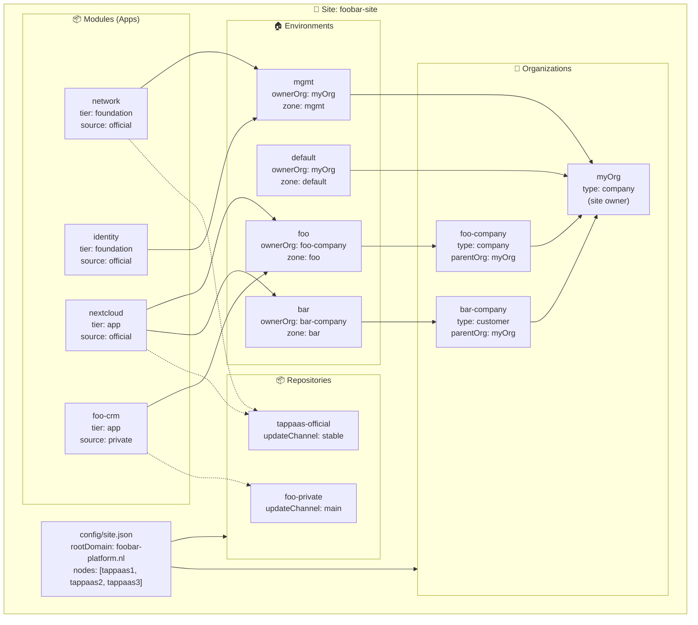
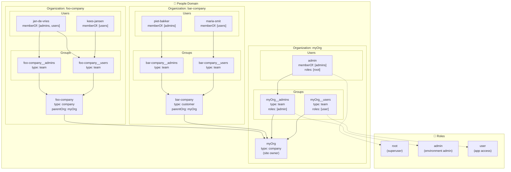

# ADR-007 Implementation Plan

**Issue**: #360
**Status**: Draft
**Version**: 0.2
**Date**: 2026-06-17

## Overview

This document describes the implementation packages for the ADR-007 series (TAPPaaS Taxonomy). Each package can be implemented and tested independently, with clear dependencies between packages.

**Key ADR Documents**:

- ADR-007 — TAPPaaS Taxonomy (overview) v2.3
- ADR-007a — People v1.1
- ADR-007b — Apps v1.2
- ADR-007c — Environments v1.2
- ADR-007d — Site v1.2
- ADR-007e — Health v1.0
- ADR-007f — Realization v0.8
- ADR-009 — Composition Meta-Model v0.3

**Related Issues**:

| Category | Issues |
|----------|--------|
| **Taxonomy** | #320 (tracking), #360 (this plan) |
| **Composition** | #171 (Module/Component), #297 (catalog facets) |
| **People** | #56 (default user/role profiles) |
| **Environments** | #318 (variant→environment), #319 (zone deletion), #294 (zone-aligned VMID), #313 (timezone→site) |
| **Apps/Modules** | #339 (module schema), #356 (source:local), #357 (local intent) |
| **Control-plane** | #364 (split opnsense-controller), #365 (managers/controllers layout) |
| **Cross-cutting** | #358 (backup) |
| **Deferred** | #354, #359 |

---

## High-Level Architecture Example

The following example shows the complete ADR-007 taxonomy in action with:
- **myOrg**: The site owner organization (runs mgmt environment)
- **Foo Company**: A subsidiary company
- **Bar Industries**: A hosted customer

### Configuration Relationship Diagram



> **Note**: Zones are now named the same as environments (sunsetting `srvHome`, `srvWork`, `srvCust`, etc.).
> The Nextcloud module is installed in both `foo` and `bar` environments.

---

## Implementation Packages

### Package Dependency Graph

```
                    ┌─────────────────────┐
                    │  P1: People Schema  │
                    └──────────┬──────────┘
                               │
        ┌──────────────────────┼──────────────────────┐
        │                      │                      │
        ▼                      ▼                      ▼
┌───────────────┐   ┌──────────────────┐   ┌─────────────────────┐
│ P2: Site JSON │   │ P3: Environment  │   │ P4: Module Updates  │
│ (from config) │   │    Schema        │   │    (tier/source)    │
└───────┬───────┘   └────────┬─────────┘   └──────────┬──────────┘
        │                    │                        │
        └──────────┬─────────┴────────────────────────┘
                   │
                   ▼
        ┌──────────────────────┐
        │  P5: tappaas-cicd    │
        │  Layout (managers)   │
        └──────────┬───────────┘
                   │
        ┌──────────┼──────────┐
        │          │          │
        ▼          │          ▼
┌───────────────┐  │  ┌─────────────────────┐
│ P6: Mgmt Zone │  │  │ P7: Default         │
│ → Environment │  │  │    Environment      │
└───────┬───────┘  │  └──────────┬──────────┘
        │          │             │
        └─────┬────┘─────────────┘
              │
              ▼
   ┌──────────────────────┐
   │  P8: Rename          │
   │  firewall → network  │
   └──────────────────────┘

   ┌──────────────────────┐
   │  P9: Backup          │◀─── depends on P2, P3, P5
   │  Configuration       │
   └──────────────────────┘
```

---

## P1: People Schema

**Closes**: #56 (default user and role profiles)

**Purpose**: Create JSON schemas and file structure for Organizations, Groups, and Users (ADR-007a).

### People Structure Diagram



**Key ADR-007a Rules**:

- 4-level hierarchy: `Role → Organization → Group → User`
- The `name` field is the identity key — used to identify entities in Authentik (no separate `authentikTenant`/`authentikGroup`/`authentikUser` fields)
- Membership modeled on **User** (`memberOf`), NOT on Group
- Roles can be assigned to Groups (inherited by members) or directly to Users (sparingly)
- **Attribute discipline**: every field must justify reason/default/operational impact (no CRM-creep)

**Deliverables**:

1. `src/foundation/schemas/role-fields.json` - Role schema
2. `src/foundation/schemas/organization-fields.json` - Organization schema
3. `src/foundation/schemas/group-fields.json` - Group schema
4. `src/foundation/schemas/user-fields.json` - User schema
5. `config/people/` directory structure:
   - `config/people/roles/{name}.json`
   - `config/people/organizations/{name}.json`
   - `config/people/groups/{org}__{name}.json`
   - `config/people/users/{name}.json`
6. Default roles: `root.json`, `admin.json`, `user.json`
7. Example files for myOrg, Foo, and Bar
8. `src/modules/foundation/identity/people-manager.py` - Python module for CRUD + Authentik sync
9. `bin/user-setup.sh` - Bootstrap script for minimal myOrg setup
10. Validation script: `bin/validate-people.sh`

**Schema Design** (from ADR-007a):

Legend: **bold** = mandatory, *italic* = optional (default shown)

```
Role (config/people/roles/{name}.json):
├── **name**        : string   — slug identifier (e.g., root, admin, user)
├── **displayName** : string   — human-readable name
└── *description*   : string   — (default: "")
   (Note: Actual permissions configured in Authentik via policies/entitlements)

Organization (config/people/organizations/{name}.json):
├── **name**        : string   — slug, used as Authentik tenant identifier
├── *type*          : enum     — (default: "company") family | company | foundation | customer
├── **displayName** : string   — human-readable name
├── **owner**       : string   — reference to User.name
└── *parentOrg*     : string   — (default: null) reference to parent Organization.name

Group (config/people/groups/{org}__{name}.json):
├── **name**        : string   — e.g., myOrg__admins, used as Authentik group identifier
├── *type*          : enum     — (default: "team") team | department | family-members | access-set | ad-hoc
├── **displayName** : string   — human-readable name
├── **ownerOrg**    : string   — reference to Organization.name
└── *roles*         : string[] — (default: []) inherited by all members
   (Note: NO members list - membership is on User)

User (config/people/users/{name}.json):
├── **name**        : string   — slug, used as Authentik user identifier
├── **displayName** : string   — human-readable name
├── **primaryEmail**: string   — user's primary email address
├── *memberOf*      : string[] — (default: []) array of Group.name references
└── *roles*         : string[] — (default: []) direct role assignment, use sparingly
```

**people-manager.py**:

A Python module associated with the identity module. Like `zone-manager` and `switch-manager`, it keeps Authentik updated idempotently.

```python
# src/modules/foundation/identity/people-manager.py
#
# CRUD operations on JSON config files + Authentik sync
#
# Commands:
#   people-manager role list|get|create|update|delete
#   people-manager org list|get|create|update|delete
#   people-manager group list|get|create|update|delete
#   people-manager user list|get|create|update|delete
#   people-manager sync [--dry-run]  # sync all to Authentik
#
# Idempotent: running sync multiple times produces same result
# Validates references: group.ownerOrg exists, user.memberOf groups exist
```

**user-setup.sh**:

Bootstrap script that creates minimal myOrg setup with one admin user:

```bash
# bin/user-setup.sh
#
# Creates:
#   - Default roles (root, admin, user) if not present
#   - myOrg organization
#   - myOrg__admins and myOrg__users groups
#   - admin user with root role, member of myOrg__admins
#
# Usage: user-setup.sh --org myOrg --admin-email admin@example.com
```

**Test Criteria**:

- [ ] Schema validates example role/org/group/user files
- [ ] `validate-people.sh` catches missing required fields
- [ ] Group references valid organization (ownerOrg)
- [ ] User references valid groups (memberOf)
- [ ] Role references in groups/users are valid
- [ ] `people-manager.py sync` creates entities in Authentik
- [ ] `people-manager.py sync` is idempotent (re-run produces no changes)
- [ ] `user-setup.sh` creates minimal working setup

**Dependencies**: None (foundational package)

### P1 Examples

#### Example: people/roles/root.json

Roles are labels that identify permission sets. The `name` is used to identify the role in Authentik. Actual permissions are configured directly in Authentik via policies and application entitlements.

```json
{
  "name": "root",
  "displayName": "Platform Root",
  "description": "Full platform access - superuser privileges"
}
```

#### Example: people/roles/admin.json

```json
{
  "name": "admin",
  "displayName": "Administrator",
  "description": "Administrative access to assigned environments"
}
```

#### Example: people/roles/user.json

```json
{
  "name": "user",
  "displayName": "User",
  "description": "Standard user access to assigned applications"
}
```

#### Example: people/organizations/myOrg.json

Per ADR-007a, every attribute must justify its **reason**, **default**, and **operational impact** (no CRM-creep). The `name` is used to identify the organization (tenant) in Authentik.

```json
{
  "name": "myOrg",
  "type": "company",
  "displayName": "myOrg BV",
  "owner": "admin"
}
```

#### Example: people/organizations/foo-company.json

```json
{
  "name": "foo-company",
  "type": "company",
  "displayName": "Foo Company BV",
  "owner": "jan-de-vries",
  "parentOrg": "myOrg"
}
```

#### Example: people/organizations/bar-company.json

A **customer** organization adds `parentOrg` to indicate the hosting relationship.

```json
{
  "name": "bar-company",
  "type": "customer",
  "displayName": "Bar Industries BV",
  "owner": "piet-bakker",
  "parentOrg": "myOrg"
}
```

#### Example: people/groups/myOrg__admins.json

Groups are named `{org}__{groupname}`. The `name` is used to identify the group in Authentik.

```json
{
  "name": "myOrg__admins",
  "type": "team",
  "displayName": "myOrg Administrators",
  "ownerOrg": "myOrg",
  "roles": ["admin"]
}
```

#### Example: people/groups/myOrg__users.json

```json
{
  "name": "myOrg__users",
  "type": "team",
  "displayName": "myOrg Users",
  "ownerOrg": "myOrg",
  "roles": ["user"]
}
```

#### Example: people/groups/foo-company__admins.json

Per ADR-007a, membership is modeled on the **User** (`memberOf`), not on the Group.

```json
{
  "name": "foo-company__admins",
  "type": "team",
  "displayName": "Foo Administrators",
  "ownerOrg": "foo-company",
  "roles": ["admin"]
}
```

#### Example: people/groups/foo-company__users.json

```json
{
  "name": "foo-company__users",
  "type": "team",
  "displayName": "Foo Users",
  "ownerOrg": "foo-company",
  "roles": ["user"]
}
```

#### Example: people/users/admin.json

The platform administrator. The `name` is used to identify the user in Authentik. The `roles` field assigns direct roles (independent of group membership) — use sparingly.

```json
{
  "name": "admin",
  "displayName": "Platform Administrator",
  "primaryEmail": "admin@foobar-platform.nl",
  "memberOf": [
    "myOrg__admins"
  ],
  "roles": ["root"]
}
```

#### Example: people/users/jan-de-vries.json

Users belong to groups via `memberOf`. The same user can be in groups across multiple organizations. Roles are inherited from groups.

```json
{
  "name": "jan-de-vries",
  "displayName": "Jan de Vries",
  "primaryEmail": "jan@foo-company.nl",
  "memberOf": [
    "foo-company__admins",
    "foo-company__users"
  ]
}
```

#### Example: people/users/piet-bakker.json

```json
{
  "name": "piet-bakker",
  "displayName": "Piet Bakker",
  "primaryEmail": "piet@bar-industries.nl",
  "memberOf": [
    "bar-company__admins"
  ]
}
```

---

## P2: Site JSON Migration

**Closes**: #313 (timezone→site)

**Purpose**: **Fully replace** `configuration.json` with `site.json` (ADR-007d). This is not a split — `configuration.json` is retired.

**Key Design Decisions**:

- `configuration.json` is **fully replaced** by `site.json` — no split, no backward compat file
- Domain, DNS, and identity are **per-environment** (not site-wide)
- Storage pools are **per-node** (not a flat list)
- `updateSchedule` stays site-wide; `automaticReboot`/`snapshotRetention` move to environments in P3

**Deliverables**:

1. `src/foundation/schemas/site-fields.json` - Site schema
2. `config/site.json` - New site configuration file
3. `bin/migrate-configuration-to-site.sh` - Migration script (called by update-tappaas)
4. Update `validate-configuration.sh` → `validate-site.sh`
5. Delete `configuration-fields.json` after migration

**Field Migration**:

| From configuration.json | To site.json | Notes |
|------------------------|--------------|-------|
| `tappaas.version` | `version` | Site config version |
| `tappaas.nodeCount` | *(removed)* | Computed from `hardware.nodes[]` |
| `tappaas-nodes[]` | `hardware.nodes[]` | Now includes per-node `storagePools` |
| `tappaas.repositories[]` | `repositories[]` | Unchanged |
| `tappaas.updateSchedule` | `updateSchedule` | Stays site-wide |
| `tappaas.automaticReboot` | `automaticReboot` | Site-wide until P3 (then per-env) |
| `tappaas.snapshotRetention` | `snapshotRetention` | Site-wide until P3 (then per-env) |
| `tappaas.domain` | *(removed)* | Now per-environment: `domains.primary` |
| `tappaas.email` | *(removed)* | Now per-environment or per-org |
| `tappaas.variants` | *(removed)* | Migrated to `environments/` files |
| *(new)* | `name`, `displayName`, `owner` | Site identity |
| *(new)* | `location.country/timezone/locale` | Site location |
| *(new)* | `network.isp`, `publicIp` | WAN config (no rootDomain) |
| *(new)* | `backup.target`, `offsite` | Site-wide backup target |
| *(new)* | `environments[]`, `organizations[]` | References to config files |

**Schema Design** (from ADR-007d):

Legend: **bold** = mandatory, *italic* = optional (default shown)

```text
Site (config/site.json):
├── **name**              : string   — slug identifier (e.g., foobar-site)
├── **displayName**       : string   — human-readable name
├── **owner**             : string   — reference to Organization.name (site owner)
├── *version*             : string   — (default: "1.0") site config schema version
├── **location**          : object
│   ├── **country**       : string   — ISO 3166-1 alpha-2 (e.g., "NL")
│   ├── **timezone**      : string   — IANA timezone (e.g., "Europe/Amsterdam")
│   └── *locale*          : string   — (default: "en_US") e.g., "nl_NL"
├── **network**           : object
│   ├── *isp*             : string   — (default: null) ISP name for reference
│   └── *publicIp*        : string   — (default: "auto") public IP or "auto"
├── **hardware**          : object
│   └── **nodes**         : array    — list of Proxmox nodes
│       ├── **name**      : string   — node name (e.g., "tappaas1")
│       └── **storagePools**: string[] — pools on this node (e.g., ["tanka1", "tankb1"])
├── *backup*              : object   — (default: null)
│   ├── *target*          : string   — (default: null) backup server hostname
│   └── *offsite*         : string   — (default: null) offsite backup buddy
├── *updateSchedule*      : array    — (default: ["monthly", "Thursday", 2])
├── *automaticReboot*     : boolean  — (default: true) → moves to Environment in P3
├── *snapshotRetention*   : integer  — (default: 5) → moves to Environment in P3
├── **repositories**      : array    — module catalog repositories
│   ├── **name**          : string   — repo identifier
│   ├── **url**           : string   — repository URL
│   └── *updateChannel*   : string   — (default: "stable") stable | main | etc.
├── *environments*        : string[] — (default: []) paths to environment JSON files
└── *organizations*       : string[] — (default: []) paths to organization JSON files
```

**Auto-Migration**:

Migration runs automatically via `update-tappaas` or `update-module.sh tappaas-cicd`:

```bash
# In update-tappaas or update-module.sh tappaas-cicd:
if [[ -f "$CONFIG_DIR/configuration.json" && ! -f "$CONFIG_DIR/site.json" ]]; then
    info "Migrating configuration.json → site.json"
    migrate-configuration-to-site.sh
fi
```

**Migration Script Logic**:

```bash
# migrate-configuration-to-site.sh
1. Check if configuration.json exists
2. Read existing configuration.json
3. Transform to new site.json structure:
   - Restructure nodes with per-node storagePools
   - Move variants to environments/ files
   - Create default myOrg organization
   - Create mgmt environment
4. Write config/site.json
5. Write config/environments/*.json for each variant
6. Write config/people/organizations/myOrg.json
7. Backup configuration.json to configuration.json.backup
8. Delete configuration.json
9. Validate site.json
```

**Test Criteria**:

- [ ] Migration script is idempotent (re-running is safe)
- [ ] `site.json` validates against schema
- [ ] Auto-migration triggers on `update-tappaas`
- [ ] Auto-migration triggers on `update-module.sh tappaas-cicd`
- [ ] All scripts read from `site.json` (no configuration.json fallback)
- [ ] `configuration.json` is backed up and deleted

**Dependencies**: P1 (for organization references in site.json)

### P2 Example

#### Example: site.json (umbrella)

Site.json contains **site-wide** settings only. Domain, DNS, and identity are **per-environment** (defined in each environment's `domains` and managed by Caddy/Authentik).

```json
{
  "name": "foobar-site",
  "displayName": "Foo & Bar Shared Platform",
  "owner": "myOrg",
  "location": {
    "country": "NL",
    "timezone": "Europe/Amsterdam",
    "locale": "nl_NL"
  },
  "network": {
    "isp": "KPN Business",
    "publicIp": "auto"
  },
  "hardware": {
    "nodes": [
      { "name": "tappaas1", "storagePools": ["tanka1", "tankb1"] },
      { "name": "tappaas2", "storagePools": ["tanka2", "tankb2"] },
      { "name": "tappaas3", "storagePools": ["tanka3"] }
    ]
  },
  "backup": {
    "target": "backup.foobar-platform.nl",
    "offsite": "pbs-offsite-buddy"
  },
  "updateSchedule": ["monthly", "Thursday", 2],
  "automaticReboot": true,
  "snapshotRetention": 5,
  "repositories": [
    {
      "name": "tappaas-official",
      "url": "https://github.com/TAPPaaS/TAPPaaS",
      "updateChannel": "stable"
    },
    {
      "name": "foo-private",
      "url": "https://github.com/foo-company/tappaas-modules",
      "updateChannel": "main"
    }
  ],
  "environments": [
    "config/environments/mgmt.json",
    "config/environments/default.json",
    "config/environments/foo.json",
    "config/environments/bar.json"
  ],
  "organizations": [
    "config/people/organizations/myOrg.json",
    "config/people/organizations/foo-company.json",
    "config/people/organizations/bar-company.json"
  ]
}
```

> **Migration note**: `automaticReboot` and `snapshotRetention` will move to per-environment settings when P3 is implemented. Until then, they remain site-wide in `site.json`.

---

## P3: Environment Schema

**Closes**: #318 (variant→environment)

**Purpose**: Create environment schema and migrate variants to environments (ADR-007c).

**Key ADR-007c Rules**:

- `ownerOrg` **references** a People Organization by name (validated, not free string)
- `vlan` lives in `zones.json`, NOT in the environment schema (CR-09)
- `updateWindow`/`updateChannel` out of v1 — tracked as issues CR-12/13
- `backup` is a cross-level concern (site → env → apps) — tracked separately (CR-14)
- Old `identityOrganization`/tenant dropped: `ownerOrg` + `domains` define identity (CR-11)
- `legal`/processor is cross-cutting — under review for own ADR (CR-15)

**Deliverables**:

1. `src/foundation/schemas/environment-fields.json` - Environment schema
2. `config/environments/` directory
3. `bin/migrate-variants-to-environments.sh` - Migration script
4. `bin/environment-manager.sh` - CRUD for environments (replaces `variant-manager.sh` v0.1)
5. Update `install-module.sh` to accept `--environment` alongside `--variant`

**Schema Design** (from ADR-007c):

Legend: **bold** = mandatory, *italic* = optional (default shown)

```
Environment (config/environments/{name}.json):
├── **name**          : string — slug identifier (e.g., foo, bar, mgmt)
├── **displayName**   : string — human-readable name
├── **ownerOrg**      : string — reference to Organization.name (validated)
├── *domains*         : object — (default: null) not required for mgmt
│   ├── **primary**   : string — primary domain (e.g., foo-company.nl)
│   ├── *aliases*     : string[] — (default: []) alias domains
│   ├── *aliasMode*   : enum   — (default: "redirect") redirect | mirror
│   └── *tlsCertRefid*: string — (default: null) managed by Caddy
├── **network**       : object
│   └── **zone**      : string — reference to zones.json (validated)
│   (Note: NO vlan here - lives in zones.json)
├── *dataResidency*   : enum   — (default: "eu-only") eu-only | global
├── *backup*          : object — (default: null)
│   └── *retention*   : string — (default: "7y") e.g., "5y", "1y"
└── *legal*           : object — (default: null)
    └── *processor*   : string — (default: null) legal processor name
```

**Variant → Environment Migration** (#318):

| configuration.json variants | environments/*.json |
|----------------------------|---------------------|
| `variants[""].domain` | `environments/default.json` → `domains.primary` |
| `variants[""].tlsCertRefid` | `domains.tlsCertRefid` (managed by Caddy, stored with domain) |
| `variants[""].zone` | `network.zone` |
| `variants["foo"].domain` | `environments/foo.json` → `domains.primary` |

> **Note**: `tlsCertRefid` is preserved and stored alongside the domain configuration. The exact integration with Caddy's certificate management needs further investigation — tracked for later refinement.

**Backward Compatibility**:

- `--variant` aliases to `--environment` for one release
- `--variant` deprecated next major version

**Test Criteria**:

- [ ] Migration preserves all variant settings
- [ ] `--variant` and `--environment` both work (compat period)
- [ ] `ownerOrg` validates against existing organization
- [ ] Zone reference validates against zones.json
- [ ] Legacy environments default `ownerOrg` to family org

**Dependencies**: P1, P2

### P3 Examples

#### Example: environments/foo.json

Per ADR-007c:

- `ownerOrg` **references** a People Organization (validated, not a free string)
- `vlan` lives in `zones.json`, not here (CR-09)
- `updateWindow`/`updateChannel` out of v1 (CR-12/13, tracked as issues)
- Zone name matches environment name (sunsetting `srvHome`, `srvWork`, etc.)
- `dataResidency` is per-environment (moved from Organization)

```json
{
  "name": "foo",
  "displayName": "Foo Company",
  "ownerOrg": "foo-company",
  "domains": {
    "primary": "foo-company.nl",
    "aliases": ["foocompany.com"],
    "aliasMode": "redirect"
  },
  "network": {
    "zone": "foo"
  },
  "dataResidency": "eu-only",
  "backup": {
    "retention": "7y"
  },
  "legal": {
    "processor": "myOrg BV"
  }
}
```

#### Example: environments/bar.json

```json
{
  "name": "bar",
  "displayName": "Bar Industries",
  "ownerOrg": "bar-company",
  "domains": {
    "primary": "bar-industries.nl"
  },
  "network": {
    "zone": "bar"
  },
  "dataResidency": "eu-only",
  "backup": {
    "retention": "5y"
  },
  "legal": {
    "processor": "myOrg BV"
  }
}
```

#### Example: environments/default.json

```json
{
  "name": "default",
  "displayName": "Default Environment",
  "ownerOrg": "myOrg",
  "domains": {
    "primary": "foobar-platform.nl"
  },
  "network": {
    "zone": "default"
  },
  "dataResidency": "eu-only",
  "backup": {
    "retention": "7y"
  }
}
```

#### Example: environments/mgmt.json (Management Environment)

The `mgmt` environment does not require a `domains` field — foundation modules are accessed via internal DNS only.

```json
{
  "name": "mgmt",
  "displayName": "Management",
  "ownerOrg": "myOrg",
  "network": {
    "zone": "mgmt"
  }
}
```

---

## P4: Module Updates

**Closes**: #339 (module schema)

**Purpose**: Update module management to embrace the new environment structure, including Tier/Source classification fields (ADR-007b). Most module definition and functionality remains unchanged — this package focuses on environment-aware deployment and the new classification attributes.

**What Changes**:

- New `tier` and `source` classification fields
- Environment-aware module deployment (`--environment` flag)
- Computed VM name based on environment
- Zone defaults from environment configuration
- Foundation tier deployment constraints

**What Stays the Same**:

- Core module fields: `vmid`, `node`, `dependsOn`, `provides`, `cores`, `memory`, `disk`, `version`
- Module installation workflow (just with `--environment`)
- Module directory structure within each module
- Test and update scripts (just with `--environment`)

### Key ADR-007b Rules

- **Two orthogonal attributes** — never collapsed into one enum (that would break MECE)
- `tier` answers: *Can it be uninstalled?* (lifecycle role)
- `source` answers: *Where does the catalog entry come from?* (origin & trust)
- Module name **is** its `{name}.json` filename — no separate `module` field (CR-04)
- `sourceMetadata` lives in **Site → `repositories`**, not on the module (CR-05)
- `ownerGroup` and `environment` are **inferred at deploy time**, not stored on module (CR-06/07)

### Tier and Source Classification

| Attribute | Determined By | Values |
|-----------|---------------|--------|
| `tier` | Module's `{name}.json` definition | `foundation` \| `app` |
| `source` | Which repository contains the module | `official` \| `community` \| `private` \| `local` |

**Tier/Source Grid** (all 8 combinations valid):

| | official | community | private | local |
|---|---|---|---|---|
| **foundation** | normal | rare (fork) | custom platform | dev |
| **app** | normal | most community | customer-specific | dev |

**Lint Rule**: `tier: foundation` → `source` MUST be `official` (or explicit override for forks)

**Source Badges**:

| Source | Badge | Meaning |
|--------|-------|---------|
| `official` | 🟢 Verified | TAPPaaS-maintained, signed |
| `community` | 🟡 Community | Peer-reviewed, not officially supported |
| `private` | 🔵 Private | Customer/private repo |
| `local` | ⚪ Local | Local dev, not in any catalog |

### Module Schema Changes

Legend: **bold** = mandatory, *italic* = optional (default shown)

Only the **changed/new** fields are shown below. All other module fields (vmid, node, dependsOn, provides, cores, memory, disk, version, etc.) remain unchanged.

```text
Module (config/modules/{name}.json) — CHANGES ONLY:
├── **tier**    : enum   — foundation | app (lifecycle role) [NEW]
└── *source*    : enum   — (default: inferred from repo) official | community | private | local [NEW]

REMOVED (now computed/inferred):
├── vmname      — computed: module name if environment=default, else {name}-{environment}
└── zone        — defaults to environment's zone (from environments/{env}.json → network.zone)
```

**VM Name Computation**:

```bash
# vmname is computed at install time, not stored in module JSON
if [[ "$ENVIRONMENT" == "default" ]]; then
    VMNAME="$MODULE_NAME"
else
    VMNAME="${MODULE_NAME}-${ENVIRONMENT}"
fi
```

**Zone Resolution**:

```bash
# Zone is read from the target environment, not the module
ZONE=$(jq -r '.network.zone' "config/environments/${ENVIRONMENT}.json")
```

### Environment-Aware Module Scripts

**Updated Scripts**:

1. `install-module.sh` - Add `--environment` option
2. `update-module.sh` - Add `--environment` option
3. `delete-module.sh` - Add `--environment` option, `--force` for foundation

**install-module.sh Changes**:

```bash
# New options
--environment <name>   # Target environment (default: "default")
--variant <name>       # Deprecated alias for --environment (one release)

# Environment resolution
if [[ -z "$ENVIRONMENT" ]]; then
    if [[ "$TIER" == "foundation" ]]; then
        ENVIRONMENT="mgmt"
    else
        ENVIRONMENT="default"
    fi
fi

# Foundation tier constraints
if [[ "$TIER" == "foundation" ]]; then
    if [[ "$ENVIRONMENT" != "mgmt" ]]; then
        error "Foundation modules can only be installed in mgmt environment"
        exit 1
    fi
    # Check for existing installation
    if module_exists "$MODULE_NAME" "mgmt"; then
        error "Foundation module '$MODULE_NAME' already installed in mgmt"
        exit 1
    fi
fi
```

**delete-module.sh Changes**:

```bash
# New options
--environment <name>   # Target environment
--force                # Required for foundation modules

# Foundation tier protection
if [[ "$TIER" == "foundation" ]]; then
    if [[ "$FORCE" != "true" ]]; then
        error "Cannot delete foundation module without --force"
        error "Foundation modules are critical platform components"
        exit 1
    fi
    warn "Deleting foundation module '$MODULE_NAME' with --force"
fi
```

### Deliverables

1. Update `src/foundation/module-fields.json`:
   - Add `tier` field: `foundation` | `app`
   - Add `source` field: `official` | `community` | `private` | `local`
   - Remove `vmname` (computed)
   - Document that `zone` defaults to environment
2. Update `src/module-catalog.json`:
   - Add `tier` and `source` to each entry
3. Update `bin/install-module.sh`:
   - Add `--environment` option
   - Add foundation tier constraints (mgmt only, single instance)
   - Implement VM name computation
   - Implement zone resolution from environment
4. Update `bin/update-module.sh`:
   - Add `--environment` option
5. Update `bin/delete-module.sh`:
   - Add `--environment` option
   - Add `--force` requirement for foundation modules
6. `bin/validate-module-tier-source.sh` - Lint rule enforcement

### Catalog Entry Schema

```text
Catalog Entry (module-catalog.json entries):
├── **moduleName**    : string   — module identifier (matches filename)
├── **stack**         : string   — classification stack (e.g., "foundation", "productivity")
├── **tier**          : enum     — foundation | app
├── *source*          : enum     — (default: "official") official | community | private | local
├── *status*          : enum     — (default: "stable") stable | beta | deprecated
└── *description*     : string   — (default: "") short description
```

**Catalog Entry Changes**:

```json
// Before
{
  "moduleName": "firewall",
  "stack": "foundation",
  "status": "stable"
}

// After
{
  "moduleName": "firewall",
  "stack": "foundation",
  "tier": "foundation",        // new - intrinsic
  "source": "official",        // new - from repo
  "status": "stable"
}
```

### Test Criteria

- [ ] All existing modules pass validation with added fields
- [ ] Lint rule catches `tier: foundation` with `source: community`
- [ ] Install warning shown for community modules
- [ ] Module `tier` read from module JSON, not install flags
- [ ] Module `source` inferred from repository, not install flags
- [ ] VM name computed correctly for default vs other environments
- [ ] Zone resolved from environment configuration
- [ ] Foundation modules can only install to mgmt environment
- [ ] Foundation modules require `--force` to delete
- [ ] Non-foundation modules default to "default" environment
- [ ] `--environment` and `--variant` both work (compat period)

**Dependencies**: None (can run in parallel with P1-P3)

### P4 Examples

#### Module Installation

**Important**: `tier` and `source` are **intrinsic properties** of the module, determined by:

- **`tier`**: Defined in the module's `{name}.json` (`foundation` or `app`)
- **`source`**: Determined by which repository the module comes from (official, community, private, or local)

These are NOT installation-time flags. The installer reads them from the module definition and repository configuration.

```bash
# Install Nextcloud for Foo environment
# tier=app and source=official are read from nextcloud.json and the tappaas-official repo
install-module.sh nextcloud --environment foo

# Install the same Nextcloud for Bar environment (multi-tenant)
install-module.sh nextcloud --environment bar

# Install a private module from the foo-private repo
# tier=app is in foo-crm.json; source=private is inferred from the foo-private repo
install-module.sh foo-crm --environment foo --repo foo-private

# Install a community module for Bar
# source=community is inferred from the community repo where paperless-ngx is catalogued
install-module.sh paperless-ngx --environment bar
```

**Lint rule (ADR-007b)**: `tier: foundation` requires `source: official` (or explicit override for forks).

---

## P5: tappaas-cicd Layout

**Closes**: #365 (managers/controllers layout), #364 (split opnsense-controller)

**Purpose**: Organize the control-plane scripts under `tappaas-cicd` into a clear **managers** vs **controllers** structure. The overall `src/` layout remains unchanged — this package focuses on organizing scripts within `tappaas-cicd`.

### Managers vs Controllers

| Type | Purpose | Operates On | Examples |
|------|---------|-------------|----------|
| **Manager** | CRUD + lifecycle for domain objects | JSON config files + Authentik sync | people-manager, environment-manager, site-manager, module-manager, health-manager |
| **Controller** | Direct control of infrastructure | APIs, VMs, network devices | zone-controller, switch-controller, opnsense-controller, identity-controller |

**Key distinction**: Managers work with **config state** (JSON files, schemas, validation). Controllers work with **runtime state** (APIs, device configs, VM operations).

### What Changes

- Create `managers/` and `controllers/` directories under `tappaas-cicd`
- Organize existing scripts by their function
- Add planned scripts from P1-P4

### What Stays the Same

- `src/foundation/` and `src/apps/` directory structure
- Module locations (`src/foundation/firewall/`, `src/apps/nextcloud/`, etc.)
- `bin/` entry points (symlinks to new locations)

### Target Layout (tappaas-cicd internal)

```
src/foundation/tappaas-cicd/
├── managers/                           # Domain object lifecycle (config state)
│   │
│   ├── people-manager/                 # 👥 People domain (P1)
│   │   ├── people-manager.py           # Main entry: role/org/group/user CRUD
│   │   ├── validate-people.sh          # Schema validation
│   │   └── user-setup.sh               # Bootstrap minimal setup
│   │
│   ├── environment-manager/            # 🏠 Environments domain (P3)
│   │   ├── environment-manager.sh      # Environment CRUD
│   │   ├── migrate-variants.sh         # Variant → Environment migration
│   │   └── validate-environment.sh     # Schema validation
│   │
│   ├── site-manager/                   # 🏢 Site domain (P2)
│   │   ├── site-manager.sh             # Site config CRUD
│   │   ├── migrate-configuration.sh    # configuration.json → site.json
│   │   └── validate-site.sh            # Schema validation
│   │
│   ├── module-manager/                 # 📦 Apps/Modules domain (P4)
│   │   ├── install-module.sh           # Install with --environment
│   │   ├── update-module.sh            # Update with --environment
│   │   ├── delete-module.sh            # Delete with --force for foundation
│   │   ├── test-module.sh              # Run module tests
│   │   ├── snapshot-vm.sh              # VM snapshot management
│   │   └── validate-module.sh          # Tier/source lint rules
│   │
│   └── health-manager/                 # 🩺 Health domain (ADR-007e)
│       ├── health-manager.sh           # Health check orchestration
│       ├── inspect-cluster.sh          # Cluster health inspection
│       ├── inspect-vm.sh               # VM health inspection
│       ├── check-disk-threshold.sh     # Disk usage alerts
│       └── check-backup-status.sh      # Backup health
│
├── controllers/                        # Infrastructure control (runtime state)
│   │
│   ├── zone-controller/                # Network zone lifecycle
│   │   ├── zone-controller.sh          # Main entry (was zone-manager)
│   │   ├── zone-state.sh               # Zone state queries
│   │   ├── zone-create.sh              # Create zone (VLAN, firewall, DNS)
│   │   └── zone-delete.sh              # Delete zone (#319)
│   │
│   ├── switch-controller/              # Managed switch VLAN control
│   │   ├── switch-controller.py        # Main entry (was switch-manager)
│   │   └── switch-api.py               # Switch API client
│   │
│   ├── opnsense-controller/            # OPNsense firewall/router control
│   │   ├── opnsense-controller.py      # Main entry (existing)
│   │   ├── opnsense-api.py             # OPNsense API client
│   │   ├── firewall-rules.py           # Firewall rule management
│   │   ├── dns-records.py              # Unbound DNS management
│   │   ├── dhcp-leases.py              # DHCP management
│   │   └── nat-rules.py                # NAT rule management
│   │
│   ├── identity-controller/            # Authentik runtime operations
│   │   ├── identity-controller.py      # Main entry
│   │   ├── authentik-api.py            # Authentik API client
│   │   ├── sync-users.py               # Sync users to Authentik
│   │   ├── sync-groups.py              # Sync groups to Authentik
│   │   └── sync-tenants.py             # Sync orgs as tenants
│   │
│   └── caddy-controller/               # Caddy reverse proxy control
│       ├── caddy-controller.sh         # Main entry (was caddy-manager)
│       ├── setup-caddy.sh              # Initial Caddy setup
│       ├── add-route.sh                # Add proxy route
│       └── reload-caddy.sh             # Reload configuration
│
├── lib/                                # Shared libraries
│   ├── common.sh                       # Bash utilities
│   ├── logging.sh                      # Logging functions
│   ├── validation.sh                   # JSON schema validation
│   └── api-client.py                   # Base API client class
│
├── install.sh
├── update.sh
├── test.sh
└── tappaas-cicd.json
```

### Manager ↔ Controller Interaction

Managers call controllers to apply changes:

```
┌─────────────────┐     calls      ┌─────────────────────┐
│ people-manager  │ ─────────────▶ │ identity-controller │
│ (JSON CRUD)     │                │ (Authentik API)     │
└─────────────────┘                └─────────────────────┘

┌─────────────────────┐     calls      ┌──────────────────┐
│ environment-manager │ ─────────────▶ │ zone-controller  │
│ (JSON CRUD)         │                │ (VLAN/firewall)  │
└─────────────────────┘                └──────────────────┘
                       │
                       │  calls      ┌──────────────────┐
                       └───────────▶ │ caddy-controller │
                                     │ (proxy routes)   │
                                     └──────────────────┘

┌────────────────┐     calls      ┌─────────────────────┐
│ module-manager │ ─────────────▶ │ opnsense-controller │
│ (install/etc)  │                │ (DNS, firewall)     │
└────────────────┘                └─────────────────────┘
```

### Command Mapping (Old → New)

| Old Command | New Location | Notes |
|-------------|--------------|-------|
| `zone-manager` | `controllers/zone-controller/` | Renamed manager→controller |
| `switch-manager` | `controllers/switch-controller/` | Renamed manager→controller |
| `opnsense-controller` | `controllers/opnsense-controller/` | Already named correctly |
| `caddy-manager` | `controllers/caddy-controller/` | Renamed manager→controller |
| `dns-manager` | `controllers/opnsense-controller/dns-records.py` | Merged into opnsense |
| `install-module.sh` | `managers/module-manager/` | New location |
| `update-module.sh` | `managers/module-manager/` | New location |
| `delete-module.sh` | `managers/module-manager/` | New location |
| `test-module.sh` | `managers/module-manager/` | New location |
| `inspect-cluster.sh` | `managers/health-manager/` | New location |
| `inspect-vm.sh` | `managers/health-manager/` | New location |
| *(new)* `people-manager` | `managers/people-manager/` | From P1 |
| *(new)* `environment-manager` | `managers/environment-manager/` | From P3 |
| *(new)* `site-manager` | `managers/site-manager/` | From P2 |
| *(new)* `identity-controller` | `controllers/identity-controller/` | Authentik sync |

### Deliverables

1. Create `src/foundation/tappaas-cicd/managers/` directory structure
2. Create `src/foundation/tappaas-cicd/controllers/` directory structure
3. Move existing scripts to appropriate locations per mapping table
4. Rename `-manager` → `-controller` for infrastructure scripts
5. Create `lib/` with shared utilities
6. Update `bin/` symlinks to point to new locations
7. Add wrapper scripts for backward compatibility (one release)
8. Update all scripts that call these tools

### Test Criteria

- [ ] All managers validate their JSON schemas
- [ ] `people-manager` syncs to `identity-controller` → Authentik
- [ ] `environment-manager` calls `zone-controller` + `caddy-controller`
- [ ] `module-manager install` works with `--environment`
- [ ] `zone-controller` creates/deletes zones correctly
- [ ] `opnsense-controller` firewall/dns/dhcp commands work
- [ ] `switch-controller` VLAN commands work
- [ ] `caddy-controller` route commands work
- [ ] Backward-compat wrappers work for one release
- [ ] `bin/` symlinks resolve correctly

**Dependencies**: P1 (people-manager), P2 (site-manager), P3 (environment-manager), P4 (module-manager updates)

---

## P6: Management Zone as Environment

**Purpose**: Model the `mgmt` zone as a proper environment with mandatory foundation modules.

**Deliverables**:
1. `config/environments/mgmt.json` - Management environment definition
2. Update `zone-state.sh` to treat mgmt as environment
3. Define mandatory modules list for mgmt environment
4. Update network tools to understand mgmt-as-environment

**mgmt Environment Special Rules**:

The mgmt environment is minimal — no domains required (internal DNS only). Mandatory modules are enforced by convention (tier: foundation), not by a `modules` field.

```json
{
  "name": "mgmt",
  "displayName": "Management",
  "ownerOrg": "myOrg",
  "network": {
    "zone": "mgmt"
  }
}
```

**Test Criteria**:
- [ ] mgmt environment created on fresh install
- [ ] Cannot delete mandatory modules from mgmt
- [ ] Foundation modules auto-install to mgmt
- [ ] mgmt.json validates against environment schema

**Dependencies**: P3, P5

---

## P7: Default Environment

**Closes**: #319 (zone deletion — sunset legacy zones)

**Purpose**: Define how the "default" environment works when no `--environment` specified, and sunset the legacy `srvHome`, `srvWork`, `srvClient` zones in favor of user-created environments.

### Legacy Zone Sunset (#319)

The legacy zones `srvHome`, `srvWork`, `srvClient` are removed from standard distribution:

| Legacy Zone | Replacement |
|-------------|-------------|
| `srvHome` | Create `home` environment |
| `srvWork` | Create `work` environment |
| `srvClient` | Create `{client}` environment per client |
| `srv` | Becomes `default` — generic services without environment affinity |

**Migration**:
- Existing installations with modules in legacy zones → prompt to create environments
- New installations start with only `mgmt` and `default` environments
- Zone names now match environment names (zone `foo` ↔ environment `foo`)

### Deliverables

1. `config/environments/default.json` - Default environment (maps to legacy "no variant" / `srv` zone)
2. Remove `srvHome`, `srvWork`, `srvClient` from `zones.json` template
3. Update `install-module.sh` default behavior
4. `bin/migrate-legacy-zones.sh` - Migration script for legacy zone users
5. Document default environment selection logic

**Default Resolution Logic**:
```bash
# When --environment not specified:
1. If site has only one non-mgmt environment → use it
2. If site has "default" environment → use it
3. If site has environment matching module's preferredEnvironment → use it
4. Otherwise → error, require explicit --environment
```

**Backward Compatibility**:
- `--variant ""` (empty) maps to default environment
- `--variant foo` maps to `environments/foo.json`
- `--environment` takes precedence over `--variant`

**Test Criteria**:
- [ ] Legacy installs without --variant work
- [ ] Single-environment sites work without flags
- [ ] Multi-environment sites require explicit choice
- [ ] Clear error message when environment ambiguous
- [ ] Fresh install has only `mgmt` and `default` zones
- [ ] `migrate-legacy-zones.sh` creates environments for modules in legacy zones
- [ ] Zone names match environment names after migration

**Dependencies**: P3

---

## P8: Rename firewall → network

**Purpose**: Rename the `firewall` module to `network` to better reflect its role (OPNsense does routing, DNS, DHCP, NAT, not just firewall).

**Deliverables**:

1. Rename `src/foundation/firewall/` → `src/foundation/network/`
2. Rename `firewall.json` → `network.json`
3. Update `vmname: "firewall"` → `vmname: "network"`
4. Update all references in:
   - `module-catalog.json`
   - `zones.json` (zone references)
   - `dependsOn` in other modules (`firewall:*` → `network:*`)
   - Scripts that reference firewall
5. Migration script for existing installations:
   - Rename VM
   - Update DNS records
   - Update Caddy routes

**Service Mapping**:

```
firewall:proxy    → network:proxy
firewall:dns      → network:dns
firewall:dhcp     → network:dhcp
firewall:nat      → network:nat
firewall:rules    → network:rules
```

**Test Criteria**:

- [ ] Fresh install creates `network` VM
- [ ] Migration renames existing `firewall` VM
- [ ] All dependent modules work after rename
- [ ] Proxy routes work with new name

**Dependencies**: P5 (managers consolidated before module rename)

---

## P9: Backup Configuration

**Closes**: #358 (backup), CR-14 (backup cross-level concern)

**Purpose**: Implement the backup configuration model across the Site → Environment → Module hierarchy. Backup is a cross-level concern where settings cascade from site defaults, through environment overrides, to module-specific policies.

### Backup Hierarchy

```
Site (site.json)
├── backup.target          # PBS server (site-wide)
├── backup.offsite         # Offsite buddy (site-wide)
└── backup.defaultRetention # Default retention (e.g., "7y")
        │
        ▼ (inherited, can override)
Environment (environments/*.json)
├── backup.retention       # Override retention (e.g., "5y" for bar)
├── backup.residency       # Data residency (e.g., "eu-only")
└── backup.schedule        # Environment-specific schedule
        │
        ▼ (inherited, can override)
Module (at install time)
├── backup.enabled         # Can disable backup for specific module
├── backup.retention       # Module-specific retention
└── backup.exclude         # Paths to exclude from backup
```

### Schema Additions

**Site backup fields** (already in P2):

```text
Site (config/site.json):
└── *backup*              : object   — (default: null)
    ├── *target*          : string   — (default: null) PBS server hostname
    ├── *offsite*         : string   — (default: null) offsite backup buddy
    └── *defaultRetention*: string   — (default: "7y") default retention period
```

**Environment backup fields** (already in P3):

```text
Environment (config/environments/{name}.json):
└── *backup*              : object   — (default: inherit from site)
    ├── *retention*       : string   — (default: inherit) e.g., "5y", "1y"
    ├── *residency*       : enum     — (default: "eu-only") eu-only | global
    └── *schedule*        : string   — (default: null) cron expression
```

**Module backup fields** (install-time):

```text
Module backup (stored in deployed module state):
└── *backup*              : object   — (default: inherit from environment)
    ├── *enabled*         : boolean  — (default: true) can disable backup
    ├── *retention*       : string   — (default: inherit) module-specific
    └── *exclude*         : string[] — (default: []) paths to exclude
```

### Backup Manager

Add `backup-manager` to `managers/`:

```
src/foundation/tappaas-cicd/managers/backup-manager/
├── backup-manager.sh       # Main entry: backup operations
├── backup-status.sh        # Check backup status for all modules
├── backup-restore.sh       # Restore operations
└── validate-backup.sh      # Validate backup configuration
```

### Backup Controller

Add `backup-controller` to `controllers/`:

```
src/foundation/tappaas-cicd/controllers/backup-controller/
├── backup-controller.py    # Main entry: PBS operations
├── pbs-api.py              # Proxmox Backup Server API client
├── schedule-backup.py      # Schedule backup jobs
└── verify-backup.py        # Verify backup integrity
```

### Deliverables

1. Add backup fields to site schema (`site-fields.json`)
2. Add backup fields to environment schema (`environment-fields.json`)
3. Create `managers/backup-manager/` with backup operations
4. Create `controllers/backup-controller/` with PBS integration
5. Update `install-module.sh` to configure backup for new modules
6. Update `health-manager` to include backup status checks
7. Document backup inheritance model

### Test Criteria

- [ ] Site-level backup target configured
- [ ] Environment inherits site backup settings
- [ ] Environment can override retention
- [ ] Module backup enabled by default
- [ ] Module backup can be disabled with `backup.enabled: false`
- [ ] `backup-manager status` shows all module backup states
- [ ] `backup-controller` communicates with PBS API
- [ ] Backup residency respected (eu-only modules not backed up to non-EU targets)

**Dependencies**: P2 (site.json), P3 (environment.json), P5 (managers/controllers structure)

---

## Implementation Order

### Phase 1: Schemas (can parallelize)

- **P1**: People Schema (no dependencies)
- **P4**: Module Updates (no dependencies)

### Phase 2: Core Migration

- **P2**: Site JSON Migration (depends on P1)
- **P3**: Environment Schema (depends on P1, P2)

### Phase 3: Control Plane

- **P5**: tappaas-cicd Layout (depends on P1, P4)

### Phase 4: Refinement

- **P6**: Mgmt Zone as Environment (depends on P3, P5)
- **P7**: Default Environment (depends on P3)

### Phase 5: Cleanup

- **P8**: Rename firewall → network (depends on P5)

### Phase 6: Cross-Cutting Concerns

- **P9**: Backup Configuration (depends on P2, P3, P5)

---

## Testing Strategy

Each package has its own test criteria. Additionally:

### Integration Tests
1. **Fresh Install Test**: Install TAPPaaS from scratch with new structure
2. **Migration Test**: Migrate existing installation to new structure
3. **Multi-tenant Test**: Install modules for Foo and Bar in different environments
4. **Rollback Test**: Verify backward-compat layers work

### Regression Tests
1. All existing `test.sh` scripts pass
2. Module installation/update/delete cycles work
3. Proxy routing works
4. DNS resolution works
5. Identity/SSO works

---

## Open Questions

1. **Backward Compatibility Duration**: How long do we maintain `--variant`, old paths?
2. **Migration Automation**: Auto-migrate on update-tappaas, or manual script?
3. **UI Impact**: Does rename firewall→network affect any UI/dashboard?
4. **Documentation**: ADRs reference old names - update or leave historical?

---

## Deferred Items (from ADR Review Comments)

The following items are explicitly deferred from the initial implementation:

| ID | Item | Tracked As | Notes |
|----|------|-----------|-------|
| CR-12 | `updateWindow` details | Issue | Out of Environment v1 |
| CR-13 | `updateChannel` details | Issue | Out of Environment v1 |
| CR-15 | `legal`/processor cross-cutting | Potential ADR | May need own ADR |
| #357 | `source: local` intent | Issue | Operational data in markdown |

---

## Appendix: Deferred Ideas

The following environment schema features are deferred for future consideration:

### `firewallPosture`

**Original intent**: Per-environment security posture setting (e.g., `strict`, `standard`, `management`) that would configure firewall rules automatically.

**Why deferred**: The values and their operational impact need to be defined before adoption. This requires deeper integration with the network module and zone-based firewall rules.

**Reintroduce when**: Firewall rule automation matures and clear posture definitions emerge from operational experience.

### `customerSubdomainPattern`

**Original intent**: MSP-style hosting pattern like `{cust}.mybusiness.nl` for multi-tenant customer subdomains within a single environment.

**Why deferred**: The use case is narrow (MSP hosting) and the implementation requires Caddy wildcard certificates and dynamic DNS — complexity not justified for initial release.

**Reintroduce when**: MSP hosting becomes a priority use case with clear requirements.

### Organization: Extended Fields

The following Organization fields from ADR-007a are deferred to keep the schema minimal (attribute discipline):

| Field | Original Intent | Why Deferred |
| ----- | --------------- | ------------ |
| `legalEntity` | Legal name for contracts | CRM-like, no operational impact |
| `jurisdiction` | Legal jurisdiction (NL, DE, etc.) | CRM-like, no operational impact |
| `primaryDomain` | Organization's primary domain | Domains are per-environment, not per-org |
| `aliasDomains[]` | Alias domains for org | Domains are per-environment |
| `aliasMode` | redirect/mirror for aliases | Domains are per-environment |
| `billing.invoicedBy` | Who invoices this customer | CRM/billing, no operational impact |
| `billing.contractRef` | Contract reference | CRM/billing, no operational impact |
| `dpaSigned` | Data Processing Agreement signed | Compliance tracking, no operational impact |

**Reintroduce when**: Specific operational requirements emerge (e.g., automated contract generation, compliance reporting).

## Related Issues

- **#318**: Rename "variant" → Environment
- **#319**: Zone deletion semantics
- **#294**: Zone-aligned VMID ranges
- **#313**: Timezone → site.json
- **#320**: Taxonomy tracking issue
- **#360**: This implementation plan

---

## Appendix: File Inventory

### New Files Created

```
config/
├── site.json
├── environments/
│   ├── mgmt.json              # Management (ownerOrg: myOrg)
│   ├── default.json           # Default environment (ownerOrg: myOrg)
│   ├── foo.json               # Foo Company (zone: foo)
│   └── bar.json               # Bar Industries (zone: bar)
└── people/
    ├── roles/
    │   ├── root.json          # Superuser role
    │   ├── admin.json         # Administrator role
    │   └── user.json          # Standard user role
    ├── organizations/
    │   ├── myOrg.json         # Site owner
    │   ├── foo-company.json   # Subsidiary (parentOrg: myOrg)
    │   └── bar-company.json   # Customer (parentOrg: myOrg)
    ├── groups/
    │   ├── myOrg__admins.json
    │   ├── myOrg__users.json
    │   ├── foo-company__admins.json
    │   ├── foo-company__users.json
    │   ├── bar-company__admins.json
    │   └── bar-company__users.json
    └── users/
        ├── admin.json
        ├── jan-de-vries.json
        ├── kees-jansen.json
        ├── piet-bakker.json
        └── maria-smit.json

src/foundation/schemas/
├── site-fields.json
├── environment-fields.json
├── role-fields.json
├── organization-fields.json
├── group-fields.json
└── user-fields.json
```

### Files Modified

```
src/module-catalog.json          # Add tier/source fields
src/foundation/module-fields.json # Add tier/source fields
configuration-fields.json         # Remove migrated fields
zones.json                        # Rename zones to match environments
```

### Files Moved/Renamed

```bash
# P5: tappaas-cicd managers/controllers reorganization

# Controllers (infrastructure control)
src/foundation/tappaas-cicd/opnsense-controller.py  →  controllers/opnsense-controller/opnsense-controller.py
src/foundation/tappaas-cicd/switch-manager.py       →  controllers/switch-controller/switch-controller.py
src/foundation/tappaas-cicd/zone-manager.sh         →  controllers/zone-controller/zone-controller.sh
src/foundation/tappaas-cicd/caddy-manager.sh        →  controllers/caddy-controller/caddy-controller.sh
src/foundation/tappaas-cicd/dns-manager.sh          →  controllers/opnsense-controller/dns-records.py

# Managers (domain object lifecycle)
bin/install-module.sh   →  managers/module-manager/install-module.sh
bin/update-module.sh    →  managers/module-manager/update-module.sh
bin/delete-module.sh    →  managers/module-manager/delete-module.sh
bin/test-module.sh      →  managers/module-manager/test-module.sh
bin/inspect-cluster.sh  →  managers/health-manager/inspect-cluster.sh
bin/inspect-vm.sh       →  managers/health-manager/inspect-vm.sh

# P8: firewall → network rename
src/foundation/firewall/  →  src/foundation/network/
```

### New Files (P9: Backup)

```text
src/foundation/tappaas-cicd/
├── managers/backup-manager/
│   ├── backup-manager.sh       # Backup operations
│   ├── backup-status.sh        # Status for all modules
│   ├── backup-restore.sh       # Restore operations
│   └── validate-backup.sh      # Validate configuration
│
└── controllers/backup-controller/
    ├── backup-controller.py    # PBS operations
    ├── pbs-api.py              # PBS API client
    ├── schedule-backup.py      # Schedule jobs
    └── verify-backup.py        # Verify integrity
```
