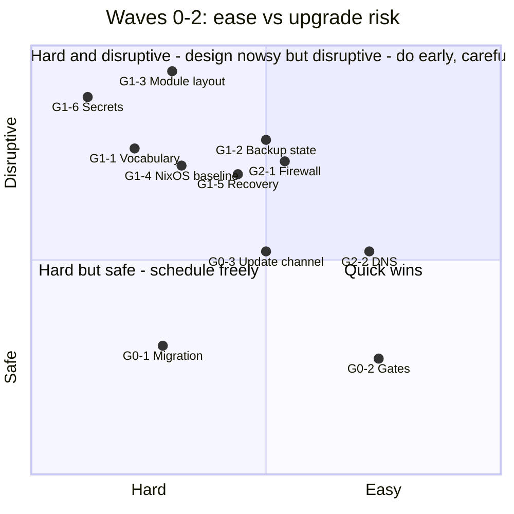
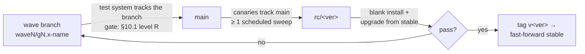

# Release 2.1 — Implementation Plan (draft for review)

**Compiled:** 2026-09-14. **Status:** draft, for operator review.
**Input:** Codeberg snapshot taken 2026-09-14 13:53 UTC — all open issues in
*Release 2.0: Build out Stacks* (15), *Release 2.0 Documentation* (3),
*Release 2.1: Security and stability release* (113) and *Future Work* (24),
plus every comment on them. Code facts were checked against the local `main`
checkout (`6d3a798`).

The goal is to order the backlog so that changes that **break or migrate an
existing installation** land first, while there are still few installations
and few community modules depending on today's names, schemas and layouts.

---

## 1. How to read the scores

Every issue and every group has three scores.

**Ease (E)** — how cheap it is to build.

| E | Meaning |
|---|---------|
| 5 | trivial — under half a day, one file |
| 4 | small — 1–2 days, contained |
| 3 | medium — up to a week, several files, needs a test |
| 2 | large — multi-week or crosses managers/controllers; needs a decision first |
| 1 | very large or open design — new subsystem or rebuild procedure |

**Upgrade risk (R)** — what an *existing* installation goes through when the
change reaches it through `update-tappaas`.

| R | Meaning |
|---|---------|
| 1 | none — docs, tests, new opt-in capability; existing installs unchanged |
| 2 | low — tool/manager behaviour changes; deployed config and live state untouched; `git revert` is the rollback |
| 3 | medium — the sweep changes live state automatically (firewall rules, DNS, VM config, restarts); reversible, but a mistake is an outage |
| 4 | high — persisted config, schema, paths or CLI names change and must be migrated on every install; rollback needs a reverse migration |
| 5 | very high — needs rebuild, reinstall or renumbering of VMs/nodes, or can lock the operator out |

**Lock-in (L)** — the cost of waiting.

| L | Meaning |
|---|---------|
| H | gets more expensive with every new install or community module (names, schemas, paths, IDs, the module template) |
| M | the blast radius grows with installs, but the change itself does not get harder |
| L | no change over time |

A group's **R is its riskiest item**, not an average. **Wave** follows from
R and L: R ≥ 4 with L = H goes in the breaking-change window (Wave 1); the
things that make those migrations survivable go before it (Wave 0).

---

## 2. Summary

1. **There is no versioned config-migration mechanism.** Migrations today are
   ad-hoc idempotent blocks in `tappaas-cicd/pre-update.sh` (e.g. the
   `firewall:proxy` → `network:proxy` rewrite). Wave 1 contains about a dozen
   schema/name changes; each needs a migration with backup, dry-run and a
   record of what ran. **Decided:** build it first (new issue, §3 G0.1).
   Each wave also has an entry gate (decisions and ADR sign-offs) and an exit
   gate (tests, then `main` → `stable`), see §10. The plan proposes 8 new
   ADRs (§10.4).
2. **Wave 0 — make upgrades safe (18 issues, mostly E3–4).** Rollback,
   honest pre-update gates, fleet-wide `--force` semantics, failure
   notification, the ADR-017 update channel. #644 is an active hazard:
   `network-manager distribute --help` pushed zones.json for real.
3. **Wave 1 — the breaking-change window (48 issues).** Everything that
   renames, re-schemas or rebuilds. The highest-lock-in items:
   - #324 — app VMs do not import `tappaas-common.nix` (verified: only
     `tappaas-cicd.nix` and the template do). Every module written today
     copies that gap.
   - #611 / #628 / *tier → stack* — vocabulary baked into schemas, manager
     names and `config/` paths.
   - #421 + #500 — `src/apps` restructure changes `.location` in every
     deployed config.
   - #602 / #600 — backup placement state; #602 can install a second PBS.
   - #294 — VMID scheme: decide now, never renumber in place.
   - #58 — define the secrets *interface* now, swap the backend later.

   #439 (firewall rebuild) is *not* on this list: only one installation runs
   the nano image, so the rebuild is documented as a runbook, not automated.
4. **Wave 2 — network hardening (19 issues, E3–4, R3–4).** Restrictive
   defaults (#399 gateway rule, #384 GUI, #159 anti-spoofing, #263 DNSSEC)
   get harder to introduce the longer users rely on today's permissive ones.
5. **Waves 3–4 — stability and additive features.** Low upgrade risk; build
   them continuously.
6. **Future Work:** roll 6 easy items into the wave groups, re-scope or close 5
   (two describe modules that already exist). See §8.
7. **2.0 milestones:** both are past due and `stable` = `v2.0` since
   2026-07-21. Map the remaining 18 issues into the groups below (done in
   this plan) and close the 2.0 milestones.

### Groups at a glance

| Wave | Group | Issues | E | R | L |
|------|-------|-------:|:-:|:-:|:-:|
| 0 | G0.1 Migration & rollback framework | 5 | 2 | 2 | H |
| 0 | G0.2 Trustworthy gates | 8 | 4 | 2 | M |
| 0 | G0.3 Update channel & failure notice | 5 | 3 | 3 | M |
| 1 | G1.1 Vocabulary & classification (ADR-022 family) | 7 | 2 | 4 | H |
| 1 | G1.2 Backup placement model (ADR-012 close-out) | 12 | 3 | 4 | H |
| 1 | G1.3 Module contract & repo layout | 10 | 2 | 5 | H |
| 1 | G1.4 Common NixOS baseline | 8 | 2 | 4 | H |
| 1 | G1.5 Rebuild & recovery paths | 6 | 3 | 4 | M |
| 1 | G1.6 Secrets & privileged access | 5 | 1 | 5 | H |
| 2 | G2.1 Firewall exposure & rule order | 14 | 3 | 4 | M |
| 2 | G2.2 DNS resolver robustness | 5 | 4 | 3 | M |
| 3 | G3.1 cluster:vm lifecycle & capacity | 11 | 4 | 3 | L |
| 3 | G3.2 Identity & SSO wiring | 4 | 3 | 2 | L |
| 3 | G3.3 App module fixes | 10 | 4 | 2 | L |
| 3 | G3.4 AI stack maturity | 4 | 3 | 3 | L |
| 3 | G3.5 Installer UX | 4 | 4 | 1 | L |
| 4 | G4.1 Alerting & cluster resilience | 5 | 3 | 3 | M |
| 4 | G4.2 Proxy & ingress | 3 | 3 | 2 | L |
| 4 | G4.3 Manager verb gaps | 6 | 3 | 2 | L |
| 4 | G4.4 Storage & physical devices | 4 | 2 | 2 | M |
| 4 | G4.5 Governance, CI & sign-offs | 6 | 3 | 1 | L |

Issue counts include Future Work items rolled in and the two new issues.

---

## 3. Wave 0 — make upgrades safe

Do this first. Apart from #620 (authoring `tier` in zones.json) and #471
(replacing the update unit), nothing here changes an installation's
configuration; it changes how updates behave when they go wrong, which every
later wave depends on.

### G0.1 Migration & rollback framework — E2 · R2 · L-H

| # | Issue | E | R | L | Note |
|---|-------|:-:|:-:|:-:|------|
| new | Versioned config-migration step | 3 | 2 | H | Replace ad-hoc blocks in `pre-update.sh` with ordered, idempotent `migrations/NNNN-*.sh`: each backs up the files it touches, supports dry-run, and is recorded as applied in `config/`. A failed migration stops the sweep before any module update. |
| #584 | Rollback in install/modify | 2 | 2 | M | `modify` Step 0 rewrites config before the snapshot and tests; snapshot `config/<module>.json` together with the VM |
| #453 | `--force` overwrites deployed config | 3 | 2 | M | Decide `--force` vs `--reinstall` semantics first (Lars, 2026-08-17) |
| #648 | `--unset` for stale fields | 4 | 1 | L | Option 2 chosen (2026-09-14): `--unset`, deep test, README |
| #572 | repo-sync auto-stash never restored | 4 | 1 | L | Pick pop or drop; warn with count |

#### Migration framework (decided 2026-09-14)

- **Where:** `src/foundation/tappaas-cicd/migrations/NNNN-<slug>.sh`, run in
  numeric order by `pre-update.sh`, before the 3-way merge and before any
  module update.
- **Contract per migration:** idempotent; `--check` reports what it would
  change and writes nothing; apply first copies every file it touches to
  `config/.migrations/backup/NNNN/`; exit non-zero on any doubt.
- **State:** `config/.migrations/applied` records id, date and commit. It
  lives in `config/`, so it is covered by the #545 backup.
- **Failure:** stops the sweep before module updates, is recorded in
  `last-update-result.json` and notified through #651.
- **Visibility:** `update-tappaas --dry-run` lists pending migrations;
  `release/changelog.sh` lists the migrations added between two tags, so
  release notes name them.
- **Rule for reviews:** a change that renames or re-schemas anything under
  `config/` ships with its migration and a fixture test (config before →
  after) in the tappaas-cicd fast tier.
- **No down-migrations by default.** Rollback for one site is restoring
  `config/.migrations/backup/NNNN/`; a migration that cannot be reversed
  that way says so in its header.
- **Bootstrap:** the release that introduces the runner carries no new
  migrations; the existing blocks in `pre-update.sh` move into it later as
  `0001…`, since they are already idempotent.

### G0.2 Trustworthy gates — E4 · R2 · L-M

Tests that pass when they should fail, or fail when they should pass, make
every later migration unverifiable.

| # | Issue | E | R | L | Note |
|---|-------|:-:|:-:|:-:|------|
| #644 | `network-manager <verb> --help` runs the verb | 5 | 1 | L | **Do first.** `distribute --help` pushed zones.json for real (2026-09-14). Still open: `main.ts` checks only `argv[0]` |
| #635 | Pre-update gate collapses test severity | 4 | 2 | M | exit 1 → warn and proceed with a `DEFERRED:` line (ADR-020 D8). Some updates that abort today will proceed |
| #633 | `site-manager update --force` overrides every `rebootOk` | 3 | 2 | M | Fleet-wide reboot authority from one flag |
| #636 | backup:vm Check 1 fatal while a backup runs | 4 | 1 | L | Timeout → "unknown", not fatal |
| #555 | network:proxy checks cannot fail without a refid | 3 | 1 | L | |
| #560 | identity:identity never checks the consumer side | 3 | 2 | L | Stricter test: existing silent SSO gaps turn red on first run (expected) |
| #620 | Tier lattice authored on 9 of 26 zones | 4 | 2 | M | Authoring `tier` in deployed zones.json is a small migration; the check must report coverage |
| #645 | Reconcile dry-run hides firewall rule changes | 4 | 1 | L | Needed before the Wave 2 rule changes |

### G0.3 Update channel & failure notice — E3 · R3 · L-M

The update mechanism is how every later fix reaches an installation. It has
to be solid before Wave 1 starts sending migrations through it.

| # | Issue | E | R | L | Note |
|---|-------|:-:|:-:|:-:|------|
| #471 | ADR-017 update scheduling | 3 | 3 | M | Replaces the update unit on every cicd; mind the first-activation bootstrap gap (Erik, 2026-08-19) |
| #447 | site-manager cannot modify the schedule | 4 | 1 | L | |
| #651 | A failed sweep notifies no one | 3 | 1 | L | Adds a site-level notification target (additive schema); #126 reuses it |
| FW #357 | Define `updateWindow` / `updateChannel` | 4 | 1 | L | Roll in: design only, belongs next to ADR-017 |
| new | Hold the scheduled pull on one site | 4 | 2 | L | A local, per-repository marker with a reason and an expiry makes the scheduled sweep behave like `site-manager update --no-git-pull` (skip the pull, run the rest). Lets the test site run uncommitted or unpushed changes through real sweeps. Shown by `site-manager`; an expired hold warns and pulls again |

---

## 4. Wave 1 — the breaking-change window

Everything here renames, re-schemas or rebuilds. Land it in one or two
coordinated releases, each with migrations (G0.1), release notes listing the
migrations, and an **upgrade test from a `v2.0` install** on the test system,
not only a fresh install.

### G1.1 Vocabulary & classification (ADR-022 family) — E2 · R4 · L-H

Settle the words before they spread further into schemas, CLI names and
`config/` paths.

| # | Issue | E | R | L | Note |
|---|-------|:-:|:-:|:-:|------|
| #624 | ADR-022 review comments | 3 | 1 | H | Decisions only; includes the `module.tier` → `stack` question |
| #637 | ADR-022 comments (second pass) | 4 | 1 | H | Merge with #624 |
| #610 | Site = administrative domain × location × zone | 3 | 1 | H | |
| #611 | `kind` values; retire `external-host` (ADR-022d) | 2 | 4 | H | `module-fields.json` and `satellite-fields.json` define it in opposite terms; deployed satellite configs carry it |
| #599 | Glossary: node vs host vs cluster member | 4 | 1 | H | Precondition for #600 |
| #628 | People → Identity (`people-manager` → `identity-manager`) | 2 | 4 | H | 73 files reference `people-manager`; `config/people/` is a deployed path. Keep an alias for one stable cycle |
| #422 | Glossary rewrite | 3 | 1 | L | After the decisions above |
| *(in #624)* | `module.tier` → `stack`? | 3 | 4 | H | 35 JSON files carry `tier`. Erik's point: tier is lifecycle, stack is domain. Decide before migrating |

### G1.2 Backup placement model (ADR-012 close-out) — E3 · R4 · L-H

Most of the remaining 2.0 milestone. The placement *state* values are
persisted in `config/backup.json` on every install, so the vocabulary change
is a migration.

| # | Issue | E | R | L | Note |
|---|-------|:-:|:-:|:-:|------|
| #602 | Empty `placementState` resolves onto the wrong host | 4 | 4 | H | **Fix first**: can install a second PBS on a cluster node |
| #600 | PBS on a non-cluster host; `node:` → `host:` | 3 | 4 | H | The migration in `52404b1d` never runs: `set -e` at `backup/update.sh:51` (Erik, 2026-09-10) |
| #612 | `shim` → realized flag; drop `vmname` from backup.json | 3 | 4 | H | Depends on #611 |
| #601 | Placement discovery is PVE-only | 3 | 2 | M | |
| #456 | `external` placement for a pre-existing PBS | 3 | 2 | M | |
| #607 | No exit from `external` placement | 4 | 1 | L | |
| #457 | `pbs_node` uses placement, not the registered name | 4 | 2 | M | Caused a nightly failure on 2026-08-17 |
| #603 | PBS on a non-PVE host has no update path | 3 | 2 | M | |
| #554 | Reconcile creates duplicate job coverage | 3 | 2 | M | |
| #609 | Off-site location never recorded | 4 | 2 | M | Additive schema |
| #605 | Split ADR-012 acceptance list | 5 | 1 | L | |
| #407 | ADR-012 3-node live validation gate | 2 | 1 | L | Sign-off gate |

### G1.3 Module contract & repo layout — E2 · R5 · L-H

What community modules copy and what deployed configs point at.

| # | Issue | E | R | L | Note |
|---|-------|:-:|:-:|:-:|------|
| #500 | Automate moving a module (`migrating` status, `newRepo`) | 2 | 3 | H | Prerequisite for #421 |
| #421 | Restructure `src/apps` into stacks | 2 | 4 | H | Changes `.location` in every deployed config; after #500. Settle the *solution* concept (2026-08-03) |
| #349 | Drop the zone tag from released modules | 3 | 3 | H | Direction set 2026-07-09 |
| #566 | Legacy name → variant convention | 2 | 3 | H | Names get harder to change as installs grow |
| #250 | `dependsOn` ownership for community modules | 3 | 2 | H | Option D (`dependsOn.sh`) |
| #248 | Module version/status standard | 4 | 1 | M | Flag day across modules |
| #363 | Module lifecycle blueprint ADR | 3 | 1 | M | |
| #463 | module-catalog schema is stale | 4 | 1 | M | Also `legacyName` and the Community repo drift |
| #430 | Controller/manager pattern for app modules | 3 | 1 | M | Decision (Ansible first) |
| #294 | Zone-aligned VMID ranges | 2 | 5 | H | Renumbering means backup/restore to a new VMID. **Proposal:** new scheme for new installs and variants only; never renumber in place. Spikes from 2026-06-04 still open |

### G1.4 Common NixOS baseline — E2 · R4 · L-H

One shared baseline for every NixOS VM. Landing it rebuilds every VM once,
so bundle all baseline changes into that one rebuild.

| # | Issue | E | R | L | Note |
|---|-------|:-:|:-:|:-:|------|
| #324 | App VMs do not import `tappaas-common.nix` | 2 | 4 | H | Verified: only `tappaas-cicd.nix` and `templates/tappaas-nixos.nix` import it |
| #390 | 00-Template fails canon C4/C7 | 5 | 1 | H | Every new module inherits it |
| #448 | NIC rename race (kernel / udev / cloud-init) | 3 | 4 | M | A stable interface name is a network-config change on every VM |
| #472 | NixOS clock two hours off | 4 | 2 | M | `tappaas-common.nix:166` hard-codes `mkDefault "Europe/Amsterdam"`; take it from site.json |
| #408 | Locale/keyboard: tappaas1 is the master | 3 | 2 | M | |
| #348 | hass locale from site master data | 3 | 2 | L | After #408 |
| FW #87 | NTP on OPNsense, consumed by modules | 4 | 2 | M | Roll in with #472 |
| #220 | Nix sandbox disabled on cicd | 4 | 2 | L | Re-test against current nixpkgs; remove the workaround |

### G1.5 Rebuild & recovery paths — E3 · R4 · L-M

A proven way back before Wave 1 changes anything: `config/` is backed up and
restorable, and the cicd keys can be reissued. Build this group first within
Wave 1.

| # | Issue | E | R | L | Note |
|---|-------|:-:|:-:|:-:|------|
| #545 | Foundation backup + tested recovery (incl. `config/`) | 2 | 2 | M | Do first: the safety net for every Wave 1 migration. The `backup:filesystem` service already exists |
| FW #122 | Reissue tappaas-cicd SSH keys | 3 | 3 | M | Roll in: needed for a cicd rebuild and by #19 |
| #439 | Firewall rebuild: **document the procedure, do not run it** | 3 | 1 | L | Decided 2026-09-14: only one installation runs the nano image. Write a runbook (build alongside on a spare VMID, move config, cut over, keep the old VM for rollback) and note where the same steps apply to cicd and identity. No automation, no rebuild of the nano system as part of this work |
| #43 | Test and document backup/restore | 3 | 1 | L | |
| #314 | PVE 9.2 default + upgrade path | 3 | 4 | M | |
| #417 | `node delete` does not remove the node | 3 | 3 | L | Workload check, ERASE confirmation |

### G1.6 Secrets & privileged access — E1 · R5 · L-H

| # | Issue | E | R | L | Note |
|---|-------|:-:|:-:|:-:|------|
| #58 | Secrets management (OpenBao) | 1 | 5 | H | **Proposal (G1.6 entry gate):** one secrets-access helper that every module uses instead of reading `/etc/secrets` directly. Swap in OpenBao later without touching modules |
| #19 | Disable SSH password login on PVE nodes | 4 | 4 | M | Lockout risk: put the cicd key on every node first (FW #122) |
| #128 | Security hardening (Proxmox hardening guide) | 2 | 3 | M | Node sshd/sysctl changes |
| #142 | RFC: AI-agent access to cicd | 2 | 1 | M | Decision |
| #378 | Default-on secret scanning on cicd | 4 | 1 | L | |

---

## 5. Wave 2 — network behaviour hardening

These change live firewall and DNS behaviour on every installation. They are
not schema migrations, but anything users rely on today (reaching the GUI
from `home`, say) gets harder to take away later. Every item needs the #645
dry-run to show the rule diff before `--apply`.

### G2.1 Firewall exposure & rule order — E3 · R4 · L-M

| # | Issue | E | R | L | Note |
|---|-------|:-:|:-:|:-:|------|
| #399 | Zone → gateway rule allows every port | 4 | 4 | M | Verified: the `Zone X -> gateway` rule in `zone_manager.py` has no port; the comment says DNS/NTP |
| #384 | Restrict webgui 8443 to mgmt + NetBird | 4 | 4 | M | Land with #399; test from mgmt and NetBird before applying |
| #386 | block-private rules shadow auto-pinholes | 3 | 3 | M | Opens intended paths that are silently blocked today |
| #385 | Persist the NetBird OPT1 pass rule | 4 | 3 | M | Land with #222 |
| #222 | NetBird → srv floating rule is fragile | 4 | 3 | M | |
| #159 | Anti-spoofing + drop fragments, always on | 4 | 3 | M | Not optional (Lars, 2026-05-13) |
| #310 | Pin the OPNsense CA instead of `--no-ssl-verify` | 3 | 3 | M | A rotated cert must fail loudly, not silently stop the sweep |
| #375 | `mgmt.access-to: "all"` sentinel | 4 | 2 | M | Small zones.json migration |
| #576 | Zone `serves` as string or array | 3 | 2 | M | Backward compatible |
| #257 | mDNS in zones.json | 3 | 3 | M | |
| #160 | Overlap detection in the rules manager | 3 | 1 | L | Land with #256 |
| #256 | Skip pinholes already covered by zone access | 3 | 2 | L | |
| FW #162 | Persistent sequence-map artifact | 4 | 1 | L | Roll in with #160/#645 |
| #223 | OPNsense 26.1 InterfaceAssignController | — | — | — | Park (agreed 2026-05-27); move to *Parking lot* |

### G2.2 DNS resolver robustness — E4 · R3 · L-M

| # | Issue | E | R | L | Note |
|---|-------|:-:|:-:|:-:|------|
| #387 | Unbound rc.d restart fails (Python mismatch) | 4 | 2 | M | |
| #149 | IPv6 root lookups fail → `do-ip6: no` | 4 | 2 | M | Also write down the IPv6 stance (FW #26) |
| #263 | DNSSEC on Unbound | 4 | 3 | M | Internal split-horizon zones need `domain-insecure` |
| #383 | Keep wildcard public DNS current on dynamic WAN | 3 | 2 | L | |
| FW #157 | Default DNS blocklists (DNSBL / maltrail) | 3 | 3 | M | Stretch; only after #387 |

---

## 6. Wave 3 — stability & correctness

Low upgrade risk. Build continuously, in any order within a group.

### G3.1 cluster:vm lifecycle & capacity — E4 · R3 · L-L

| # | Issue | E | R | L | Note |
|---|-------|:-:|:-:|:-:|------|
| #392 | Never attempt a disk shrink | 5 | 1 | L | |
| #393 | A failed migration must not block later steps | 4 | 2 | L | |
| #531 | Detect hardware-spec drift | 4 | 3 | L | Once detected, pending changes get applied (reboots): gate on `rebootOk` |
| #532 | Pending vs applied hardware changes | 3 | 2 | L | |
| #36 | VM shutdown timeout | 4 | 2 | L | Land with #127 |
| #127 | Boot order: firewall (and secrets) first | 4 | 2 | L | |
| #100 | Automatic storage extension | 3 | 2 | L | |
| #403 | Install on the root disk; smarter placement | 3 | 2 | L | |
| #569 | Node capacity / overcommit verb | 4 | 1 | L | |
| #37 | Optimise RAM (ballooning, swap, ARC) | 3 | 3 | L | ARC limit on nodes; ballooning changes VM config |
| #423 | `Create-TAPPaaS-LXC.sh` has no `debug()` | 5 | 1 | L | Verified still missing |

### G3.2 Identity & SSO wiring — E3 · R2 · L-L

| # | Issue | E | R | L | Note |
|---|-------|:-:|:-:|:-:|------|
| #345 | hass: appliance-aware OIDC staging | 3 | 2 | L | |
| #401 | Nextcloud: OIDC redirect, trusted domains | 3 | 2 | L | |
| #282 | forgejo SSO (Community repo) | 3 | 1 | L | |
| #479 | Site-specific login page | 4 | 1 | L | |

### G3.3 App module fixes — E4 · R2 · L-L

| # | Issue | E | R | L | Note |
|---|-------|:-:|:-:|:-:|------|
| #552 | hass: a lost LLAT blocks every update | 4 | 1 | L | |
| #568 | hass: backup freeze leaves Frigate unhealthy | 3 | 1 | L | |
| #571 | hassanova has no release baseline | 5 | 1 | L | |
| #553 | litellm:models cannot reach an appliance consumer | 3 | 1 | L | |
| #412 | coturn reads an undefined `publicDomain` | 5 | 1 | L | |
| #411 | windows-server: `deploy-instances.sh` missing | 4 | 1 | L | |
| #332 | euro-office / Nextcloud install findings | 3 | 2 | L | |
| #283 | forgejo central logging (Community repo) | 4 | 1 | L | |
| #284 | forgejo SQLite → PostgreSQL | — | — | — | Close: a module implementation choice (Lars, 2026-06-03) |
| #622 | deconz probe uses a name that never resolves | 5 | 1 | L | Looks fixed on `main` (both services now resolve the deconz FQDN): verify and close |

### G3.4 AI stack maturity — E3 · R3 · L-L

| # | Issue | E | R | L | Note |
|---|-------|:-:|:-:|:-:|------|
| #120 | litellm test.sh conventions | 4 | 1 | L | 2 of 6 items done |
| #119 | openwebui test coverage | 4 | 1 | L | |
| #121 | litellm production-grade | 3 | 2 | L | Renamed backups: old backup files must still restore |
| #621 | Bump litellm / openwebui | 3 | 3 | L | After #121 LLM-003 gives update.sh a health gate |

### G3.5 Installer UX — E4 · R1 · L-L

| # | Issue | E | R | L | Note |
|---|-------|:-:|:-:|:-:|------|
| #377 | Installer cannot restart; mgmt-net routing | 3 | 1 | L | |
| #266 | Progress indicator during the PVE update | 5 | 1 | L | |
| #405 | Do not ask for tanks without free disks | 4 | 1 | L | |
| FW #83 | Reuse already-downloaded images | 4 | 1 | L | Roll in |

---

## 7. Wave 4 — additive capabilities

New capabilities with low upgrade risk.

### G4.1 Alerting & cluster resilience — E3 · R3 · L-M

| # | Issue | E | R | L | Note |
|---|-------|:-:|:-:|:-:|------|
| #126 | No alerts for quorum loss / node dropout | 3 | 1 | L | Reuse the #651 channel; Zabbix option discussed |
| #125 | Mail relay via M365 Graph API | 3 | 2 | L | |
| #165 | logging v2: Loki auth, Grafana OIDC | 2 | 3 | M | Turning on Loki auth breaks existing Promtail pushes unless clients change in the same sweep |
| #590 | Second corosync link | 2 | 3 | M | |
| FW #40 | Dedicated sync network recipe | 4 | 1 | L | Roll in with #590 |

### G4.2 Proxy & ingress — E3 · R2 · L-L

| # | Issue | E | R | L | Note |
|---|-------|:-:|:-:|:-:|------|
| #642 | Limit a route to paths | 3 | 2 | L | ADR-023, approved by Erik 2026-09-14 |
| #643 | Per-route allowed zones | 3 | 2 | L | Same ADR |
| #154 | `firewall:internal-proxy` | — | — | — | Close? Lars questioned the need (2026-05-31) |

### G4.3 Manager verb gaps — E3 · R2 · L-L

| # | Issue | E | R | L | Note |
|---|-------|:-:|:-:|:-:|------|
| #428 | module-manager `suspend` | 3 | 2 | L | |
| #429 | Migrate by modifying `.node` | 3 | 2 | L | Relates to ADR-019 and #498 |
| #499 | `test` verbs on managers | 2 | 1 | L | |
| #444 | IP → device lookup | 4 | 1 | L | Blocked on the MAC-pinning question (#582) |
| #582 | Read back static reservations | 4 | 1 | L | Lars asked for a concrete need first (2026-09-05) |
| #634 | Private repositories in `repository add` | 5 | 1 | L | Adopt-mode: won't fix; document the deploy-key method |

### G4.4 Storage & physical devices — E2 · R2 · L-M

| # | Issue | E | R | L | Note |
|---|-------|:-:|:-:|:-:|------|
| #388 | `cluster:storage` (NFS first) | 1 | 2 | M | The share schema in site.json becomes a contract |
| #155 | Modules for physical devices | 5 | 1 | L | Docs and examples only (Lars, 2026-05-15) |
| #236 | RADIUS MAB for dynamic VLANs | 2 | 2 | M | Adds a `mac` field to zones.json |
| FW #158 | Multi-NIC module firewall rules | 3 | 1 | L | Optional roll-in |

### G4.5 Governance, CI & sign-offs — E3 · R1 · L-L

| # | Issue | E | R | L | Note |
|---|-------|:-:|:-:|:-:|------|
| #486 | ADR-015 community-health files | 4 | 1 | L | |
| #415 | Self-hosted KVM Woodpecker runners | 2 | 1 | L | |
| #406 | ADR-010 P7 hardening + sign-off | 2 | 2 | L | |
| #359 | legal/processor ADR | 3 | 1 | L | |
| #63 | Service desk tooling spike | 3 | 1 | L | |
| FW #143 | CVE tracking / SBOM (ADR-011) | 3 | 1 | L | Optional roll-in with #363 |

---

## 8. Future Work — what to roll into the waves

**Roll in** (small, and cheaper done with the group they sit in):

| # | Issue | Group | Why now |
|---|-------|-------|---------|
| #357 | updateWindow / updateChannel design | G0.3 | Same code and ADR as #471 |
| #87 | NTP server for TAPPaaS | G1.4 | Same rebuild as the #472 time fix |
| #122 | Reissue cicd SSH keys | G1.5 | #439 and #19 both need it |
| #162 | Firewall sequence-map artifact | G2.1 | Falls out of #160 / #645 |
| #83 | Reuse downloaded images | G3.5 | Contained installer change |
| #40 | Sync-network recipe | G4.1 | Documentation half of #590 |

**Optional roll-ins:** #157 (G2.2, after #387), #143 (G4.5), #158 (G4.4),
#39 power saving (docs, alongside #37).

**Close or re-scope:**

| # | Issue | Proposal |
|---|-------|----------|
| #11 | NextCloud | Close: `src/apps/nextcloud` exists |
| #12 | HomeAssistant | Close: `src/apps/hass` exists |
| #71 | Backup of user data inside the VM | Re-scope: the `backup:filesystem` service exists; document it for app data under #545 |
| #93 | App-level backups to PBS as pxar | Same as #71 |
| #98 | Create the DevOps stack | Close, or keep as the stack epic: forgejo exists in the Community repo |

**Keep in Future Work:** #26 IPv6 (write the stance under #149), #51 Immich,
#52 Jellyfin, #129 Project Nomad, #89 binary repository, #91 Backstage,
#156 pfSense alias import, #170 LiteLLM declarative state (decide with #430),
#183 service catalog.

---

## 9. Housekeeping before starting

- **Merge pairs** the issues themselves say belong together: #36 + #127,
  #399 + #384, #385 + #222, #160 + #256, #624 + #637, #642 + #643,
  #444 + #582, #119 / #120 / #121.
- **Close or park:** #622 (verify), #284, #154, #223 → *Parking lot*.
- **Open new issues:** the versioned config-migration step (G0.1), the
  scheduled-pull hold (G0.3), and one tracking issue per new ADR (§10.4).
- **Close the 2.0 milestones** once their 18 issues are moved per this plan.

---

## 10. Testing, rollout and wave gates

Every wave follows the existing release flow in
[release/README.md](../../release/README.md): `main` → `rc/<ver>` → blank
install + upgrade test → tag `v<ver>` → fast-forward `stable`. Installed
systems follow their channel with `git pull --ff-only`; `stable` is the
default channel, `main` is for testing and staging. This section adds what
is specific to the waves: how deeply each change is tested, and what must
be true before a wave starts and before it reaches `stable`.

Two sites are available for testing (decided 2026-09-14):

- **Test system: hrossen.dk.** It follows wave branches and is the first
  site to get every change. Unpushed work reaches it under a pull hold (G0.3).
- **Canary: makerfloss.** It stays on `main` and gets a change only after
  the operator has pushed it.

### 10.1 Test level by upgrade risk

Each level includes everything above it.

| R | Required before merging to `main` |
|---|-----------------------------------|
| 1 | Fast tier + deep test of the touched module/manager on the test system |
| 2 | Deep test of every consumer of the changed tool; the revert is a plain `git revert` |
| 3 | `network-manager reconcile` / `module-manager modify` dry-run diff reviewed and pasted into the PR (#645); applied live on the test system; one full scheduled sweep on a canary tracking `main` with no failure notice (#651) |
| 4 | Migration `--check`, then apply, against a **copy** of each canary's `config/`; upgrade test on the test system from the current `stable`; restoring from `config/.migrations/backup/NNNN/` rehearsed once |
| 5 | Operator-initiated only, never in the unattended sweep; runbook rehearsed on the test system |

Keep a snapshot of a test-system install at the current `stable` (cicd,
firewall and `config/`, via `snapshot-vm.sh`) so the upgrade test can be
replayed for every candidate without reinstalling.

### 10.2 From branch to `main` to `stable`

Rules:

1. **One branch per group** (`wave1/g1.2-backup`, …). A group merges to
   `main` only as a whole, after its gate. `main` must stay promotable at
   any moment, so half-done migrations never sit on `main`.
2. **One release candidate per wave** (Wave 1 may use one per group or pair
   of groups). Migrations from different waves never arrive in the same
   sweep.
3. **Wave 0 reaches `stable` before any Wave 1 migration merges to
   `main`.** Sites on `stable` must receive the migration runner in an
   update *before* the first update that carries a migration.
4. **Data-safety bugs skip the queue.** #644 (a `--help` that writes) and
   #602 (a second PBS) are fixed on `main` at once and released with the
   next candidate, whatever wave they belong to.
5. **`stable` never moves backwards.** A bad release is fixed forward. For
   one affected site: pause its update schedule, restore the migration
   backup (R4) or wait for the revert (R ≤ 3), resume after the fix.
6. **Release notes** for a wave list its migrations (from `changelog.sh`)
   and any operator steps, and go out before the candidate is promoted.

### 10.3 Wave gates

A wave, or the group named, does not start until its entry gate is met: the
open decisions from review, and the ADRs that have to be signed off first.
"New ADR" items are listed in §10.4. ADR numbers are assigned when written.

| Wave · group | Decisions | ADR sign-off (entry) | Exit gate (before `stable`) |
|--------------|-----------|----------------------|-----------------------------|
| 0 | Migration framework ✅; `--force` vs `--reinstall` semantics (#453) | **New: Config migrations & upgrade path**; ADR-017 Proposed → Accepted, with Erik's v0.2 points (#471); ADR-020 Proposed → Accepted (D8 is what #635 reuses; #584, #648, #633); ADR-007e amended for the site notification target (#651) | Runner released with no migrations; #644 and #645 on `stable`; hrossen.dk moved to its wave branch, makerfloss left on `main`; every known site reports a clean sweep after the update |
| 1 (all) | Wave 0 on `stable` and applied everywhere | — | Per group: migrations passed §10.1 R4 on the test system and every canary; release notes list them |
| 1 · G1.5 | none — runs first | none: #439 is a runbook in `docs/design/`; the #545 outcome (what is backed up, how) goes into ADR-012 §2.7 | `config/` restore rehearsed on the test system |
| 1 · G1.1 | `module.tier` → `stack`, or keep both (#624) | ADR-022 and 022a–022d Draft → Accepted (#624, #637, #610, #611 is 022d, #599 is 022c); ADR-009 Proposed → amended or superseded by 022c; ADR-007a + ADR-006 amended for People → Identity (#628); ADR-007b amended for the tier/stack outcome | as Wave 1 |
| 1 · G1.2 | placement state names (#600) | ADR-012 amendment signed off: #600, #602, #607, #609, #612, and the split acceptance list (#605). The ADR header says *Accepted, all 19 items checked* while #605 says it stayed Proposed — settle that first | as Wave 1 |
| 1 · G1.3 | VMID scheme: new installs only, or not at all (#294); `src/apps` restructure together with #500 (#421); zone0 direction (#349); dependsOn option D (#250) | **New: Stacks & solutions** (#421, #500; amends ADR-004 and ADR-007b); **New: Module blueprint** (#363, #248); **New: Controller pattern for app modules** (#430); **New: VMID convention** only if #294 is adopted; ADR-003 amended (#250); ADR-007c amended (#349) | as Wave 1 |
| 1 · G1.4 | none | **New: Module blueprint** includes the NixOS baseline every VM must import (#324, #390, #448 interface naming, #472 / FW #87 time) | Every NixOS VM on the test system rebuilt once and deep-tested |
| 1 · G1.6 | Secrets: an access interface first, OpenBao later (#58); #142 RFC outcome | **New: Secrets management** (#58, with FW #122 and #19); an ADR for #142 only if a REST API is chosen over SSH + sudo | as Wave 1 |
| 2 | #645 dry-run diff on `stable`; #620 and #375 applied | ADR-014 amended: `all` sentinel (#375), `serves` as array (#576), anti-spoofing always on (#159), mDNS in zones.json (#257); ADR-021 amended: DNSSEC with split horizon (#263) and the IPv6 stance (#149) | Lockout check on the test system and each canary: mgmt and NetBird reach 8443 and 22, other zones do not |
| 3 | none | ADR-019 Proposed → Accepted (#393 migration-failure policy; #36 / #127 boot order) | §10.1 level of each issue |
| 4 | MAC pinning question (#444 / #582); #154 closed or kept; #430 decided before #170 | ADR-023 Proposed → Accepted (#642, #643; render check open); ADR-015 Draft → Accepted (#486); ADR-011 Draft → Accepted (FW #143); ADR-010 P7 sign-off (#406); ADR-008 amended (#236); ADR-019 amended for a second corosync link (#590) and the migrate verb (#429); ADR-007e amended for alerting and logging v2 (#126, #165), or a new ADR if Zabbix is chosen; **New: Shared storage** (#388); **New: Legal/processor** (#359) | §10.1 level of each issue |

ADR-024 (Site Fabric) is a deferred placeholder and gates nothing here.

### 10.4 New ADRs proposed by this plan

Each is a design that should be agreed before its code starts.

| New ADR | Covers | Gates | Why an ADR and not an issue |
|---------|--------|-------|-----------------------------|
| Config migrations & upgrade path | G0.1 framework; the rollout rules in §10.2 | Wave 0 | Binds every future release and every contributor who changes `config/` |
| Module blueprint | #363 artifacts, #248 version/status, the NixOS baseline (#324, #390, #448, #472, FW #87), link to ADR-011 SBOM | G1.3, G1.4 | The contract every community module copies |
| Stacks & solutions | #421 layout, #500 module move, the *solution* concept (2026-08-03) | G1.3 | Changes paths in every deployed config; amends ADR-004 and ADR-007b |
| Controller pattern for app modules | #430 (Ansible first); later #170 | G1.3 | The issue is already written as an ADR proposal |
| Secrets management | #58 interface and backend, key reissue (FW #122), #19 | G1.6 | Every module reads secrets; the interface outlives the backend |
| VMID convention | #294 | G1.3, only if adopted | IDs are visible everywhere and cannot be changed in place |
| Shared storage | #388 `cluster:storage`, backends, share schema in site.json | G4.4 | A new platform capability with a site.json contract |
| Legal/processor | #359 | Wave 4 | Requested by the issue; cross-cutting across ADR-007 |

Not proposed as ADRs: the firewall rebuild (#439, a runbook), the IPv6
stance (a paragraph in ADR-021 until FW #26 is picked up), and notification
targets (an ADR-007e amendment).

---

## 11. Decision log

| # | Question | Outcome |
|---|----------|---------|
| 1 | Migration framework before Wave 1 | **Decided 2026-09-14:** yes (G0.1), and each wave documents how it is tested and rolled out (§10) |
| 2 | `module.tier` → `stack`, or keep both | Open → entry gate for G1.1 |
| 3 | VMID scheme (#294): new installs only, or not at all | Open → entry gate for G1.3 |
| 4 | Secrets (#58): is an access interface enough for now | Open → entry gate for G1.6 |
| 5 | `src/apps` restructure (#421) together with #500 | Open → entry gate for G1.3 |
| 6 | Firewall rebuild (#439) | **Decided 2026-09-14:** only one installation runs the nano image; document the procedure, do not build or run it (G1.5) |
| 7 | Scope of the 2.1 release | **Decided 2026-09-14:** not discussed here; the plan is organised by waves |
| 8 | What gates a wave | **Decided 2026-09-14:** open decisions and ADR sign-offs are entry gates (§10.3); designs that need a new ADR are listed in §10.4 |
