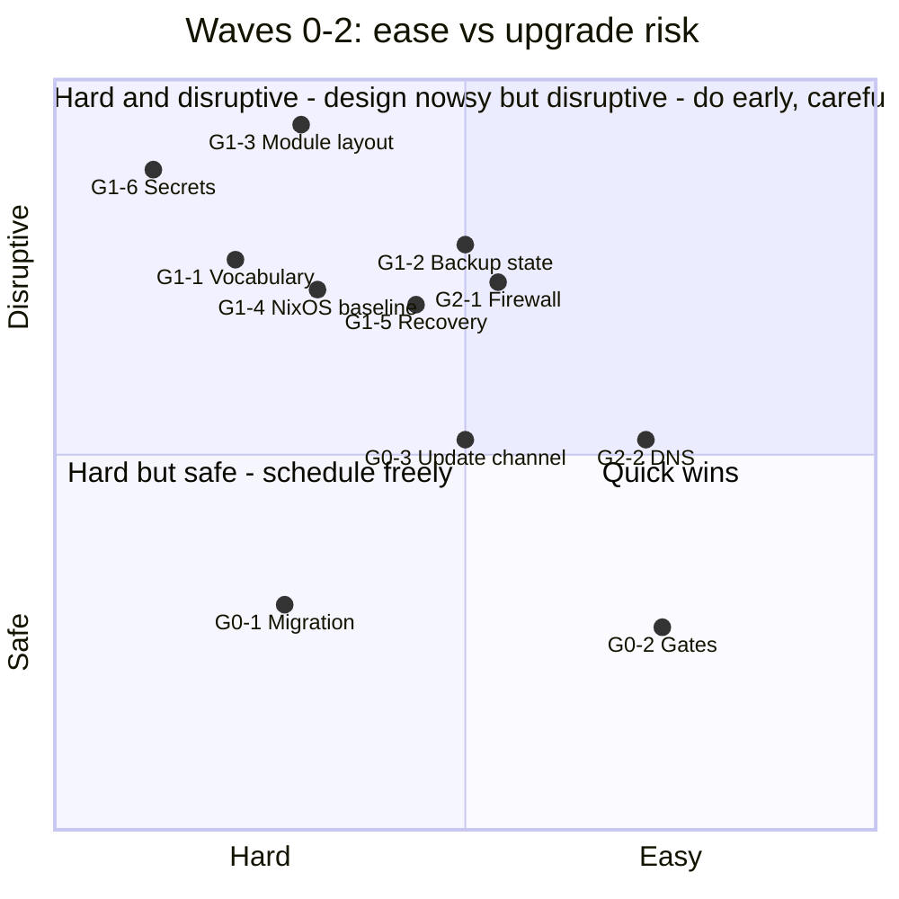
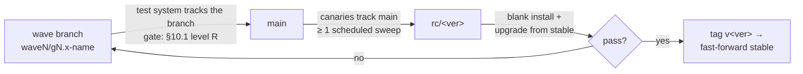

# Release 2.1 — Implementation Plan (draft for review)

**Compiled:** 2026-09-14. **Status:** draft, for operator review.
**Input:** Codeberg snapshot taken 2026-09-14 13:53 UTC — all open issues in
*Release 2.0: Build out Stacks* (15), *Release 2.0 Documentation* (3),
*Release 2.1: Security and stability release* (113) and *Future Work* (24),
plus every comment on them. Code facts were checked against the local `main`
checkout (`6d3a798`).

The goal is to order the backlog so that changes that **break or migrate an
existing installation** land first, while there are still few installations
and few community modules depending on today's names, schemas and layouts.

---

## 1. How to read the scores

**✅ in front of a row means done** — the issue is closed on the forge, or the question in that
row is answered. A group heading carries ✅ only when every row under it does. Everything
without a tick is still to do, so planning the next step is a matter of reading down a wave and
stopping at the first unticked line. Refreshed 2026-09-20 against the forge.

Every issue and every group has three scores.

**Ease (E)** — how cheap it is to build.

| E | Meaning |
|---|---------|
| 5 | trivial — under half a day, one file |
| 4 | small — 1–2 days, contained |
| 3 | medium — up to a week, several files, needs a test |
| 2 | large — multi-week or crosses managers/controllers; needs a decision first |
| 1 | very large or open design — new subsystem or rebuild procedure |

**Upgrade risk (R)** — what an *existing* installation goes through when the
change reaches it through `update-tappaas`.

| R | Meaning |
|---|---------|
| 1 | none — docs, tests, new opt-in capability; existing installs unchanged |
| 2 | low — tool/manager behaviour changes; deployed config and live state untouched; `git revert` is the rollback |
| 3 | medium — the sweep changes live state automatically (firewall rules, DNS, VM config, restarts); reversible, but a mistake is an outage |
| 4 | high — persisted config, schema, paths or CLI names change and must be migrated on every install; rollback needs a reverse migration |
| 5 | very high — needs rebuild, reinstall or renumbering of VMs/nodes, or can lock the operator out |

**Lock-in (L)** — the cost of waiting.

| L | Meaning |
|---|---------|
| H | gets more expensive with every new install or community module (names, schemas, paths, IDs, the module template) |
| M | the blast radius grows with installs, but the change itself does not get harder |
| L | no change over time |

A group's **R is its riskiest item**, not an average. **Wave** follows from
R and L: R ≥ 4 with L = H goes in the breaking-change window (Wave 1); the
things that make those migrations survivable go before it (Wave 0).

---

## 2. Summary

1. **There is no versioned config-migration mechanism.** Migrations today are
   ad-hoc idempotent blocks in `tappaas-cicd/pre-update.sh` (e.g. the
   `firewall:proxy` → `network:proxy` rewrite). Wave 1 contains about a dozen
   schema/name changes; each needs a migration with backup, dry-run and a
   record of what ran. **Decided:** build it first (new issue, §3 G0.1).
   Each wave also has an entry gate (decisions and ADR sign-offs) and an exit
   gate (tests, then `main` → `stable`), see §10. The plan proposes 8 new
   ADRs (§10.4).
2. **Wave 0 — make upgrades safe (18 issues, mostly E3–4).** Rollback,
   honest pre-update gates, fleet-wide `--force` semantics, failure
   notification, the ADR-017 update channel. #644 is an active hazard:
   `network-manager distribute --help` pushed zones.json for real.
3. **Wave 1 — the breaking-change window (48 issues).** Everything that
   renames, re-schemas or rebuilds. The highest-lock-in items:
   - #324 — app VMs do not import `tappaas-common.nix` (verified: only
     `tappaas-cicd.nix` and the template do). Every module written today
     copies that gap.
   - #611 / #628 / *tier → stack* — vocabulary baked into schemas, manager
     names and `config/` paths.
   - #421 + #500 — `src/apps` restructure changes `.location` in every
     deployed config.
   - #602 / #600 — backup placement state; #602 can install a second PBS.
   - #294 — VMID scheme: decide now, never renumber in place.
   - #58 — define the secrets *interface* now, swap the backend later.

   #439 (firewall rebuild) is *not* on this list: only one installation runs
   the nano image, so the rebuild is documented as a runbook, not automated.
4. **Wave 2 — network hardening (19 issues, E3–4, R3–4).** Restrictive
   defaults (#399 gateway rule, #384 GUI, #159 anti-spoofing, #263 DNSSEC)
   get harder to introduce the longer users rely on today's permissive ones.
5. **Waves 3–4 — stability and additive features.** Low upgrade risk; build
   them continuously.
6. **Future Work:** roll 6 easy items into the wave groups, re-scope or close 5
   (two describe modules that already exist). See §8.
7. **2.0 milestones:** both are past due and `stable` = `v2.0` since
   2026-07-21. Map the remaining 18 issues into the groups below (done in
   this plan) and close the 2.0 milestones.

### Groups at a glance

| Wave | Group | Issues | E | R | L |
|------|-------|-------:|:-:|:-:|:-:|
| 0 | ✅ G0.1 Migration & rollback framework | 5 | 2 | 2 | H |
| 0 | ✅ G0.2 Trustworthy gates | 8 | 4 | 2 | M |
| 0 | ✅ G0.3 Update channel & failure notice | 5 | 3 | 3 | M |
| 1 | G1.1 Vocabulary & classification (ADR-022 family) | 8 | 2 | 4 | H |
| 1 | G1.2 Backup placement model (ADR-012 close-out) | 12 | 3 | 4 | H |
| 1 | G1.3 Module contract & repo layout | 10 | 2 | 5 | H |
| 1 | G1.4 Common NixOS baseline | 8 | 2 | 4 | H |
| 1 | G1.5 Rebuild & recovery paths | 6 | 3 | 4 | M |
| 1 | G1.6 Secrets & privileged access | 5 | 1 | 5 | H |
| 2 | G2.1 Firewall exposure & rule order | 14 | 3 | 4 | M |
| 2 | G2.2 DNS resolver robustness | 5 | 4 | 3 | M |
| 3 | G3.1 cluster:vm lifecycle & capacity | 12 | 4 | 3 | L |
| 3 | G3.2 Identity & SSO wiring | 4 | 3 | 2 | L |
| 3 | G3.3 App module fixes | 11 | 4 | 2 | L |
| 3 | G3.4 AI stack maturity | 4 | 3 | 3 | L |
| 3 | G3.5 Installer UX | 4 | 4 | 1 | L |
| 4 | G4.1 Alerting & cluster resilience | 5 | 3 | 3 | M |
| 4 | G4.2 Proxy & ingress | 3 | 3 | 2 | L |
| 4 | G4.3 Manager verb gaps | 6 | 3 | 2 | L |
| 4 | G4.4 Storage & physical devices | 5 | 2 | 2 | M |
| 4 | G4.5 Governance, CI & sign-offs | 6 | 3 | 1 | L |

Issue counts include the Future Work items rolled in.

---

## 3. Wave 0 — make upgrades safe

Do this first. Apart from #620 (authoring `tier` in zones.json) and #471
(replacing the update unit), nothing here changes an installation's
configuration; it changes how updates behave when they go wrong, which every
later wave depends on.

### ✅ G0.1 Migration & rollback framework — E2 · R2 · L-H

| # | Issue | E | R | L | Note |
|---|-------|:-:|:-:|:-:|------|
| ✅ #652 | Versioned config-migration step | 3 | 2 | H | Replace ad-hoc blocks in `pre-update.sh` with ordered, idempotent `migrations/NNNN-*.sh`: each backs up the files it touches, supports dry-run, and is recorded as applied in `config/`. A failed migration stops the sweep before any module update. |
| ✅ #584 | Rollback in install/modify | 2 | 2 | M | `modify` Step 0 rewrites config before the snapshot and tests; snapshot `config/<module>.json` together with the VM |
| ✅ #453 | `--force` overwrites deployed config | 3 | 2 | M | **Decided 2026-09-16:** `add --force` refuses on a deployed module and names `module update` / `add --reinstall`; only `--reinstall` overwrites a deployed config (ADR-020 v0.10 D5) |
| ✅ #655 | `module-manager update` verb | 3 | 2 | M | The release update gets its own word; `modify` is the field change. Bare `modify` stays an alias for one release (ADR-020 v0.10 D5) |
| ✅ *(with #655)* | one meaning for `--force` | 3 | 2 | H | `--force` = proceed (failed pre-update test, archived/external) at every level; downtime is `--allow-disruption`; `--ignore-test-failure` retired (ADR-020 v0.10 D8, ADR-017 v0.3 D5) |
| ✅ #648 | `--unset` for stale fields | 4 | 1 | L | Option 2 chosen (2026-09-14): `--unset`, deep test, README |
| ✅ #572 | repo-sync auto-stash never restored | 4 | 1 | L | Pick pop or drop; warn with count |

#### Migration framework (decided 2026-09-14)

- **Where:** `src/foundation/tappaas-cicd/migrations/NNNN-<slug>.sh`, run in
  numeric order by `scripts/run-migrations.sh` from `tappaas-self-prepare.sh`
  — after the control-plane refresh, before the `nixos-rebuild` and before any
  module update. (ADR-025 D2 settled the slot: `pre-update.sh` runs inside the
  sweep, after the modules `tappaas-cicd` depends on, so "before any module"
  cannot be true there.)
- **Contract per migration:** idempotent; `--check` reports what it would
  change and writes nothing; apply first copies every file it touches to
  `config/.migrations/backup/NNNN/`; exit non-zero on any doubt.
- **State:** `config/.migrations/applied` records id, date and commit. It
  lives in `config/`, so it is covered by the #545 backup.
- **Failure:** stops the sweep before module updates, is recorded in
  `last-update-result.json` and notified through #651.
- **Visibility:** `update-tappaas --dry-run` lists pending migrations;
  `release/changelog.sh` lists the migrations added between two tags, so
  release notes name them.

Status: landed 2026-09-16 — 121cf82a (ADRs), 64cc90c3 (#655 + the `--force`
rework), c69b3860 + 96ea83d3 (ADR-025), 21a81d84 (#453), d234e3bd (#584),
51b63e5d (#648), 060f61a0 (#572), e46e4e45 (#652), plus 99297d14, 1387038b and
f44828af (see below). Every issue in the table is implemented.

**T3 on hrossen: green.** A real sweep through `update-tappaas.service`, 13/13
modules, no `--force`, no node reboot needed. The migration runner ran between
the control-plane refresh and the rebuild, reported `no pending migrations`, and
wrote nothing — no ledger, no snapshot (ADR-025 D11). The sweep invoked the new
`module update` verb for all 13 modules and the bare-`modify` deprecation
warning never fired, which is what proves #655 reached the path that matters.
The #572 auto-stash restore was verified live on the shared checkout where the
entries had accumulated.

**Two failure injections**, run deliberately with the operator's approval, put
the ADR-025 worked-example table on the record rather than on trust:

- a migration that exits non-zero stopped the run at the migrate stage — no
  rebuild, no sweep, module `updateTime`s unchanged, nothing recorded in the
  ledger, the whole-`config/` snapshot taken first and complete, and the #651
  notice naming the stage;
- a migration that succeeds is recorded and is **not** re-applied on the next
  run, which is what makes "fix forward after a failed rebuild" safe.

**Three defects the live path found**, all fixed on the branch: a ledger that
could not be read was treated as "nothing applied" and would have replayed every
migration a site ever received; a `config/` snapshot with holes in it passed as a
safety net; and `date -Is` (GNU-only) wrote a ledger line the reader would refuse
the next night — caught only because the reader was tightened first (1387038b).
A refused field change also told the operator the config "may be partially
updated" when nothing had been written (f44828af). The always-red source-tree
suites now skip with a reason instead of failing on every run (99297d14).
- **Rule for reviews:** a change that renames or re-schemas anything under
  `config/` ships with its migration and a fixture test (config before →
  after) in the tappaas-cicd fast tier.
- **No down-migrations by default.** Rollback for one site is restoring
  `config/.migrations/backup/NNNN/`; a migration that cannot be reversed
  that way says so in its header.
- **Bootstrap:** the release that introduces the runner carries no new
  migrations; the existing blocks in `pre-update.sh` move into it later as
  `0001…`, since they are already idempotent.

### ✅ G0.2 Trustworthy gates — E4 · R2 · L-M

Status: landed 2026-09-15 on local `main`, push pending — ADR-020 v0.8 ddae6b99;
#636 ed16f691, #555 7f7901fb, #645 0c408b1f + df7b8915, #560 d32ea443 +
422986f2, #620 254bdcba, #635 8b86662a, #633 f73f705a + 082964af; T3 on
hrossen green (tappaas-cicd's #595 guard fixed in 747b2310).

Tests that pass when they should fail, or fail when they should pass, make
every later migration unverifiable.

| # | Issue | E | R | L | Note |
|---|-------|:-:|:-:|:-:|------|
| ✅ #644 | `network-manager <verb> --help` runs the verb | 5 | 1 | L | **Do first.** `distribute --help` pushed zones.json for real (2026-09-14). Still open: `main.ts` checks only `argv[0]` |
| ✅ #635 | Pre-update gate collapses test severity | 4 | 2 | M | exit 1 → warn and proceed; the post-update test fails only on new failures and prints a `TEST-WARN:` line for old ones; `--ignore-test-failure` overrides a fatal pre-test (ADR-020 v0.8 D8). Some updates that abort today will proceed |
| ✅ #633 | `site-manager update --force` overrides every `rebootOk` | 3 | 2 | M | Fleet-wide reboot authority from one flag. Decided 2026-09-15: `--force` = run now, respects `rebootOk` (ADR-020 v0.8) |
| ✅ #636 | backup:vm Check 1 fatal while a backup runs | 4 | 1 | L | Timeout → "unknown", not fatal |
| ✅ #555 | network:proxy checks cannot fail without a refid | 3 | 1 | L | |
| ✅ #560 | identity:identity never checks the consumer side | 3 | 2 | L | Stricter test: existing silent SSO gaps turn red on first run (expected) |
| ✅ #620 | Tier lattice authored on 9 of 26 zones | 4 | 2 | M | The check reports coverage. `tier` drives no rule; the repo already tiers every non-exempt zone, the untiered ones are site-local (retire them, or `modify <zone> --set tier=`), so no migration |
| ✅ #645 | Reconcile dry-run hides firewall rule changes | 4 | 1 | L | Needed before the Wave 2 rule changes |

### ✅ G0.3 Update channel & failure notice — E3 · R3 · L-M

Status: landed 2026-09-15 on local `main`, push pending — ADR-007e v1.3
aab46270, ADR-020 v0.9 5c77a7ca, ADR-017 v0.2 2fb781fb (FW #357 settled, D7
deferred to G0.1's runner); #653 aac924f0; #651 0b99af35; fleet `--force`
bb3f07b6; #471 da38bc36 d6bac3d7 88b96379 4507936a + fixes e7dc61d2 d95e6891
675a9779 1e1a4810; #447 ddbb1a66. T3 on hrossen green: bootstrap through the
interim path, then a full sweep through the new unit (13/13, timer rendered).

The update mechanism is how every later fix reaches an installation. It has
to be solid before Wave 1 starts sending migrations through it.

| # | Issue | E | R | L | Note |
|---|-------|:-:|:-:|:-:|------|
| ✅ #471 | ADR-017 update scheduling | 3 | 3 | M | Replaces the update unit on every cicd; mind the first-activation bootstrap gap (Erik, 2026-08-19) |
| ✅ #447 | site-manager cannot modify the schedule | 4 | 1 | L | |
| ✅ #651 | A failed sweep notifies no one | 3 | 1 | L | Adds a site-level notification target (additive schema); #126 reuses it |
| ✅ FW #357 | Define `updateWindow` / `updateChannel` | 4 | 1 | L | Roll in: design only, belongs next to ADR-017 |
| ✅ #653 | Hold the scheduled pull on one site | 4 | 2 | L | A local, per-repository marker with a reason and an expiry makes the scheduled sweep behave like `site-manager update --no-git-pull` (skip the pull, run the rest). Lets the test site run uncommitted or unpushed changes through real sweeps. Shown by `site-manager`; an expired hold warns and pulls again |

### ✅ G0.4 Merge trust — fast lane, added 2026-09-16

Not a planned group: one issue, fast-laned ahead of Wave 1 on the operator's
decision (2026-09-16), because every Wave 1 item is a config re-schema that
reaches a deployed config **through** the 3-way merge. A module the merge skips
will silently not receive Wave 1's changes either, while the migration ledger
reports the site as migrated — the result of the whole wave would be
unfalsifiable on exactly the installs that need it most.

| # | Issue | E | R | L | Note |
|---|-------|:-:|:-:|:-:|------|
| ✅ #659 | Step 0 skipped when a config has no `.location`, update still reports success | 4 | 3 | H | Three silent paths, not one: an unresolvable location, a missing `apply-json-merge.sh`, **and a merge that errors** — all logged at info/warn and all followed by `exit 0`. Fixed by resolving through the catalog as well as `.location` (#460's second tracking path) and making all three fatal |

**Landed 2026-09-17** (bdf15dcf, 51d1bae3), once makerfloss's satellite was marked
`status: external` — see below. Measured before landing:
hrossen's 13 modules all resolve via `.location`, so the change is a no-op there.
On makerfloss exactly one module is affected — `satellite-satellite1`, which has
neither a `.location` nor a catalog entry and would REFUSE after this lands.
(`portainer-lab1` also has a broken `.location`, but it is `status: archived`
and the archived check sits *before* Step 0, so it never reaches the new fatal
path — an earlier note here said otherwise and was wrong.)

The satellite config is not a module config at all: it is a host record written
by a documented manual copy step in `src/foundation/satellite/install.sh`
("Copy satellite.json -> ~/config/satellite-<name>.json and edit it"), which is
why it has no `.location` — the installer that would have recorded one was
bypassed by design. It is therefore fixed by the satellite conversion (G1.2),
not by this issue. Unblocked 2026-09-17 by marking it `status: external`, which the archived/external
check skips before Step 0 — semantically true today, since the config is
created outside the module lifecycle. Recording a `.location` instead was
rejected: it would make satellite PARTICIPATE, and `reconcile` would then call
`satellite/update.sh` with the module name `satellite-satellite1` while
`satellite-manager` knows the satellite as `satellite1` — trading a silent skip
for a nightly failure. The real fix stays the G1.2 conversion, which removes the
`status: external` again.

The branch also carries the inverse of the effective-name rule (76e27d9c): a
deployed `podman-lab1` resolves to `podman` because `lab1` is a DECLARED
environment, while `vllm-amd` stays whole because `amd` is not — the declared
environment set is what makes that decidable, since module names contain
hyphens too.

---

## 4. Wave 1 — the breaking-change window

Everything here renames, re-schemas or rebuilds. Land it in one or two
coordinated releases, each with migrations (G0.1), release notes listing the
migrations, and an **upgrade test from a `v2.0` install** on the test system,
not only a fresh install.

### G1.1 Vocabulary & classification (ADR-022 family) — E2 · R4 · L-H

Settle the words before they spread further into schemas, CLI names and
`config/` paths.

Status: **ADR-022 family accepted 2026-09-18** (022 and 022a–h, v1.0). #611 and #628
landed on `main`. ADR-007a/006 (People → Identity) are Erik's edits; the operator
assumes they will follow and **implementation does not wait for them** (2026-09-18).
Left: the `tier` → `scope` migration (ADR-022e) — **#676**, to be swept together with #674.

| # | Issue | E | R | L | Note |
|---|-------|:-:|:-:|:-:|------|
| ✅ #624 | ADR-022 review comments | 3 | 1 | H | **Applied 2026-09-17** in Erik's PR #664 — close |
| ✅ #637 | ADR-022 comments (second pass) | 4 | 1 | H | **Applied 2026-09-17** in PR #664 (changelogs cut, Appendix A removed, `kind` defined, 022e–h proposed) — close |
| ✅ #610 | Site = administrative domain × location × zone | 3 | 1 | H | **Decided**: ADR-022a separates the Administrative Domain, 022b the Location; the zone dimension stays ADR-014's. Close on the decision; anything left is implementation under #611 |
| ✅ #611 | `kind` values; retire `external-host` (ADR-022d/f) | 2 | 4 | H | **Implemented 2026-09-18**, on `main` (21e3adc7, migration 0004). Decided with the operator: `kind` names the workload and the ADR-007 marker `kind: "module"` is **retired**, not given a field of its own — discovery is shape-based and the marker was never a config's only signal on either site; `cluster`/`templates` carry no `kind` until the grouping-concept ADR. Every module authors its `kind` (15 `vm`, `vllm-amd` `lxc`, `backup` `application`, `satellite` `machine`); `install-module.sh` stops stamping; `satellite-manager` writes `machine`. **Migration 0004** removes the marker so the 3-way merge adopts the authored value (without it, rule 5 would keep `module` for ever — proven against the real merge), keeps it where it is a config's only module signal, rewrites `external-host` → `machine`. The Health inventory of unmanaged workloads the issue also raises is not part of this: ADR-022g's `management` covers what is registered, and where an unregistered inventory lives is still open |
| ✅ #599 | Glossary: node vs host vs cluster member | 4 | 1 | H | **Done 2026-09-18**: ADR-022c D1/D2/D3 restore `Node` to its ArchiMate meaning and add **cluster member** and **Host**; `GLOSSARY.md` §B now carries all three — close |
| ✅ #628 | People → Identity (`people-manager` → `identity-manager`) | 2 | 4 | H | **Implemented 2026-09-18**, on `main` (5d15c7f9, migration 0005) — the operator agreed on the issue and went ahead ahead of Erik's ADR-007a edit, which stays his (ADR-007a and ADR-006 bodies untouched). `manager/people-manager` → `manager/identity-manager`; every caller changed with it, including the two the nightly sweep runs (`identity/update.sh`, `site-manager`'s `SITE_IDENTITY_BIN`, old variable still honoured). **Aliases for one stable cycle:** `people-manager` (warns on stderr, runs identity-manager — also what replaces the old `~/bin` link, which would otherwise keep running the last people-manager build), `validate-people.sh`, and a `config/people` → `identities` symlink. **Migration 0005** moves `config/people/` → `config/identities/` (proposed on #628 for ADR-007a to confirm: `config/identity/` would sit beside the Authentik module's `config/identity.json`); refuses when both are real directories. One path rule for every reader (`lib/ts` `identityDir()`: `identities/`, else a pre-0005 `people/`). Tested on hrossen: the renamed component builds and links, alias verified; identity-manager 18, environment-manager 27, site-manager 22, backup-manager 38, module-manager 167, network-manager 16, health-manager 36, identity-controller 46, 0005 fixture 21 — all pass; `0005 --check` on both sites: 8 files each, nothing written; the new binary reads hrossen's live, unmigrated config through the fallback. **Lands on `main` only after Wave 0 is on `stable` (ADR-025 D9).** Dated generated snapshots (`src/STATISTICS.md`, `DEPENDENCIES.*`, `PROGRAMS.csv`) keep the old name until regenerated |
| ✅ #422 | Glossary rewrite | 3 | 1 | L | **Done 2026-09-18**: `GLOSSARY.md` rewritten to the ADR-022 vocabulary, with a §E "what changed" table for reviewers — close |
| #676 | `tier` → `scope` migration (ADR-022e) | 3 | 4 | M | **Opened 2026-09-20.** `module.tier` → `scope: site \| environment` in every module JSON and deployed config — a Wave 1 migration with readers accepting both, as 0006 did. Today 22 module JSONs carry `tier`, 60 source files read it, and 15 of 26 deployed configs on a live site have it. The migration must write `scope` **before** any release drops `tier`, or the merge deletes it from every deployed config (the #581 rule #349 hit with `zone0`). Also settles whether the catalogue carries `scope` at all — ADR-022e says `tier` → `scope` there, but #463 has since removed both under the no-duplication rule, leaving `stack`. **One sweep with #674** (G1.3): same module JSONs, same validators, same template — #676's vocabulary first, then the blueprint check, written once |
| ✅ *(in #624)* | `module.tier` → `stack`? | 3 | 4 | H | **Answered 2026-09-17 (ADR-022e)**: tier does **not** become stack. `module.tier` → **`scope: site \| environment`**; `Stack` stays the ArchiMate aggregation (022e D5); `tier` keeps only `zone.tier` (022e D7). The 35 JSON files are now a migration, not a question |

### G1.2 Backup placement model + managed machines (ADR-012, ADR-026) — E3 · R4 · L-H

**ADR-026 — managed machines as modules** joins this group (2026-09-18): every machine
TAPPaaS manages becomes a module of `kind: machine`, which is what makes ADR-012's
fourth topology — a local PBS on a machine that is not a cluster member — something
the model can express and patch. The two are one piece of work because a backup
`application` needs a Host the model knows.

Status: **landed on `main` 2026-09-19** (1f57509b, fast-forward of `wave1/g1.2-module-source`):
ADR-026 D6, #602, `debianhost` + `module adopt`, #665 stage 1 (`pvehost`), `location` →
`moduleSource` (migration 0006), #609, #607, #612, #600 (migration 0007), #603, #601, #457,
#554, #456; §1.3 verified (test plan phase 6). Rolled out on makerfloss the same day (both
migrations applied, nodes registered, `backup.mgmt.internal` a CNAME, 9/9 modules updated).
Left: #407 sign-off; stage 2 of ADR-026 D4 (node patching behind `pvehost`); phase 5 of the
debianhost test plan (PXE). The satellite as a module (#670, ADR-010 §8.4, ADR-026 D4 stage 5)
landed and was closed 2026-09-20; its deep test (#671, after the operator's travel) is the
remaining validation.

| # | Issue | E | R | L | Note |
|---|-------|:-:|:-:|:-:|------|
| *(new)* | `debianhost` module + `module-manager module adopt` | 3 | 2 | M | **Built 2026-09-18**, test phases 1–4 green (`wave1/g1.2-module-source`): `install.sh` verifies (root by key, Debian) and changes nothing; `update.sh` apt full-upgrade, a pending reboot taken only when authorized, else `DEFERRED:`; `test.sh` reachable/Debian/no reboot pending/disk/clock. Along the way: `os`, `zone0`, `zone1` became general fields and `address`, `management` were added (ADR-022f/g, as implemented); the module's own `update.sh` now receives `--allow-disruption` as `TAPPAAS_ALLOW_DISRUPTION=1`; `delete` of a `kind: machine` instance unregisters only and refuses `--vmid`. **`module adopt` built 2026-09-18**: reach as root by key (prints the command and waits), learn hostname/OS, module by OS, instance = hostname, zone from the address; refuses PVE nodes, taken names and addresses, unknown OS, no zone. Test plan phases 1–4, 6 and 7 green on hrossen (2026-09-18/19), and a machine module now updates in the nightly like any other (tappaas1–3 each sweep). **Open:** phase 5 (PXE: create, then adopt — not started, D8a), `cicd-key.sh` coverage, the key-only step |
| ✅ *(new)* | ADR-012 topology §1.3 verified | 3 | 2 | M | **Verified 2026-09-19** on hrossen (test plan phase 6): PBS installed by hand on `dh-test1`, adopted from an empty placement as `node` = dh-test1, nothing provisioned on a cluster node, alias + `debianhost` patching + reboot all green. Found and fixed: `~/.pbs-credentials.txt` overwritten on every non-interactive re-install; ZFS ordering required on a host without ZFS. Installing PBS onto a bare machine stays manual |
| ✅ *(new)* | instance vs module name | 3 | 3 | M | **Implemented 2026-09-18**, on `main` (8439c54f) (ADR-026 D6.3/D6.4). `module_of <instance>` (shared routines) = the basename of the module's source directory — `.location`, else the catalogue — replacing name parsing; `resolve_base_module_name` survives only as the catalogue's key (`module_name_guess`). The 3-way merge reads `<module_dir>/<module>.json`, not a file named after the instance; `health-manager` and `module-manager` find the Released source the same way and no longer by `vmname`. `module add --instance NAME` (install-module.sh, copy-update-json.sh) with a checked name. Tests: `module_of` (instance tappaas2 → module pvehost), a real merge for an instance ≠ module, `resolveGitJson` with a `vmname` decoy, `test-instance-name.sh` (28). **Unblocks #665** |
| ✅ #665 | Register cluster nodes as machine modules | 3 | 2 | M | **Stage 1 built 2026-09-19** (`wave1/g1.2-module-source`): module **`pvehost`** (operator); `adopt` turns a Proxmox node that `site.json` lists into a `pvehost` instance named after it, and the cluster module's update (Step 7) and `site-manager node add` register nodes through it — no migration, no change on a node. Live on hrossen: tappaas1 adopted, 7/7 tests. ADR-026 D4 stage 1 — registration only, inert. Stage 2 (node patching behind the module lifecycle) and stage 3 (the cluster install becomes module installs) are separate and high-blast-radius |
| ✅ #670 | Satellite as a module: retire `satellite-manager` | 3 | 3 | M | **Closed 2026-09-20.** Built 2026-09-19 on `wave1/g1.2-satellite` (unit-tested; live test #671): `network-manager wgvpn`; the module (install/update/test/delete, managed, patched by the sweep via the debianhost update); sweep skips `management: unmanaged`; `module delete --decommission`; `module modify --lockdown` (the vault); satellite-manager retired; off-site check finds satellites by module. §8.4.3 built too: the satellite as the Site's PBS Host (a `tankc` pool on an attached volume, `<name>.mgmt.internal` at the tunnel end, the nodes' path opened only while it is the Host) and PBS onto a bare machine (ADR-012 §1.3). **Open:** makerfloss conversion (by hand, with the operator); live test #671. **Decided 2026-09-19** (ADR-010 §8.4, ecdeaf5a): `module add satellite` (instance `satellite` by default, `config/<instance>.json`), **managed by default** and patched by the sweep; can be the Site's PBS Host (ADR-012 §1.3 — needs PBS install onto a bare machine); `module modify --lockdown` makes the unmanaged pull vault; `module delete --decommission`; admin VPN → `network-manager wgvpn`; makerfloss converted by hand. ADR-026 D4 stage 5 |
| #671 | Deep test: satellite as a module on a real VPS | 2 | 1 | L | After #670 and the operator's travel; needs a fresh VPS. Phases: add managed, sweep patch, `wgvpn`, satellite as the Site's PBS, lockdown, delete/decommission, makerfloss conversion |
| ✅ *(closed)* | `placementState` revisit | 4 | 2 | M | **Answered 2026-09-18**: ADR-012 v0.9 settles the backup case (`node` \| `shim` \| `external`); the general point is ADR-026 D6.5 — the `node` field names an *instance*, which coincides with a module name in almost every deployment but is not the same thing. No separate decision needed |

#### ADR-012 close-out (original scope)

**Gate met 2026-09-18: ADR-012 v1.0 accepted** (operator, with the four design decisions below). The `docs(ADR-012)` issues are settled in the ADR; each row now says what is left to *build*.

**Order (operator, 2026-09-18): machines-as-modules first** — every step of it is done
(ADR-026 D6.3/D6.4, `debianhost` + `module adopt`, #665 stage 1, #612, #600 with migration
0007, #603, #601, #607, #609, #602; #457, #554 and #456 as they fit). What the ordering
was for — `node` becoming a pointer to a machine instance, and the PBS's DNS alias with
it — is in place, so the rows below stand on their own.

Most of the remaining 2.0 milestone. The placement *state* values are
persisted in `config/backup.json` on every install, so the vocabulary change
is a migration.

| # | Issue | E | R | L | Note |
|---|-------|:-:|:-:|:-:|------|
| ✅ #602 | Empty `placementState` resolves onto the wrong host | 4 | 4 | H | **Built 2026-09-18**, on `main` (31bec1b2): before any discovery, an empty state asks the `node` Host, `pbsUrl`'s host and every cluster member whether they hold the datastore, adopts the one that does under **its own name** (an alias like `backup` is recorded as `tappaas3`), and stops as `unmanaged` when only an unmanaged host answers; same rule in `install.sh` and `update.sh`. 63 unit cases (4 fail on the old resolver, reproducing the second-PBS bug); read-only on makerfloss and hrossen, resolution from empty gives the recorded `node:tappaas3 tankc1`; **live on hrossen**, `update.sh` with the state cleared backfilled `node:tappaas3` and completed. The machine-hosted case (§1.3) is unit-tested only — no site has one yet |
| ✅ #600 | PBS on a non-cluster host | 3 | 4 | H | **Answered by v1.0 §1.3** (machine topology; `node` names a Host, not a cluster member). **Built 2026-09-19** (`wave1/g1.2-module-source`): stored as `placementState: node` + `.node` = the Host; migration 0007 rewrites `node:<host>`; readers accept both; the DNS sample checks backup under its instance name. The `set -e` bug at `backup/update.sh:51` was already fixed by #625 (tested form, covered by `test-pbs-legacy-guard.sh`) |
| ✅ #612 | `vmname` → the instance name, as a DNS alias; `shim` stays | 4 | 3 | M | **Built 2026-09-19** (`wave1/g1.2-module-source`): `dns-manager alias add|delete|list` (a CNAME on the Host's own dnsmasq entry; a move is remove-then-add, found live); backup's name is the instance's, registered as an alias of the `node` Host on install and every update, replacing the old A record; `vmname` gone from `backup.json`. **Decided (v1.0 §2.7):** backup is `kind: application`, so `vmname` names nothing; the PBS's DNS name is the backup instance's name (ADR-026 D6.1), registered as an **alias of the `node` Host** instead of an A record frozen at install; `pbsUrl` derives from it. Needs D6.3/D6.4 and #665 first, and a `dns-manager` alias verb |
| ✅ #601 | Placement discovery is PVE-only | 3 | 2 | M | **Built 2026-09-19** (`wave1/g1.2-module-source`): a machine Host is reached by its `address`; storage on a Host without Proxmox is found from its ZFS pools (`pvesm` path unchanged). `install.sh` adopts a PBS serving on a non-member Host and refuses — records nothing — when it has only a pool (it used to record an "adopted" placement with nothing behind it). **Not automated:** installing PBS onto a bare machine (test-plan phase 6) |
| ✅ #456 | `external` placement for a pre-existing PBS | 3 | 2 | M | Consuming was built and live-verified with ADR-012 (`use-external`, 165 backups kept restorable). **Finished 2026-09-19** (`wave1/g1.2-module-source`): one operator verb, `backup-manager placement use-external <url>` (the `--set placementState=external` advice registered no storage); every update of an `external` placement fails, named, when its storage is missing or unusable (Erik's validation); ADR-012 §4.2 corrected |
| ✅ #607 | Exit from `external` placement | 4 | 1 | L | **Built 2026-09-18** (`wave1/g1.2-module-source`): `backup-manager placement reset` / `finish-reset`. The old storage entry is renamed `<name>_former` (credential + key) so history stays restorable — left under the module's name, the local install would have kept pushing to the external PBS; state → `shim` (not empty: empty would stop on the old PBS as `unmanaged`); refused without a tankc pool; then the update, then the pull onboarding. Unit-tested; the rename live-verified on hrossen on a copy of the real entry. **Not rehearsed end to end** — needs an external PBS |
| ✅ #457 | `pbs_node` uses placement, not the registered name | 4 | 2 | M | Caused a nightly failure on 2026-08-17. **Built 2026-09-19** (`wave1/g1.2-module-source`): with #600/#612 the Host (`.node`) and the name (`backup.mgmt.internal`, an alias of it) cannot diverge; every PBS ssh goes through `pbs_node_addr` (a machine by its address); `pbs_node` fails instead of guessing the first node; the ZFS-ordering ssh failure is printed. backup-controller's override aligned |
| ✅ #603 | PBS on a non-PVE host has no update path | 3 | 2 | M | **Built 2026-09-19** (`wave1/g1.2-module-source`): the Host's owner patches it — the cluster module for a node, the machine's `debianhost` instance in the sweep otherwise. Backup install/update checks the Host has an owner (`lib/pbs-host.sh`), adopts an unregistered machine, warns loudly when it cannot. Also closes a #612 gap: a PBS adopted on a machine now gets its DNS alias at install |
| ✅ #554 | Reconcile creates duplicate job coverage | 3 | 2 | M | **Built 2026-09-19** (`wave1/g1.2-module-source`): coverage is asked of every `/cluster/backup` job. A foreign job naming the VM by vmid → left alone, reported; an `--all`/pool job → reported, VM added anyway (else no PBS backup); disabled jobs and a silent cluster never block. New `backup-manager coverage <module>` (+ `backup-controller coverage`). Live on hrossen with a throwaway foreign job |
| ✅ #609 | Off-site location recorded | 4 | 2 | M | **Built 2026-09-18** (`wave1/g1.2-module-source`): the field is `physicalLocation` (operator: `location` was a module's source directory, renamed `moduleSource` with migration 0006, readers accept both for one stable cycle). Recorded by `backup-manager peer add --country/--city/--building` and `satellite-manager install --country/--city`; `site.json` `location` gains `city`/`building`; `backup-manager validate` warns about a satellite/`remote`/`pull` target not shown to be elsewhere |
| ✅ #605 | Split ADR-012 acceptance list | 5 | 1 | L | **Done in v1.0:** a Decision list (accepted) and an Implementation list (tracked in #407) |
| #407 | ADR-012 3-node live validation gate | 2 | 1 | L | Sign-off gate. **Live suite green 2026-09-19** on hrossen with dh-test1's PBS as the second PBS: push write-no-delete, off-site restore ±key, relocation-by-pull, `placement reset` end to end (found + fixed a substring storage check). `node add` client: moot on PVE 9 (hard dependency). Left: immutability live (production ZFS only), **operator sign-off** |

### G1.3 Module contract & repo layout — E2 · R5 · L-H

What community modules copy and what deployed configs point at.

Status: landed 2026-09-20 — `wave1/g1.3-module-contract` merged to `main` after a green
sweep on hrossen (16/16 modules; 124 bash + 394 TypeScript assertions). Built: #500
(ahead of the entry gate, operator 2026-09-19; ADR-025 D14), #349 (operator go,
2026-09-19; ADR-007c v1.5), #566 (ADR-026 D6.4a), #248, #463 (ADR-004 amended). #363 is
**Proposed** as ADR-027 (no Erik sign-off needed) with its estate sweep begun; **#674**
(in the table below) tracks what remains of it — the blueprint check and the 15
incomplete service directories. Two defects found while assessing the merge and fixed on the branch: the
instance rename could not be previewed (`--dry-run` never reached `rename-instance.sh`),
and #463 had removed the catalogue `source` that `kind.ts` used, which would have made
every module with no authored `kind` a `vm` — a repository now states its source once.
**Parked until the operator has agreed them with Erik:** #421 (`src/apps` into stacks),
#294 (VMID scheme) and #430 (controller pattern). #250 left the wave 2026-09-20 — Future
Work.

| # | Issue | E | R | L | Note |
|---|-------|:-:|:-:|:-:|------|
| ✅ #500 | Automate moving a module | 2 | 3 | H | **Built 2026-09-19** (`wave1/g1.3-module-contract`): not the `migrating`/`newRepo` catalogue status first proposed but a migration, as the operator's comment suggested — `scripts/move-module.sh <Repo>:<path> <Repo>:<path>` moves the files, rewrites the catalogue and writes `NNNN-modules-moved.sh` (ADR-025 D14; decisions: stop on an unregistered target repository, moves declared in TAPPaaS, `--rename` behind a dependency check). Prerequisite for #421 |
| #421 | Restructure `src/apps` into stacks | 2 | 4 | H | Changes `.location` in every deployed config; after #500. Settle the *solution* concept (2026-08-03) |
| ✅ #349 | Drop the zone tag from released modules | 3 | 3 | H | **Built 2026-09-19** (`wave1/g1.3-module-contract`): apps already named none; `zone0: mgmt` removed from the 7 foundation modules, recorded as `mgmt` by `copy-update-json.sh` (the bootstrap path) and resolved for `mgmt` before its env file exists; the five placed-by-role modules keep theirs (coturn, vaultwarden `dmz`, deconz `iotCloud`, netbird-client `home`, satellite `edge`). The update merge now keeps a deployed `zone0` (rule 1b) — without it #581 would have deleted it from every foundation config. ADR-007c v1.5 |
| ✅ #566 | Legacy name → variant convention | 2 | 3 | H | **Built 2026-09-20** (`wave1/g1.3-module-contract`): the breakage it reported (a legacy name never merged, so its updates failed) was already gone with ADR-026 D6.3 — pinned by a regression test. Added `module modify <instance> --set instance=<new>` (the operator's suggestion: the instance name as a settable field), which moves the config, its `.orig` and `.meta`, and repoints a `node` naming it; the guest keeps `vmname` (renaming it is separate and disruptive); a machine is refused. ADR-026 D6.4a. **Not built:** the issue's "flag an instance whose last good update lags" idea |
| ✅ #248 | Module version/status standard | 4 | 1 | M | **Built 2026-09-20** (`wave1/g1.3-module-contract`): the standard (SemVer 0.x until someone else has run it; Development → Testing → Production with the step that earns each) documented in module-fields.json and the manager README, and enforced by the classification lint — unknown status or a deployment state (`archived`/`external`) in a released module fails; version form, a missing claim and the two contradictions warn. Repo versions normalised to x.y.z. `_`-prefixed documentation keys stop being reported as unknown fields (the issue asked to delete them; they earn their place). **Left to the author:** cluster alone (status Production at 0.8.0 — a maturity claim, not a metadata gap); netbird-client and windows-server were given `Development` at 0.x on 2026-09-20. The Module blueprint ADR absorbs this text |
| ✅ #363 | Module lifecycle blueprint ADR | 3 | 1 | M | **Closed 2026-09-20.** Drafted (`wave1/g1.3-module-contract`): [ADR-027 Module Blueprint](../ADR/<ADR-027 - Module Blueprint.md>) v0.3 (**Proposed**) — the executable artifact set (documents deferred to ADR-013, contribution files to ADR-015, which now point at each other), the service directory's six files, one severity for every module plus an estate sweep, a no-op `install.sh` instead of a declared exception, `00-Template` as the blueprint in files. Absorbs #248. **Proposed** 2026-09-20 (no further sign-off needed); `00-Template` now ships warning stubs and the four module-level gaps in the estate are filled. **Remaining, tracked by #674:** the blueprint check in `module-manager validate` + CI, a stubbed `services/` in the template, and the 15 incomplete service directories |
| ✅ #463 | module-catalog schema is stale | 4 | 1 | M | **Built 2026-09-20** (`wave1/g1.3-module-contract`): not the proposed field patch but the operator's rule — a catalogue repeats nothing the module's own JSON says unless a catalogue function needs the join, and says so where it does. One flat `modules` list of `moduleName`, `moduleJson`, `legacyName`, `vmid`, `stack`; `tier`/`source`/`status`/`category`/`repo` dropped (the catalogue and the module disagreed on 15 of 18 entries). `stack` becomes a module field and decides what a module is (`foundation`/`template`/`test` reserved, anything else an application module), so the four lists go. `site-manager repository validate-catalog [--strict]` grounds the schema in code — run on `repository add` and after a module move — and found, on top of the issue's list: `unifi` listed but deleted, a `template` entry pointing at a file that no longer exists, `deconz` and `satellite` never listed, and Community's duplicate VMID 350. Readers take both shapes for a stable cycle; ADR-004 amended. Dropping the per-entry `source` broke `kind.ts`, which used it to tell an official module from a community one — fixed by stating it once per repository (`source` at the top of the catalogue), the module's own `source` winning |
| #674 | Implement the ADR-027 blueprint check | 3 | 1 | M | **Opened 2026-09-20**, after ADR-027 was Proposed. **One sweep with #676** (G1.1, `tier` → `scope`): same module JSONs, same validators, same template — the vocabulary change first, so the check is written once. `module-manager validate` reports the artifact set (D2) and a service directory's six files (D3) with D5's severities — a missing MUST an error, a missing SHOULD a warning, the same for every module — running in `validate` and in CI, **never at install time**. Plus the rest of the estate sweep: a stubbed `services/` in `00-Template` (D6) and the 15 service directories missing part of their set. The four module-level gaps and the template's warning stubs were done with #363 |
| #430 | Controller/manager pattern for app modules | 3 | 1 | M | Decision (Ansible first) — **parked 2026-09-20** until the operator has agreed it with Erik |
| #294 | Zone-aligned VMID ranges | 2 | 5 | H | Renumbering means backup/restore to a new VMID. **Proposal:** new scheme for new installs and variants only; never renumber in place. Spikes from 2026-06-04 still open |

### G1.4 Common NixOS baseline — E2 · R4 · L-H

One shared baseline for every NixOS VM. Landing it rebuilds every VM once,
so bundle all baseline changes into that one rebuild.

Status: in progress — **#408, #472 and #87 built and verified on hrossen 2026-09-21**
(`wave1/g1.4-nixos-baseline`, merged to `main`). The site's own answers now reach every
guest: `site.json .location` is derived from the first node and gained `keyboard`,
`latitude`, `longitude`; a generated `/etc/nixos/tappaas-site.nix` carries time zone,
locale, keymap and time source to each NixOS VM, with a converge path for Debian guests and
adopted hosts keyed on `management`; thirteen hard-coded time zones are gone from the module
`.nix` files. Evidence after the 2026-09-21 08:35 sweep (15/16, the one failure being #687):
every guest on `Europe/Copenhagen`, syncing against its own zone's gateway — `10.0.0.1` for
mgmt, `10.2.0.1` for rossen — the mothership included, where nothing had a time source
before. #87 needed only the consuming half: OPNsense has been serving NTP (stratum 2) all
along and no guest asked it. **#324 was pulled in and split back out** (see its row). **#680 came here from §12 on
2026-09-21** — its code half is built and verified on hrossen; what remains of it is a release
decision, not code (who refreshes the baseline `flake.lock`, and how often).
**Remaining:** #390, #448, #220, #716 (a booting guest's time source — #87's follow-on); #348 parked (needs a site with hass) and #678 in Future Work.

**Approach (operator, 2026-09-20).** Locale and time are **one site fact, applied per OS
family** — not a NixOS-only concern. Measured that day on the test site: `tappaas1` is
`Europe/Copenhagen` + keyboard `dk` (the operator's install answers), `tappaas2` and
`tappaas3` are `Europe/Amsterdam` + `us` (PXE-provisioned from a site.json the mothership's
own clock produced), `site.json` says `NL` / `Europe/Amsterdam`, `tappaas-common.nix` hard-codes
Amsterdam and `euro-office.nix` hard-codes UTC — which is #472's "two hours out". Nothing sets
time or locale on a Debian guest, an adopted `debianhost`, or a Windows guest at all.

1. `site.json .location` is the single source: it gains `keyboard`, `latitude` and `longitude`,
   and `tappaas1` — where the operator answered once — is what it is derived from (#408).
2. **NixOS:** a generated `/etc/nixos/tappaas-site.nix` (time zone, locale, keymap, NTP server),
   imported by each module's own `.nix` and by `tappaas-common.nix`. **#324 was bundled into
   this rebuild and then split back out 2026-09-20**: the canary (`euro-office`) proved modules
   are *copies* of the baseline, not consumers — importing `tappaas-common.nix` fails on
   `system.stateVersion` (`25.11` vs every module's `25.05`) and on ~14 more options that 11–13
   modules each restate. De-duplicating those is #324's real content and needs its own rebuild
   cycle; the fragment collides with nothing and lands now.
3. **Debian/Ubuntu:** the same facts converged in the Debian branch of `update-os.sh`, so a
   guest and an adopted host are corrected by every sweep instead of only being tested for a
   ticking clock. For an **adopted machine the `management` field decides** (ADR-022g):
   converge where TAPPaaS manages the host, report drift where it does not.
4. **Proxmox nodes:** `node-provisioner/answer.py` takes the keyboard from `.location` too, and
   `pvehost`'s `update.sh` converges an existing node — which is what fixes tappaas2 and
   tappaas3 without reinstalling them.
5. **Windows** is split out as **#678** (Future Work): one module, its own time-zone vocabulary
   (`W. Europe Standard Time`, not IANA) and a Windows test, so it must not hold up the rest.

| # | Issue | E | R | L | Note |
|---|-------|:-:|:-:|:-:|------|
| #324 | App VMs do not import `tappaas-common.nix` | 2 | 4 | H | **Not an import line — a de-duplication** (proven on the test site 2026-09-20, see the issue): every module restates the baseline (`system.stateVersion`, `services.openssh`, `users.users.tappaas`, `cloud-init`, `nix.settings`…), so the import fails option by option until the copies go. `stateVersion` is the exception: existing VMs' state is `25.05` and must stay. Verified: only `tappaas-cicd.nix` and `templates/tappaas-nixos.nix` import it |
| #390 | 00-Template fails canon C4/C7 | 5 | 1 | H | Every new module inherits it |
| #448 | NIC rename race (kernel / udev / cloud-init) | 3 | 4 | M | A stable interface name is a network-config change on every VM |
| ✅ #472 | NixOS clock two hours off | 4 | 2 | M | **Built and verified 2026-09-21.** **Root cause:** every module nix picks its own time zone — `euro-office.nix:96` is UTC while the rest inherit `tappaas-common.nix:166`'s `mkDefault "Europe/Amsterdam"`, and the master (`tappaas1`) is `Europe/Copenhagen`. Fixed by the site fragment + #324 + #87 in one rebuild. Take it from site.json |
| ✅ #408 | Locale/keyboard: tappaas1 is the master | 3 | 2 | M | **Built 2026-09-21.** `site add` reads timezone/keyboard/locale back from the first node (`timedatectl`, `XKBLAYOUT`, `LANG`) instead of the mothership's template clock; country stays derived from the timezone because no Proxmox node stores it. `.location` gained `keyboard`, `latitude`, `longitude` with `site modify` flags; the PXE answer file takes the keyboard from the site (it used `DEFAULT_KEYBOARD`, which is why tappaas2/3 came up `us` against tappaas1's `dk`) and the USB installer offers the site's values as defaults. A recorded value is never overwritten: a re-run fills what is missing and warns when the site and its master disagree. hrossen corrected `NL/Europe/Amsterdam` → `DK/Europe/Copenhagen/dk` through the new flag |
| #348 | hass locale from site master data | 3 | 2 | L | **Parked 2026-09-21** — no site we can test on runs hass, and an unverified change lands on someone else's Home Assistant. How to build it in the new setup is written on the issue: hass is HAOS, so the #472 fragment does not reach it; the fix is the `core_config` body at `lib/config.sh:158` **plus** a `config/core/update` converge for already-onboarded instances, sending only the keys the site actually has. After #408: `hass:config` completes `core_config` with `{}` today, so country, time zone, currency and language stay at defaults. Reads the same `.location`, which is why `latitude`/`longitude` go in with #408 |
| ✅ #87 | NTP on OPNsense, consumed by modules | 4 | 2 | M | **Built 2026-09-21** (moved into Release 2.1 2026-09-20). The server half already existed — the firewall answers as a stratum-2 NTP server — and nothing consumed it: every guest fell through to `*.nixos.pool.ntp.org` with `SystemNTPServers` empty. Now each guest is pointed at its own zone's gateway, by the fragment on NixOS and a `systemd-timesyncd` drop-in on Debian. DHCP option 42 is raised on the issue as belt-and-braces, not done. Nothing in the tree serves or consumes NTP today — no `timesyncd` servers, no chrony, no OPNsense service. Rolled into #472's rebuild |
| #716 | A guest can boot into a 17–34 min window with no usable time source | 3 | 4 | M | **Opened 2026-09-23** — #87's follow-on: every guest now syncs, but from its zone gateway *alone*, and that source is fragile at boot. Found as the cause under #714: after Nextcloud's OS update its clock ran 5–6 s behind the document server's and every signed download was refused (`Cannot handle token with iat prior to …`) until timesyncd first synced **17 minutes** later. Two mechanisms, neither fully explained: (1) the firewall's `ntpd` periodically loses its upstream (1–8 episodes/day on hrossen, several inside sweeps, not all) and then serves no usable time for a while — timeouts, then *too large root distance*; (2) **estate-wide** (hrossen *and* makerfloss): on the hour, every hour, timesyncd sees a *network configuration changed* event — same second as the hourly `logrotate.service` — the query it sends then times out, and it waits its full 2048 s max poll before retrying. Harmless once synced; a failed *initial* sync waits it out. The issue carries **five candidates to choose between**; the two that reach every site are baseline changes and belong in this group's one rebuild: retry a failed initial sync promptly (tighter timesyncd intervals, or chrony with `makestep`), and treat `NTPSynchronized=yes` as part of a guest being ready — `pvehost/test.sh` already checks it for nodes, guests have no equivalent. #714 is mitigated at the app (`jwt_leeway = 60`); OIDC tokens, TOTP and TLS windows are not |
| #220 | Nix sandbox disabled on cicd | 4 | 2 | L | Re-test against current nixpkgs; remove the workaround |
| ✅ #680 | The baseline `flake.lock` decides every site's nixpkgs | 3 | 4 | H | **Built and verified on hrossen 2026-09-21** (`wave3/680-flake-lock`, moved here from §12). Since ADR-017 D3 the mothership builds from the checkout, so `tappaas-cicd/flake.lock` pins every site, and a host that pinned something newer moved **backwards** in silence — Erik logged kernel 6.12.92 → 6.12.90, curl 8.20 → 8.19 and six more, with the rebuild reporting success. `tappaas-self-rebuild.sh` now reads the lock's revision and date against the running system before switching: it records the pin on every rebuild and, when the rebuild would lower the revision, names both revisions and dates and says the kernel follows at the next boot. It still switches — every site is behind this lock today, so refusing would break the update path itself. The suite reports the pin's age and, past 90 days, how to refresh it, passing either way (failing there would abort a healthy mothership's update — the #694 lesson). **Still the operator's, not code:** who refreshes the baseline lock and at what cadence. `b77b3de8` is 122 days old; hrossen and makerfloss both run it, so nothing downgrades today and the guard protects the next site to adopt D3 |

### G1.5 Rebuild & recovery paths — E3 · R4 · L-M

A proven way back before Wave 1 changes anything: `config/` is backed up and
restorable, and the cicd keys can be reissued. Build this group first within
Wave 1.

| # | Issue | E | R | L | Note |
|---|-------|:-:|:-:|:-:|------|
| ✅ #545 | Foundation backup + tested recovery (incl. `config/`) | 2 | 2 | M | **Done 2026-09-18**: design is ADR-012 D20 and is what is deployed (`backup-manager list` on hrossen: `network` + `tappaas-cicd` in the daily job, `cluster`/`templates` in neither); `config/` restore rehearsed on the test system — 173/173 files, clean but for post-capture `updateTime` stamps, and refused without the key. The rehearsal found one runbook defect (`/etc/secrets` needs a root restore), fixed in RESTORE.md §5.1 — **G1.5's exit gate is met** |
| ✅ FW #122 | Reissue **and revoke** tappaas-cicd SSH keys | 3 | 3 | M | **Done 2026-09-18**: `cicd-key.sh status | rotate | recover`. `rotate` adds a new key everywhere, proves it on every node and VM before switching, then revokes every other `tappaas-cicd` key and refreshes the console debug key on the nodes; it refuses to start while any VM is in doubt (host-key mismatch or no answer), since skipping one would leave the old key valid there. `recover` (after a reinstall) reaches each VM through its guest agent from the nodes. Never touches a VM's cloud-init `sshkeys` — PVE hashes the user-data into the instance-id, so that would regenerate every VM's host keys. The console debug key (`/root/tappaas/tappaas-cicd.key` — the mothership's private key on the install-time nodes, so a node console can reach the mothership) is kept and refreshed, never deleted; `distribute_cicd_key` replaces instead of appending (symlink-safe). **hrossen:** 18 stale root keys removed (sshd logs show none used in 7 days), key rotated, old key refused on all 10 targets, console debug path node → mothership → VM verified (it had been broken by a stale mothership host key in tappaas1's `known_hosts`; fixed), `recover` proven by locking the mothership out of one VM and restoring it through the agent. Found on the way: a stale `known_hosts` entry for `unifi-os` (its host key was regenerated 2026-09-09) had made it look like a non-target; confirmed through the guest agent and fixed. Windows VMs are not handled: `rotate` aborts safely if one takes the key, `recover` names it |
| #439 | Firewall rebuild: **document the procedure, do not run it** | 3 | 1 | L | Decided 2026-09-14: only one installation runs the nano image. Write a runbook (build alongside on a spare VMID, move config, cut over, keep the old VM for rollback) and note where the same steps apply to cicd and identity. No automation, no rebuild of the nano system as part of this work |
| #43 | Test and document backup/restore | 3 | 1 | L | |
| #314 | PVE 9.2 default + upgrade path | 3 | 4 | M | |
| #417 | `node delete` does not remove the node | 3 | 3 | L | Workload check, ERASE confirmation |

### G1.6 Secrets & privileged access — E1 · R5 · L-H

| # | Issue | E | R | L | Note |
|---|-------|:-:|:-:|:-:|------|
| #58 | Secrets management (OpenBao) | 1 | 5 | H | **Proposal (G1.6 entry gate):** one secrets-access helper that every module uses instead of reading `/etc/secrets` directly. Swap in OpenBao later without touching modules |
| ✅ #19 | Disable SSH password login on PVE nodes | 4 | 3 | M | **T3 green on hrossen 2026-09-18** (`module-manager module update cluster` from the branch: Step 5 hardened all three nodes, Test 4 passes on each, password SSH refused everywhere, PVE's node-to-node root SSH intact across all six pairs, no reboot needed). **Decided 2026-09-18: hardened, not configurable** — no `site.json` field. Every node gets `PasswordAuthentication no`, `KbdInteractiveAuthentication no`, `PermitRootLogin prohibit-password`, from `cluster/update.sh` Step 5 (`setup-ssh-hardening.sh`). Never `PermitRootLogin no`: PVE's cross-node GUI Shell and migrations run as root over key SSH, and so does the mothership. The consoles are unaffected — the web GUI (node Shell included) and the physical console use PAM, not sshd — so a development site that breaks is recovered from the console. Applied only over a connection that just authenticated by key, never by the node installer (which runs before the mothership's key exists); `sshd -t` before reload; effective values read back with `sshd -T`. `cluster/test.sh` Test 4 asserts it, skipping rather than failing in the pre-update gate so it cannot block its own fix. It no longer waits for FW #122, but it does change what a mothership **reinstall** needs: its `ssh-copy-id` can no longer fall back to a password, so the new key is planted from a node's GUI Shell until #122 automates it |
| #128 | Security hardening (Proxmox hardening guide) | 2 | 3 | M | Decomposed 2026-09-17 against `docs/pve9-hardening-guide.md`, checked on a live node: seven gaps, each independently testable — host sshd (**absorbs #19**), `unattended-upgrades` on hosts, auditd on `/etc/pve`, microcode, Corosync ring1, client-side backup encryption, fail2ban. Already satisfied: segmentation (zones), KSM off, backup verification (#228/#230), off-site (satellite). NOT adopted: the PVE firewall (a second rule surface against `zones.json` — its own decision), Ceph, subscription repos, Secure Boot/LUKS (L3). See the issue for the table |
| #142 | RFC: AI-agent access to cicd | 2 | 1 | M | Decision |
| #378 | Default-on secret scanning on cicd | 4 | 1 | L | |

---

## 5. Wave 2 — network behaviour hardening

These change live firewall and DNS behaviour on every installation. They are
not schema migrations, but anything users rely on today (reaching the GUI
from `home`, say) gets harder to take away later. Every item needs the #645
dry-run to show the rule diff before `--apply`.

### G2.1 Firewall exposure & rule order — E3 · R4 · L-M

| # | Issue | E | R | L | Note |
|---|-------|:-:|:-:|:-:|------|
| #399 | Zone → gateway rule allows every port | 4 | 4 | M | Verified: the `Zone X -> gateway` rule in `zone_manager.py` has no port; the comment says DNS/NTP |
| #384 | Restrict webgui 8443 to mgmt + NetBird | 4 | 4 | M | Land with #399; test from mgmt and NetBird before applying |
| #386 | block-private rules shadow auto-pinholes | 3 | 3 | M | Opens intended paths that are silently blocked today |
| #385 | Persist the NetBird OPT1 pass rule | 4 | 3 | M | Land with #222 |
| #222 | NetBird → srv floating rule is fragile | 4 | 3 | M | |
| #159 | Anti-spoofing + drop fragments, always on | 4 | 3 | M | Not optional (Lars, 2026-05-13) |
| #310 | Pin the OPNsense CA instead of `--no-ssl-verify` | 3 | 3 | M | A rotated cert must fail loudly, not silently stop the sweep |
| #375 | `mgmt.access-to: "all"` sentinel | 4 | 2 | M | Small zones.json migration |
| #576 | Zone `serves` as string or array | 3 | 2 | M | Backward compatible |
| #257 | mDNS in zones.json | 3 | 3 | M | |
| #160 | Overlap detection in the rules manager | 3 | 1 | L | Land with #256 |
| #256 | Skip pinholes already covered by zone access | 3 | 2 | L | |
| FW #162 | Persistent sequence-map artifact | 4 | 1 | L | Roll in with #160/#645 |
| #660 | A declared `aliasType` change cannot be applied | 3 | 3 | M | `_upsert_alias` posts the new type and never reads the stored one; OPNsense refuses a type change and the apply dies with an unhandled error. A module with a referencing rule cannot be migrated by hand either (the delete is refused while referenced), so the recreate must detach, delete, create, reattach — that ordering is the work. Consequence is silent: the alias stays `host`, its pf table stays empty, the rule matches nothing and permitted traffic is dropped (#542). Also give `aliasType` a change class in the schema so ADR-020 classifies it as a recreate rather than leaving it unstated |
| ✅ #682 | `rules_manager.py` reads the provider from `location`, not `moduleSource` | 4 | 5 | M | **Done 2026-09-21** (0d0272d1). Migration 0006 renamed the field; the reader was never widened, so the provider path came back empty, no auto-pinhole compiled, and `reconcile`'s prune deleted every established one as an orphan — Erik measured 24 live rules removed by a routine sweep. `module_source_of()` now reads `moduleSource`, then a string `location`, per ADR-026 D6.2's "readers accept both for one stable cycle"; `zone_manager.py` uses the same helper. Proven on makerfloss's live data: the old read gave `'' → ports None`, the fixed one the module's path and its ports |
| ✅ #684 | `test-module.sh` fills its dependency set from `dependsOn` alone | 4 | 3 | M | **Done 2026-09-21** (3948f7b1). `rules-manager` synthesises auto-pinholes from `dependsOn` **and** `integratesWith` (#632), so a service wired through `integratesWith` had a live firewall rule no test ever verified — the blind spot that let #682 delete rules with nothing going red. Steps 2 and 3 now walk both lists through one helper, and an optional provider that is not installed is a `debug` line, not a warning |
| #683 | Declared `ports` without `network:rules` are inert | 4 | 2 | L | **Opened 2026-09-20**, from the makerfloss sweep: `podman-lab1` and `signage-omStaging` declare `ports` and wire no `network:rules`, so nothing reads them — no ingress validation, no rules — while `validate` says ok and the merge warns on every update. Decide once what a declared `ports` means with no service to read it: a `validate` finding (ADR-027 severities) and out of the sweep's log, or documentation the manifest states as such. Same shape as the `backup` orphan fixed with migration `0010`; settle both as one rule |
| #223 | OPNsense 26.1 InterfaceAssignController | — | — | — | Park (agreed 2026-05-27); move to *Parking lot* |

### G2.2 DNS resolver robustness — E4 · R3 · L-M

| # | Issue | E | R | L | Note |
|---|-------|:-:|:-:|:-:|------|
| #693 | An unpublishable name returns rc=0 where D5 expects 3 | 4 | 2 | L | **Opened 2026-09-21** from the makerfloss deep sweep (`network`, check *Deep 11e-b*). ADR-021 D5 says a name that cannot be published exits 3 so R3 can tell refusal from success; the resolver answers 0, so a caller that failed is told everything is fine. Either the resolver is fixed or the ADR and the test change together — it is the only one of that module's six deep failures that is neither #386 nor environmental |
| #387 | Unbound rc.d restart fails (Python mismatch) | 4 | 2 | M | |
| #149 | IPv6 root lookups fail → `do-ip6: no` | 4 | 2 | M | Also write down the IPv6 stance (FW #26) |
| #263 | DNSSEC on Unbound | 4 | 3 | M | Internal split-horizon zones need `domain-insecure` |
| #383 | Keep wildcard public DNS current on dynamic WAN | 3 | 2 | L | |
| FW #157 | Default DNS blocklists (DNSBL / maltrail) | 3 | 3 | M | Stretch; only after #387 |
| ✅ #657 | Standard 4 invents an FQDN when a config lookup fails | 5 | 1 | L | **Done 2026-09-17.** Fixed at the source: `dns_sample_select` now carries the zone alongside the vmname (`DNS_SAMPLE_RECORDS`), read from the config file it selected, found by descent so a Pattern A nesting cannot hide it (#555's shape). A module that declares no zone is reported as such instead of being given the `srvHome` guess. Original note: Test-only. Standard 4 re-reads the config by `vmname`, which is not the config's name for a variant, so the zone falls back to the literal `srvHome` and the test asserts a name the estate never declared. It marks `network` failed and buries real DNS faults among invented ones — the G0.2 class of defect, found after G0.2 closed |

---

## 6. Wave 3 — stability & correctness

Low upgrade risk. Build continuously, in any order within a group.

### G3.1 cluster:vm lifecycle & capacity — E4 · R3 · L-L

| # | Issue | E | R | L | Note |
|---|-------|:-:|:-:|:-:|------|
| ✅ #665 | Register cluster nodes as `kind: machine` modules | 3 | 2 | M | Stage 1 of ADR-026 D4 — registration only, inert: declare existing nodes as modules so every managed machine has one mechanism. Stage 2 (node patching behind the module lifecycle) is separate and high-blast-radius. Blocked on the instance work (ADR-026 D6, decided 2026-09-18): `tappaas1..3` are three instances of one module in one Environment, so the synthetic `module` field and the `--instance` argument land first |
| #662 | PVE host configuration is not backed up | 4 | 2 | M | Guests and module paths are backed up; the hosts' own config is not — `/etc/pve`, `/etc/network/interfaces`, `/etc/ssh`, `/root`. A single node loss is survivable (pmxcfs replicates), a cluster-wide one is not. The Level 1 control from the hardening guide we have no equivalent for. Settle first how to capture `/etc/pve`: a pxar of the FUSE mount, or `/var/lib/pve-cluster/config.db`, or both — only one of them restores onto a node not yet in a cluster |
| ✅ #692 | A guest is built on `tanka1` whatever node it lands on | 4 | 4 | M | **Found and fixed 2026-09-21** by the makerfloss deep sweep. `tanka1` was the fallback in both create paths and the schema default, and nothing checked the target node had it: the guest was created, a 413 MB image downloaded, and `qm importdisk` then failed with Proxmox's own *storage 'tanka1' is not available on node 'tappaas3'* — four of seven VM-creation variants, all of them the ones targeting tappaas3. The pool is now resolved against the node (`tanka1` when it has it, else the node's first ZFS pool), and a **declared** pool the node lacks is refused before anything is downloaded, naming what the node does offer. The `active`/`enabled` filter is the load-bearing part: `tanka1` *is listed* on tappaas3, as `active=0, enabled=0`, so a naive membership check would have passed wrongly. The deep fixtures no longer hardcode a pool, which is what made the suite estate-specific |
| #686 | A backup lock fails an update that succeeded | 4 | 2 | M | **Found 2026-09-20** by the G1.4 sweep: a VM held by a running backup fails its pre-update snapshot, the update then proceeds *without a rollback point* ('continuing without rollback safety net'), and a post-rebuild `qm` call hitting the same lock marks the module FAILED — `identity` and `logging` were reported failed while both had in fact rebuilt correctly. A lock should be a bounded wait and then a **defer** (the sweep already has that outcome), never a snapshot-less update |
| ✅ #679 | An immutable field's schema default can make a module unreconcilable | 3 | 4 | M | **Done 2026-09-21** (37d2c04f). `cloudInit` is `class: immutable` with schema default `true`, so a module that declares nothing still acquires a desired value; a guest that genuinely has no cloud-init drive reports `false` and the differ called it immutable drift whose only remedy is delete + reinstall — 47 of 48 deployed modules on Erik's estate declare no `cloudInit`, so the exposure was the rule. Fixed as a rule, not a patch: a field still at its schema default whose change class cannot apply is a property of the guest, and is recorded as skipped (`defaulted-unappliable`). A value the module **declares** still drifts |
| #392 | Never attempt a disk shrink | 5 | 1 | L | |
| #393 | A failed migration must not block later steps | 4 | 2 | L | |
| #531 | Detect hardware-spec drift | 4 | 3 | L | Once detected, pending changes get applied (reboots): gate on `rebootOk` |
| #532 | Pending vs applied hardware changes | 3 | 2 | L | |
| #36 | VM shutdown timeout | 4 | 2 | L | Land with #127 |
| #127 | Boot order: firewall (and secrets) first | 4 | 2 | L | |
| #100 | Automatic storage extension | 3 | 2 | L | |
| #403 | Install on the root disk; smarter placement | 3 | 2 | L | |
| ✅ #569 | Node capacity / overcommit verb | 4 | 1 | L | **Done 2026-09-17** (71799221): `health-manager validate` gained a `memory-commitment` gate beside `disk-threshold` — per node, committed vs physical, `--memory-threshold PCT`. Committed (not used), stopped guests excluded, idle nodes reported at 0% so a placement gap shows |
| #663 | Memory defaults are not based on measurement | 4 | 2 | M | The demand side of #37. Shipped defaults were never checked against use: 60G declared across hrossen's QEMU guests, 31.9G resident, ~20G used. Over-declaring costs **commitment** (what #569's gate reports and what decides placement), not RAM — except where a guest's allocator touches everything, as OPNsense/FreeBSD does. Applied on hrossen: `tappaas-cicd` 12G, `unifi-os` 5G. `network` 8G→4G is **parked until the operator has physical access** — the firewall is the route back into the site |
| #37 | Optimise RAM (ballooning, swap) | 3 | 3 | L | **ARC part dropped 2026-09-17** after measuring six nodes: `zfs_arc_max` is already set to ~10.7% of RAM (the PVE 8.1+ installer default, not ZFS's 50%), and three of six nodes sit AT their cap — nothing to reclaim, and the proposed direction was backwards. hrossen tappaas2 looks like an exception (69G uncommitted) but is not: it shares GPU RAM with CPU RAM and runs the LLMs. What remains is the real gain — hrossen declares 110G across 11 guests with **no ballooning on any of them**, ~70G declared and unused (`vllm-amd` 46G→2.1G, though that one is GPU-bound and needs thought, not a reflex balloon). Monitoring is partly delivered by #569's `memory-commitment` gate |
| #423 | `Create-TAPPaaS-LXC.sh` has no `debug()` | 5 | 1 | L | Verified still missing |

### G3.2 Identity & SSO wiring — E3 · R2 · L-L

| # | Issue | E | R | L | Note |
|---|-------|:-:|:-:|:-:|------|
| #345 | hass: appliance-aware OIDC staging | 3 | 2 | L | |
| #401 | Nextcloud: OIDC redirect, trusted domains | 3 | 2 | L | |
| #282 | forgejo SSO (Community repo) | 3 | 1 | L | |
| #479 | Site-specific login page | 4 | 1 | L | |

### G3.3 App module fixes — E4 · R2 · L-L

| # | Issue | E | R | L | Note |
|---|-------|:-:|:-:|:-:|------|
| #552 | hass: a lost LLAT blocks every update | 4 | 1 | L | |
| #568 | hass: backup freeze leaves Frigate unhealthy | 3 | 1 | L | |
| #571 | hassanova has no release baseline | 5 | 1 | L | |
| #553 | litellm:models cannot reach an appliance consumer | 3 | 1 | L | |
| #687 | OnlyOffice: the document server cannot download from Nextcloud | 3 | 1 | M | **Found 2026-09-20**, not transient. Ruled out: the document server is running, euro-office reaches `https://nextcloud.hrossen.dk` (200), and the two clocks agree to a second (so not the #472 re-timing). Lead: the internal name has no TLS — `https://nextcloud.rossen.internal` gives 000 while `http://` gives 200 — so the storage URL handed to the document server is the likely culprit. Users lose document editing silently: Nextcloud hides the editor |
| #715 | Nextcloud-hub revisited: Talk never worked end to end; races, retries and tests hid real failures | 2 | 3 | M | **Opened 2026-09-23 by @AndreasJe; in progress, revisit after #680** (its Nextcloud pin question depends on it). **Done, on `main`:** one proxyDomain derivation delivered to the guests (`dec9fcad`); the rollback `.orig` baseline was already fixed (#688). Found in the 2026-09-23 hrossen sweep and fixed the same day: a derived name is not a published route. A guest now also gets `proxyPublished` from the split-horizon resolver, and logging.nix builds Grafana's SSO, secure cookie and https root URL only when it is true (logging.hrossen.dk has no public record, and Grafana had no working login; `4c9c846a`). The writers stop re-moding `/etc/secrets` (identity's `install -d -m 700` locked Grafana out and crash-looped it), identity sends the OIDC credentials on stdin rather than on sudo's logged command line, and Grafana re-asserts its tmpfiles rule before every start. A plain `module-manager update logging` healed a deliberately broken hrossen (`7a7484c9`). **Done, on branches — not merged:** `fix/715-trimmed` (5 commits, only what AndreasJe's branch does not cover) = apply-db-pass after+requires `postgresql-setup` with `ON_ERROR_STOP` (`tuple concurrently updated` ×4 on hrossen), every boot-time occ unit *requires* `nextcloud-setup`, the Nextcloud suite fails on an untrusted public name and asserts code/DB version and all 23 declared apps (21/0 live on hrossen), the HPB test cannot pass on an empty domain, the last public-name copies gone (litellm, HPB) with a wider guard, the fileservice verifier probes the document server. `fix/715-races-and-tests` (7 commits) holds the same plus alternative versions of the rebuild retry, the pre-install hook and the HPB peers — superseded by AndreasJe's where they overlap. **AndreasJe's branch:** `AndreasJe/TAPPaaS_QW` `Qualiware-Prod` (10 commits, 181 behind `main`, messages fail our commit-msg hook) — carries the Talk work: Janus SFU, coturn declared WAN forwards, two TURN endpoints, `talk`/`hpb` connectors, pre-install placement, rebuild-failure classification. Preferred path: he opens a PR rebased on `main`. **Outstanding / to decide:** (1) how his branch lands; (2) his module-local Nextcloud nixpkgs pin (33.0.6) — decide with #680; (3) skip his `db977921`, which restores the settings_error DELETE #714 removed; (4) his `configure-talk` and new `talk-turn` units still both write the Talk TURN keys; (5) nextcloud, euro-office and nextcloud-hpb declare egress `to: home` where #366's caddy-reach rule may already cover it; (6) **one mode for `/etc/secrets` platform-wide**. The directory is shared, and its writers disagree: logging uses 0750 root:grafana; nextcloud, coturn and nextcloud-hpb use 0700; backup:filesystem forces 755 so its capture user can traverse it. A 0700/0750 guest that gets filesystem backup would lose its capture after every rebuild (latent; no site has that combination today). Recommended: `0711 root:root` everywhere, where every file protects itself. Options are in the #715 comment; (7) **rotate the OIDC client secrets** that identity wired before `7a7484c9`. Each one is in its guest's journal via sudo's command log, on every site, not only hrossen's logging. No automatic fix; (8) confirm makerfloss's first nightly with Grafana SSO on (2026-09-24; `logging.makerfloss.eu` is published) comes up clean |
| ✅ #412 | coturn reads an undefined `publicDomain` | 5 | 1 | L | |
| #411 | windows-server: `deploy-instances.sh` missing | 4 | 1 | L | |
| #332 | euro-office / Nextcloud install findings | 3 | 2 | L | |
| #283 | forgejo central logging (Community repo) | 4 | 1 | L | |
| #284 | forgejo SQLite → PostgreSQL | — | — | — | Close: a module implementation choice (Lars, 2026-06-03) |
| ✅ #622 | deconz probe uses a name that never resolves | 5 | 1 | L | Looks fixed on `main` (both services now resolve the deconz FQDN): verify and close |
| #658 | nextcloud test 12 probes the browser URL from wherever it runs | 4 | 1 | L | Maintainer-owned (@ErikDaniel007). **Not** "treat 403 as pass" — that would mask a real access-list fault. The test should ask whether the host it runs from is inside the route's `proxyAllowedZones` and skip with a reason when it is not, the way `tappaas-cicd/test.sh` Test 9z now handles a suite that cannot run here (exit 77). Today it pushes an operator to widen a zone list to make a test pass — a security change caused by a test assumption |

### G3.4 AI stack maturity — E3 · R3 · L-L

| # | Issue | E | R | L | Note |
|---|-------|:-:|:-:|:-:|------|
| #120 | litellm test.sh conventions | 4 | 1 | L | 2 of 6 items done |
| #119 | openwebui test coverage | 4 | 1 | L | |
| #121 | litellm production-grade | 3 | 2 | L | Renamed backups: old backup files must still restore |
| #621 | Bump litellm / openwebui | 3 | 3 | L | After #121 LLM-003 gives update.sh a health gate |
| #677 | litellm's default workers do not fit its default 4 GB | 4 | 2 | M | **Found 2026-09-20** by `site-manager test --deep`: 43 MB available on an idle VM — ~1.0 GB for litellm plus four workers at ~620 MB of a 3912 MB guest, so the deep test fails and there is no headroom for a burst. Either the default memory covers the default worker count or the workers follow the memory |

### G3.5 Installer UX — E4 · R1 · L-L

| # | Issue | E | R | L | Note |
|---|-------|:-:|:-:|:-:|------|
| #377 | Installer cannot restart; mgmt-net routing | 3 | 1 | L | |
| #266 | Progress indicator during the PVE update | 5 | 1 | L | |
| #405 | Do not ask for tanks without free disks | 4 | 1 | L | |
| FW #83 | Reuse already-downloaded images | 4 | 1 | L | Roll in |

---

## 7. Wave 4 — additive capabilities

New capabilities with low upgrade risk.

### G4.1 Alerting & cluster resilience — E3 · R3 · L-M

| # | Issue | E | R | L | Note |
|---|-------|:-:|:-:|:-:|------|
| #126 | No alerts for quorum loss / node dropout | 3 | 1 | L | Reuse the #651 channel; Zabbix option discussed |
| #125 | Mail relay via M365 Graph API | 3 | 2 | L | |
| #165 | logging v2: Loki auth, Grafana OIDC | 2 | 3 | M | Turning on Loki auth breaks existing Alloy pushes unless clients change in the same sweep |
| #590 | Second corosync link | 2 | 3 | M | |
| FW #40 | Dedicated sync network recipe | 4 | 1 | L | Roll in with #590 |

### G4.2 Proxy & ingress — E3 · R2 · L-L

| # | Issue | E | R | L | Note |
|---|-------|:-:|:-:|:-:|------|
| #642 | Limit a route to paths | 3 | 2 | L | ADR-023, approved by Erik 2026-09-14 |
| #643 | Per-route allowed zones | 3 | 2 | L | Same ADR |
| #656 | Limit a route to a provider's source ranges | 3 | 2 | L | **Split, and fold into ADR-023.** Today the only way to admit one SaaS caller is `internet`, which admits everyone, so the static half is an exposure *reduction* and belongs with #642/#643: a route names explicit CIDRs, compiled by the `remote_ip` matcher that already exists. The "list kept current from a provider's published feed" half is parked — see below |
| #154 | `firewall:internal-proxy` | — | — | — | Close? Lars questioned the need (2026-05-31) |

### G4.3 Manager verb gaps — E3 · R2 · L-L

| # | Issue | E | R | L | Note |
|---|-------|:-:|:-:|:-:|------|
| #428 | module-manager `suspend` | 3 | 2 | L | |
| #429 | Migrate by modifying `.node` | 3 | 2 | L | Relates to ADR-019 and #498 |
| #499 | `test` verbs on managers | 2 | 1 | L | |
| #444 | IP → device lookup | 4 | 1 | L | Blocked on the MAC-pinning question (#582) |
| #582 | Read back static reservations | 4 | 1 | L | Lars asked for a concrete need first (2026-09-05) |
| ✅ #681 | Auto-stash entries nothing lists or resolves | 4 | 2 | L | **Done 2026-09-21** (ed6aa6a7). `repo-sync` stashes a dirty managed checkout so the pull can move and puts the entry back (#572); one that no longer applies was kept and only ever **counted**, leaving `git stash list` — by hand, in a checkout the operator is told not to edit — as the only way to see what the number meant. Erik saw 12 entries in TAPPaaS and 2 in Community; makerfloss carried 16, all mode-only artefacts from before #565, so nothing is accumulating now. `site-manager repository stash list/show/restore/discard` is the missing surface, and the sweep's line now names the oldest entry's age and that verb. An entry an operator stashed by hand carries no repo-sync tag and is never listed, restored or dropped |
| #634 | Private repositories in `repository add` | 5 | 1 | L | Adopt-mode: won't fix; document the deploy-key method |

### G4.4 Storage & physical devices — E2 · R2 · L-M

| # | Issue | E | R | L | Note |
|---|-------|:-:|:-:|:-:|------|
| #388 | `cluster:storage` (NFS first) | 1 | 2 | M | The share schema in site.json becomes a contract |
| #155 | Modules for physical devices | 5 | 1 | L | Docs and examples only (Lars, 2026-05-15) |
| #668 | A machine's zone is recorded, not enforced | 2 | 3 | M | **Opened 2026-09-19.** A `vm`'s `zone0` decides a bridge VLAN and `cluster:vm` makes it true; a `machine`'s decides which network its **physical** NIC is cabled to, and nothing checks or sets the switch port. Record the switch and port per NIC, check the port's VLAN against `zone0`/`zone1` as drift, and apply a zone change under the same consent rules as a VM's NIC change. Touches the ADR-026 machine modules, `switch-controller`/`network-manager` and the field schema; sits beside #236 |
| #697 | Node `lan` trunks and their switch ports are set once at install, maintained by nothing | 3 | 4 | M | **Opened 2026-09-21** from the makerfloss deep sweep. `config-network.sh` writes `bridge-vids 2-4094` once; `proxmox-controller` later *narrows* it to the Active tags, and only `zone add`/`delete` ever trigger that — `enable`/`disable` just print a hint, the routine sweep runs `reconcile --only opnsense`, and no timer runs the proxmox or switch planes at all. Untagged mgmt is excluded from the desired set **by construction** (`vm-net.sh`: Active *and* `vlantag > 0`) and survives only on the kernel's default PVID 1, which nothing sets or asserts; the switch trunk has the same hole. Live proof: makerfloss's node bridges match its Active zones exactly, while `switch-configuration-*.json` hold `"switches": []` — which is why three VLAN variants created their VMs and then timed out waiting for DHCP on tag 200. The issue carries **five candidates to choose between**, not a plan to do all five: reconcile on zone state change; report plane drift in the sweep (dry-run — an unattended rewrite of a node's network config is an ADR-020 decision, not a freebie); declare the untagged/native VLAN; give `pvehost/test.sh` the trunk check that now belongs to it (#665 made a node a module, and its tests cover ssh, PVE, quorum, disk and clock but no bridge); and derive the switch port's target from `hardware.nodes`. **Decide as one sitting with #668** — same seam, and #668's "record the switch and port per NIC" is the precondition for the last of the five |
| FW #158 | Multi-NIC module firewall rules | 3 | 1 | L | Optional roll-in |

### G4.5 Governance, CI & sign-offs — E3 · R1 · L-L

| # | Issue | E | R | L | Note |
|---|-------|:-:|:-:|:-:|------|
| #486 | ADR-015 community-health files | 4 | 1 | L | |
| #695 | The deep VM suite leaves a guest behind, and the next run fails on it | 4 | 2 | L | **Opened 2026-09-21.** VMID 912 (`test-nix-vlannode`, stopped, `onboot: 1`, 16 G on tanka1) outlived an earlier deep run with no config left behind; the next run's rollback fixture reuses that VMID, found it taken, and reported a **rollback** failure that had nothing to do with rollback. Two faults: a teardown that is not checked, and a precondition that surfaces as someone else's red. Removed by hand on makerfloss 2026-09-21 |
| #694 | Service README field sections are stale | 5 | 1 | L | **Opened 2026-09-21.** `tappaas-cicd --deep` reports the generated field docs as out of date and names the generator. One command to fix; worth deciding at the same time whether a generated file should be able to drift at all, or whether CI fails on the diff — a standing red is how people learn to skim past red |
| #415 | Self-hosted KVM Woodpecker runners | 2 | 1 | L | |
| #406 | ADR-010 P7 hardening + sign-off | 2 | 2 | L | |
| #359 | legal/processor ADR | 3 | 1 | L | |
| #63 | Service desk tooling spike | 3 | 1 | L | |
| FW #143 | CVE tracking / SBOM (ADR-011) | 3 | 1 | L | Optional roll-in with #363 |

---

## 8. Future Work — what to roll into the waves

**Roll in** (small, and cheaper done with the group they sit in):

| # | Issue | Group | Why now |
|---|-------|-------|---------|
| ✅ #357 | updateWindow / updateChannel design | G0.3 | Same code and ADR as #471 |
| ✅ #87 | NTP server for TAPPaaS | G1.4 | **Moved into Release 2.1 2026-09-20** — same rebuild as the #472 time fix |
| ✅ #122 | Reissue cicd SSH keys | G1.5 | #439 and #19 both need it |
| #162 | Firewall sequence-map artifact | G2.1 | Falls out of #160 / #645 |
| #83 | Reuse downloaded images | G3.5 | Contained installer change |
| #40 | Sync-network recipe | G4.1 | Documentation half of #590 |

**Optional roll-ins:** #157 (G2.2, after #387), #143 (G4.5), #158 (G4.4),
#39 power saving (docs, alongside #37).

**Moved out of a wave:**

| # | Issue | From | When |
|---|-------|------|------|
| #250 | `dependsOn` ownership for community modules (option D, `dependsOn.sh`) | G1.3 | 2026-09-20 (operator) — Future Work |

**Close or re-scope:**

| # | Issue | Proposal |
|---|-------|----------|
| #11 | NextCloud | Close: `src/apps/nextcloud` exists |
| #12 | HomeAssistant | Close: `src/apps/hass` exists |
| #71 | Backup of user data inside the VM | Re-scope: the `backup:filesystem` service exists; document it for app data under #545 |
| #93 | App-level backups to PBS as pxar | Same as #71 |
| #98 | Create the DevOps stack | Close, or keep as the stack epic: forgejo exists in the Community repo |

**Keep in Future Work:** #26 IPv6 (write the stance under #149), #51 Immich,
#52 Jellyfin, #129 Project Nomad, #89 binary repository, #91 Backstage,
#156 pfSense alias import, #170 LiteLLM declarative state (decide with #430),
#183 service catalog.

---

## 9. Housekeeping before starting

- **Merge pairs** the issues themselves say belong together: #36 + #127,
  #399 + #384, #385 + #222, #160 + #256, #624 + #637, #642 + #643,
  #444 + #582, #119 / #120 / #121.
- **Close or park:** #622 (verify), #284, #154, #223 → *Parking lot*.
- **Parked, half of #656:** a proxy access list kept current from a provider's
  published feed (e.g. an Azure service tag). It is not a field, it is a
  subsystem: outbound fetch from the mothership on a schedule, a trust decision
  about a third party deciding who may reach a site's services, and a defined
  behaviour when the feed is unreachable or changes shape — fail open, fail
  closed, or keep the last good copy. That needs its own decision in ADR-023,
  not an implementation. The static CIDR half closes the reported problem.
- **New issues:** the config-migration step is #652 (G0.1) and the scheduled-pull
  hold #653 (G0.3); still to open: one tracking issue per new ADR (§10.4).
- **Close the 2.0 milestones** once their 18 issues are moved per this plan.

---

## 10. Testing, rollout and wave gates

Every wave follows the existing release flow in
[release/README.md](../../release/README.md): `main` → `rc/<ver>` → blank
install + upgrade test → tag `v<ver>` → fast-forward `stable`. Installed
systems follow their channel with `git pull --ff-only`; `stable` is the
default channel, `main` is for testing and staging. This section adds what
is specific to the waves: how deeply each change is tested, and what must
be true before a wave starts and before it reaches `stable`.

Two sites are available for testing (decided 2026-09-14):

- **Test system: hrossen.dk.** It follows wave branches and is the first
  site to get every change. Unpushed work reaches it under a pull hold (G0.3).
- **Canary: makerfloss.** It stays on `main` and gets a change only after
  the operator has pushed it.

### 10.1 Test level by upgrade risk

Each level includes everything above it.

| R | Required before merging to `main` |
|---|-----------------------------------|
| 1 | Fast tier + deep test of the touched module/manager on the test system |
| 2 | Deep test of every consumer of the changed tool; the revert is a plain `git revert` |
| 3 | `network-manager reconcile` / `module-manager modify` dry-run diff reviewed and pasted into the PR (#645); applied live on the test system; one full scheduled sweep on a canary tracking `main` with no failure notice (#651) |
| 4 | Migration `--check`, then apply, against a **copy** of each canary's `config/`; upgrade test on the test system from the current `stable`; restoring from `config/.migrations/backup/NNNN/` rehearsed once |
| 5 | Operator-initiated only, never in the unattended sweep; runbook rehearsed on the test system |

Keep a snapshot of a test-system install at the current `stable` (cicd,
firewall and `config/`, via `snapshot-vm.sh`) so the upgrade test can be
replayed for every candidate without reinstalling.

### 10.2 From branch to `main` to `stable`

Rules:

1. **One branch per group** (`wave1/g1.2-backup`, …). A group merges to
   `main` only as a whole, after its gate. `main` must stay promotable at
   any moment, so half-done migrations never sit on `main`.
2. **One release candidate per wave** (Wave 1 may use one per group or pair
   of groups). Migrations from different waves never arrive in the same
   sweep.
3. **Wave 0 reaches `stable` before any Wave 1 migration merges to
   `main`.** Sites on `stable` must receive the migration runner in an
   update *before* the first update that carries a migration.
4. **Data-safety bugs skip the queue.** #644 (a `--help` that writes) and
   #602 (a second PBS) are fixed on `main` at once and released with the
   next candidate, whatever wave they belong to.
5. **`stable` never moves backwards.** A bad release is fixed forward. For
   one affected site: pause its update schedule, restore the migration
   backup (R4) or wait for the revert (R ≤ 3), resume after the fix.
6. **Release notes** for a wave list its migrations (from `changelog.sh`)
   and any operator steps, and go out before the candidate is promoted.

### 10.3 Wave gates

A wave, or the group named, does not start until its entry gate is met: the
open decisions from review, and the ADRs that have to be signed off first.
"New ADR" items are listed in §10.4. ADR numbers are assigned when written.

| Wave · group | Decisions | ADR sign-off (entry) | Exit gate (before `stable`) |
|--------------|-----------|----------------------|-----------------------------|
| 0 | Migration framework ✅; `--force` vs `--reinstall` semantics (#453) | **New: Config migrations & upgrade path**; ADR-017 Proposed → Accepted, with Erik's v0.2 points (#471) ✅ 2026-09-15; ADR-020 Proposed → Accepted ✅ 2026-09-15, v0.8 (D8 is what #635 reuses; #584, #648, #633); ADR-007e amended for the site notification target (#651) ✅ v1.3 | Runner released with no migrations; #644 and #645 on `stable`; hrossen.dk moved to its wave branch, makerfloss left on `main`; every known site reports a clean sweep after the update |
| 1 (all) | Wave 0 on `stable` and applied everywhere | — | Per group: migrations passed §10.1 R4 on the test system and every canary; release notes list them |
| 1 · G1.5 | none — runs first | none: #439 is a runbook in `docs/design/`; the #545 outcome (what is backed up, how) goes into ADR-012 §2.7 | `config/` restore rehearsed on the test system |
| 1 · G1.1 | ✅ answered: `scope` (ADR-022e) | ✅ ADR-022 and 022a–022h Accepted 2026-09-18; ADR-007a/006 assumed (implementation proceeds) — was: ADR-022 and 022a–022d Draft → Accepted (#624, #637, #610, #611 is 022d, #599 is 022c); ADR-009 Proposed → amended or superseded by 022c; ADR-007a + ADR-006 amended for People → Identity (#628); ADR-007b amended for the tier/stack outcome | as Wave 1 |
| 1 · G1.2 | placement state names (#600) | ✅ ADR-012 v1.0 accepted 2026-09-18 (#600, #602, #607, #609, #612, #605 settled) | as Wave 1 |
| 1 · G1.3 | VMID scheme: new installs only, or not at all (#294 — parked for Erik); `src/apps` restructure together with #500 (#421 — parked for Erik); zone0 direction (#349 ✅) | **New: Stacks & solutions** (#421 parked, #500 ✅; amends ADR-004 and ADR-007b — ADR-004 amended by #463 2026-09-20); **Module blueprint** (#363, #248) — ADR-027 Proposed 2026-09-20 ✅, implementation in #674; **New: Controller pattern for app modules** (#430); **New: VMID convention** only if #294 is adopted; ADR-007c amended (#349, done) | as Wave 1 |
| 1 · G1.4 | none | **New: Module blueprint** includes the NixOS baseline every VM must import (#324, #390, #448 interface naming, #472 / FW #87 time) | Every NixOS VM on the test system rebuilt once and deep-tested |
| 1 · G1.6 | Secrets: an access interface first, OpenBao later (#58); #142 RFC outcome | **New: Secrets management** (#58, with FW #122 and #19); an ADR for #142 only if a REST API is chosen over SSH + sudo | as Wave 1 |
| 2 | #645 dry-run diff on `stable`; #620 and #375 applied | ADR-014 amended: `all` sentinel (#375), `serves` as array (#576), anti-spoofing always on (#159), mDNS in zones.json (#257); ADR-021 amended: DNSSEC with split horizon (#263) and the IPv6 stance (#149) | Lockout check on the test system and each canary: mgmt and NetBird reach 8443 and 22, other zones do not |
| 3 | none | ADR-019 Proposed → Accepted (#393 migration-failure policy; #36 / #127 boot order) | §10.1 level of each issue |
| 4 | MAC pinning question (#444 / #582); #154 closed or kept; #430 decided before #170 | ADR-023 Proposed → Accepted (#642, #643; render check open); ADR-015 Draft → Accepted (#486); ADR-011 Draft → Accepted (FW #143); ADR-010 P7 sign-off (#406); ADR-008 amended (#236); ADR-019 amended for a second corosync link (#590) and the migrate verb (#429); ADR-007e amended for alerting and logging v2 (#126, #165), or a new ADR if Zabbix is chosen; **New: Shared storage** (#388); **New: Legal/processor** (#359) | §10.1 level of each issue |

ADR-024 (Site Fabric) is a deferred placeholder and gates nothing here.

### 10.4 New ADRs proposed by this plan

Each is a design that should be agreed before its code starts.

| New ADR | Covers | Gates | Why an ADR and not an issue |
|---------|--------|-------|-----------------------------|
| **ADR-025** Config migrations and the upgrade path | G0.1 framework; the rollout rules in §10.2 | Wave 0 | Binds every future release and every contributor who changes `config/`. **Accepted 2026-09-16** (v0.2); the runner is #652 |
| **ADR-027** Module blueprint (Proposed 2026-09-20) | #363 executable artifacts (documents → ADR-013, contribution files → ADR-015, paired both ways), #248 version/status (built), the NixOS baseline (#324, #390, #448, #472, FW #87 — G1.4, referenced not decided), link to ADR-011 SBOM | G1.3, G1.4 | The contract every community module copies |
| Stacks & solutions | #421 layout, #500 module move, the *solution* concept (2026-08-03) | G1.3 | Changes paths in every deployed config; amends ADR-004 and ADR-007b |
| Controller pattern for app modules | #430 (Ansible first); later #170 | G1.3 | The issue is already written as an ADR proposal |
| Secrets management | #58 interface and backend, key reissue (FW #122), #19 | G1.6 | Every module reads secrets; the interface outlives the backend |
| VMID convention | #294 | G1.3, only if adopted | IDs are visible everywhere and cannot be changed in place |
| Shared storage | #388 `cluster:storage`, backends, share schema in site.json | G4.4 | A new platform capability with a site.json contract |
| Legal/processor | #359 | Wave 4 | Requested by the issue; cross-cutting across ADR-007 |

Not proposed as ADRs: the firewall rebuild (#439, a runbook), the IPv6
stance (a paragraph in ADR-021 until FW #26 is picked up), and notification
targets (an ADR-007e amendment).

---

## 11. Decision log

| # | Question | Outcome |
|---|----------|---------|
| 1 | Migration framework before Wave 1 | **Decided 2026-09-14:** yes (G0.1), and each wave documents how it is tested and rolled out (§10) |
| 2 | `module.tier` → `stack`, or keep both | **Decided 2026-09-17/18:** neither — `module.tier` becomes `scope: site \| environment` (ADR-022e, accepted with the ADR-022 family 2026-09-18) |
| 3 | VMID scheme (#294): new installs only, or not at all | Open → **parked 2026-09-20** until the operator has agreed it with Erik |
| 4 | Secrets (#58): is an access interface enough for now | Open → entry gate for G1.6 |
| 5 | `src/apps` restructure (#421) together with #500 | #500 built 2026-09-19; the restructure itself **parked 2026-09-20** until the operator has agreed it with Erik |
| 6 | Firewall rebuild (#439) | **Decided 2026-09-14:** only one installation runs the nano image; document the procedure, do not build or run it (G1.5) |
| 7 | Scope of the 2.1 release | **Decided 2026-09-14:** not discussed here; the plan is organised by waves |
| 8 | What gates a wave | **Decided 2026-09-14:** open decisions and ADR sign-offs are entry gates (§10.3); designs that need a new ADR are listed in §10.4 |
| 9 | `--force` vs `--reinstall` (#453), and what `--force` means at each level | **Decided 2026-09-16:** one meaning everywhere — *proceed*, never reboot, never overwrite a deployed config. Downtime is `--allow-disruption`; `--ignore-test-failure` is retired into `--force`; `add --force` refuses on a deployed module. #655's `update` verb lands with it (ADR-020 v0.10) |
| 10 | Rollback in install (#584) | **Decided 2026-09-16:** a failed `add` removes what that run created (config, and the VM if the run created it); `modify`/`update` snapshots `config/<module>.json` with the VM |

## 12. Open decisions from Erik's reports, 2026-09-20/21

Six reports were triaged on 2026-09-21. Five were fixed the same day and now sit in their
groups: #682 and #684 in G2.1, #679 in G3.1, #681 in G4.3, #680 in G1.4. The one below is not
a code decision, and wants the operator's word before any code is written.

| # | What it is | E | R | Checked on `main` | The decision to take |
|---|---|:-:|:-:|---|---|
| #675 | `site.json .repositories` declares the repositories a site tracks and the sweep pulls them all, but the mothership's rebuild only ever builds the baseline flake. A site that composes its own host-level NixOS modules loses them on every scheduled rebuild, while the unit reports success. There is no extension point: `tappaas-cicd.nix` declares no option for it. | 2 | 3 | **Confirmed** — no `mkOption`/`extraModules`/`extraImports` anywhere in `tappaas-cicd.nix`. | Architectural, so an ADR first: what a managed repository may contribute to the control plane's own NixOS configuration, and what happens when that contribution fails to build. Implementation only after that is written down |
