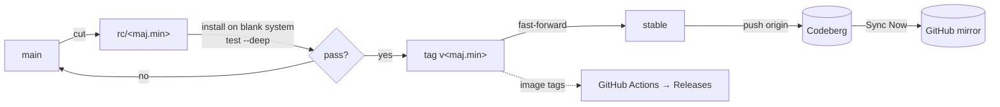

# Making a TAPPaaS release

The runbook and helper scripts for cutting a TAPPaaS release. It complements
[BUILD.md](../BUILD.md) (how the artifacts are built) and
[docs/codeberg-migration.md](../docs/codeberg-migration.md) (the interim image
runbook and the branch-promotion phases). This directory is the home of the
release process; keep new automation here.

## The model

TAPPaaS ships from two long-lived branches:

- **`main`** — trunk / development.
- **`stable`** — the release line. It is *also* the default `updateChannel`
  (`src/foundation/schemas/site-fields.json`), so a running TAPPaaS pulls this
  branch via GitOps (`git pull --ff-only`). **Promoting `stable` is the release.**

Because installed systems self-update with `git pull --ff-only` on their tracked
branch, a **detached tag can't be tracked**. So a release candidate is a
short-lived **branch** (`rc/<maj.min>`), not a tag. The version is stamped as an
annotated tag (`v<maj.min>`) only once the candidate passes, and `stable` is
fast-forwarded to it.



### Where versions live

There is **no single product-version file** — the product version exists only as
the `v<maj.min>` git tag. Two other version surfaces matter at release time:

- **Image pointers** (updated by `bump-version.sh`):
  `src/foundation/templates/tappaas-nixos.json` (`version` **and**
  `imageLocation`) and `src/foundation/network/network.json` (`imageLocation`).
  These pin the `nixos-template-v*` / `opnsense-firewall-v*` GitHub Release tags.
- **Per-module `version` fields** in each module JSON are independent and
  hand-maintained; they are *not* the product version and are not touched here.

## Scripts

| Script | Purpose |
|--------|---------|
| `make-release.sh` | Guided, confirm-gated driver for the whole flow. `--dry-run` previews everything; `--yes` for non-interactive. |
| `bump-version.sh` | Repoint `tappaas-nixos.json` / `network.json` at new image tags; `--check` reports drift. |
| `changelog.sh` | Compile delivered issues + grouped changes between two refs as Markdown. `--enrich` adds issue titles (Forgejo API). |
| `lib.sh` | Shared logging/confirm helpers (sourced, not run). |

All scripts run from a maintainer checkout (not the mothership) and take
`-h/--help`. They never force-push and never push without a confirm.

## Procedure

Drive it with `make-release.sh` (each step is confirm-gated); the manual steps
below are what it prompts for.

```bash
release/make-release.sh --version 2.1 --dry-run   # preview
release/make-release.sh --version 2.1             # for real
# add --nixos-tag 1.4 / --opnsense-tag 1.2 if images are rebuilt this release
```

1. **Pre-flight** — clean tree, on `main`, `origin` (Codeberg) + `github`
   remotes present, `v<ver>` not already tagged, fetch tags.
2. **Deep tests** on the current cluster (manual, on the cicd mothership):
   `TAPPAAS_TEST_DEEP=1 ./test.sh` per foundation component and
   `test-module.sh --deep <module>` per app. There is no cross-catalog runner —
   sweep the modules you ship.
3. **Cut `rc/<ver>`** from `main` and push to `origin`.
4. **Blank-system install + upgrade test** (manual): install `rc/<ver>` on a
   clean cluster (`install.sh` with `BRANCH=rc/<ver>`, see
   [INSTALL.md](../INSTALL.md)) and deep-test it. Then install the previous
   `stable` and confirm the upgrade to the candidate works.
5. **Images** (only if rebuilt) — push the `nixos-template-v*` /
   `opnsense-firewall-v*` tag to the **`github`** remote (that fires the build
   Actions; `origin`/the weekly mirror will not trigger them promptly), wait for
   the Releases, then `bump-version.sh` repoints the configs.
6. **Tag & promote** — annotate `v<ver>` on the tested commit; fast-forward
   `stable` to it (refuses a non-fast-forward promote).
7. **Push** `main`, `stable`, and `v<ver>` to `origin`.
8. **Force the mirror** — Codeberg → Settings → Repository → Mirror settings →
   **Sync Now** (otherwise the weekly push mirror can lag up to a week).
9. **Release notes** — `changelog.sh --from <prev v-tag> --to v<ver>` (add
   `--enrich` for titles). Then send the announcement.

## Manual quick-reference

If not using the driver:

```bash
git switch main && git pull --ff-only
git branch rc/2.1 main && git push -u origin rc/2.1
# … install rc/2.1 on a blank system, test --deep, test upgrade from stable …
git tag -a v2.1 rc/2.1 -m "TAPPaaS 2.1"
git merge-base --is-ancestor stable v2.1 && git branch -f stable v2.1   # ff-only
git push origin main stable v2.1
# images (if rebuilt): git tag nixos-template-v1.4 && git push github nixos-template-v1.4
# then: bump-version.sh --nixos 1.4  (commit + push)
# Codeberg UI: Mirror settings → Sync Now
release/changelog.sh --from v2.0 --to v2.1 --enrich > NOTES.md
```
