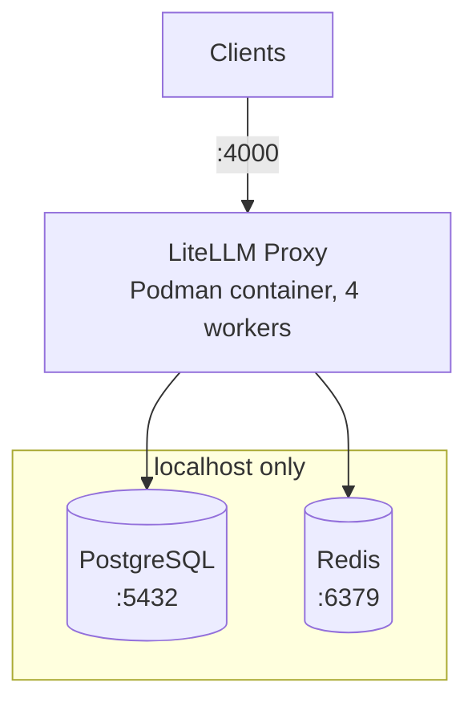

# TAPPaaS LiteLLM - AI proxy

## Overview

Production-ready LiteLLM proxy with PostgreSQL and Redis backend on NixOS.

This configuration provides a unified API gateway for multiple LLM providers (OpenAI, Anthropic, OpenRouter, Perplexity) with:

- **Caching:** Redis-based response caching (60-80% DB load reduction)
- **Persistence:** PostgreSQL for model configs, usage tracking, API keys
- **Security:** Auto-generated master key, passwordless local DB access
- **Backups:** Automated daily backups (PostgreSQL, Redis, configs)
- **Monitoring:** Systemd journal integration

## Architecture



## Specifications

### Sizing Guide

| Users | vCPU | RAM | Workers | DB Pool | Cost/mo |
|-------|------|-----|---------|---------|---------|
| 100   | 4    | 4GB | 4       | 25      | €20-30  |
| 250   | 4-6  | 8GB | 4       | 25      | €40-60  |
| 500+  | 8    | 16GB| 8       | 20      | €80-120 |

### Current Configuration (8GB VM)

- **PostgreSQL 15:** 2GB shared_buffers, 100 max_connections
- **Redis 7:** 1GB maxmemory, LRU eviction
- **LiteLLM:** Dynamic model loading from DB
- **Firewall:** Ports 22 (SSH), 4000 (API)

## Features

### Dynamic Model Management

```bash
# Add models via API (no rebuild required)
curl -X POST http://localhost:4000/model/new \
  -H "Authorization: Bearer $LITELLM_MASTER_KEY" \
  -d '{"model_name": "gpt-4", "litellm_params": {...}}'
```

### Automated Backups

- **PostgreSQL:** Daily at 02:00 (gzip compressed)
- **Redis:** Daily at 02:30 (RDB snapshots)
- **Configs:** Daily at 02:45 (secrets + config files)
- **Retention:** 30 days, automatic cleanup

### Security

- Auto-generated master key on first boot
- Passwordless PostgreSQL (localhost trust)
- Read-only config mounts
- Network isolation (127.0.0.1 binding)

## Quick Start

See [INSTALL.md](INSTALL.md) for detailed deployment instructions.

```bash
# 1. Deploy configuration
sudo nixos-rebuild switch

# 2. Retrieve master key
sudo cat /etc/secrets/litellm.env | grep LITELLM_MASTER_KEY

# 3. Test API
curl http://localhost:4000/health
```

## File Structure

```
/etc/nixos/
├── configuration.nix          # Main NixOS config
└── hardware-configuration.nix # Auto-generated

/etc/litellm/
└── config.yaml                # LiteLLM settings (read-only)

/etc/secrets/
├── litellm.env                # Runtime secrets (600)
└── litellm-template.env       # Reference template

/var/backup/
├── postgresql/                # Daily DB dumps
├── redis/                     # Daily RDB snapshots
└── litellm-env/              # Daily config backups

/var/lib/
├── postgresql/
│   └── archive/              # WAL archives
└── redis-litellm/            # Redis persistence
```

## Management

### Service Control
```bash
# Check status
systemctl status postgresql redis-litellm podman-litellm

# View logs
journalctl -u podman-litellm -f

# Restart container
systemctl restart podman-litellm
```

### Database Access
```bash
# PostgreSQL
sudo -u postgres psql litellm

# Redis
redis-cli
```

### Monitoring
```bash
# Active DB connections
sudo -u postgres psql -c "SELECT count(*) FROM pg_stat_activity;"

# Redis info
redis-cli INFO stats

# Container stats
podman stats litellm
```

## Configuration Updates

### Add API Keys
```bash
sudo vim /etc/secrets/litellm.env
# Add: OPENROUTER_API_KEY=...
sudo systemctl restart podman-litellm
```

### Adjust Resources
Edit `configuration.nix`:
```nix
# Increase shared_buffers for more RAM
shared_buffers = "4GB";  # Was: 2GB

# More workers for more CPU
cmd = [ "--num_workers" "8" ];  # Was: 4
```

Apply:
```bash
sudo nixos-rebuild switch
```

## Troubleshooting

### Container won't start
```bash
# Check secrets exist
ls -la /etc/secrets/litellm.env

# Verify dependencies
systemctl status postgresql redis-litellm

# Check logs
journalctl -u podman-litellm --since "10 minutes ago"
```

### High memory usage
```bash
# Check PostgreSQL
SELECT pg_size_pretty(pg_database_size('litellm'));

# Check Redis
redis-cli INFO memory

# Restart workers (recycle memory)
systemctl restart podman-litellm
```

### Connection errors
```bash
# Test PostgreSQL
sudo -u postgres psql -c "SELECT 1;"

# Test Redis
redis-cli PING

# Check firewall
sudo nft list ruleset | grep 4000
```

## Maintenance

### Manual Backup
```bash
# PostgreSQL
sudo -u postgres pg_dump litellm | gzip > backup-$(date +%F).sql.gz

# Redis
redis-cli SAVE
cp /var/lib/redis-litellm/dump.rdb backup-$(date +%F).rdb
```

### Restore from Backup
```bash
# PostgreSQL
sudo systemctl stop podman-litellm
sudo -u postgres psql -c "DROP DATABASE litellm;"
sudo -u postgres psql -c "CREATE DATABASE litellm OWNER litellm;"
gunzip -c backup.sql.gz | sudo -u postgres psql litellm
sudo systemctl start podman-litellm

# Redis
sudo systemctl stop redis-litellm
sudo cp backup.rdb /var/lib/redis-litellm/dump.rdb
sudo chown redis-litellm:redis-litellm /var/lib/redis-litellm/dump.rdb
sudo systemctl start redis-litellm
```

## Version Information

- **NixOS:** 25.05
- **PostgreSQL:** 15
- **Redis:** 7
- **LiteLLM:** v1.81.3.rc.2

## Support

- **LiteLLM Docs:** https://docs.litellm.ai/
- **NixOS Manual:** https://nixos.org/manual/nixos/stable/
- **TAPPaaS:** https://tappaas.org

## License

Mozilla Public License 2.0 (MPL-2.0)
```