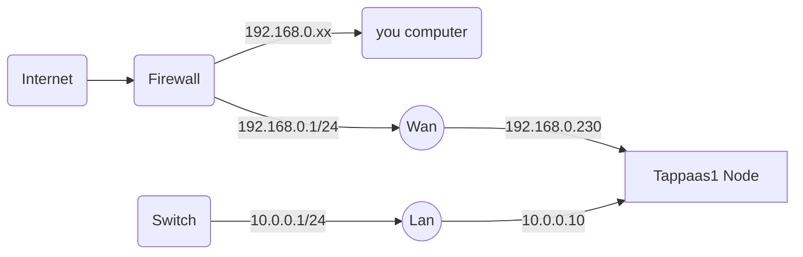
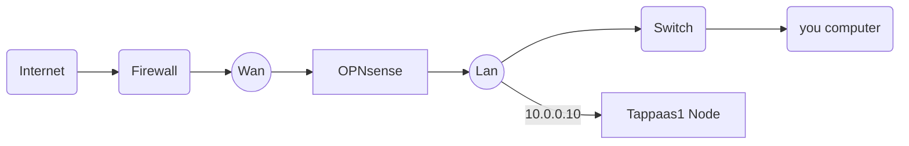

# OPNSense Installation

# Introduction

the basic macro steps:

- prepare the proxmox environment with the right virthal bridges
- install a basic OPNSense in a VM
- swap cables and default gateway in proxmox after basic testing
- swap firewall if relevant

note detailed VLAN configuration is a later step in foundation setup, after tappaas-cicd VM is running

# Preparation

The TAPPaaS OPNSense firewall will have two interfaces: WAN and LAN, bot interfaces will be virtio bridges in Proxmox.

It is assumed that Proxmox is connected to an existing firewall/router on vmbr0 via an ethernet port on the physical server.
It is further assumed that the IP domain for this connection is NOT a 10.x.y.z domain as it will conflict with the OPNSense setup (if it is it will stil be possible to set up TAPPaaS but will need more elaborate bootstrap process)

As preparation we need to set up another bridge on proxmox: vmbr1: this will connect to a secondary ethernet port on the physical server. This will eventually become the LAN interface

in the Proxmox GUI do:

- go to node: tappass1
- select the Network page under system
- take note of the free ethernet ports, and select the one that will be the new lan port. note down the Name
- click "create"
- in the pop up full in
-- Name: lan
-- IPv4/CIDR: 10.0.0.10/24
-- Gateway, ipv6 and ipv6 gateway: leave blank
-- Autostart is checked and VLAN aware is un checked
-- Bridgeport: the name of the chosen ethernet port
- now click create and click "apply configuration"

Rename the vmbr0 bridge to wan:
in the command line/console of tappas1 do the following:
edit the /etc/network/interfaces
replace all occurrences of "vmbr0" with the string "wan" (there should be two instances)
save file

Reboot the proxmox system

attach a new switch to the ethernet port associated with the lan bridge port

you will now have a setup looking like this


where Wan is the only port on the Proxmox box that is used by the hypervisor


## Install OPNsense software

There are two ways of installing OPNSense:

1. Installation of an OPNSense image, with manual configuration of OPNsense WAN and LAN ports from the console
2. Restore a vanilla OPNSense proxmox backup of a minimum install

### Method 1: install from image

now create the OPNSense VM: from the command prompt/console of tappaas1:

```
curl -fsSL  https://raw.githubusercontent.com/TAPPaaS/TAPPaaS/main/src/foundation/10-OPNsense/opnsense-vm.sh| bash
```

boot up the VM and configure the opnsense

after boot you login as root with password opnsense

change lan ip through option 2:
- configure lan 
- use ip range to 10.0.0.1/24
- enable DHCP, with a range of 10.0.0.100 - 10.0.0.254

jump into a shell (option 8) and test that you can ping external adresses

connect a pc to the LAN port of the proxmox box (can be via a switch)
- check that you get an ip in the 10.0.0x range
- connect to the management console of opnsense: 10.0.0.1


#### DNS setup

- Enable services -> dnsmask DNS ->general
  - Listen port: use port 53053
  Enable service -> Unbound DNS -> general
- register dnsmask with unbound DNS for lan.internal domain
  - Service -> Unbound DNS -> Query Forwarding
    - register lan.internal to query 127.0.0.1 port 53053
    - register 10.in-addr.arpa to query 127.0.0.1 port 53053
    - press apply
  - 

Take a proxmox backup of the VM to be used as Method 2: 

change the root password

### Method 2: Restore backup

This method relies on a proxmox backup image taken just at the end of the steps in "method 1"

- Download backup image
- do a qmrestore on the image

start the vm 
after boot you login as root/opnsense
change the root password


## Test and switch

We are now ready to do basic testing of OPNsense and to switch the primary proxmox bridge as well as primary firewall

We are going to replace the firewall with OPNSense. We are going to do that in two steps. 

### Step one

First we switch tappaas node 1 to be working **only** on the Lan port 
so in the Proxmox console edit the network bridge "Wan": remove the IP IP assignment.
in the shell prompt: edit the follwing files:
/etc/hosts: ensure the host IP is the new 10.0.0.10
/etc/resolv.conf: ensure the resolver is 10.0.0.1

You should now have a setup looking like:



(where OPNsense is a VM on the TAppaas1 node)

reboot proxmox and see that you have access to the internt from both the pc connected to the LAN switch and from the proxmox console. ensure you have access to the OPNsense GUI at 10.0.0.1


### Step Two: switch firewall

There are 3 scenarios for this step:

- Stay with TAPPaaS as a subsystem of existing ISP provided and configured network 
  - in this case there is nothing further to do at this stage
  - Eventually you will need to make a pass through pinhole in the existing firewall to the Wan port on OPNsense. See Pangolin setup
- Reconfigure existing ISP provided firewall to be in bridge mode
  - consult ISP on how to do this. once done check OPNSense have the right connection.
  - Potentially you need to reconfigure IPv6
  - Note that if existing legacy firewall provided WIFI then this now need to be set up for TAPPaaS
- Replace the ISP provided firewall: this assumes the ISP is having an ethernet termination for WAN
  - plug in OPNsense wan port instead of legacy firewall
  - see notes above on Wifi and IPv6

Redo test

# TODO


### IPv6 setup

- create gateway: System -> Gateways -> Configuration
  - add a gateway, on the WAN port, protocol IPv6 give it the gateway address assigned by the ISP
- Interface -> WAN: 
  - IPv6 Configuration Type = Static IP
  - IPv6 address: the assigned IP address of you router by the provider it WAN connectivity
  - select gateway: IPv6 gateway rule: select the created gateway
  - Save and apply changes


