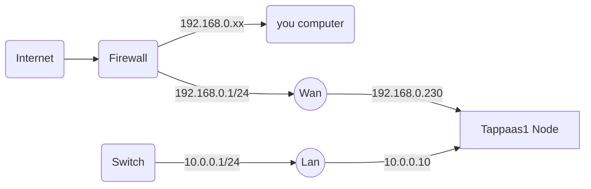
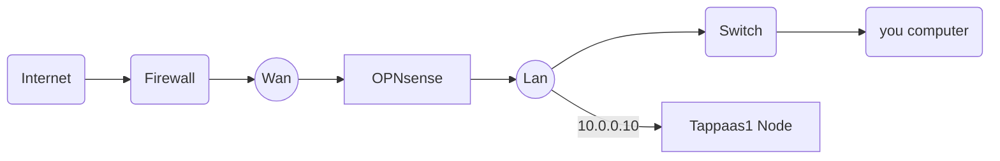

# OPNSense Installation

# Introduction

the basic macro steps:

1. prepare the proxmox environment with the right virtual bridges
2. install a basic OPNSense in a VM
3. swap cables and default gateway in proxmox after basic testing
4. swap firewall if relevant
5. test
6. setup reverse proxy
7. setup VLANS and firewall rules
8. tests
9. Make a backup image

step 2-6 and 8-10 can be replaced with
2. Restore Backup image
3. swap firewall
4. Reconfigure domain names inrestored image
5. configure public DNS
6. test

# Prerequisite

The assumption for TAPPaaS to work is external access via public IP. Either directly exposed or through a NAT pinhole for port 80 and 443
Further the assumption is that there is a registered domain name associated with the tappaas installation: <example.tlc>
Finally it is assumed that the installer have access to editing the DNS records of the domain.

So have the following ready:
- Domain: example.tld
- Public IP assigned by ISP: 1.2.3.4

# 1. Preparation

The TAPPaaS OPNSense firewall will have two interfaces: WAN and LAN, both interfaces will be virtio bridges in Proxmox.

It is assumed that Proxmox is connected to an existing firewall/router on vmbr0 via an ethernet port on the physical server.
It is further assumed that the IP domain for this connection is NOT a 10.x.y.z domain as it will conflict with the OPNSense setup (if it is it will stil be possible to set up TAPPaaS but will need more elaborate bootstrap process)

As preparation we need to set up another bridge on proxmox: vmbr1: this will connect to a secondary ethernet port on the physical server. This will eventually become the LAN interface

in the Proxmox GUI do:

- go to node: tappass1
- select the Network page under system
- take note of the free ethernet ports, and select the one that will be the new lan port. note down the Name
- click "create"
- in the pop up full in
-- Name: lan
-- IPv4/CIDR: 10.0.0.10/24
-- Gateway, ipv6 and ipv6 gateway: leave blank
-- Autostart is checked and VLAN aware is unchecked
-- Bridgeport: the name of the chosen ethernet port
- now click create and click "apply configuration"

Rename the vmbr0 bridge to wan:
in the command line/console of tappas1 do the following:
edit the /etc/network/interfaces
replace all occurrences of "vmbr0" with the string "wan" (there should be two instances)
save file

Reboot the proxmox system

attach a new switch to the ethernet port associated with the lan bridge port

you will now have a setup looking like this


where Wan is the only port on the Proxmox box that is used by the hypervisor


# 2. Install OPNsense software


now create the OPNSense VM: from the command prompt/console of tappaas1:

```
curl -fsSL  https://raw.githubusercontent.com/TAPPaaS/TAPPaaS/main/src/foundation/10-OPNsense/opnsense-vm.sh| bash
```

boot up the VM and configure the opnsense

after boot you login as root with password opnsense

change lan ip through option 2:
- configure lan 
- use ip range to 10.0.0.1/24
- enable DHCP, with a range of 10.0.0.100 - 10.0.0.254

jump into a shell (option 8) and test that you can ping external addresses

connect a pc to the LAN port of the proxmox box (can be via a switch)
- check that you get an ip in the 10.0.0x range
- connect to the management console of opnsense: 10.0.0.1


## DNS setup

From: [OPNsense DHCP with DNS](https://docs.opnsense.org/manual/dnsmasq.html#dhcpv4-with-dns-registration)

- Enable services -> Unbound DNS - general and ensure it listen to port 53
- Enable services -> dnsmask DNS ->general
  - Listen port: use port 53053
  - Do not forward to system defined DNS servers
  - DHCP fqdn
  - dhcp default domain: internal
  - DHCP register firewall rules
  Enable service -> Unbound DNS -> general
- register dnsmask with unbound DNS for lan.internal domain
  - Service -> Unbound DNS -> Query Forwarding
    - register internal to query 127.0.0.1 port 53053
    - register 10.in-addr.arpa to query 127.0.0.1 port 53053
    - press apply
    - 

Check that you can lookup you your local machines using .internal domain


# 3. Swap cables Step

First we switch tappaas node 1 to be working **only** on the Lan port 
so in the Proxmox console edit the network bridge "Wan": remove the IP IP assignment.
in the shell prompt: edit the follwing files:
/etc/hosts: ensure the host IP is the new 10.0.0.10
/etc/resolv.conf: ensure the resolver is 10.0.0.1

You should now have a setup looking like:



(where OPNsense is a VM on the tappaas1 node)

reboot proxmox and see that you have access to the internet from both the pc connected to the LAN switch and from the proxmox console. ensure you have access to the OPNsense GUI at 10.0.0.1


# 4. Switch firewall

There are 3 scenarios for this step:

- Stay with TAPPaaS as a subsystem of existing ISP provided and configured network 
  - in this case there is nothing further to do at this stage
  - Eventually you will need to make a pass through pinhole in the existing firewall to the Wan port on OPNsense. See Pangolin setup
- Reconfigure existing ISP provided firewall to be in bridge mode
  - consult ISP on how to do this. once done check OPNSense have the right connection.
  - Potentially you need to reconfigure IPv6
  - Note that if existing legacy firewall provided WIFI then this now need to be set up for TAPPaaS
- Replace the ISP provided firewall: this assumes the ISP is having an ethernet termination for WAN
  - plug in OPNsense wan port instead of legacy firewall
  - see notes above on Wifi and IPv6


# 5. Test

# 6. Configure proxy

we use the OPNsense os-caddy plugin for https proxy

In the opnsense console, use option 8 to get a command line shell and install caddy
```
pkg install os-caddy
```

follow the OPNsense manual to configure Caddy: [Caddy Install](https://docs.opnsense.org/manual/how-tos/caddy.html#installation)
Only do the "Prepare OPNsense for Caddy After Installation":
- re configure opensense gui to 8443
- Create http and https firewall rules for wan and lan to caddy
- then configure enmail adress and enable caddy

note as we create VLANs we need to create firewall rules as well

# 7. VLAN and Firewalls

TODO: create automation script

- go to Interfaces -> Devices -> VLAN and add vlans
- go to the created VLAN as interfaces and configure static IP according to VLAN specs
- go to Services -> ISC DHCPv4 -> <Vlan> and configure IP range for DHCP

- Each of the LAN/VLAN interfaces
  - IPv6 Configuration type = Static IPv6
  - IPv6 address: The assigned IPv6 range potentially subdivided into sub ranges ending in ::1 and handed out as a 64 bit network range
  - save and apply
- create Router advertisement on each local interface LAN/VLAN: Services -> Router advisement -: (V)LAN
  - Router Advertisements = Managed
  - DNS Options, tick the Use the DNS configuration of the DHCPv6 server

### create VLAN firewall rules

general for each interface some firewall rules needs to be configured

- WAN: there should be a default rule to NOT pass any traffic. keep that
- DMZ: allow DMZ to communicate to internet, but not locally
  - block LAN, and other VLANs
  - create a pass rule for the rest
- Remaining LAN/VLANs: add rule to allow/pass any to any traffic
- for Guest/client: add first rule to block/reject traffic to LAN (management)
  - for "true guests" block access to other vlans except DMZ


Note: all rules are for both IPv4 and IPv6

# 8. Test

# 9. Backup and Cleanup

make a proxmox backup of the VM
change the root password to something different

# Method 2: Restore backup

This method relies on a proxmox backup image taken just at the end of the steps in "method 1"

- Download backup image
- do a qmrestore on the image

start the vm 
after boot you login as root/opnsense
change the root password
change domain name
configure caddy email address
swap firewall
test

# TODO


### IPv6 setup

- create gateway: System -> Gateways -> Configuration
  - add a gateway, on the WAN port, protocol IPv6 give it the gateway address assigned by the ISP
- Interface -> WAN: 
  - IPv6 Configuration Type = Static IP
  - IPv6 address: the assigned IP address of you router by the provider it WAN connectivity
  - select gateway: IPv6 gateway rule: select the created gateway
  - Save and apply changes


