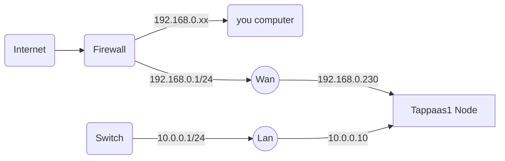
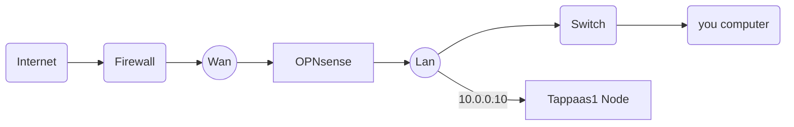

# OPNSense Installation

## Introduction

the basic macro steps:

1. prepare the proxmox environment with the right virtual bridges
2. install a basic OPNSense in a VM
3. swap cables and default gateway in proxmox after basic testing
4. swap firewall if relevant
5. set up ssh and test

## Prerequisite

The assumption for TAPPaaS to work is external access via public IP. Either directly exposed or through a NAT pinhole for port 80 and 443
Further the assumption is that there is a registered domain name associated with the tappaas installation: <example.tld>
Finally it is assumed that the installer have access to editing the DNS records of the domain.

So have the following ready:

- Domain: example.tld
- Public IP assigned by ISP: 1.2.3.4

## 1. Preparation

The TAPPaaS OPNSense firewall will have two interfaces: WAN and LAN, both interfaces will be virtio bridges in Proxmox.

It is assumed that Proxmox is connected to an existing firewall/router on vmbr0 via an ethernet port on the physical server.
It is further assumed that the IP range for this connection is NOT a 10.x.y.z/8 range as it will conflict with the OPNSense setup (if it is it will still be possible to set up TAPPaaS but will need more elaborate bootstrap process)

As preparation we need to set up another bridge on proxmox: vmbr1: this will connect to a secondary ethernet port on the physical server. This will eventually become the LAN interface

in the Proxmox GUI do:

- go to node: tappaas1
- select the Network page under system
- take note of the free ethernet ports, and select the one that will be the new lan port. note down the Name
- click "create" select "linux bridge"
- in the pop up fill in
  - Name: lan
  - IPv4/CIDR: 10.0.0.10/24
  - Gateway:blank (as we have a gateway on the other bridge)
  - ipv6 and ipv6 gateway: leave blank
  - Autostart is checked and VLAN aware is unchecked
  - Bridgeport: the name of the chosen ethernet port
- now click create and click "apply configuration"

Rename the vmbr0 bridge to "wan" using the command line/console of tappaas1:

- edit the /etc/network/interfaces
- replace all occurrences of "vmbr0" with the string "wan" (there should be two instances)
- save file
- reboot the tappaas1 node (or PVE will not discover the new wan correctly)

attach a new switch to the ethernet port associated with the lan bridge port

you will now have a setup looking like this



where Wan is the only port on the Proxmox box that is used by the hypervisor

## 2. Install OPNsense software

now create the OPNSense VM: from the command prompt/console of tappaas1:
(Note if you are not using the main branch then replace "main" with branch name in the command below)

```bash
BRANCH="main"
curl -fsSL  https://raw.githubusercontent.com/TAPPaaS/TAPPaaS/$BRANCH/src/foundation/10-firewall/firewall.json > /root/tappaas/firewall.json
~/tappaas/Create-TAPPaaS-VM.sh firewall
```

boot up the VM and configure the opnsense

after boot you login as root with password opnsense

change the root password; option 3, followed by answer "y"

change lan ip; option 2:

- followed by 1 for Lan, and N for not using DHCP
- use ip 10.0.0.1, and  range: 24
- no IPv6 config (TODO, enable IPv6)
- enable DHCP, with a range of 10.0.0.100 - 10.0.0.254
- default "N" answers to the rest

### Test

jump into a shell (option 8) and test that you can ping external addresses
(you might need to reboot opnsense for routing to work)

connect a pc to the LAN port of the proxmox box (can be via a switch)

- check that you get an ip in the 10.0.0.x range
- connect to the management console of opnsense: 10.0.0.1

## DNS setup

From: [OPNsense DHCP with DNS](https://docs.opnsense.org/manual/dnsmasq.html#dhcpv4-with-dns-registration)

Log into OPNsense on 10.0.0.10

- Enable services -> Unbound DNS -> General and ensure it listen to port 53
- Enable services -> dnsmask DNS -> General
  - Interface LAN
  - Listen port: use port 53053
  - DNS Query Forwarding
    - enable: Require domain, Do not forward to system ..., Do not forward private reverse ...
  - DHCP:
    - enable: DHCP fqdn, DHCP authoritative, DHCP register firewall rules
    - DHCP default domain: internal
  - Click Apply
- Service -> Unbound DNS -> Query Forwarding
  - register "internal" to query 127.0.0.1 port 53053
  - register "10.in-addr.arpa" to query 127.0.0.1 port 53053
  - press apply
- go to Services -> Dnsmasq & DHCP -> DHCP ranges
  - edit LAN interface and change domain to mgmt.internal
  - press apply

Finally register the static hosts on the internal network: firewall and tappaas1

- go to Service -> Dnsmasq DNS & DHCP -> Hosts
  - add host:
    - name firewall
    - domain: mgmt.internal
    - ip: 10.0.0.1
  - add host:
    - name tappaas1
    - domain: mgmt.internal
    - ip: 10.0.0.10
  - press apply

Check that you can lookup you your tappaas1 and firewall hosts using .mgmt.internal domain

## 3. Swap cables Step

First we switch tappaas1 node to be working **only** on the Lan port:

- in the Proxmox console edit the network bridge "Wan": remove the IP IP assignment.
  - Note that you should connect to tappaas1 proxmox node via 10.0.0.10:8006
  - first remove the ip and gateway assignment by editing the "wan" bridge under network for tappaas1
  - then add 10.0.01 as gateway for the "wan" bridge
  - press apply
- in the console fo the tappaas1 node (via the proxmox gui): edit the following files:
  - /etc/hosts: ensure the host IP is the new 10.0.0.10
  - /etc/resolv.conf: ensure the resolver is 10.0.0.1

You should now have a setup looking like:



(where OPNsense is a VM on the tappaas1 node)

reboot proxmox and see that you have access to the internet from both the pc connected to the LAN switch and from the proxmox console. ensure you have access to the OPNsense GUI at 10.0.0.1

## 4. Switch firewall

There are 3 scenarios for this step:

- Stay with TAPPaaS as a subsystem of existing ISP provided and configured network 
  - in this case there is nothing further to do at this stage
  - Eventually you will need to make a pass through pinhole in the existing firewall to the Wan port on OPNsense. See Pangolin setup
- Reconfigure existing ISP provided firewall to be in bridge mode
  - consult ISP on how to do this. once done check OPNSense have the right connection.
  - Potentially you need to reconfigure IPv6
  - Note that if existing legacy firewall provided WIFI then this now need to be set up for TAPPaaS
- Replace the ISP provided firewall: this assumes the ISP is having an ethernet termination for WAN
  - plug in OPNsense wan port instead of legacy firewall
  - see notes above on Wifi and IPv6

## 5. setup ssh and Test

In the OPNsense gui: got to System->Settings->Administration

- under secure shell do:
  - enable secure shell
  - permit root user login
  - (Do NOT allow password login)
  - Listen interface is LAN
- click SAVE

## Reboot and Test

## TODO

### IPv6 setup

- create gateway: System -> Gateways -> Configuration
  - add a gateway, on the WAN port, protocol IPv6 give it the gateway address assigned by the ISP
- Interface -> WAN: 
  - IPv6 Configuration Type = Static IP
  - IPv6 address: the assigned IP address of you router by the provider it WAN connectivity
  - select gateway: IPv6 gateway rule: select the created gateway
  - Save and apply changes
