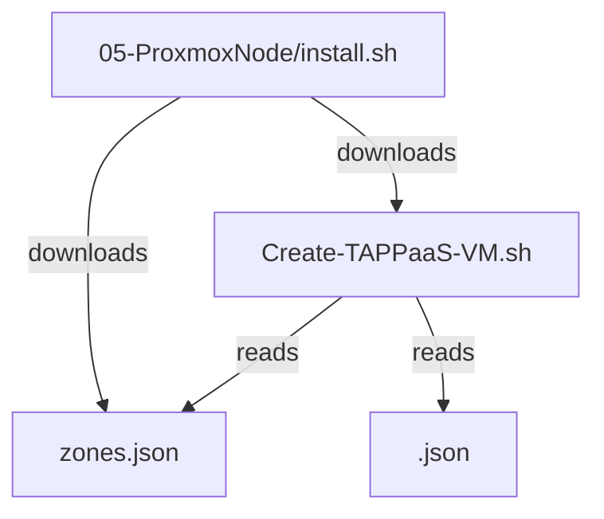
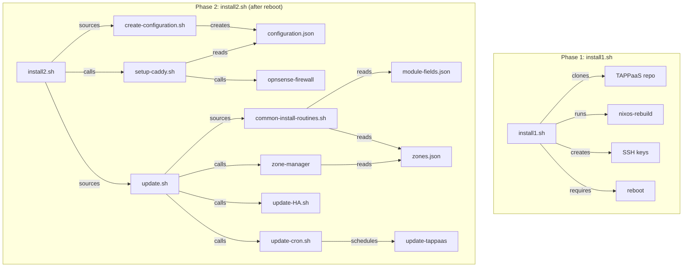
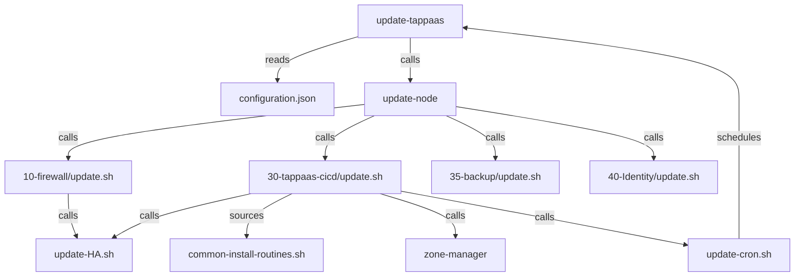
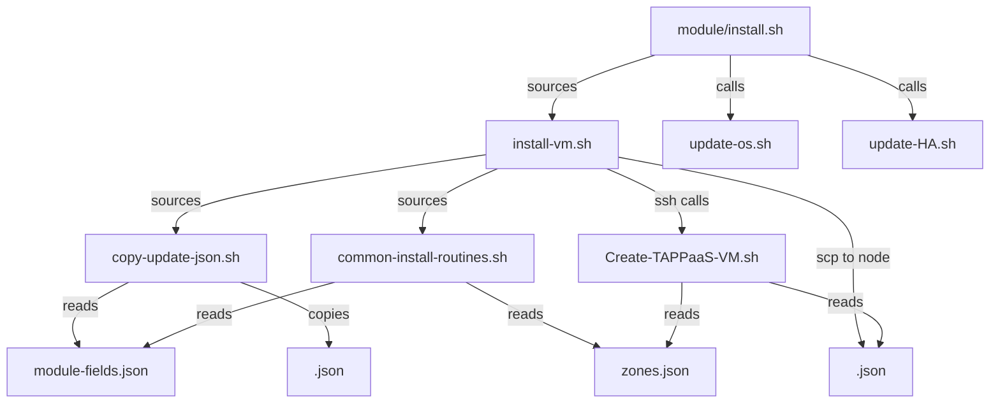
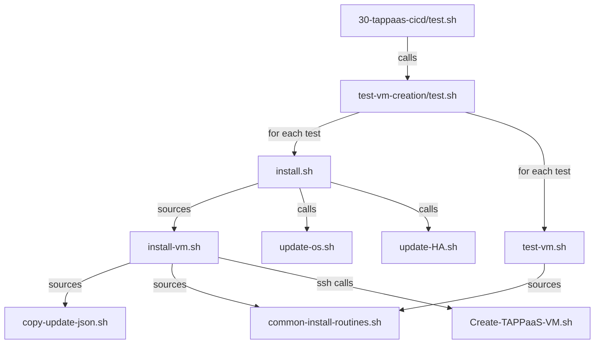
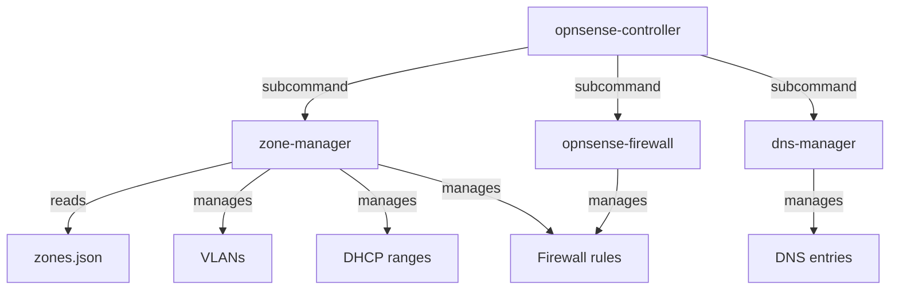
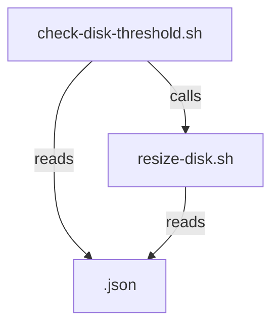
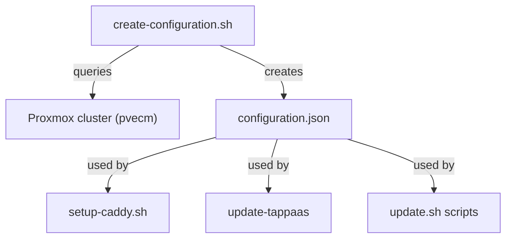

# TAPPaaS Foundation Layer - Dependency Documentation

This document describes the program dependencies within the `src/foundation/` directory of TAPPaaS.

## Summary

| Directory | Programs | Description |
|-----------|----------|-------------|
| 30-tappaas-cicd/scripts/ | 12 | Core helper scripts |
| 30-tappaas-cicd/opnsense-controller/ | 4 | OPNsense Python CLI tools |
| 30-tappaas-cicd/update-tappaas/ | 2 | Update scheduler |
| 30-tappaas-cicd/test-vm-creation/ | 3 | VM creation test suite |
| 30-tappaas-cicd/ | 4 | Main installation scripts |
| 05-ProxmoxNode/ | 2 | Node bootstrap scripts |
| 10-firewall/ | 1 | Firewall update |
| 35-backup/ | 2 | Backup server scripts |
| 40-Identity/ | 2 | Identity module scripts |

### Key Dependency Chains

1. **Install Chain**: `install1.sh` → `install2.sh` → `create-configuration.sh` + `setup-caddy.sh` + `update.sh`
2. **Update Chain**: `update-tappaas` → `update-node` → module `update.sh` scripts
3. **VM Creation Chain**: `install-vm.sh` → `copy-update-json.sh` → `Create-TAPPaaS-VM.sh`
4. **Zone Management Chain**: `zone-manager` → OPNsense API → firewall configuration
5. **Test Chain**: `test.sh` → `install.sh` → `test-vm.sh`

### Most Connected Programs

| Program | Role |
|---------|------|
| `common-install-routines.sh` | Sourced by all module scripts |
| `install-vm.sh` | Called by all module install scripts |
| `update-tappaas` | Orchestrates all node updates |
| `zone-manager` | Manages all OPNsense zones |

---

## Top-Level Entry Points

These programs are NOT called by other TAPPaaS programs - they are entry points:

| Entry Point | Purpose | Trigger |
|-------------|---------|---------|
| `05-ProxmoxNode/install.sh` | Bootstrap first Proxmox node | Manual (curl from GitHub) |
| `30-tappaas-cicd/install1.sh` | Install CICD mothership | Manual (after VM creation) |
| `30-tappaas-cicd/test.sh` | Run VM creation test suite | Manual/CI |
| `update-tappaas` | Scheduled node updates | Cron job |
| `create-configuration.sh` | Generate system configuration | Manual (initial setup) |
| `check-disk-threshold.sh` | Monitor disk usage | Cron |
| `test-config.sh` | Validate configurations | Manual |
| `opnsense-controller` | Direct OPNsense management | Manual |

---

## Dependency Graphs

### 1. Bootstrap Flow: `05-ProxmoxNode/install.sh`

Initial Proxmox node setup - downloads scripts and configuration files.

### 2. CICD Installation Flow: `install1.sh` then `install2.sh`

Two-phase installation with reboot in between.

### 3. Update Scheduler Flow: `update-tappaas`

Automated scheduled updates for all TAPPaaS nodes.

### 4. VM Creation Flow: Module Installation

Used by all module install scripts.

### 5. Test Suite Flow: `30-tappaas-cicd/test.sh`

VM creation and validation tests.

### 6. OPNsense Controller: `opnsense-controller`

Direct management of OPNsense firewall.

### 7. Disk Management Flow: `check-disk-threshold.sh`

Automated disk monitoring and resizing.

### 8. Configuration Generation: `create-configuration.sh`

Creates the main configuration file from cluster state.

---

## Configuration File Dependencies

| Config File | Created By | Used By |
|-------------|------------|---------|
| `configuration.json` | create-configuration.sh | update-tappaas; setup-caddy.sh; module update.sh |
| `zones.json` | Manual/git | zone-manager; Create-TAPPaaS-VM.sh; common-install-routines.sh |
| `module-fields.json` | Manual/git | common-install-routines.sh; copy-update-json.sh |

---

## Install Locations

| Location | Programs |
|----------|----------|
| `/home/tappaas/bin/` | All CLI tools and helper scripts (symlinks) |
| `/root/tappaas/` (Proxmox nodes) | Create-TAPPaaS-VM.sh |
| `src/foundation/*/` | Module install.sh and update.sh scripts |
