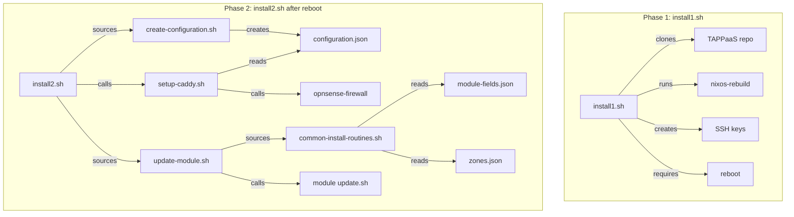
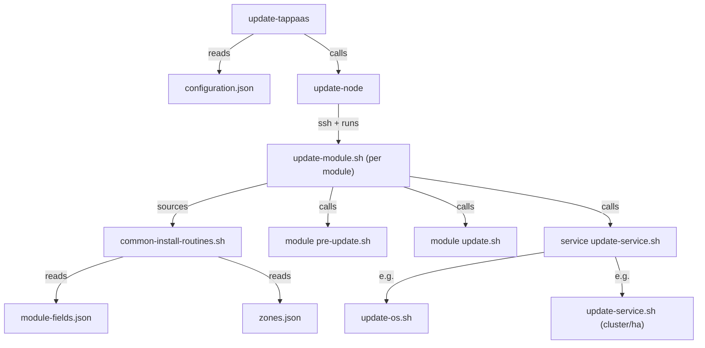
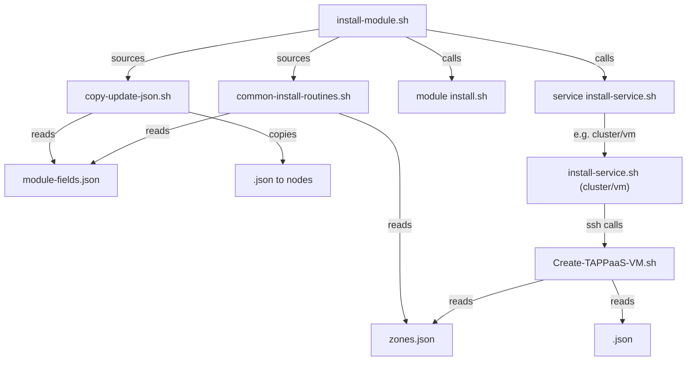
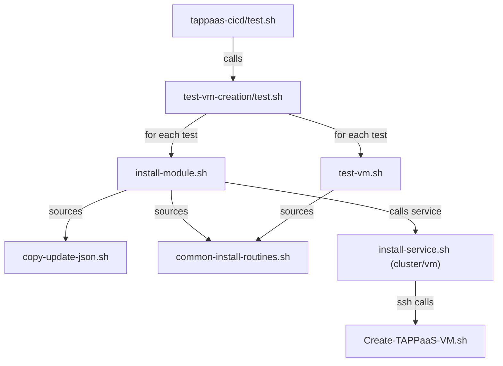
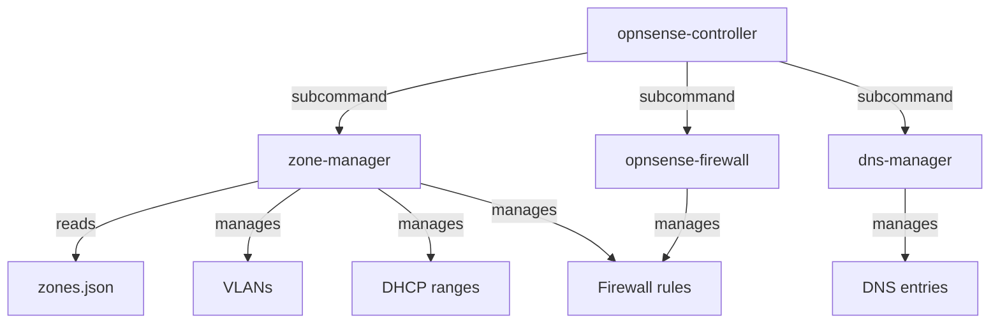
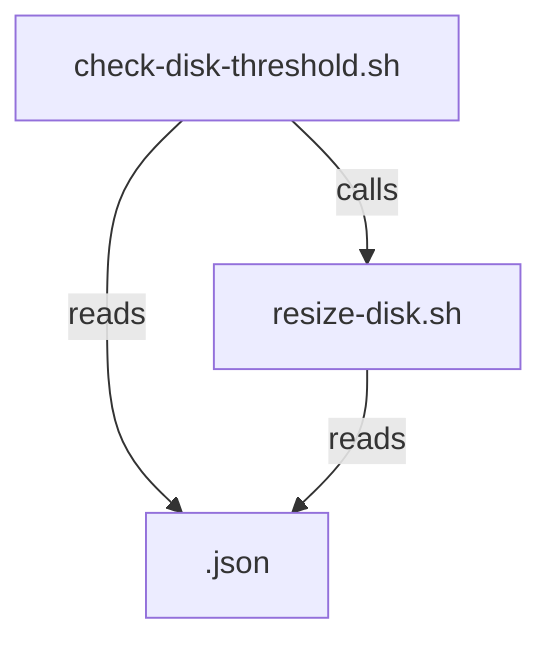
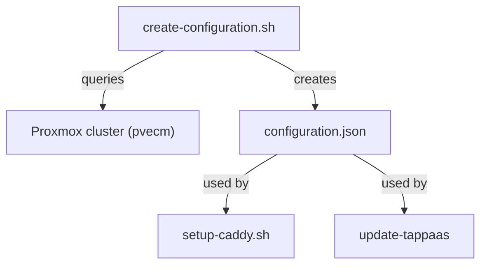
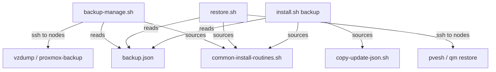

# TAPPaaS Foundation Layer - Dependency Documentation

This document describes the program dependencies within the `src/foundation/` directory of TAPPaaS.

## Summary

| Directory | Programs | Description |
|-----------|----------|-------------|
| tappaas-cicd/scripts/ | 11 | Core helper scripts |
| tappaas-cicd/opnsense-controller/ | 4 | OPNsense Python CLI tools |
| tappaas-cicd/update-tappaas/ | 2 | Update scheduler |
| tappaas-cicd/test-vm-creation/ | 3 | VM creation test suite |
| tappaas-cicd/ | 5 | Main installation scripts |
| cluster/ | 3 | Cluster and VM management |
| firewall/ | 1 | Firewall update |
| backup/ | 4 | Backup server scripts |
| identity/ | 2 | Identity module scripts |
| templates/ | 4 | OS template service scripts |

### Key Dependency Chains

1. **Install Chain**: `install1.sh` → `install2.sh` → `create-configuration.sh` + `setup-caddy.sh` + `update-module.sh`
2. **Update Chain**: `update-tappaas` → `update-node` → `update-module.sh` → module `update.sh` + service `update-service.sh`
3. **Module Install Chain**: `install-module.sh` → `copy-update-json.sh` + `common-install-routines.sh` → service `install-service.sh` → `Create-TAPPaaS-VM.sh`
4. **Zone Management Chain**: `zone-manager` → OPNsense API → firewall/VLAN/DHCP configuration
5. **Test Chain**: `test.sh` → `install-module.sh` → `test-vm.sh`

### Most Connected Programs

| Program | Depended On By |
|---------|----------------|
| `common-install-routines.sh` | install-module.sh, update-module.sh, pre-update.sh, update.sh (tappaas-cicd), backup-manage.sh, restore.sh, update.sh (identity), update-service.sh (cluster/ha), update-service.sh (templates/*), test-vm.sh |
| `copy-update-json.sh` | install-module.sh, install.sh (backup), install-service.sh (cluster/vm) |
| `update-tappaas` | Orchestrates all node updates (cron) |
| `install-module.sh` | Entry point for all module installations |
| `update-module.sh` | Entry point for all module updates |
| `update-os.sh` | update-service.sh (templates/nixos), update-service.sh (templates/debian) |

---

## Top-Level Entry Points

These programs are NOT called by other TAPPaaS programs - they are entry points:

| Entry Point | Purpose | Trigger |
|-------------|---------|---------|
| `tappaas-cicd/install1.sh` | Install CICD mothership | Manual (on tappaas-cicd) |
| `tappaas-cicd/test.sh` | Run VM creation test suite | Manual/CI |
| `update-tappaas` | Scheduled node updates | Cron job (hourly) |
| `create-configuration.sh` | Generate system configuration | Manual (initial setup) |
| `check-disk-threshold.sh` | Monitor disk usage | Cron |
| `test-config.sh` | Validate module JSON configs | Manual |
| `opnsense-controller` | Direct OPNsense management | Manual |
| `backup-manage.sh` | Backup operations | Manual |
| `restore.sh` | Restore from backup | Manual |

---

## Dependency Graphs

### 1. CICD Installation Flow: `install1.sh` then `install2.sh`

Two-phase installation with reboot in between.

### 2. Update Scheduler Flow: `update-tappaas`

Automated scheduled updates for all TAPPaaS nodes.

### 3. Module Installation Flow: `install-module.sh`

Used by `install2.sh` and test scripts to install modules.

### 4. Test Suite Flow: `tappaas-cicd/test.sh`

VM creation and validation tests.

### 5. OPNsense Controller: `opnsense-controller`

Direct management of OPNsense firewall.

### 6. Disk Management Flow: `check-disk-threshold.sh`

Automated disk monitoring and resizing.

### 7. Configuration Generation: `create-configuration.sh`

Creates the main configuration file from cluster state.

### 8. Backup Flow: `backup-manage.sh` and `restore.sh`

Backup and restore operations.

---

## Configuration File Dependencies

| Config File | Created By | Used By |
|-------------|------------|---------|
| `configuration.json` | create-configuration.sh | update-tappaas; setup-caddy.sh |
| `zones.json` | Manual/git | zone-manager; Create-TAPPaaS-VM.sh; common-install-routines.sh; cluster/update.sh; firewall/update.sh |
| `module-fields.json` | Manual/git | common-install-routines.sh; copy-update-json.sh; test-config.sh |
| `<module>.json` | Per module (git) | install-module.sh; update-module.sh; Create-TAPPaaS-VM.sh; various service scripts |

---

## Install Locations

| Location | Programs |
|----------|----------|
| `/home/tappaas/bin/` | All CLI tools and helper scripts (symlinks from tappaas-cicd/) |
| `/root/tappaas/` (Proxmox nodes) | Create-TAPPaaS-VM.sh, zones.json |
| `src/foundation/*/` | Module install.sh, update.sh, and service scripts |
