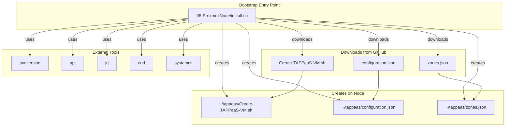
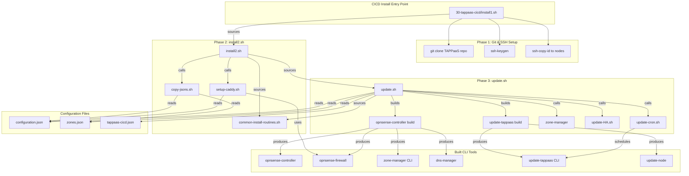
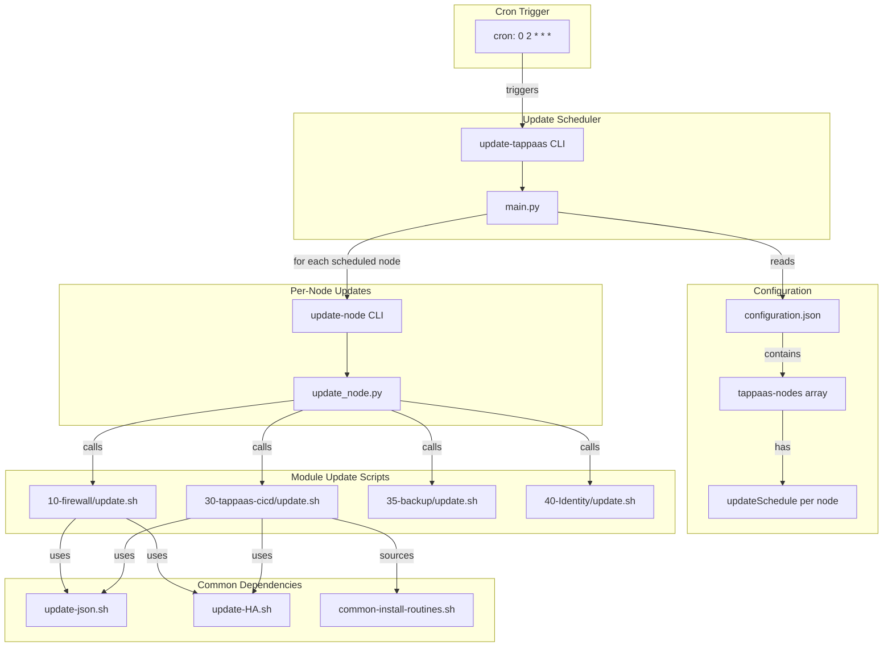
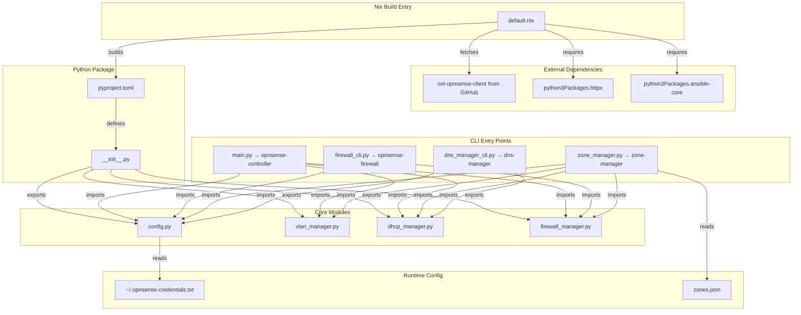
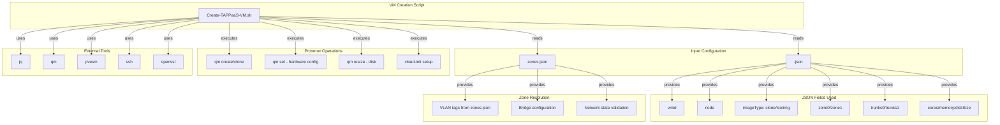
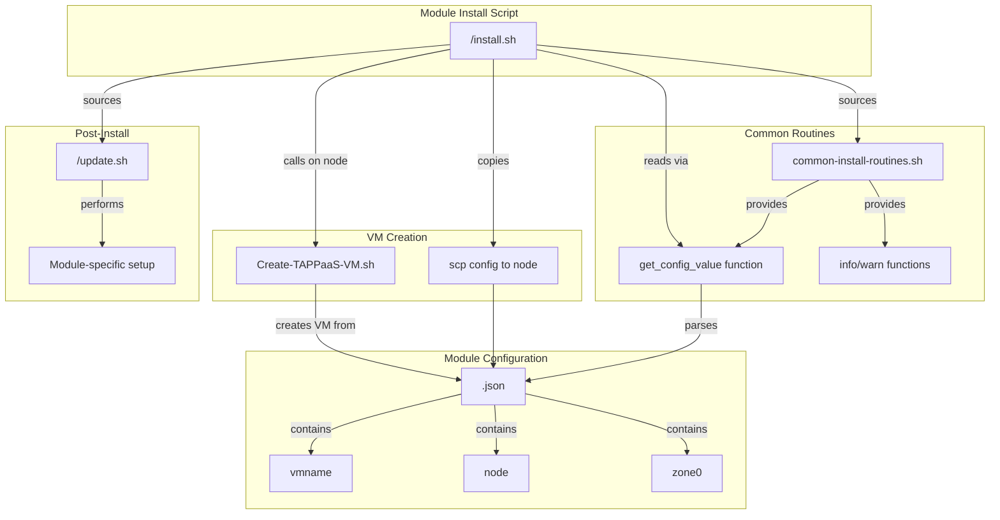
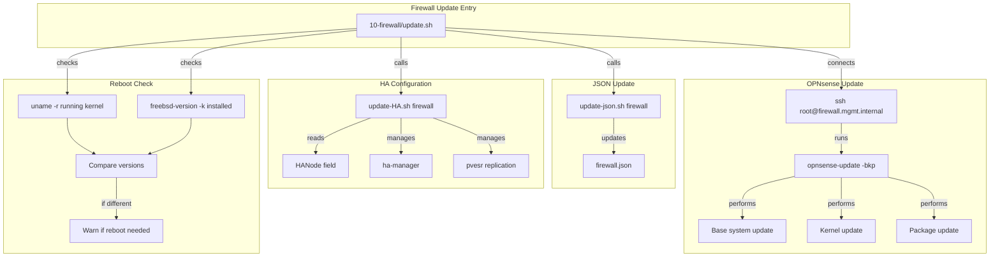
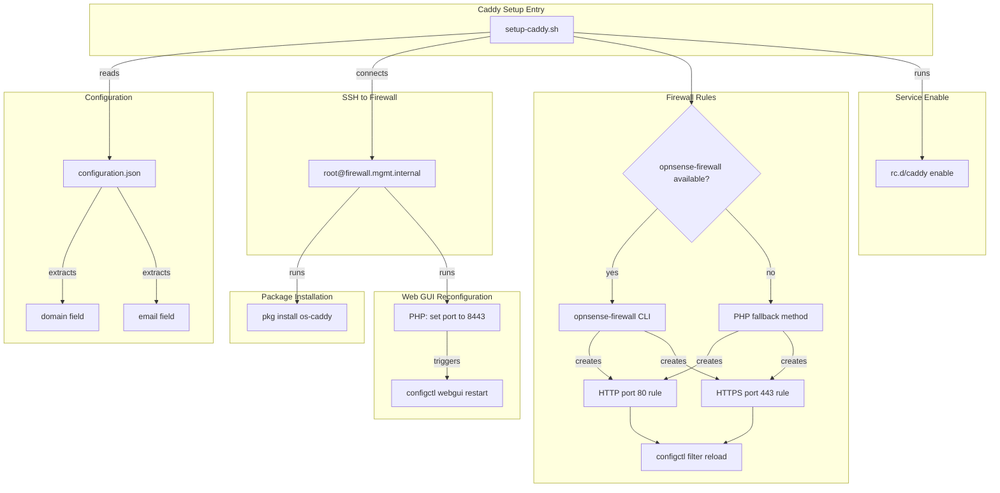

# TAPPaaS Foundation Layer - Dependency Documentation

This document describes the file dependencies within the `src/foundation/` directory of TAPPaaS.

## Summary

The foundation layer contains **55 files** organized by directory:

| Directory | Files | Description |
|-----------|-------|-------------|
| Root level | 5 | JSON configuration files |
| 05-ProxmoxNode | 2 | Initial Proxmox node setup scripts |
| 10-firewall | 2 | OPNsense firewall configuration |
| 20-tappaas-nixos | 3 | NixOS VM template |
| 30-tappaas-cicd | 4 + 10 + 12 + 2 | CICD mothership (main + scripts + Python + Nix) |
| 35-backup | 6 | Proxmox Backup Server |
| 40-Identity | 4 | Identity/secrets management |
| Attic | 8 | Deprecated/archived files |

### Key Dependency Chains

1. **Configuration Flow**: `configuration.json` → `copy-jsons.sh` → all nodes
2. **Zone Flow**: `zones.json` → `zone-manager` → OPNsense firewall
3. **Build Chain**: `default.nix` → `nix-build` → `/home/tappaas/bin/` symlinks
4. **Update Chain**: `update-tappaas` → `update-node` → module `update.sh` scripts
5. **Install Chain**: `install.sh` → `common-install-routines.sh` → `Create-TAPPaaS-VM.sh`

### Most Connected Files

| File | Role |
|------|------|
| `common-install-routines.sh` | Sourced by all module install scripts |
| `Create-TAPPaaS-VM.sh` | Called by all module installers |
| `update.sh` (30-tappaas-cicd) | Most complex, depends on 15+ other files |
| `configuration.json` | Referenced by setup, update, and scheduling scripts |
| `zones.json` | Used by VM creation and zone-manager |

---

## Top-Level Entry Points

These are files that **no other files depend on** - they are the entry points into the system:

| Entry Point | Purpose | Trigger |
|-------------|---------|---------|
| `05-ProxmoxNode/install.sh` | Bootstrap first Proxmox node | Manual (curl from GitHub) |
| `30-tappaas-cicd/install1.sh` | Install CICD mothership | Manual (after VM creation) |
| `10-firewall/update.sh` | Update OPNsense firewall | Called by update-node |
| `35-backup/install.sh` | Install PBS backup server | Manual |
| `40-Identity/install.sh` | Install identity services | Manual |
| `update-tappaas` (CLI) | Scheduled node updates | Cron job (2 AM daily) |
| `check-disk-threshold.sh` | Monitor disk usage | Cron/manual |
| `rebuild-nixos.sh` | Rebuild NixOS VM | Manual |
| `test-config.sh` | Validate configurations | Manual |

---

## Dependency Graphs

### 1. Bootstrap Flow: `05-ProxmoxNode/install.sh`

Initial Proxmox node setup - downloads and configures the first node.

### 2. CICD Installation Flow: `30-tappaas-cicd/install1.sh`

Installs the CICD mothership VM that controls the entire TAPPaaS system.

### 3. Update Scheduler Flow: `update-tappaas`

Automated scheduled updates for all TAPPaaS nodes.

### 4. OPNsense Controller Build: `opnsense-controller/default.nix`

Nix build for all OPNsense CLI tools.

### 5. VM Creation Flow: `Create-TAPPaaS-VM.sh`

Creates VMs on Proxmox from JSON configuration.

### 6. Module Install Pattern: Generic Module Installation

Common pattern used by all module install scripts.

### 7. Firewall Update Flow: `10-firewall/update.sh`

Updates the OPNsense firewall.

### 8. Caddy Setup Flow: `setup-caddy.sh`

Sets up Caddy reverse proxy on OPNsense.

---

## File Reference Table

### Root Configuration Files

| File | Dependencies | Dependents |
|------|--------------|------------|
| `configuration.json` | None | setup-caddy.sh, update-tappaas/main.py, copy-jsons.sh, install2.sh |
| `zones.json` | None | Create-TAPPaaS-VM.sh, zone-manager, copy-jsons.sh, install2.sh |
| `*-fields.json` | None | Documentation only |

### Shell Scripts

| File | Sources/Calls | Called By |
|------|---------------|-----------|
| `common-install-routines.sh` | jq | All module install.sh, update.sh (cicd) |
| `copy-jsons.sh` | configuration.json, zones.json | install2.sh |
| `update-json.sh` | Module JSON files | All update.sh scripts |
| `update-HA.sh` | Module JSON files | All update.sh scripts |
| `setup-caddy.sh` | configuration.json, opnsense-firewall | install2.sh |
| `update-cron.sh` | update-tappaas | update.sh (cicd) |
| `rebuild-nixos.sh` | nixos-rebuild | Manual |
| `resize-disk.sh` | Module JSON files | check-disk-threshold.sh |

### Python Modules

| File | Imports | Provides |
|------|---------|----------|
| `config.py` | os, dataclasses | Config class |
| `vlan_manager.py` | config, oxl_opnsense_client | VlanManager, Vlan |
| `dhcp_manager.py` | config, oxl_opnsense_client | DhcpManager, DhcpRange, DhcpHost |
| `firewall_manager.py` | config, oxl_opnsense_client | FirewallManager, FirewallRule |
| `zone_manager.py` | config, vlan/dhcp/firewall_manager | ZoneManager, Zone |
| `firewall_cli.py` | config, firewall_manager | opnsense-firewall CLI |
| `dns_manager_cli.py` | config, dhcp_manager | dns-manager CLI |
| `main.py` (opnsense-controller) | all managers | opnsense-controller CLI |
| `main.py` (update-tappaas) | configuration.json | update-tappaas CLI |

### Nix Files

| File | Imports/Builds | Outputs |
|------|----------------|---------|
| `opnsense-controller/default.nix` | oxl-opnsense-client, python3 | opnsense-controller, opnsense-firewall, zone-manager, dns-manager |
| `update-tappaas/default.nix` | python3 | update-tappaas, update-node |
| `tappaas-cicd.nix` | hardware-configuration.nix, opnsense-controller | NixOS system config |
| `tappaas-nixos.nix` | hardware-configuration.nix | NixOS template |
| `identity.nix` | hardware-configuration.nix | Identity VM config |

---

## External Dependencies

### System Tools Required

| Tool | Used By | Purpose |
|------|---------|---------|
| `jq` | All scripts | JSON parsing |
| `ssh`/`scp` | All scripts | Remote operations |
| `git` | install1.sh, update.sh | Repository management |
| `curl` | 05-ProxmoxNode/install.sh | Download files |
| `nix-build` | update.sh | Build Nix packages |
| `nixos-rebuild` | update.sh, rebuild-nixos.sh | Apply NixOS configs |
| `qm` | Create-TAPPaaS-VM.sh, resize-disk.sh | Proxmox VM management |
| `pvesh` | Multiple scripts | Proxmox API |
| `ha-manager` | update-HA.sh | Proxmox HA |
| `pvesr` | update-HA.sh | Proxmox replication |
| `crontab` | update-cron.sh | Scheduling |

### Python Libraries

| Library | Package | Purpose |
|---------|---------|---------|
| `oxl-opnsense-client` | opnsense-controller | OPNsense API client |
| `httpx` | opnsense-controller | HTTP requests |
| `ansible-core` | opnsense-controller | Module validation |

### Remote Hosts

| Host | Accessed By | Purpose |
|------|-------------|---------|
| `firewall.mgmt.internal` | setup-caddy.sh, 10-firewall/update.sh, zone-manager | OPNsense firewall |
| `tappaas1.mgmt.internal` | Multiple scripts | Primary Proxmox node |
| `<node>.mgmt.internal` | copy-jsons.sh, update scripts | All Proxmox nodes |
