# TAPPaaS Foundation Layer - Dependency Documentation

This document describes the program dependencies within the `src/foundation/` directory of TAPPaaS.

Generated: 2026-04-02

## Directory Summary

| Directory | Shell Scripts | Python Files | pyproject.toml | Total |
|-----------|-------------|-------------|---------------|-------|
| tappaas-cicd/scripts/ | 19 | - | - | 19 |
| tappaas-cicd/ (root) | 5 | - | - | 5 |
| tappaas-cicd/opnsense-controller/ | - | 10 | 1 | 11 |
| tappaas-cicd/update-tappaas/ | - | 2 | 1 | 3 |
| tappaas-cicd/test-vm-creation/ | 4 | - | - | 4 |
| tappaas-cicd/test-repository/ | 1 | - | - | 1 |
| cluster/ | 3 | - | - | 3 |
| cluster/services/ | 8 | - | - | 8 |
| backup/ | 4 | - | - | 4 |
| backup/services/ | 4 | - | - | 4 |
| firewall/ | 1 | - | - | 1 |
| firewall/services/ | 7 | - | - | 7 |
| identity/ | 2 | - | - | 2 |
| identity/services/ | 7 | - | - | 7 |
| templates/services/ | 7 | - | - | 7 |
| **Total** | **72** | **12** | **2** | **86** |

## Most Connected Files

Files with the most dependents (other files that source or call them):

| File | Depended On By (count) | Purpose |
|------|----------------------|---------|
| common-install-routines.sh | 35+ scripts | Shared library: logging, colors, config access, node helpers, JSON validation |
| configuration.json | 18+ scripts | Central system config: domain, nodes, repos, schedule |
| zones.json | 8+ scripts | Network zone/VLAN definitions |
| update-module.sh | update-tappaas, install2.sh, cluster/update.sh | Orchestrates module update lifecycle |
| test-module.sh | update-module.sh | Runs module + service tests |
| copy-update-json.sh | install-module.sh, install2.sh, backup/install.sh | Deploys module JSON configs |
| Create-TAPPaaS-VM.sh | cluster/services/vm/install-service.sh, cluster/update.sh, cluster/install.sh | Creates VMs on Proxmox nodes |
| validate-configuration.sh | create-configuration.sh, cluster/update.sh, tappaas-cicd/test.sh | Validates configuration.json |
| update-os.sh | templates:nixos/update-service.sh, templates:debian/update-service.sh | Updates VM operating system |
| caddy-manager | setup-caddy.sh, firewall:proxy install/update/test/delete | Manages Caddy reverse proxy on OPNsense |
| snapshot-vm.sh | update-module.sh | Creates/restores/manages VM snapshots |
| migrate-vm.sh | migrate-node.sh | Migrates individual VMs between nodes |
| resize-disk.sh | check-disk-threshold.sh | Resizes VM disks in Proxmox and in-guest |

## Key Dependency Chains

### 1. Module Install Flow

```
install-module.sh
  |-- sources common-install-routines.sh
  |-- sources copy-update-json.sh --> reads module-fields.json, zones.json
  |-- validates JSON via check_json()
  |-- for each dependsOn: calls provider install-service.sh
  |     |-- cluster:vm/install-service.sh
  |     |     |-- sources common-install-routines.sh
  |     |     |-- copies JSON to Proxmox node
  |     |     +-- SSH calls Create-TAPPaaS-VM.sh (reads zones.json, <module>.json)
  |     |-- cluster:ha/install-service.sh --> delegates to ha/update-service.sh
  |     |-- templates:nixos/install-service.sh --> delegates to nixos/update-service.sh
  |     |     +-- calls update-os.sh (sources common-install-routines.sh)
  |     |-- firewall:proxy/install-service.sh
  |     |     |-- sources common-install-routines.sh
  |     |     +-- calls caddy-manager (add-domain, add-handler, reconfigure)
  |     +-- backup:vm/install-service.sh (sources common-install-routines.sh)
  +-- calls <module>/install.sh
```

### 2. Module Update Flow

```
update-module.sh
  |-- sources common-install-routines.sh
  |-- Step 1: snapshot-vm.sh (create pre-update snapshot)
  |     +-- sources common-install-routines.sh
  |-- Step 2: test-module.sh (pre-update test)
  |     |-- sources common-install-routines.sh
  |     |-- for each dependsOn: calls provider test-service.sh
  |     +-- calls <module>/test.sh
  |-- Step 3: <module>/pre-update.sh (if present)
  |-- Step 4: for each dependsOn: calls provider update-service.sh
  |     |-- cluster:vm/update-service.sh (no-op)
  |     |-- cluster:ha/update-service.sh (HA rules + ZFS replication)
  |     |-- templates:nixos/update-service.sh --> calls update-os.sh
  |     |-- firewall:proxy/update-service.sh --> calls caddy-manager
  |     +-- backup:vm/update-service.sh (no-op)
  |-- Step 5: <module>/update.sh
  |-- Step 6: test-module.sh (post-update test)
  +-- rollback via snapshot-vm.sh --restore on fatal failure
```

### 3. Module Test Flow

```
test-module.sh
  |-- sources common-install-routines.sh
  |-- Step 1: validates module JSON via check_json()
  |-- Step 2: checks dependency test-service.sh availability
  |-- Step 3: for each dependsOn: calls provider test-service.sh
  |     |-- cluster:vm/test-service.sh (VM running, ping, SSH, disk, memory)
  |     |-- cluster:ha/test-service.sh (HA resource, affinity rule, replication)
  |     |-- firewall:proxy/test-service.sh (Caddy domain, handler, HTTPS, TLS)
  |     |-- backup:vm/test-service.sh (PBS storage, backups exist, backup age)
  |     +-- identity:identity/test-service.sh
  +-- Step 4: calls <module>/test.sh
```

### 4. Module Delete Flow

```
delete-module.sh
  |-- sources common-install-routines.sh
  |-- Step 1: validates module JSON exists
  |-- Step 2: checks reverse dependencies (other modules depending on this one)
  |-- Step 3: calls <module>/delete.sh (if present)
  |-- Step 4: for each dependsOn (reverse order): calls provider delete-service.sh
  |     |-- firewall:proxy/delete-service.sh --> caddy-manager (delete-handler, delete-domain)
  |     |-- cluster:ha/delete-service.sh (remove HA resource, rule, replication)
  |     +-- cluster:vm/delete-service.sh (stop + destroy VM)
  +-- Step 5: removes module JSON from config dir
```

### 5. Cluster Update Flow

```
cluster/update.sh
  |-- sources common-install-routines.sh
  |-- Step 0: validate-configuration.sh
  |-- Step 1: SSH to each node: apt update && apt upgrade
  +-- Step 2: SCP zones.json + Create-TAPPaaS-VM.sh to each node
```

## Top-Level Entry Points

These programs are not called by any other program in the foundation layer.
They are user-invoked commands or cron-triggered schedulers.

| Program | Purpose |
|---------|---------|
| install-module.sh | Install a new module with dependency validation |
| delete-module.sh | Remove an installed module with dependency cleanup |
| inspect-cluster.sh | Audit cluster: compare running VMs vs configs |
| inspect-vm.sh | Inspect single VM: compare git/config/actual values |
| migrate-vm.sh | Migrate a VM to its HA node or back |
| migrate-node.sh | Evacuate or return all VMs on a node |
| repository.sh | Add, remove, modify, or list module repositories |
| backup-manage.sh | Manage PBS backups (list, run, verify, prune, gc) |
| restore.sh | Restore a VM from PBS backup |
| resize-disk.sh | Manually resize a VM disk |
| check-disk-threshold.sh | Check disk usage and auto-resize (cron) |
| validate-configuration.sh | Validate configuration.json standalone |
| create-configuration.sh | Create or update configuration.json |
| update-tappaas | Cron-triggered update scheduler (Python) |
| install1.sh | First bootstrap step (run on bare NixOS VM) |
| install2.sh | Second bootstrap step (completes CICD setup) |

## Mermaid Dependency Graphs

### install-module.sh

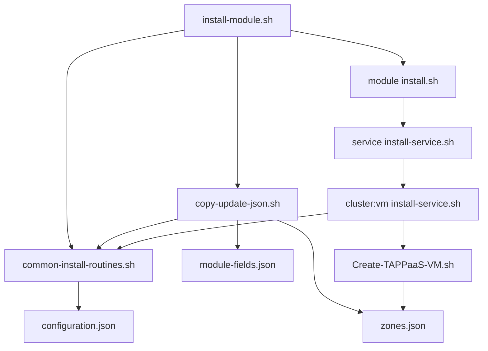
```mermaid
graph TD
    A["install-module.sh"] --> B["common-install-routines.sh"]
    A --> C["copy-update-json.sh"]
    A --> D["module install.sh"]
    C --> B
    C --> E["module-fields.json"]
    C --> F["zones.json"]
    D --> G["service install-service.sh"]
    G --> H["cluster:vm install-service.sh"]
    H --> B
    H --> I["Create-TAPPaaS-VM.sh"]
    I --> F
    B --> J["configuration.json"]
```

### update-module.sh

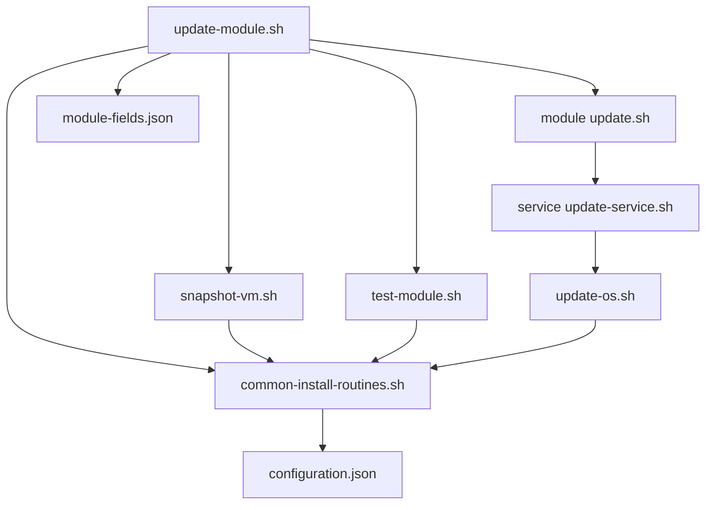
```mermaid
graph TD
    A["update-module.sh"] --> B["common-install-routines.sh"]
    A --> C["snapshot-vm.sh"]
    A --> D["test-module.sh"]
    A --> E["module update.sh"]
    A --> F["module-fields.json"]
    C --> B
    D --> B
    E --> G["service update-service.sh"]
    G --> H["update-os.sh"]
    H --> B
    B --> I["configuration.json"]
```

### delete-module.sh

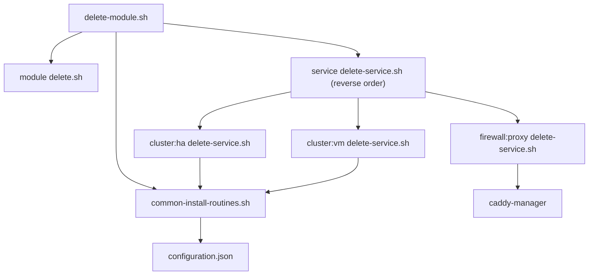
```mermaid
graph TD
    A["delete-module.sh"] --> B["common-install-routines.sh"]
    A --> C["module delete.sh"]
    A --> D["service delete-service.sh (reverse order)"]
    D --> E["firewall:proxy delete-service.sh"]
    E --> F["caddy-manager"]
    D --> G["cluster:ha delete-service.sh"]
    G --> B
    D --> H["cluster:vm delete-service.sh"]
    H --> B
    B --> I["configuration.json"]
```

### test-module.sh

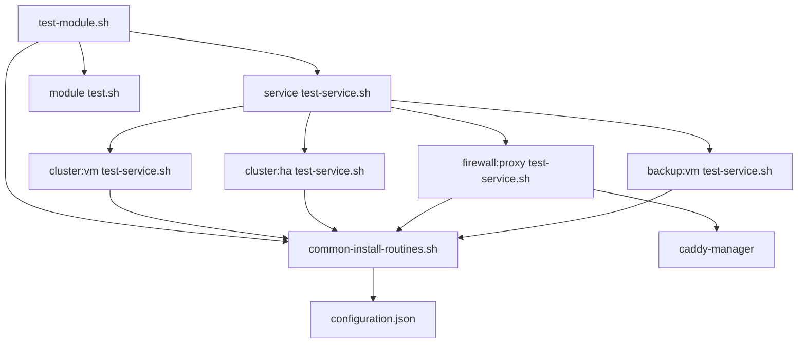
```mermaid
graph TD
    A["test-module.sh"] --> B["common-install-routines.sh"]
    A --> C["service test-service.sh"]
    A --> D["module test.sh"]
    C --> E["cluster:vm test-service.sh"]
    C --> F["cluster:ha test-service.sh"]
    C --> G["firewall:proxy test-service.sh"]
    C --> H["backup:vm test-service.sh"]
    E --> B
    F --> B
    G --> B
    G --> I["caddy-manager"]
    H --> B
    B --> J["configuration.json"]
```

### update-tappaas (cron)

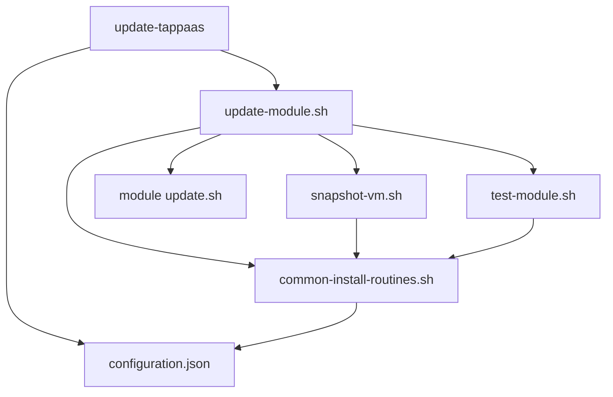
```mermaid
graph TD
    A["update-tappaas"] --> B["configuration.json"]
    A --> C["update-module.sh"]
    C --> D["common-install-routines.sh"]
    C --> E["snapshot-vm.sh"]
    C --> F["test-module.sh"]
    C --> G["module update.sh"]
    D --> B
    E --> D
    F --> D
```

### install2.sh (bootstrap)

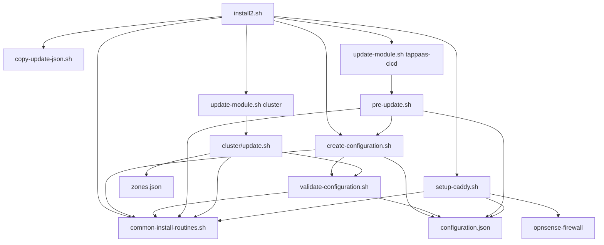
```mermaid
graph TD
    A["install2.sh"] --> B["create-configuration.sh"]
    A --> C["copy-update-json.sh"]
    A --> D["update-module.sh tappaas-cicd"]
    A --> E["update-module.sh cluster"]
    A --> F["setup-caddy.sh"]
    A --> G["common-install-routines.sh"]
    B --> G
    B --> H["validate-configuration.sh"]
    B --> I["configuration.json"]
    H --> G
    H --> I
    D --> J["pre-update.sh"]
    J --> G
    J --> B
    J --> I
    E --> K["cluster/update.sh"]
    K --> G
    K --> H
    K --> L["zones.json"]
    F --> G
    F --> I
    F --> M["opnsense-firewall"]
```

### migrate-node.sh

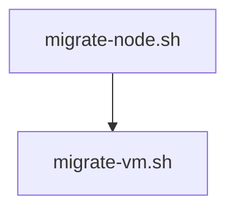
```mermaid
graph TD
    A["migrate-node.sh"] --> B["migrate-vm.sh"]
```

### inspect-cluster.sh

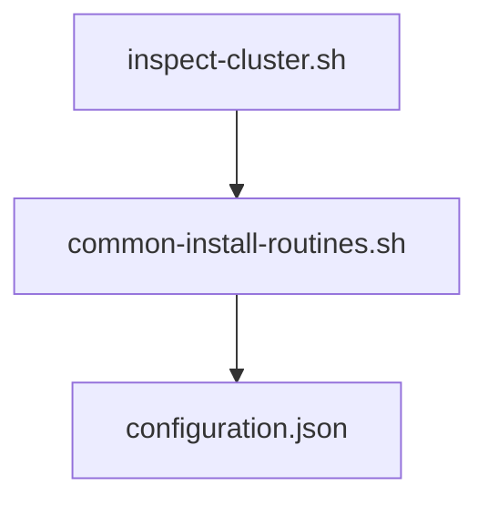
```mermaid
graph TD
    A["inspect-cluster.sh"] --> B["common-install-routines.sh"]
    B --> C["configuration.json"]
```

### backup-manage.sh

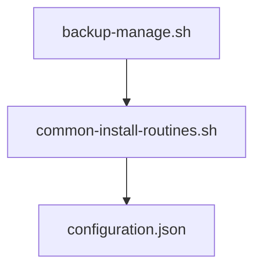
```mermaid
graph TD
    A["backup-manage.sh"] --> B["common-install-routines.sh"]
    B --> C["configuration.json"]
```

### restore.sh

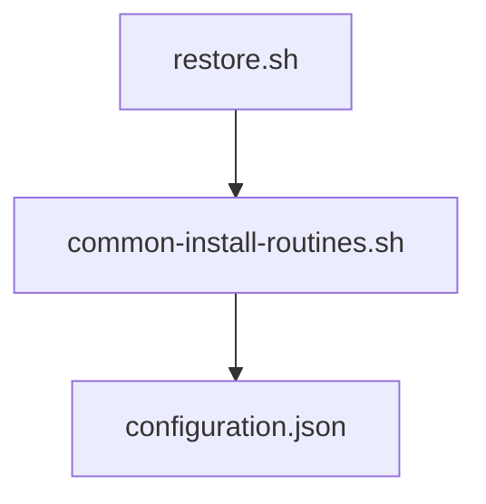
```mermaid
graph TD
    A["restore.sh"] --> B["common-install-routines.sh"]
    B --> C["configuration.json"]
```

### check-disk-threshold.sh

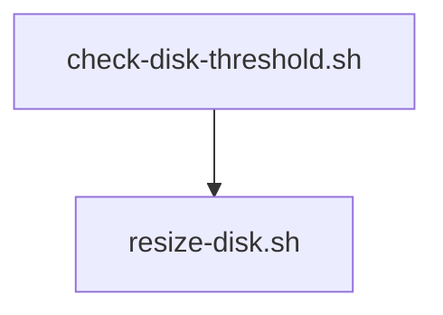
```mermaid
graph TD
    A["check-disk-threshold.sh"] --> B["resize-disk.sh"]
```

### firewall update flow

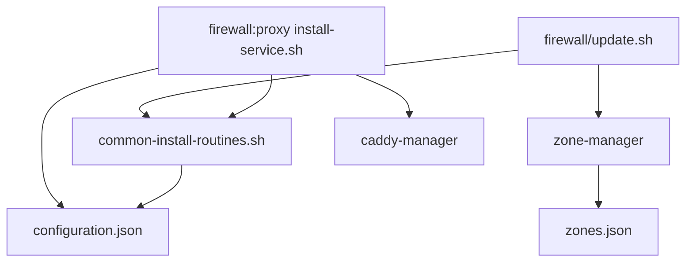
```mermaid
graph TD
    A["firewall/update.sh"] --> B["common-install-routines.sh"]
    A --> C["zone-manager"]
    C --> D["zones.json"]
    E["firewall:proxy install-service.sh"] --> B
    E --> F["caddy-manager"]
    E --> G["configuration.json"]
    B --> G
```

### inspect-vm.sh

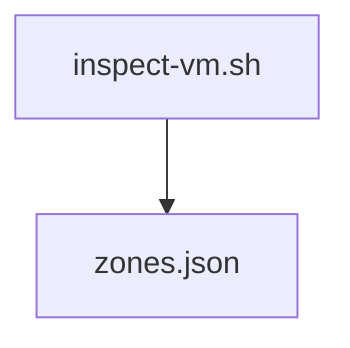
```mermaid
graph TD
    A["inspect-vm.sh"] --> B["zones.json"]
```
