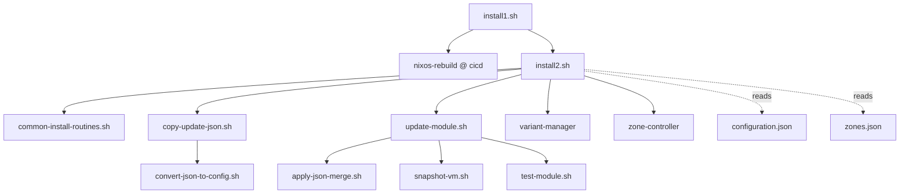
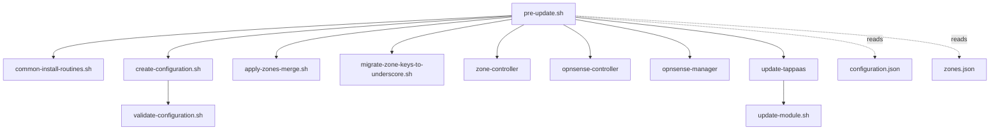
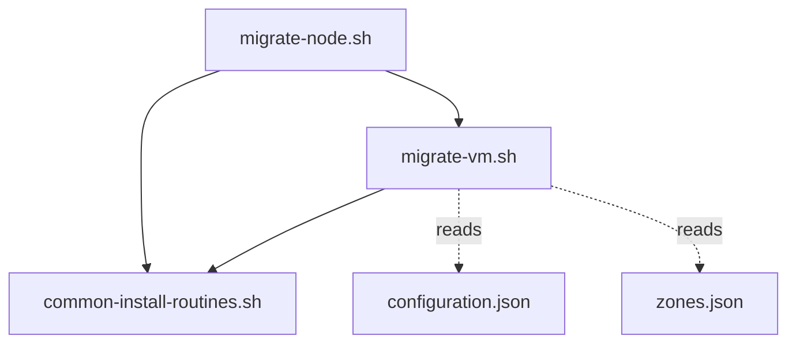
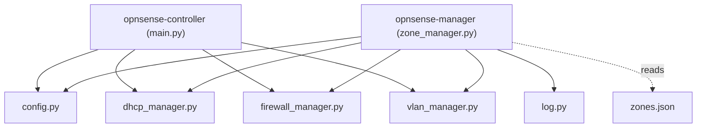
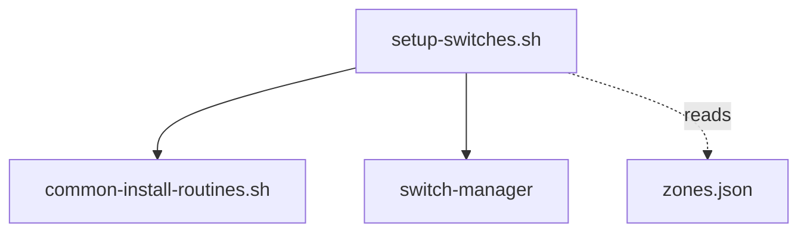
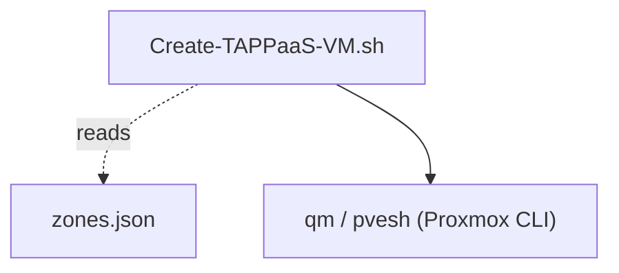

# TAPPaaS Foundation Layer - Dependency Documentation

This document describes the program dependencies within the `src/foundation/` directory of TAPPaaS. It is regenerated from the on-disk layout after the ADR-007 S0 reorg that split the `tappaas-cicd` control plane into `manager/`, `controller/`, and `lib/`.

Companion data files:
- `PROGRAMS.csv` — every installed program, where it lands, and its repo source.
- `DEPENDENCIES.csv` — per-file direct dependencies (sourced scripts, invoked programs, config reads).

Generated: 2026-06-22.

## Directory summary

| Directory | `.sh` / `.py` files |
|-----------|---------------------:|
| `tappaas-cicd/` (control plane, total) | 155 |
| &nbsp;&nbsp;`tappaas-cicd/lib/` | 3 |
| &nbsp;&nbsp;`tappaas-cicd/manager/` | 55 |
| &nbsp;&nbsp;`tappaas-cicd/controller/` | 58 |
| &nbsp;&nbsp;`tappaas-cicd/scripts/` | 13 |
| &nbsp;&nbsp;`tappaas-cicd/update-tappaas/` | 2 |
| `firewall/` | 37 |
| `cluster/` | 32 |
| `backup/` | 18 |
| `templates/` | 13 |
| `identity/` | 11 |
| `logging/` | 3 |

The `tappaas-cicd/manager/*` and `controller/*` sub-trees are organized one folder per
domain (people, site, environment, module, network, health; proxmox, switch, ap, opnsense),
each carrying `install.sh` / `update.sh` / `test.sh` plus its domain programs.

## Key dependency chains

### 1. Foundation install flow
```
install1.sh -> nixos-rebuild (cicd) -> install2.sh
  -> common-install-routines.sh
  -> copy-update-json.sh -> convert-json-to-config.sh
  -> update-module.sh (tappaas-cicd, cluster, firewall, ...)
  -> variant-manager, zone-controller
  -> scripts/setup-caddy.sh -> opnsense-firewall
  -> scripts/rest-of-foundation.sh / acme-setup.sh
(reads configuration.json + zones.json)
```

### 2. Nightly / on-demand update flow
```
pre-update.sh
  -> create-configuration.sh -> validate-configuration.sh
  -> migrate-zone-keys-to-underscore.sh -> apply-zones-merge.sh
  -> zone-controller -> opnsense-controller / opnsense-manager
  -> update-tappaas -> update-module.sh (per module)
       update-module.sh -> apply-json-merge.sh; snapshot-vm.sh; test-module.sh
```

### 3. Zone / network reconciliation flow
```
zone-controller.sh -> common-install-routines.sh (+ zones.json, configuration.json)
zone-reconcile -> zones.json
apply-zones-merge.sh -> common-install-routines.sh (+ zones.json)
opnsense-manager (= zone_manager.py)
  -> config.py; dhcp_manager.py; firewall_manager.py; vlan_manager.py; log.py (+ zones.json)
firewall/update.sh -> zone-manager (+ zones.json)
```

### 4. Module lifecycle flow
```
install-module.sh
  -> common-install-routines.sh
  -> copy-update-json.sh -> convert-json-to-config.sh
  -> delete-module.sh (on rollback)
  -> <module>/install.sh -> services/*/install-service.sh -> common-install-routines.sh
update-module.sh -> apply-json-merge.sh; snapshot-vm.sh; test-module.sh
test-module.sh / delete-module.sh -> common-install-routines.sh
```

### 5. Identity / people flow
```
identity/install.sh -> identity/update.sh
  -> common-install-routines.sh; ensure-authentik-creds.sh; roles-ensure.sh (+ configuration.json)
user.sh -> common-install-routines.sh; roles-ensure.sh (+ configuration.json)
variant-manager.sh -> roles-ensure.sh (+ configuration.json, zones.json)
authentik-manager (= authentik_cli.py) -> authentik_manager.py
```

## Most connected files

Ranked by how many other foundation files source or invoke them.

| File | Role | Depended on by (count) |
|------|------|-----------------------:|
| `common-install-routines.sh` (`lib/`) | shared bash routines, sourced almost everywhere | ~90+ |
| `configuration.json` | site config, read across managers/services | ~25 |
| `zones.json` | network zone source of truth | ~25 |
| `convert-json-to-config.sh` | JSON→shell config emitter | 4 |
| `install-module.sh` | module installer, called by test harnesses | 7 |
| `delete-module.sh` | module remover, called by installers/tests | 7 |
| `roles-ensure.sh` | identity role reconciler | 5 |
| `config.py` (opnsense pkg) | shared OPNsense API config, imported by all CLIs | 11 |
| `firewall_manager.py` | OPNsense rule primitive, imported by zone/rules CLIs | 4 |

## Top-level entry points

Programs that nothing else in the tree depends on — operator/automation entry points:

- `install1.sh` (bootstrap)
- `pre-update.sh` (nightly update orchestrator)
- `inspect-cluster.sh`, `inspect-vm.sh`, `check-disk-threshold.sh` (health)
- `migrate-node.sh` (Proxmox node evacuation)
- `setup-switches.sh`, `setup-wlan-secrets.sh` (network controllers)
- `opnsense-controller`, `proxmox-manager`, `switch-manager`, `ap-manager` (top CLIs)
- `Create-TAPPaaS-VM.sh` (node-local VM creator)
- the various `test.sh` regression harnesses

### install1.sh

```mermaid
graph TD
    I1["install1.sh"] --> RB["nixos-rebuild #64; cicd"]
    I1 --> I2["install2.sh"]
    I2 --> CIR["common-install-routines.sh"]
    I2 --> CUJ["copy-update-json.sh"]
    I2 --> UM["update-module.sh"]
    I2 --> VM["variant-manager"]
    I2 --> ZC["zone-controller"]
    CUJ --> CJC["convert-json-to-config.sh"]
    UM --> AJM["apply-json-merge.sh"]
    UM --> SV["snapshot-vm.sh"]
    UM --> TM["test-module.sh"]
    I2 -.reads.-> CFG["configuration.json"]
    I2 -.reads.-> ZN["zones.json"]
```

### pre-update.sh

```mermaid
graph TD
    PU["pre-update.sh"] --> CIR["common-install-routines.sh"]
    PU --> CC["create-configuration.sh"]
    PU --> AZM["apply-zones-merge.sh"]
    PU --> MZK["migrate-zone-keys-to-underscore.sh"]
    PU --> ZC["zone-controller"]
    PU --> OC["opnsense-controller"]
    PU --> OM["opnsense-manager"]
    PU --> UT["update-tappaas"]
    CC --> VC["validate-configuration.sh"]
    UT --> UM["update-module.sh"]
    PU -.reads.-> CFG["configuration.json"]
    PU -.reads.-> ZN["zones.json"]
```

### migrate-node.sh

```mermaid
graph TD
    MN["migrate-node.sh"] --> CIR["common-install-routines.sh"]
    MN --> MV["migrate-vm.sh"]
    MV --> CIR
    MV -.reads.-> CFG["configuration.json"]
    MV -.reads.-> ZN["zones.json"]
```

### opnsense-controller (Python CLI)

```mermaid
graph TD
    OC["opnsense-controller (main.py)"] --> CONF["config.py"]
    OC --> DHCP["dhcp_manager.py"]
    OC --> FW["firewall_manager.py"]
    OC --> VLAN["vlan_manager.py"]
    OM["opnsense-manager (zone_manager.py)"] --> CONF
    OM --> DHCP
    OM --> FW
    OM --> VLAN
    OM --> LOG["log.py"]
    OM -.reads.-> ZN["zones.json"]
```

### setup-switches.sh

```mermaid
graph TD
    SS["setup-switches.sh"] --> CIR["common-install-routines.sh"]
    SS --> SM["switch-manager"]
    SS -.reads.-> ZN["zones.json"]
```

### Create-TAPPaaS-VM.sh (node-local)

```mermaid
graph TD
    CV["Create-TAPPaaS-VM.sh"] -.reads.-> ZN["zones.json"]
    CV --> QM["qm / pvesh (Proxmox CLI)"]
```
