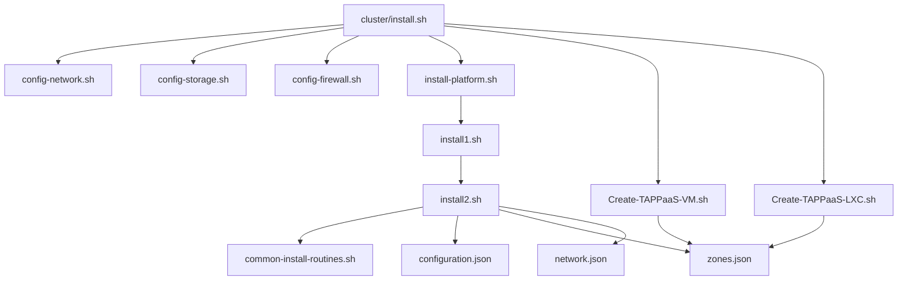
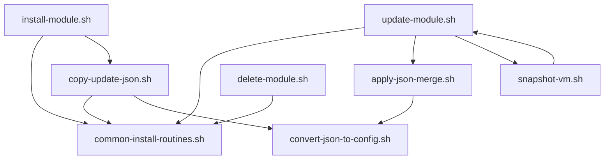
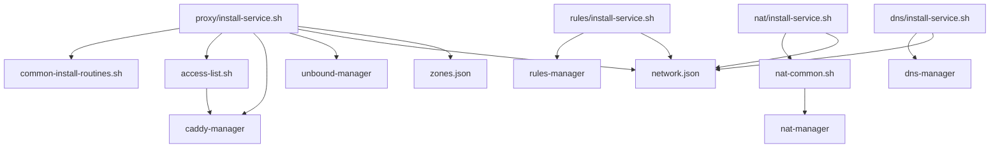
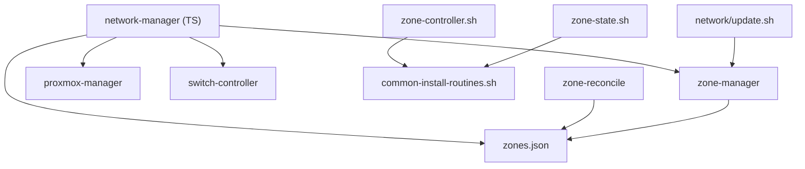
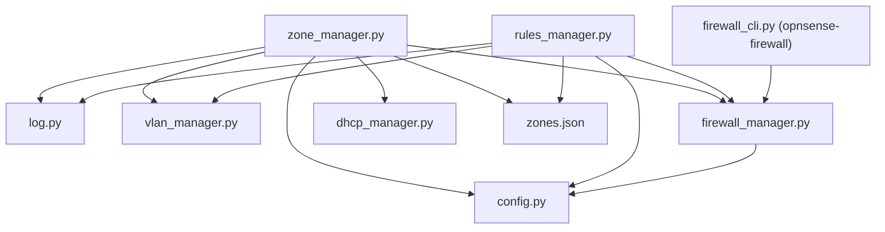

# TAPPaaS Foundation Layer - Dependency Documentation

Generated: 2026-06-23

This document summarizes the direct dependencies between the scripts, Python
packages and configuration files under `src/foundation/`. The canonical machine
-readable data lives in [`DEPENDENCIES.csv`](DEPENDENCIES.csv); the installed
program surface (what lands on `/home/tappaas/bin` on the `tappaas-cicd`
mothership) lives in [`PROGRAMS.csv`](PROGRAMS.csv).

A "direct dependency" is one of:

- a script **sourced** via `.` / `source`,
- another TAPPaaS **program/script invoked** by name (e.g. `install-module.sh`,
  `caddy-manager`, `zone-controller`),
- a **config file read**: `configuration.json`, `zones.json`, `network.json`
  (the renamed firewall config; scripts read it with a `firewall.json`
  fallback), or a module's own `<name>.json`.

> Note: the former `firewall` module is now the **`network`** module. It lives at
> `src/foundation/network/`, its config is `network.json`, and its sub-services
> are `network:proxy|rules|nat|dns|discovery`. The rules-plane Python entry point
> `opnsense-firewall` (source `firewall_cli.py` / `firewall_manager.py`) keeps
> its name intentionally.

## Summary: directories and file counts

| Directory | Files analyzed |
|-----------|---------------:|
| `tappaas-cicd/` (top level) | 5 |
| `tappaas-cicd/lib/` | 4 |
| `tappaas-cicd/scripts/` (+ `scripts/test/`) | 13 |
| `tappaas-cicd/manager/` (+ `install/test/update`) | 3 |
| `tappaas-cicd/manager/people-manager/` | 5 |
| `tappaas-cicd/manager/site-manager/` | 11 |
| `tappaas-cicd/manager/environment-manager/` | 5 |
| `tappaas-cicd/manager/module-manager/` | 13 |
| `tappaas-cicd/manager/network-manager/` | 6 |
| `tappaas-cicd/manager/health-manager/` | 8 |
| `tappaas-cicd/manager/backup-manager/` | 9 |
| `tappaas-cicd/manager/TEMPLATE/` | 5 |
| `tappaas-cicd/controller/` (+ `install/test/update`) | 3 |
| `tappaas-cicd/controller/proxmox-controller/` | 7 |
| `tappaas-cicd/controller/switch-controller/` | 6 |
| `tappaas-cicd/controller/ap-controller/` | 6 |
| `tappaas-cicd/controller/identity-controller/` (+ py pkg + tests) | 3 sh + 4 py + 3 test |
| `tappaas-cicd/controller/backup-controller/` | 3 |
| `tappaas-cicd/controller/opnsense-controller/` (py pkg + tests) | 22 py + 7 test |
| `tappaas-cicd/controller/TEMPLATE/` | 4 |
| `tappaas-cicd/update-tappaas/` (py pkg) | 2 |
| `tappaas-cicd/opnsense-patch/` | 1 |
| `tappaas-cicd/test-variants/` | 5 |
| `tappaas-cicd/test-vm-creation/` (+ `rollback-fixture/`) | 10 |
| `tappaas-cicd/test-repository/` | 1 |
| `network/` (top level) | 7 |
| `network/scripts/` (+ `plugins/`) | 3 |
| `network/services/proxy/` | 5 |
| `network/services/rules/` | 4 |
| `network/services/nat/` | 5 |
| `network/services/dns/` | 4 |
| `network/services/discovery/` | 4 |
| `network/test-fixtures/` | 6 |
| `cluster/` (+ `lib/`, `services/*`) | 27 |
| `backup/` (+ `lib/`, `services/*`) | 22 |
| `identity/` (+ `lib/`, `services/*`) | 10 |
| `logging/` | 3 |
| `templates/` (+ `services/*`, `winserver/`) | 11 |
| `Deprecated/` | 2 |
| **Total file rows** | **287** |
| **Installed programs (PROGRAMS.csv)** | **70** |

## Key dependency chains (5 main flows)

### 1. Foundation bootstrap (cluster install)

```
cluster/install.sh
  -> config-network.sh / config-storage.sh / config-firewall.sh
  -> install-platform.sh -> install1.sh -> install2.sh
       -> common-install-routines.sh
       -> configuration.json / zones.json / network.json
  -> Create-TAPPaaS-VM.sh / Create-TAPPaaS-LXC.sh  (read zones.json)
```

### 2. Module lifecycle (install / update / delete)

```
install-module.sh
  -> common-install-routines.sh
  -> copy-update-json.sh -> convert-json-to-config.sh
update-module.sh
  -> apply-json-merge.sh -> convert-json-to-config.sh
  -> snapshot-vm.sh -> update-module.sh   (snapshot wraps update)
delete-module.sh -> common-install-routines.sh
```

### 3. Network service planes (proxy / rules / nat / dns / discovery)

```
network/services/proxy/install-service.sh
  -> common-install-routines.sh
  -> access-list.sh -> caddy-manager (+ zones.json)
  -> caddy-manager / unbound-manager
  -> configuration.json / network.json / zones.json
network/services/rules/*-service.sh   -> rules-manager (+ network.json)
network/services/nat/*-service.sh      -> nat-common.sh -> nat-manager (+ network.json)
network/services/dns/*-service.sh      -> dns-manager (+ network.json)
```

### 4. Zone reconciliation (network orchestrator)

```
network-manager (TS)        owns zones.json, calls plane controllers
zone-controller(.sh) / zone-state.sh / zone-reconcile
  -> common-install-routines.sh
  -> zone-manager (opnsense rules+vlan plane) -> reads zones.json
network/update.sh -> zone-manager (--execute against zones.json)
```

### 5. opnsense-controller Python package (rules plane)

```
zone_manager.py / rules_manager.py
  -> config.py, log.py, vlan_manager.py, firewall_manager.py, dhcp_manager.py
  -> zones.json
firewall_cli.py (opnsense-firewall) -> firewall_manager.py -> config.py
```

## Most-connected files (most depended upon)

| File | Incoming references | Role |
|------|--------------------:|------|
| `common-install-routines.sh` | 136 | shared logging / helpers, sourced by nearly every script |
| `zones.json` | 28 | network zone / VLAN source of truth |
| `network.json` | 24 | firewall VM config (was `firewall.json`) |
| `config.py` | 18 | opnsense-controller shared API client/config |
| `configuration.json` | 16 | site/system configuration |
| `dns-manager` | 15 | DNS record CLI (opnsense-controller) |
| `install-module.sh` | 13 | module install entry point |
| `pbs-job.sh` | 12 | PBS backup job helper (backup module) |
| `delete-module.sh` | 12 | module delete entry point |
| `pbs-namespace.sh` | 8 | PBS namespace helper |
| `vm-net.sh` | 6 | VM network helper (cluster/lib) |
| `caddy-manager` | 6 | reverse-proxy CLI (opnsense-controller) |
| `rules-manager` | 5 | firewall rules CLI (opnsense-controller) |
| `nat-manager` | 5 | NAT/port-forward CLI (opnsense-controller) |
| `firewall_manager.py` | 5 | rules-plane manager module |
| `dhcp_manager.py` | 5 | DHCP manager module |
| `Create-TAPPaaS-VM.sh` | 5 | VM creation (node-local) |

## Top-level entry points (programs nothing else depends on)

These are the user/operator-facing commands and orchestrators — no other file
in the foundation tree depends on them:

- **Foundation install:** `cluster/install.sh`, `cluster/install-platform.sh`,
  `tappaas-cicd/install1.sh`, `tappaas-cicd/pre-update.sh`, `tappaas-cicd/update.sh`
- **Module ops:** `install-module.sh`, `update-module.sh`, `delete-module.sh`,
  `module-format.sh`, `test-module.sh`
- **Network:** `network/update.sh`, `network/test.sh`, `network-manager`,
  `zone-reconcile`, `network/migrate-firewall-to-network.sh`
- **Health/ops:** `inspect-cluster.sh`, `inspect-vm.sh`, `update-os.sh`,
  `check-disk-threshold.sh`, `cluster/reboot-cluster.sh`
- **Backup:** `backup-manager.sh`, `backup-restore.sh`, `backup-status.sh`
- **Identity/people:** `people-manager`, `identity/install.sh`
- **Update:** `update-tappaas`
- **Top-level controllers:** `opnsense-controller`, `proxmox-controller`,
  `switch-manager`, `ap-controller`

## Mermaid dependency graphs

### Foundation bootstrap


```mermaid
graph TD
    I["cluster/install.sh"] --> CN["config-network.sh"]
    I --> CS["config-storage.sh"]
    I --> CF["config-firewall.sh"]
    I --> IP["install-platform.sh"]
    I --> CV["Create-TAPPaaS-VM.sh"]
    I --> CL["Create-TAPPaaS-LXC.sh"]
    IP --> I1["install1.sh"]
    I1 --> I2["install2.sh"]
    I2 --> CIR["common-install-routines.sh"]
    I2 --> CFG["configuration.json"]
    I2 --> ZJ["zones.json"]
    I2 --> NJ["network.json"]
    CV --> ZJ
    CL --> ZJ
```

### Module lifecycle


```mermaid
graph TD
    IM["install-module.sh"] --> CIR["common-install-routines.sh"]
    IM --> CUJ["copy-update-json.sh"]
    CUJ --> CIR
    CUJ --> CJC["convert-json-to-config.sh"]
    UM["update-module.sh"] --> CIR
    UM --> AJM["apply-json-merge.sh"]
    UM --> SV["snapshot-vm.sh"]
    AJM --> CJC
    SV --> UM
    DM["delete-module.sh"] --> CIR
```

### Network service planes


```mermaid
graph TD
    PI["proxy/install-service.sh"] --> CIR["common-install-routines.sh"]
    PI --> AL["access-list.sh"]
    PI --> CM["caddy-manager"]
    PI --> UB["unbound-manager"]
    PI --> NJ["network.json"]
    PI --> ZJ["zones.json"]
    AL --> CM
    RI["rules/install-service.sh"] --> RM["rules-manager"]
    RI --> NJ
    NI["nat/install-service.sh"] --> NC["nat-common.sh"]
    NC --> NM["nat-manager"]
    NI --> NJ
    DI["dns/install-service.sh"] --> DNS["dns-manager"]
    DI --> NJ
```

### Zone reconciliation


```mermaid
graph TD
    NM["network-manager (TS)"] --> ZJ["zones.json"]
    NM --> ZM["zone-manager"]
    NM --> PM["proxmox-manager"]
    NM --> SC["switch-controller"]
    ZC["zone-controller.sh"] --> CIR["common-install-routines.sh"]
    ZS["zone-state.sh"] --> CIR
    ZR["zone-reconcile"] --> ZJ
    NU["network/update.sh"] --> ZM
    ZM --> ZJ
```

### opnsense-controller (rules plane, Python)


```mermaid
graph TD
    ZM["zone_manager.py"] --> CFG["config.py"]
    ZM --> LOG["log.py"]
    ZM --> VL["vlan_manager.py"]
    ZM --> FW["firewall_manager.py"]
    ZM --> DH["dhcp_manager.py"]
    ZM --> ZJ["zones.json"]
    RM["rules_manager.py"] --> CFG
    RM --> LOG
    RM --> VL
    RM --> FW
    RM --> ZJ
    FCLI["firewall_cli.py (opnsense-firewall)"] --> FW
    FW --> CFG
```
