# TAPPaaS Foundation Layer - Dependency Documentation

This document describes the program dependencies within the `src/foundation/` directory of TAPPaaS.

## Summary

| Directory | Programs | Description |
|-----------|----------|-------------|
| tappaas-cicd/scripts/ | 19 | Core helper scripts |
| tappaas-cicd/opnsense-controller/ | 5 | OPNsense Python CLI tools |
| tappaas-cicd/update-tappaas/ | 1 | Update scheduler |
| tappaas-cicd/test-vm-creation/ | 3 | VM creation test suite |
| tappaas-cicd/test-repository/ | 1 | Repository test suite |
| tappaas-cicd/ | 5 | Main installation scripts |
| cluster/ | 3 | Cluster and VM management |
| cluster/services/ | 8 | Cluster service scripts (vm + ha) |
| firewall/ | 1 | Firewall update |
| firewall/services/ | 7 | Firewall service scripts (firewall + proxy) |
| backup/ | 4 | Backup server scripts |
| backup/services/ | 4 | Backup service scripts (vm) |
| identity/ | 2 | Identity module scripts |
| identity/services/ | 7 | Identity service scripts (identity + accessControl) |
| templates/services/ | 7 | OS template service scripts (nixos + debian) |

### Key Dependency Chains

1. **Install Chain**: `install1.sh` → `install2.sh` → `create-configuration.sh` + `copy-update-json.sh` + `update-module.sh` + `setup-caddy.sh`
2. **Update Chain**: `update-tappaas` → `update-module.sh` → `snapshot-vm.sh` + module `pre-update.sh` + service `update-service.sh` + module `update.sh` + `test-module.sh`
3. **Module Install Chain**: `install-module.sh` → `copy-update-json.sh` + `common-install-routines.sh` → service `install-service.sh` → `Create-TAPPaaS-VM.sh`
4. **Zone Management Chain**: `zone-manager` → OPNsense API → firewall/VLAN/DHCP configuration
5. **Test Chain**: `test.sh` → `test-vm-creation/test.sh` + `test-repository/test.sh` → `install-module.sh` → `test-vm.sh` → `delete-module.sh`

### Most Connected Programs

| Program | Depended On By |
|---------|----------------|
| `common-install-routines.sh` | install-module.sh, update-module.sh, delete-module.sh, test-module.sh, pre-update.sh, update.sh (tappaas-cicd), setup-caddy.sh, update-os.sh, snapshot-vm.sh, test-config.sh, backup scripts, identity/update.sh, cluster/update.sh, firewall/update.sh, most service scripts, test-vm.sh |
| `copy-update-json.sh` | install-module.sh, install2.sh, install.sh (backup) |
| `update-module.sh` | update-tappaas, install2.sh |
| `install-module.sh` | install2.sh (indirect), test-vm-creation/test.sh |
| `delete-module.sh` | test-vm-creation/test.sh |
| `test-module.sh` | update-module.sh |
| `snapshot-vm.sh` | update-module.sh |
| `update-os.sh` | update-service.sh (templates/nixos), update-service.sh (templates/debian) |
| `caddy-manager` | proxy service scripts (install/update/delete/test-service.sh) |
| `resize-disk.sh` | check-disk-threshold.sh |
| `migrate-vm.sh` | migrate-node.sh |

---

## Top-Level Entry Points

These programs are NOT called by other TAPPaaS programs - they are entry points:

| Entry Point | Purpose | Trigger |
|-------------|---------|---------|
| `tappaas-cicd/install1.sh` | Install CICD mothership | Manual (on tappaas-cicd) |
| `tappaas-cicd/test.sh` | Run full test suite | Manual/CI |
| `update-tappaas` | Scheduled module updates | Cron job (hourly) |
| `create-configuration.sh` | Generate system configuration | Manual (initial setup) |
| `check-disk-threshold.sh` | Monitor disk usage | Cron |
| `test-config.sh` | Validate module JSON configs | Manual |
| `opnsense-controller` | Direct OPNsense management | Manual |
| `backup-manage.sh` | Backup operations | Manual |
| `restore.sh` | Restore from backup | Manual |
| `inspect-cluster.sh` | Show cluster status overview | Manual |
| `inspect-vm.sh` | Show detailed VM status | Manual |
| `migrate-node.sh` | Migrate all VMs off a node | Manual |
| `repository.sh` | Sync repository modules | Manual |

---

## Dependency Graphs

### 1. CICD Installation Flow: `install1.sh` then `install2.sh`

Two-phase installation with reboot in between.

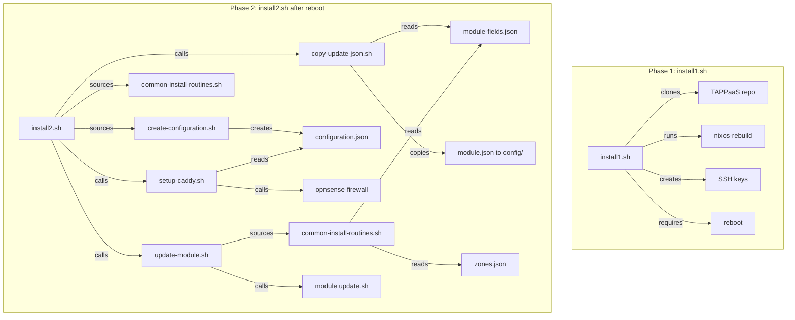
```mermaid
graph TD
    subgraph "Phase 1: install1.sh"
        A[install1.sh] -->|clones| B[TAPPaaS repo]
        A -->|runs| C[nixos-rebuild]
        A -->|creates| D[SSH keys]
        A -->|requires| E[reboot]
    end

    subgraph "Phase 2: install2.sh after reboot"
        F[install2.sh] -->|sources| G[create-configuration.sh]
        F -->|sources| CIR1[common-install-routines.sh]
        F -->|calls| N[copy-update-json.sh]
        F -->|calls| H[setup-caddy.sh]
        F -->|calls| I[update-module.sh]

        G -->|creates| J[configuration.json]

        N -->|reads| P[module-fields.json]
        N -->|copies| R["module.json to config/"]

        H -->|reads| J
        H -->|calls| K[opnsense-firewall]

        I -->|sources| L[common-install-routines.sh]
        I -->|calls| M["module update.sh"]

        L -->|reads| P
        L -->|reads| Q[zones.json]
    end
```

### 2. Update Flow: `update-tappaas`

Automated scheduled updates for all TAPPaaS modules.

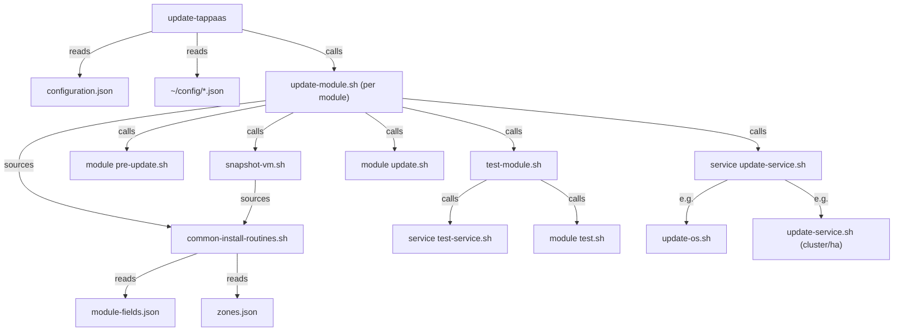
```mermaid
graph TD
    A[update-tappaas] -->|reads| B[configuration.json]
    A -->|reads| BC["~/config/*.json"]
    A -->|calls| D["update-module.sh (per module)"]

    D -->|calls| SN[snapshot-vm.sh]
    D -->|sources| E[common-install-routines.sh]
    D -->|calls| F["module pre-update.sh"]
    D -->|calls| H["service update-service.sh"]
    D -->|calls| G["module update.sh"]
    D -->|calls| TM[test-module.sh]

    TM -->|calls| TS["service test-service.sh"]
    TM -->|calls| MT["module test.sh"]

    SN -->|sources| E

    H -->|e.g.| I[update-os.sh]
    H -->|e.g.| J["update-service.sh (cluster/ha)"]

    E -->|reads| K[module-fields.json]
    E -->|reads| L[zones.json]
```

### 3. Module Installation Flow: `install-module.sh`

Used by `install2.sh` and test scripts to install modules.

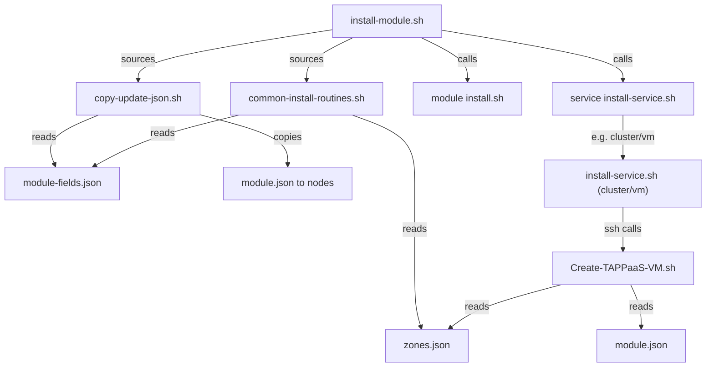
```mermaid
graph TD
    A[install-module.sh] -->|sources| B[copy-update-json.sh]
    A -->|sources| C[common-install-routines.sh]
    A -->|calls| D["module install.sh"]
    A -->|calls| E["service install-service.sh"]

    B -->|reads| F[module-fields.json]
    B -->|copies| G["module.json to nodes"]

    C -->|reads| F
    C -->|reads| H[zones.json]

    E -->|e.g. cluster/vm| I["install-service.sh (cluster/vm)"]
    I -->|ssh calls| J[Create-TAPPaaS-VM.sh]

    J -->|reads| K["module.json"]
    J -->|reads| H
```

### 4. Module Deletion Flow: `delete-module.sh`

Removes a module and its services.

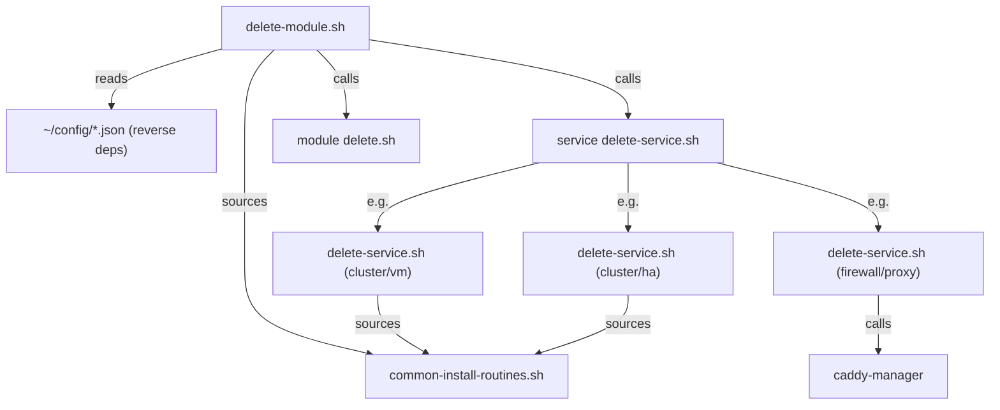
```mermaid
graph TD
    A[delete-module.sh] -->|sources| B[common-install-routines.sh]
    A -->|reads| C["~/config/*.json (reverse deps)"]
    A -->|calls| D["service delete-service.sh"]
    A -->|calls| E["module delete.sh"]

    D -->|e.g.| F["delete-service.sh (cluster/vm)"]
    D -->|e.g.| G["delete-service.sh (cluster/ha)"]
    D -->|e.g.| H["delete-service.sh (firewall/proxy)"]

    H -->|calls| CM[caddy-manager]

    F -->|sources| B
    G -->|sources| B
```

### 5. Test Suite Flow: `tappaas-cicd/test.sh`

VM creation, repository, and validation tests.

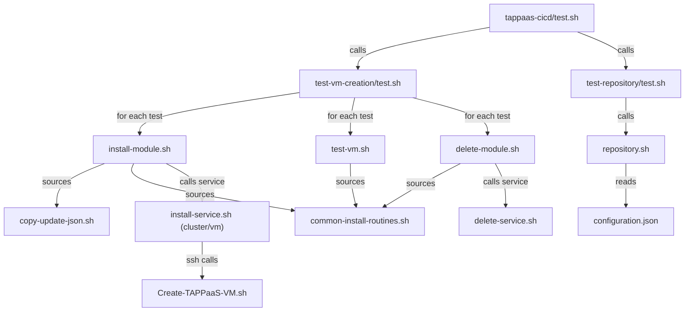
```mermaid
graph TD
    A["tappaas-cicd/test.sh"] -->|calls| B["test-vm-creation/test.sh"]
    A -->|calls| BR["test-repository/test.sh"]

    B -->|for each test| C[install-module.sh]
    B -->|for each test| D[test-vm.sh]
    B -->|for each test| DM[delete-module.sh]

    BR -->|calls| REP[repository.sh]
    REP -->|reads| CONF[configuration.json]

    C -->|sources| E[copy-update-json.sh]
    C -->|sources| F[common-install-routines.sh]
    C -->|calls service| G["install-service.sh (cluster/vm)"]
    G -->|ssh calls| H[Create-TAPPaaS-VM.sh]

    D -->|sources| F

    DM -->|sources| F
    DM -->|calls service| DS["delete-service.sh"]
```

### 6. OPNsense Controller: `opnsense-controller`

Direct management of OPNsense firewall.

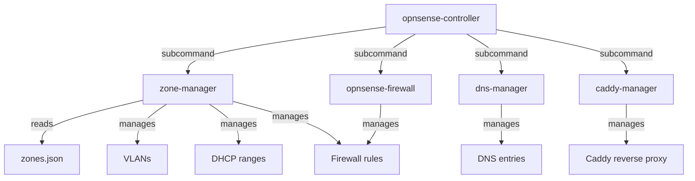
```mermaid
graph TD
    A[opnsense-controller] -->|subcommand| B[zone-manager]
    A -->|subcommand| C[dns-manager]
    A -->|subcommand| D[opnsense-firewall]
    A -->|subcommand| CM[caddy-manager]

    B -->|reads| E[zones.json]
    B -->|manages| F[VLANs]
    B -->|manages| G[DHCP ranges]
    B -->|manages| H[Firewall rules]

    C -->|manages| I[DNS entries]

    D -->|manages| H

    CM -->|manages| CD[Caddy reverse proxy]
```

### 7. Disk Management Flow: `check-disk-threshold.sh`

Automated disk monitoring and resizing.

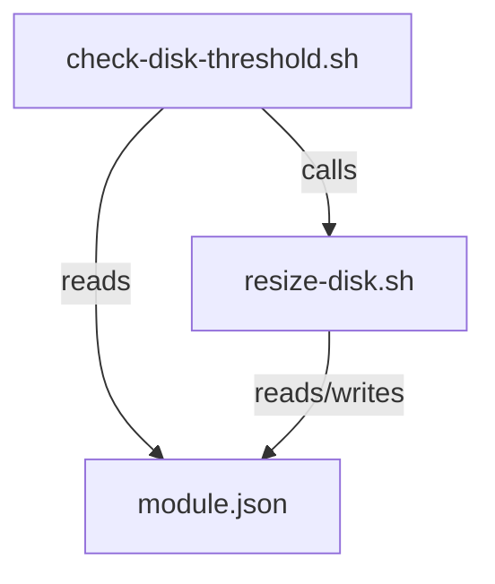
```mermaid
graph TD
    A[check-disk-threshold.sh] -->|reads| B["module.json"]
    A -->|calls| C[resize-disk.sh]

    C -->|reads/writes| B
```

### 8. Configuration Generation: `create-configuration.sh`

Creates the main configuration file from cluster state.

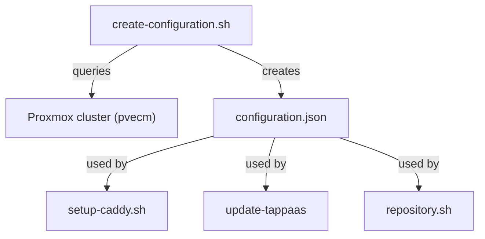
```mermaid
graph TD
    A[create-configuration.sh] -->|queries| B["Proxmox cluster (pvecm)"]
    A -->|creates| C[configuration.json]

    C -->|used by| D[setup-caddy.sh]
    C -->|used by| E[update-tappaas]
    C -->|used by| F[repository.sh]
```

### 9. Backup Flow: `backup-manage.sh` and `restore.sh`

Backup and restore operations.

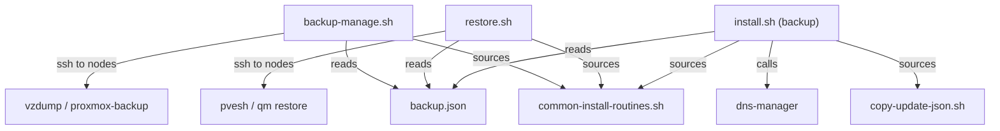
```mermaid
graph TD
    A[backup-manage.sh] -->|sources| B[common-install-routines.sh]
    A -->|reads| C[backup.json]
    A -->|"ssh to nodes"| D[vzdump / proxmox-backup]

    E[restore.sh] -->|sources| B
    E -->|reads| C
    E -->|"ssh to nodes"| F[pvesh / qm restore]

    G["install.sh (backup)"] -->|sources| H[copy-update-json.sh]
    G -->|sources| B
    G -->|calls| X[dns-manager]
    G -->|reads| C
```

### 10. Migration Flow: `migrate-node.sh`

Migrate all VMs off a Proxmox node.

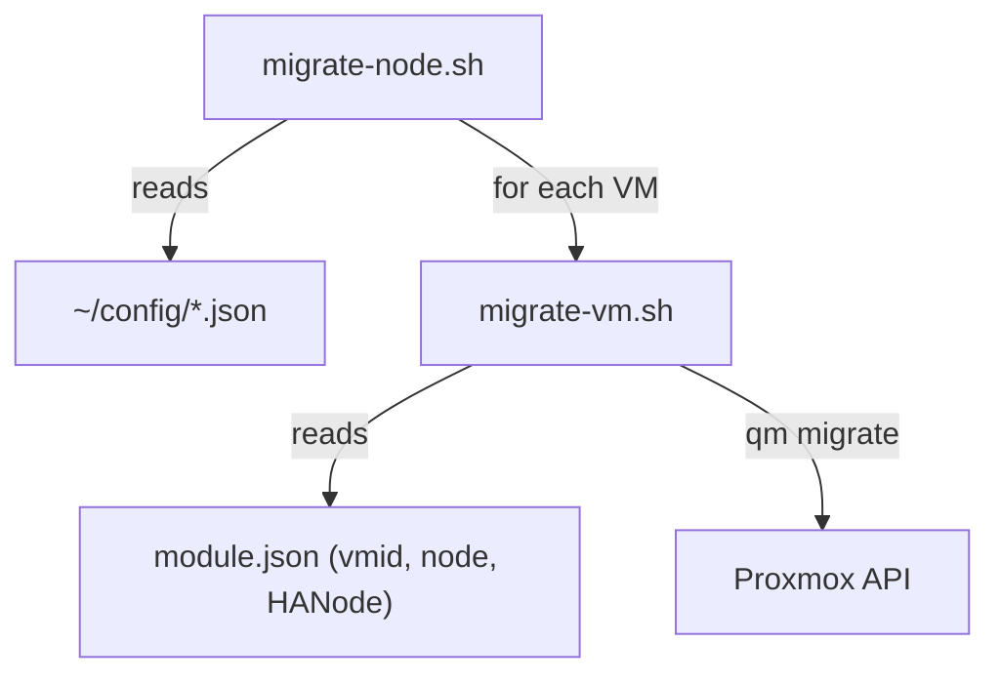
```mermaid
graph TD
    A[migrate-node.sh] -->|reads| B["~/config/*.json"]
    A -->|"for each VM"| C[migrate-vm.sh]

    C -->|reads| D["module.json (vmid, node, HANode)"]
    C -->|"qm migrate"| E["Proxmox API"]
```

### 11. Proxy Service Flow: `firewall/services/proxy/`

Caddy reverse proxy management per module.

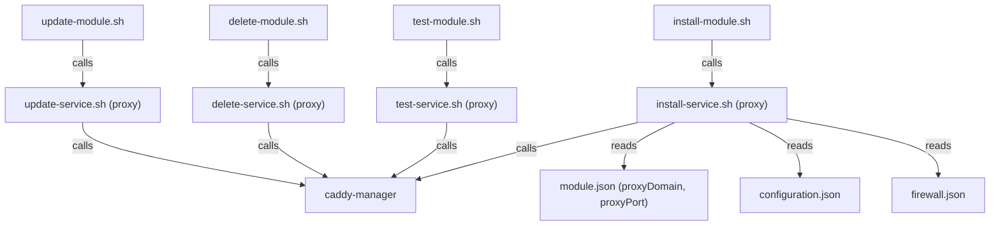
```mermaid
graph TD
    IM[install-module.sh] -->|calls| A["install-service.sh (proxy)"]
    UM[update-module.sh] -->|calls| B["update-service.sh (proxy)"]
    DM[delete-module.sh] -->|calls| C["delete-service.sh (proxy)"]
    TMS[test-module.sh] -->|calls| D["test-service.sh (proxy)"]

    A -->|calls| CM[caddy-manager]
    B -->|calls| CM
    C -->|calls| CM
    D -->|calls| CM

    A -->|reads| MJ["module.json (proxyDomain, proxyPort)"]
    A -->|reads| CJ[configuration.json]
    A -->|reads| FJ[firewall.json]
```

---

## Configuration File Dependencies

| Config File | Created By | Used By |
|-------------|------------|---------|
| `configuration.json` | create-configuration.sh | update-tappaas; setup-caddy.sh; repository.sh; proxy service scripts; test.sh (tappaas-cicd) |
| `zones.json` | Manual/git | zone-manager; Create-TAPPaaS-VM.sh; common-install-routines.sh; cluster/update.sh; firewall/update.sh; inspect-vm.sh |
| `module-fields.json` | Manual/git | common-install-routines.sh; copy-update-json.sh; test-config.sh; update-module.sh; pre-update.sh; test.sh (tappaas-cicd) |
| `<module>.json` | Per module (git) | install-module.sh; update-module.sh; delete-module.sh; test-module.sh; Create-TAPPaaS-VM.sh; most service scripts; inspect-*.sh; migrate-*.sh; snapshot-vm.sh; check-disk-threshold.sh; resize-disk.sh |

---

## Install Locations

| Location | Programs |
|----------|----------|
| `/home/tappaas/bin/` | All CLI tools (6 Python) and helper scripts (19 shell, symlinks from tappaas-cicd/) |
| `/root/tappaas/` (Proxmox nodes) | Create-TAPPaaS-VM.sh, zones.json |
| `src/foundation/*/` | Module install.sh, update.sh, and service scripts |
