# TAPPaaS Foundation Layer - Dependency Documentation

This document describes the program dependencies within the `src/foundation/` directory of TAPPaaS.
Generated from `PROGRAMS.csv` and `DEPENDENCIES.csv`.

Generated: 2026-06-16

> Scope: live foundation modules only. The archived `Attic/` tree is excluded.
> "configuration.json" refers to the runtime config at `/home/tappaas/config/configuration.json`
> (generated from `configuration-fields.json` + each module's JSON via `convert-json-to-config.sh`);
> "zones.json" is the network zone/VLAN source of truth.

## Directory Summary

| Directory | Shell Scripts | Python Files | Notes |
|-----------|--------------:|-------------:|-------|
| tappaas-cicd/scripts/ | 32 | - | Core programs symlinked into /home/tappaas/bin/ |
| tappaas-cicd/scripts/test/ | 10 | - | Unit tests for the core scripts |
| tappaas-cicd/ (root) | 5 | - | install1, install2, pre-update, update, test |
| tappaas-cicd/opnsense-controller/ | - | 22 | 13 CLI entry points + manager/lib modules |
| tappaas-cicd/update-tappaas/ | - | 2 | update-tappaas cron scheduler |
| tappaas-cicd/test-vm-creation/ | 10 | - | incl. rollback-fixture/ |
| tappaas-cicd/test-repository/ | 1 | - | |
| tappaas-cicd/test-variants/ | 6 | - | ADR-005 variant tests |
| firewall/ (root) | 6 | - | lifecycle + network/proxy tests |
| firewall/scripts/ | 14 | - | ADR-008 providers + plugins + tests |
| firewall/services/ | 22 | - | proxy, dns, nat, rules, discovery |
| cluster/ (root + lib) | 17 | - | node/VM/LXC creation + ops |
| cluster/services/ | 12 | - | vm, ha, lxc |
| backup/ (root + lib) | 8 | - | PBS jobs + namespaces |
| backup/services/ | 10 | - | vm, remote, external |
| identity/ (root + lib) | 4 | - | Authentik IdP / SSO |
| identity/services/ | 7 | - | identity, accessControl |
| logging/ | 3 | - | |
| templates/ (root + services) | 11 | - | nixos, debian, windows |

## Most Connected Files

Files with the most dependents (other files that source or call them):

| File | Depended On By (approx) | Purpose |
|------|------------------------|---------|
| common-install-routines.sh | 90+ scripts | Shared library: logging, colors, config access, node helpers, JSON validation |
| configuration.json | 40+ scripts | Central runtime config: domain, nodes, repos, schedule, installed modules |
| zones.json | 12+ programs | Network zone/VLAN definitions (canonical source of truth) |
| update-module.sh | update-tappaas, cluster/*, templates, rest-of-foundation.sh, ha/vm services | Orchestrates the module update lifecycle |
| Create-TAPPaaS-VM.sh | cluster install/update/test, cluster:vm install-service, templates/update.sh | Creates VMs on Proxmox nodes |
| Create-TAPPaaS-LXC.sh | cluster install/update/test, cluster:lxc install-service | Creates LXC containers on Proxmox nodes |
| caddy-manager | setup-caddy.sh, firewall:proxy install/update/delete, firewall/test.sh | Manages Caddy reverse proxy on OPNsense |
| copy-update-json.sh | install-module.sh, install2.sh, backup/install.sh, test-variant.sh | Converts + deploys module JSON to runtime config |
| convert-json-to-config.sh | copy-update-json.sh, apply-json-merge.sh | Flattens module-fields.json schema + module JSON into config |
| test-module.sh | update-module.sh, test-variant-install.sh | Runs module + service tests |
| snapshot-vm.sh | update-module.sh | Creates/restores/manages VM snapshots |
| zone-manager | firewall/update.sh, pre-update.sh, migrate-zone-keys-*, firewall/test.sh | Reconciles OPNsense zones/VLANs/DHCP/firewall from zones.json |
| dns-manager | acme-setup (via unbound), firewall:dns, migrate-zone-keys, test-variant-dns | Manages Unbound DNS host overrides |
| update-os.sh | cluster:vm, templates:nixos/debian, identity:identity install-service | Updates VM operating system in-guest |
| pbs-job.sh / pbs-namespace.sh | backup install/update + all backup:* services | PBS backup job + namespace helpers |
| roles-ensure.sh | user.sh, identity/update.sh + test.sh, identity:identity install-service | Ensures Authentik roles/groups exist |
| vm-net.sh | inspect-vm.sh, proxmox-manager, ap-manager, firewall tests, cluster:vm update | VM network-attach helper library |
| validate-configuration.sh | create-configuration.sh, cluster/update.sh, tappaas-cicd/test.sh | Validates configuration.json |
| authentik-manager | roles-ensure.sh, user.sh | Authentik API client CLI |

## Key Dependency Chains

### 1. Module Install Flow

```
install-module.sh
  |-- sources common-install-routines.sh  --> configuration.json
  |-- copy-update-json.sh --> convert-json-to-config.sh (reads module-fields.json) --> config
  |-- for each dependsOn: calls provider install-service.sh
  |     |-- cluster:vm/install-service.sh
  |     |     |-- sources common-install-routines.sh
  |     |     |-- SSH calls Create-TAPPaaS-VM.sh (reads zones.json, <module>.json)
  |     |     +-- update-os.sh, update-module.sh
  |     |-- cluster:lxc/install-service.sh --> Create-TAPPaaS-LXC.sh
  |     |-- cluster:ha/install-service.sh
  |     |-- templates:nixos/install-service.sh --> delegates to nixos/update-service.sh
  |     |     +-- calls update-os.sh (sources common-install-routines.sh)
  |     |-- firewall:proxy/install-service.sh
  |     |     |-- sources common-install-routines.sh + access-list.sh
  |     |     +-- calls caddy-manager (add-domain, add-handler, reconfigure)
  |     |-- firewall:dns/install-service.sh --> dns-manager
  |     |-- firewall:nat/install-service.sh --> nat-common.sh + nat-manager
  |     |-- firewall:rules/install-service.sh --> rules-manager (reads zones.json)
  |     |-- identity:identity/install-service.sh --> ensure-authentik-creds.sh + roles-ensure.sh
  |     +-- backup:vm/install-service.sh --> pbs-job.sh
  +-- calls <module>/install.sh
```

### 2. Module Update Flow

```
update-module.sh
  |-- sources common-install-routines.sh
  |-- Step 1: snapshot-vm.sh (create pre-update snapshot)
  |-- Step 2: test-module.sh (pre-update test) --> provider test-service.sh + <module>/test.sh
  |-- Step 3: <module>/pre-update.sh (if present)
  |-- Step 4: for each dependsOn: calls provider update-service.sh
  |     |-- cluster:vm/update-service.sh (vm-net.sh)
  |     |-- cluster:ha/update-service.sh (HA rules + ZFS replication)
  |     |-- templates:nixos|debian/update-service.sh --> update-os.sh
  |     |-- firewall:proxy/update-service.sh --> caddy-manager (+ access-list.sh)
  |     |-- firewall:nat/update-service.sh --> nat-manager
  |     |-- firewall:rules/update-service.sh --> rules-manager
  |     +-- backup:vm|remote|external/update-service.sh --> pbs-job.sh / pbs-namespace.sh
  |-- Step 5: <module>/update.sh
  |-- Step 6: test-module.sh (post-update test)
  +-- rollback via snapshot-vm.sh --restore on fatal failure
```

### 3. Bootstrap / Foundation Build Flow

```
install1.sh (bare NixOS VM)
install2.sh
  |-- create-configuration.sh --> validate-configuration.sh --> configuration.json
  |-- symlinks scripts/*.sh into /home/tappaas/bin/
  |-- copy-update-json.sh (cluster, templates, firewall, tappaas-cicd)
  |-- update-module.sh tappaas-cicd --no-snapshot
  |     +-- pre-update.sh
  |          |-- symlinks opnsense-controller CLIs + firewall provider tools into bin
  |          |-- create-configuration.sh, apply-zones-merge.sh
  |          +-- migrate-zone-keys-to-underscore.sh (zone-manager, dns-manager)
  |-- update-module.sh cluster
  |-- setup-caddy.sh --> opnsense-firewall, update-tappaas
  +-- rest-of-foundation.sh --> install-module.sh / update-module.sh (firewall, backup, identity, logging, ...)
```

### 4. Network / Zone Reconcile Flow (ADR-008)

```
firewall/update.sh
  |-- sources common-install-routines.sh
  |-- zone-manager  (reads zones.json + configuration.json; imports vlan/dhcp/firewall managers)
  +-- proxmox-manager (vm-net.sh) — per-VM trunk + bridge-vids on PVE nodes

zone-reconcile (orchestrator front door)
  |-- sources common-install-routines.sh
  |-- opnsense-manager  (alias of zone-manager binary)
  |-- proxmox-manager
  |-- switch-manager
  +-- ap-manager
```

### 5. update-tappaas (cron) Flow

```
update-tappaas (Python)
  |-- reads configuration.json (installed modules + schedule)
  +-- shells out to update-module.sh per module
        |-- common-install-routines.sh
        |-- snapshot-vm.sh
        |-- test-module.sh
        +-- <module>/update.sh
```

## Top-Level Entry Points

These programs are user-invoked commands or cron-triggered schedulers; no other foundation
program calls them.

| Program | Purpose |
|---------|---------|
| inspect-cluster.sh | Audit cluster: compare running VMs vs configs |
| inspect-vm.sh | Inspect a single VM: compare git/config/actual values |
| migrate-node.sh | Evacuate or return all VMs on a node (calls migrate-vm.sh) |
| repository.sh | Add, remove, modify, or list module repositories |
| backup-manage.sh | Manage PBS backups (list, run, verify, prune, gc) |
| restore.sh | Restore a VM from PBS backup |
| check-disk-threshold.sh | Check disk usage and auto-resize (cron; calls resize-disk.sh) |
| update-tappaas | Cron-triggered update scheduler (Python) |
| install1.sh / install2.sh | Bootstrap the tappaas-cicd mothership |
| rest-of-foundation.sh | Install/update the remaining foundation modules |
| variant-manager / variant-manager.sh | Manage ADR-005 module variants |
| migrate-to-variants.sh | One-shot migration of modules to the variant layout |
| migrate-zone-keys-to-camelcase.sh / migrate-zone-keys-to-underscore.sh | Zone-key schema migrations |
| zone-reconcile | ADR-008 network orchestrator front door |
| setup-switches.sh / setup-wlan-secrets.sh | Configure physical switches / WLAN secrets |
| user.sh | Manage Authentik users (calls roles-ensure.sh) |
| audit-jq-readers.sh | Audit scripts that read JSON directly with jq |
| module-format.sh | Lint/format module JSON against module-fields.json |
| reboot-cluster.sh / reboot-node.sh | Orchestrated cluster/node reboots |

## Mermaid Dependency Graphs

### install-module.sh

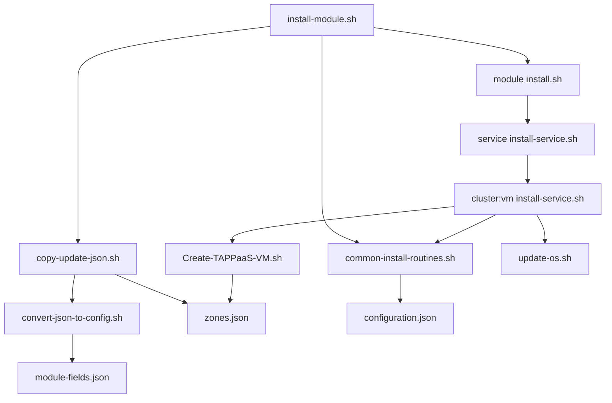
```mermaid
graph TD
    A["install-module.sh"] --> B["common-install-routines.sh"]
    A --> C["copy-update-json.sh"]
    A --> D["module install.sh"]
    C --> K["convert-json-to-config.sh"]
    K --> E["module-fields.json"]
    C --> F["zones.json"]
    D --> G["service install-service.sh"]
    G --> H["cluster:vm install-service.sh"]
    H --> B
    H --> I["Create-TAPPaaS-VM.sh"]
    H --> U["update-os.sh"]
    I --> F
    B --> J["configuration.json"]
```

### update-module.sh

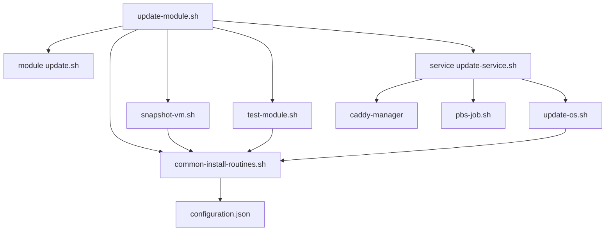
```mermaid
graph TD
    A["update-module.sh"] --> B["common-install-routines.sh"]
    A --> C["snapshot-vm.sh"]
    A --> D["test-module.sh"]
    A --> E["module update.sh"]
    A --> G["service update-service.sh"]
    C --> B
    D --> B
    G --> H["update-os.sh"]
    G --> M["caddy-manager"]
    G --> N["pbs-job.sh"]
    H --> B
    B --> I["configuration.json"]
```

### delete-module.sh

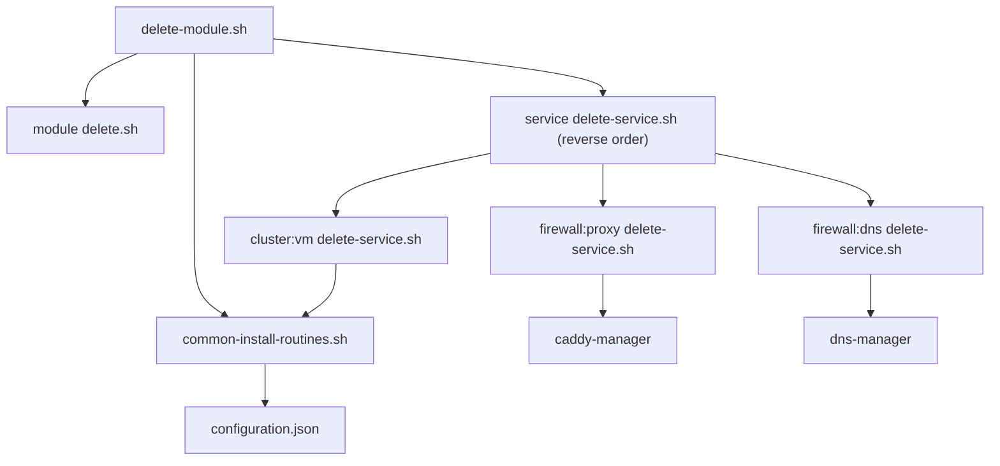
```mermaid
graph TD
    A["delete-module.sh"] --> B["common-install-routines.sh"]
    A --> C["module delete.sh"]
    A --> D["service delete-service.sh (reverse order)"]
    D --> E["firewall:proxy delete-service.sh"]
    E --> F["caddy-manager"]
    D --> P["firewall:dns delete-service.sh"]
    P --> Q["dns-manager"]
    D --> H["cluster:vm delete-service.sh"]
    H --> B
    B --> I["configuration.json"]
```

### test-module.sh

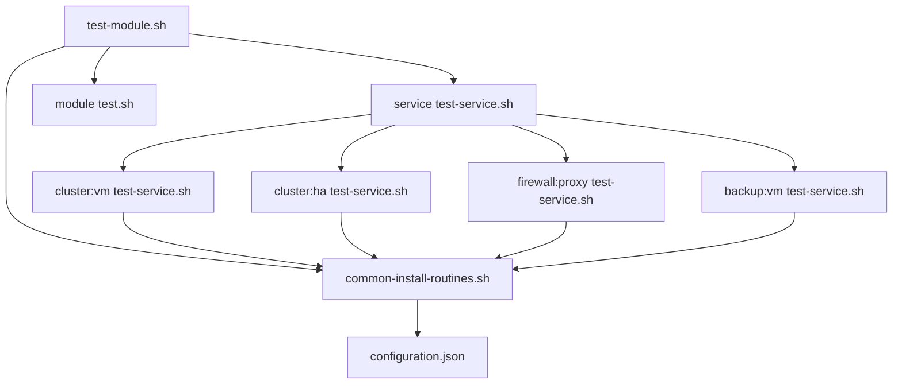
```mermaid
graph TD
    A["test-module.sh"] --> B["common-install-routines.sh"]
    A --> C["service test-service.sh"]
    A --> D["module test.sh"]
    C --> E["cluster:vm test-service.sh"]
    C --> F["cluster:ha test-service.sh"]
    C --> G["firewall:proxy test-service.sh"]
    C --> H["backup:vm test-service.sh"]
    E --> B
    F --> B
    G --> B
    H --> B
    B --> J["configuration.json"]
```

### install2.sh (bootstrap)

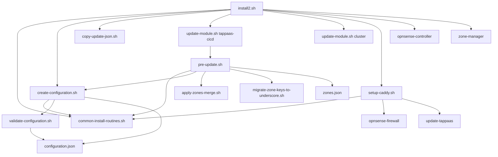
```mermaid
graph TD
    A["install2.sh"] --> G["common-install-routines.sh"]
    A --> B["create-configuration.sh"]
    A --> C["copy-update-json.sh"]
    A --> D["update-module.sh tappaas-cicd"]
    A --> E["update-module.sh cluster"]
    A --> F["setup-caddy.sh"]
    A --> OC["opnsense-controller"]
    A --> ZM["zone-manager"]
    B --> G
    B --> H["validate-configuration.sh"]
    B --> I["configuration.json"]
    H --> I
    D --> J["pre-update.sh"]
    J --> G
    J --> B
    J --> AZ["apply-zones-merge.sh"]
    J --> MZ["migrate-zone-keys-to-underscore.sh"]
    J --> L["zones.json"]
    F --> G
    F --> M["opnsense-firewall"]
    F --> UT["update-tappaas"]
```

### pre-update.sh

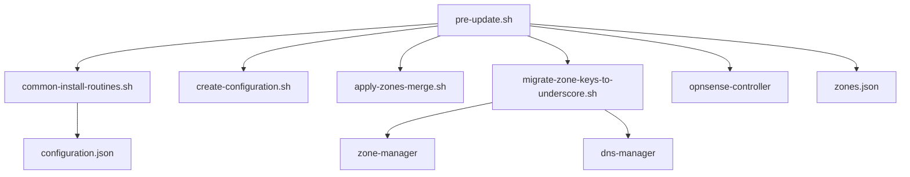
```mermaid
graph TD
    A["pre-update.sh"] --> B["common-install-routines.sh"]
    A --> C["create-configuration.sh"]
    A --> D["apply-zones-merge.sh"]
    A --> E["migrate-zone-keys-to-underscore.sh"]
    A --> F["opnsense-controller"]
    A --> G["zones.json"]
    E --> H["zone-manager"]
    E --> I["dns-manager"]
    B --> J["configuration.json"]
```

### update-tappaas (cron)

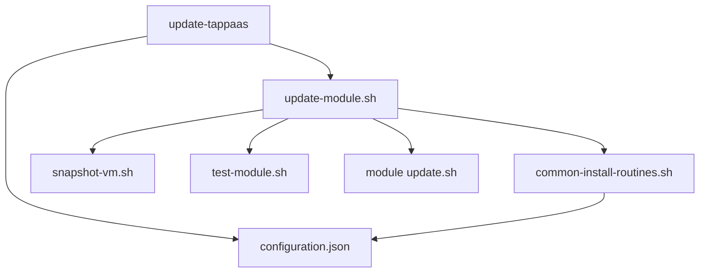
```mermaid
graph TD
    A["update-tappaas"] --> B["configuration.json"]
    A --> C["update-module.sh"]
    C --> D["common-install-routines.sh"]
    C --> E["snapshot-vm.sh"]
    C --> F["test-module.sh"]
    C --> G["module update.sh"]
    D --> B
```

### firewall/update.sh + zone reconcile (ADR-008)

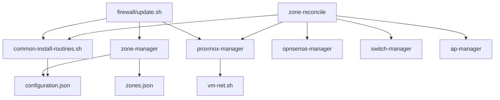
```mermaid
graph TD
    A["firewall/update.sh"] --> B["common-install-routines.sh"]
    A --> C["zone-manager"]
    A --> P["proxmox-manager"]
    C --> D["zones.json"]
    C --> CFG["configuration.json"]
    P --> VN["vm-net.sh"]
    R["zone-reconcile"] --> B
    R --> OM["opnsense-manager"]
    R --> P
    R --> SW["switch-manager"]
    R --> AP["ap-manager"]
    B --> CFG
```

### zone-manager (Python)

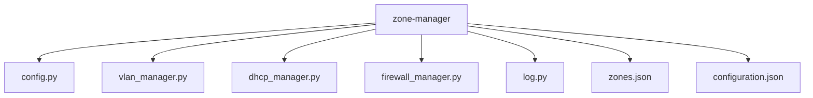
```mermaid
graph TD
    A["zone-manager"] --> B["config.py"]
    A --> C["vlan_manager.py"]
    A --> D["dhcp_manager.py"]
    A --> E["firewall_manager.py"]
    A --> F["log.py"]
    A --> G["zones.json"]
    A --> H["configuration.json"]
```

### backup install/update

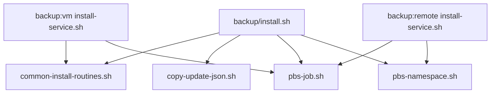
```mermaid
graph TD
    A["backup/install.sh"] --> B["common-install-routines.sh"]
    A --> C["copy-update-json.sh"]
    A --> D["pbs-job.sh"]
    A --> E["pbs-namespace.sh"]
    F["backup:vm install-service.sh"] --> B
    F --> D
    G["backup:remote install-service.sh"] --> D
    G --> E
```

### identity update / SSO

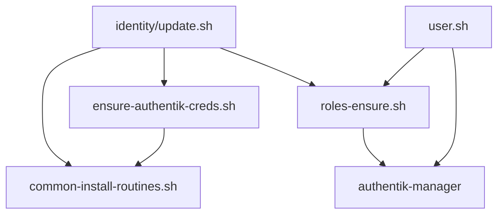
```mermaid
graph TD
    A["identity/update.sh"] --> B["common-install-routines.sh"]
    A --> C["ensure-authentik-creds.sh"]
    A --> D["roles-ensure.sh"]
    D --> E["authentik-manager"]
    F["user.sh"] --> E
    F --> D
    C --> B
```

### check-disk-threshold.sh (cron)

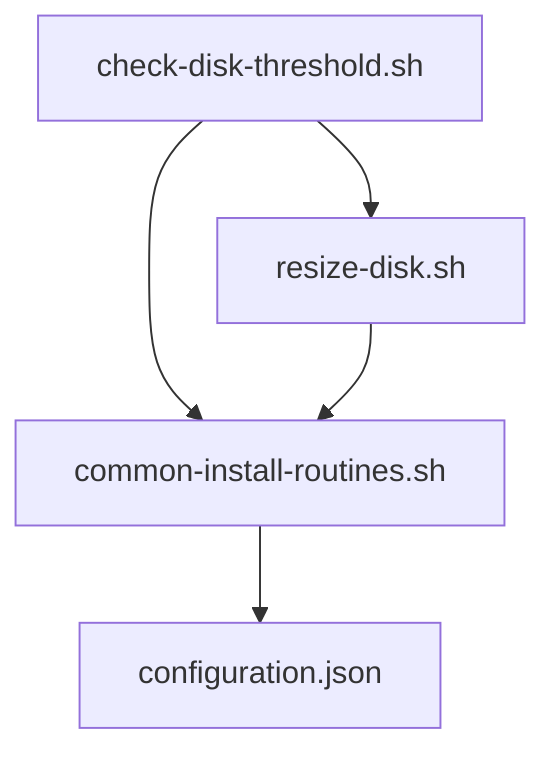
```mermaid
graph TD
    A["check-disk-threshold.sh"] --> B["common-install-routines.sh"]
    A --> C["resize-disk.sh"]
    B --> D["configuration.json"]
    C --> B
```

### migrate-node.sh

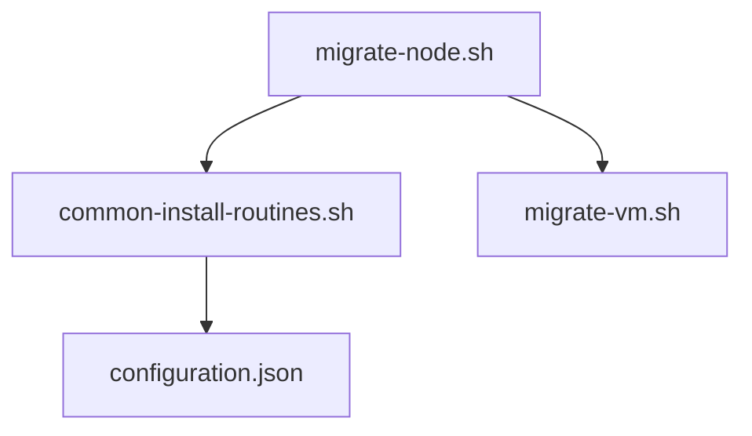
```mermaid
graph TD
    A["migrate-node.sh"] --> B["common-install-routines.sh"]
    A --> C["migrate-vm.sh"]
    B --> D["configuration.json"]
```

### inspect-cluster.sh / inspect-vm.sh

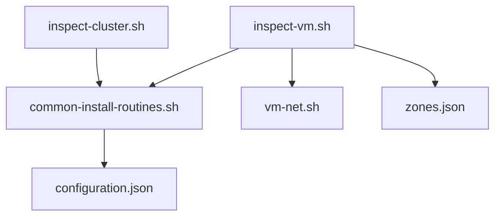
```mermaid
graph TD
    A["inspect-cluster.sh"] --> B["common-install-routines.sh"]
    C["inspect-vm.sh"] --> B
    C --> V["vm-net.sh"]
    C --> Z["zones.json"]
    B --> D["configuration.json"]
```
