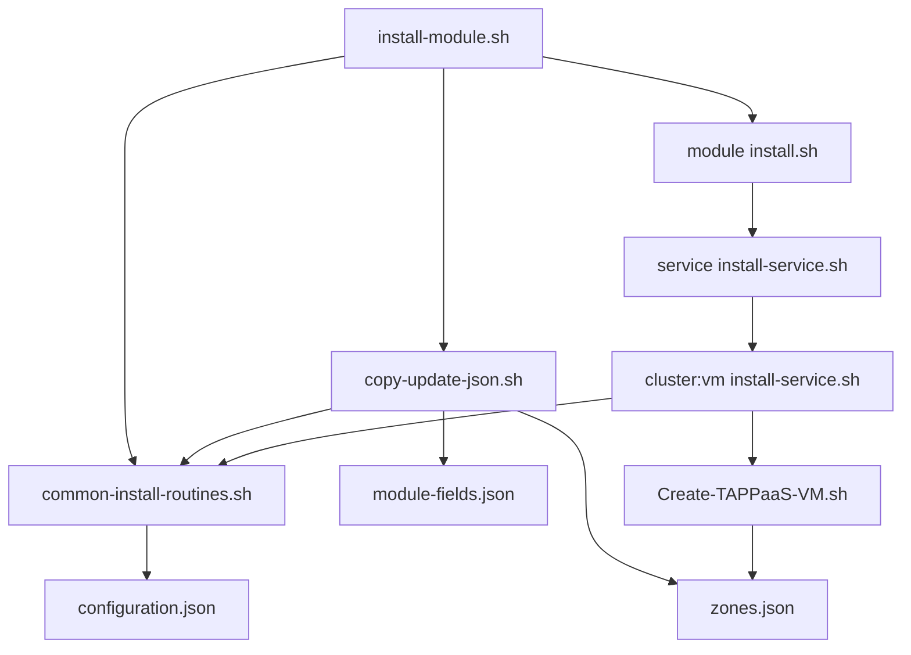
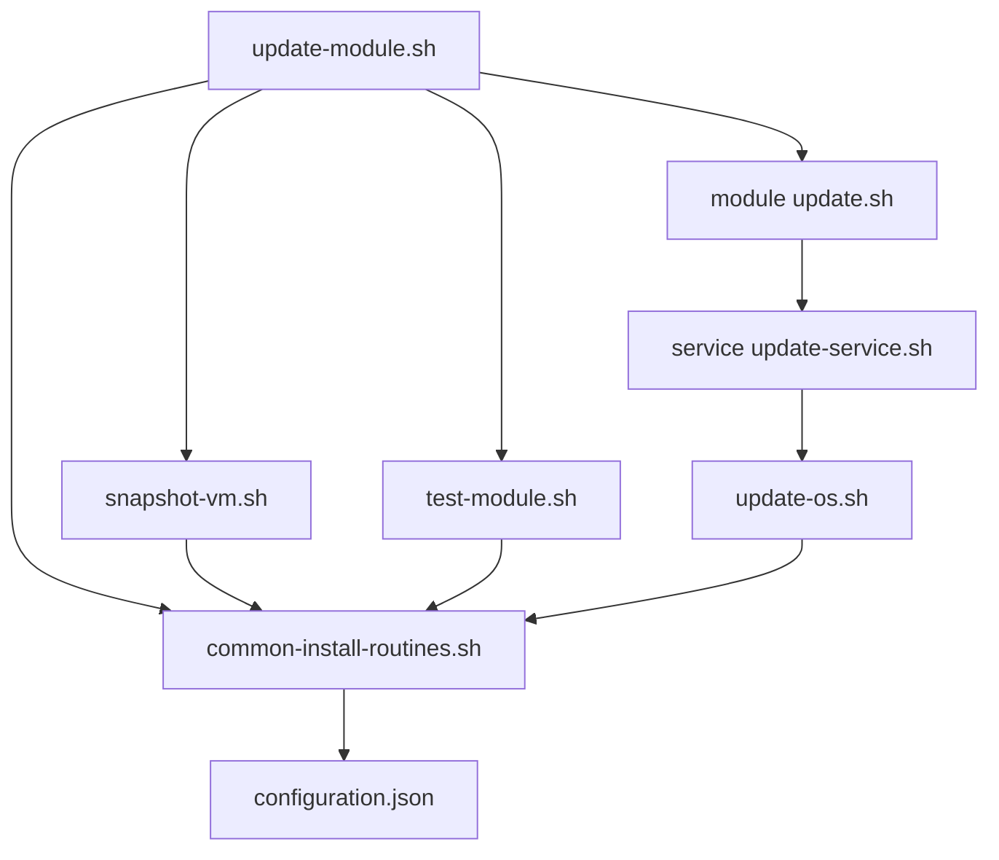
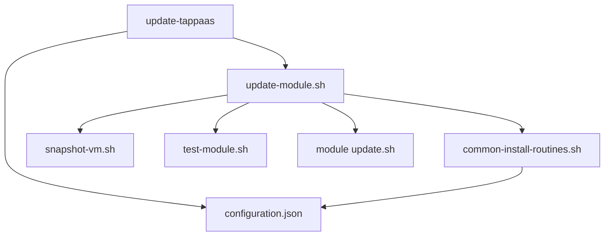
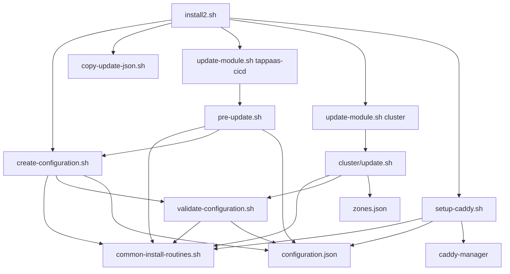
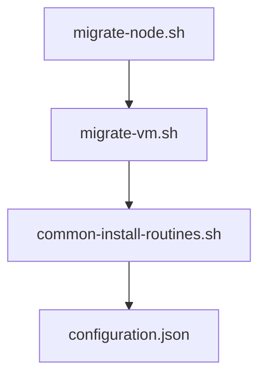
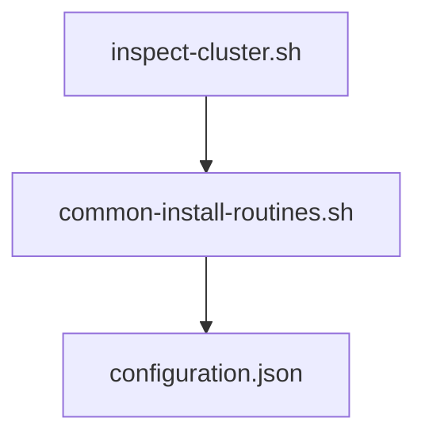
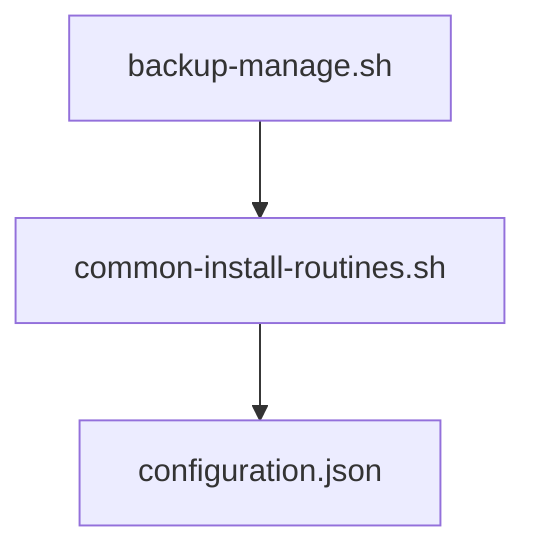
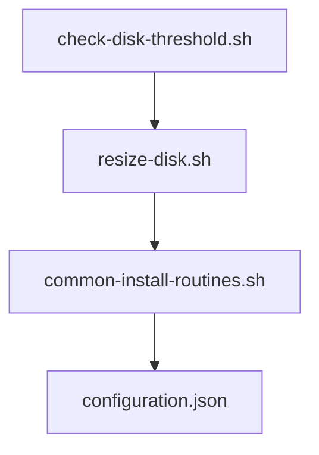
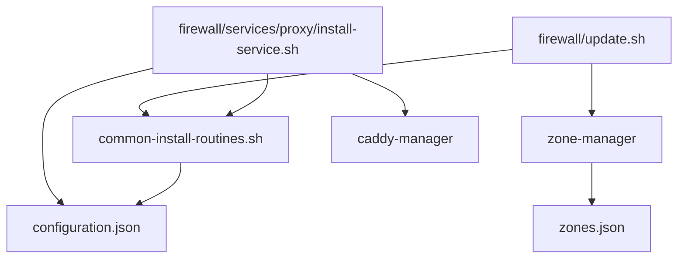

# TAPPaaS Foundation Layer - Dependency Documentation

This document describes the program dependencies within the `src/foundation/` directory of TAPPaaS.

Generated: 2026-03-19

## Directory Summary

| Directory | Shell Scripts | Python Files | JSON Configs | Total |
|-----------|-------------|-------------|-------------|-------|
| tappaas-cicd/scripts/ | 19 | - | - | 19 |
| tappaas-cicd/ (root) | 5 | - | 1 | 6 |
| tappaas-cicd/opnsense-controller/ | - | 10 | 1 | 11 |
| tappaas-cicd/update-tappaas/ | - | 2 | 1 | 3 |
| tappaas-cicd/test-vm-creation/ | 4 | - | 5 | 9 |
| tappaas-cicd/test-repository/ | 1 | - | - | 1 |
| cluster/ | 3 | - | 1 | 4 |
| cluster/services/ | 8 | - | - | 8 |
| backup/ | 4 | - | 1 | 5 |
| backup/services/ | 4 | - | - | 4 |
| firewall/ | 1 | - | 2 | 3 |
| firewall/services/ | 7 | - | - | 7 |
| identity/ | 2 | - | 1 | 3 |
| identity/services/ | 5 | - | - | 5 |
| templates/ | - | - | 2 | 2 |
| templates/services/ | 7 | - | - | 7 |
| (root) | - | - | 4 | 4 |

## Most Connected Files

| File | Depended On By | Purpose |
|------|---------------|---------|
| common-install-routines.sh | 30+ scripts | Shared library: logging, colors, config access, node helpers |
| configuration.json | 15+ scripts | Central system config: domain, nodes, repos, schedule |
| zones.json | 8+ scripts | Network zone/VLAN definitions |
| update-module.sh | update-tappaas, install2.sh | Orchestrates module update lifecycle |
| test-module.sh | update-module.sh | Runs module + service tests |
| copy-update-json.sh | install-module.sh, install2.sh | Deploys module JSON configs |
| Create-TAPPaaS-VM.sh | cluster/services/vm/install-service.sh, cluster/update.sh | Creates VMs on Proxmox nodes |
| validate-configuration.sh | create-configuration.sh, cluster/update.sh, test.sh | Validates configuration.json |

## Key Dependency Chains

### 1. Module Installation Flow

```
install-module.sh
  ├── common-install-routines.sh (source)
  ├── copy-update-json.sh (source) ── reads module-fields.json, zones.json
  ├── <module>/install.sh
  │     └── service install-service.sh (per dependsOn)
  │           └── cluster/services/vm/install-service.sh
  │                 └── Create-TAPPaaS-VM.sh (on PVE node) ── reads zones.json, <module>.json
  └── test-module.sh (post-install verify)
```

### 2. Module Update Flow

```
update-tappaas (Python, runs hourly via cron)
  ├── reads configuration.json (schedule, repos, nodes)
  └── calls update-module.sh <module>
        ├── common-install-routines.sh (source)
        ├── snapshot-vm.sh (pre-update snapshot)
        ├── test-module.sh (pre-update test)
        ├── <module>/update.sh ── may call update-os.sh
        │     └── service update-service.sh (per dependsOn)
        ├── test-module.sh (post-update test)
        └── snapshot-vm.sh --restore (rollback on failure)
```

### 3. Initial Bootstrap Flow

```
install1.sh (run on bare NixOS VM)
  └── (manual: user runs install2.sh)

install2.sh
  ├── create-configuration.sh ── discovers cluster, writes configuration.json
  │     └── validate-configuration.sh
  ├── copy-update-json.sh cluster/templates/firewall/tappaas-cicd
  ├── update-module.sh tappaas-cicd
  │     └── pre-update.sh
  │           ├── pulls git repos (from configuration.json)
  │           ├── create-configuration.sh --update
  │           └── installs scripts to /home/tappaas/bin/
  ├── update-module.sh cluster
  │     └── cluster/update.sh
  │           ├── validate-configuration.sh
  │           └── distributes zones.json + Create-TAPPaaS-VM.sh to nodes
  └── setup-caddy.sh ── reads configuration.json, calls caddy-manager
```

### 4. Cluster Update Flow

```
cluster/update.sh
  ├── common-install-routines.sh (source)
  ├── validate-configuration.sh (Step 0)
  ├── SSH to each node: apt update/upgrade (Step 1)
  └── SCP zones.json + Create-TAPPaaS-VM.sh to each node (Step 2)
```

### 5. Firewall/Proxy Flow

```
firewall/update.sh
  ├── common-install-routines.sh (source)
  └── zone-manager --zones-file zones.json --execute

firewall/services/proxy/install-service.sh
  ├── common-install-routines.sh (source)
  ├── reads configuration.json (domain, email)
  └── caddy-manager (add reverse proxy entry)
```

## Top-Level Entry Points

These programs are not called by any other program (user-invoked or cron-triggered):

| Program | Purpose |
|---------|---------|
| install-module.sh | Install a new module |
| delete-module.sh | Remove an installed module |
| inspect-cluster.sh | Audit cluster VM status |
| inspect-vm.sh | Inspect a single VM |
| migrate-vm.sh | Migrate a VM to its HA node |
| migrate-node.sh | Evacuate/return all VMs on a node |
| repository.sh | Manage module repositories |
| backup-manage.sh | Manage PBS backups |
| restore.sh | Restore from PBS backup |
| check-disk-threshold.sh | Check and auto-resize VM disks |
| validate-configuration.sh | Validate configuration.json |
| update-tappaas | Cron-triggered update scheduler |
| install1.sh | First bootstrap step |
| install2.sh | Second bootstrap step |

## Mermaid Dependency Graphs

### install-module.sh


```mermaid
graph TD
    A["install-module.sh"] --> B["common-install-routines.sh"]
    A --> C["copy-update-json.sh"]
    A --> D["module install.sh"]
    C --> B
    C --> E["module-fields.json"]
    C --> F["zones.json"]
    D --> G["service install-service.sh"]
    G --> H["cluster:vm install-service.sh"]
    H --> B
    H --> I["Create-TAPPaaS-VM.sh"]
    I --> F
    B --> J["configuration.json"]
```

### update-module.sh


```mermaid
graph TD
    A["update-module.sh"] --> B["common-install-routines.sh"]
    A --> C["snapshot-vm.sh"]
    A --> D["test-module.sh"]
    A --> E["module update.sh"]
    C --> B
    D --> B
    E --> F["service update-service.sh"]
    F --> G["update-os.sh"]
    G --> B
    B --> H["configuration.json"]
```

### update-tappaas (cron)


```mermaid
graph TD
    A["update-tappaas"] --> B["configuration.json"]
    A --> C["update-module.sh"]
    C --> D["common-install-routines.sh"]
    C --> E["snapshot-vm.sh"]
    C --> F["test-module.sh"]
    C --> G["module update.sh"]
    D --> B
```

### install2.sh (bootstrap)


```mermaid
graph TD
    A["install2.sh"] --> B["create-configuration.sh"]
    A --> C["copy-update-json.sh"]
    A --> D["update-module.sh tappaas-cicd"]
    A --> E["update-module.sh cluster"]
    A --> F["setup-caddy.sh"]
    B --> G["common-install-routines.sh"]
    B --> H["validate-configuration.sh"]
    B --> I["configuration.json"]
    H --> G
    H --> I
    D --> J["pre-update.sh"]
    J --> G
    J --> B
    J --> I
    E --> K["cluster/update.sh"]
    K --> G
    K --> H
    K --> L["zones.json"]
    F --> G
    F --> I
    F --> M["caddy-manager"]
```

### migrate-node.sh


```mermaid
graph TD
    A["migrate-node.sh"] --> B["migrate-vm.sh"]
    B --> C["common-install-routines.sh"]
    C --> D["configuration.json"]
```

### inspect-cluster.sh


```mermaid
graph TD
    A["inspect-cluster.sh"] --> B["common-install-routines.sh"]
    B --> C["configuration.json"]
```

### backup-manage.sh


```mermaid
graph TD
    A["backup-manage.sh"] --> B["common-install-routines.sh"]
    B --> C["configuration.json"]
```

### check-disk-threshold.sh


```mermaid
graph TD
    A["check-disk-threshold.sh"] --> B["resize-disk.sh"]
    B --> C["common-install-routines.sh"]
    C --> D["configuration.json"]
```

### firewall update flow


```mermaid
graph TD
    A["firewall/update.sh"] --> B["common-install-routines.sh"]
    A --> C["zone-manager"]
    C --> D["zones.json"]
    E["firewall/services/proxy/install-service.sh"] --> B
    E --> F["caddy-manager"]
    E --> G["configuration.json"]
    B --> G
```
