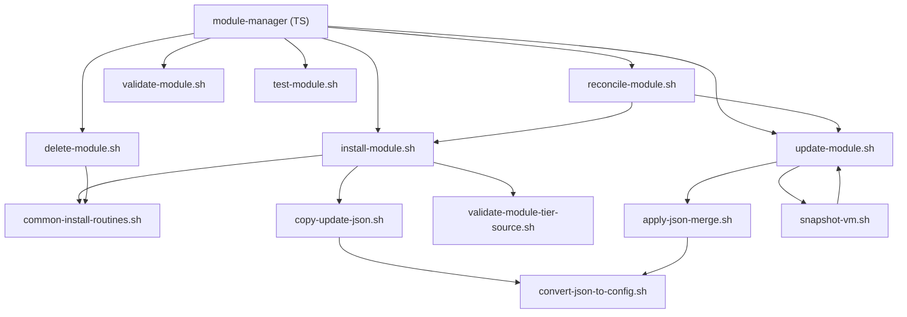
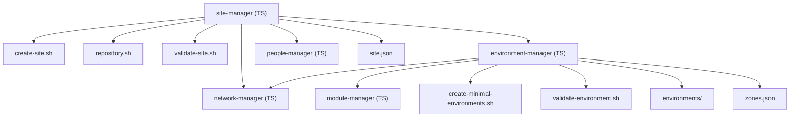
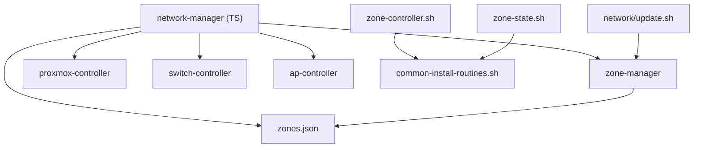
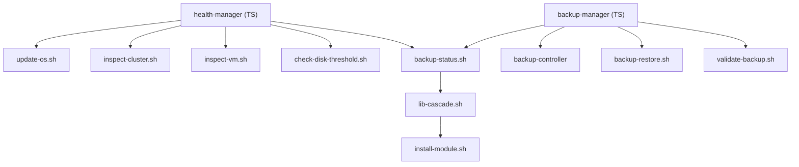
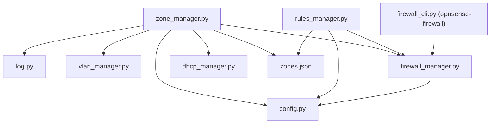

# TAPPaaS Foundation Layer - Dependency Documentation

Generated: 2026-06-25

This document summarizes the direct dependencies between the scripts, the
TypeScript managers/controllers, Python packages and configuration files under
`src/foundation/`. The canonical machine-readable data lives in
[`DEPENDENCIES.csv`](DEPENDENCIES.csv); the installed program surface (what
lands on `/home/tappaas/bin` on the `tappaas-cicd` mothership) lives in
[`PROGRAMS.csv`](PROGRAMS.csv).

A "direct dependency" is one of:

- a script **sourced** via `.` / `source`,
- another TAPPaaS **program/script/bin invoked** by name (e.g.
  `install-module.sh`, `caddy-manager`, `zone-controller`, `network-manager`),
- a **config file read**: `site.json`, `zones.json`, the `environments/` tree,
  `network.json` (the renamed firewall config, read with a `firewall.json`
  fallback), or a module's own `<name>.json`.

> **ADR-007 #3 — the 7 verb-aligned managers are the front doors.** Each is a
> compiled TypeScript bin (one bin per manager, source = its `src/*.ts` tree,
> built by `default.nix`, linked by `install.sh`):
> `people-manager`, `network-manager`, `module-manager`, `site-manager`,
> `environment-manager`, `backup-manager`, `health-manager`. They **shell out**
> to the legacy bash verb scripts (thin orchestration), so a manager's
> dependency row lists the `*.sh` verbs its `src/main.ts` spawns.

> **`configuration.json` is RETIRED.** Site configuration is now `site.json`
> (plus the `environments/` tree and `zones.json`). A few not-yet-migrated bash
> scripts still read `configuration.json`; those reads are flagged in the CSV.

> Note: the former `firewall` module is the **`network`** module
> (`src/foundation/network/`, config `network.json`, sub-services
> `network:proxy|rules|nat|dns|discovery`). The rules-plane Python entry point
> `opnsense-firewall` keeps its name intentionally.

## Summary: directories and file counts

| Directory | Files analyzed |
|-----------|---------------:|
| `tappaas-cicd/` (top level) | 5 |
| `tappaas-cicd/lib/` | 4 |
| `tappaas-cicd/scripts/` (+ `scripts/test/`) | 13 |
| `tappaas-cicd/manager/` (dispatchers) | 3 |
| `tappaas-cicd/manager/people-manager/` (6 ts + 5 sh) | 11 |
| `tappaas-cicd/manager/site-manager/` (5 ts + 11 sh) | 16 |
| `tappaas-cicd/manager/environment-manager/` (7 ts + 5 sh) | 12 |
| `tappaas-cicd/manager/module-manager/` (5 ts + 13 sh) | 18 |
| `tappaas-cicd/manager/network-manager/` (10 ts + 6 sh) | 16 |
| `tappaas-cicd/manager/health-manager/` (6 ts + 8 sh) | 14 |
| `tappaas-cicd/manager/backup-manager/` (8 ts + 9 sh) | 17 |
| `tappaas-cicd/manager/TEMPLATE/` | 5 |
| `tappaas-cicd/controller/` (dispatchers) | 3 |
| `tappaas-cicd/controller/proxmox-controller/` | 7 |
| `tappaas-cicd/controller/switch-controller/` | 6 |
| `tappaas-cicd/controller/ap-controller/` | 6 |
| `tappaas-cicd/controller/identity-controller/` (3 sh + 4 py + 3 test) | 10 |
| `tappaas-cicd/controller/backup-controller/` | 3 |
| `tappaas-cicd/controller/opnsense-controller/` (22 py + 7 test) | 29 |
| `tappaas-cicd/controller/TEMPLATE/` | 4 |
| `tappaas-cicd/update-tappaas/` (py pkg) | 2 |
| `tappaas-cicd/opnsense-patch/` (sh + php) | 2 |
| `tappaas-cicd/test-variants/` | 5 |
| `tappaas-cicd/test-vm-creation/` (+ `rollback-fixture/`) | 10 |
| `tappaas-cicd/test-repository/` | 1 |
| `network/` (top level) | 7 |
| `network/scripts/` (+ `plugins/`, `switch-controller/` TS port) | 4 |
| `network/services/proxy/` | 5 |
| `network/services/rules/` | 4 |
| `network/services/nat/` | 5 |
| `network/services/dns/` | 4 |
| `network/services/discovery/` | 4 |
| `network/test-fixtures/` | 6 |
| `cluster/` (+ `lib/`, `services/*`) | 27 |
| `backup/` (+ `lib/`, `services/*`) | 22 |
| `identity/` (+ `lib/`, `services/*`) | 10 |
| `logging/` | 3 |
| `templates/` (+ `services/*`, `winserver/`) | 11 |
| `Deprecated/` | 2 |

## Key dependency chains (5 main flows)

### 1. Module lifecycle through the manager (ADR-007 #3)

```
module-manager (TS)                  <- the verb-aligned front door
  src/main.ts spawns:
    install-module.sh   -> common-install-routines.sh -> copy-update-json.sh -> convert-json-to-config.sh
                                                       -> validate-module-tier-source.sh
    update-module.sh    -> apply-json-merge.sh -> convert-json-to-config.sh
                        -> snapshot-vm.sh -> update-module.sh / update-os.sh
    delete-module.sh    -> common-install-routines.sh -> inspect-cluster.sh
    reconcile-module.sh -> install-module.sh / update-module.sh
    validate-module.sh / test-module.sh
```

### 2. Site / environment bootstrap (site-native, ADR-007)

```
site-manager (TS)        owns site.json
  src/main.ts spawns: create-site.sh, repository.sh, validate-site.sh,
                      environment-manager, network-manager, people-manager
environment-manager (TS) owns the environments/ tree
  src/main.ts spawns: network-manager, module-manager, reconcile-module,
                      create-minimal-environments.sh, validate-environment.sh
  (reads site.json, zones.json, environments/)
```

### 3. Network reconciliation (network-manager orchestrator + plane controllers)

```
network-manager (TS)     owns zones.json (single source of truth)
  src/main.ts spawns:  zone-manager (opnsense rules+vlan plane),
                       proxmox-controller, switch-controller, ap-controller, scp
zone-controller(.sh) / zone-state.sh -> common-install-routines.sh
network/update.sh -> zone-manager (--execute against zones.json)
```

### 4. Network service planes (proxy / rules / nat / dns / discovery)

```
network/services/proxy/install-service.sh
  -> common-install-routines.sh
  -> access-list.sh -> caddy-manager (+ zones.json)
  -> caddy-manager / unbound-manager
  -> site.json / network.json / zones.json
network/services/rules/*-service.sh  -> rules-manager (+ network.json)
network/services/nat/*-service.sh    -> nat-common.sh -> nat-manager (+ network.json)
network/services/dns/*-service.sh    -> dns-manager  (+ network.json)
```

### 5. Health + backup managers (read-only verbs over controllers)

```
health-manager (TS)  src/main.ts spawns: update-os.sh, inspect-cluster.sh,
                     inspect-vm.sh, check-disk-threshold.sh, backup-status.sh
backup-manager (TS)  src/main.ts spawns: backup-controller, backup-status.sh,
                     backup-restore.sh, validate-backup.sh
check-backup-status.sh -> backup-manager / backup-status.sh
```

## Most-connected files (most depended upon)

| File | Incoming references | Role |
|------|--------------------:|------|
| `common-install-routines.sh` | 130+ | shared logging / helpers, sourced by nearly every script |
| `zones.json` | 30+ | network zone / VLAN source of truth (network-manager owns) |
| `network.json` | 24 | firewall VM config (was `firewall.json`) |
| `site.json` | 22 | site/system configuration (replaces `configuration.json`) |
| `config.py` | 18 | opnsense-controller shared API client/config |
| `dns-manager` | 15 | DNS record CLI (opnsense-controller) |
| `update-module.sh` | 14 | module update verb (wrapped by module-manager) |
| `install-module.sh` | 13 | module install verb (wrapped by module-manager) |
| `delete-module.sh` | 13 | module delete verb (wrapped by module-manager) |
| `pbs-job.sh` | 12 | PBS backup job helper (backup module) |
| `validate-site.sh` | 9 | site validation (wrapped by site-manager) |
| `pbs-namespace.sh` | 8 | PBS namespace helper |
| `backup-status.sh` | 7 | backup status verb (wrapped by backup/health managers) |
| `vm-net.sh` | 6 | VM network helper (cluster/lib) |
| `caddy-manager` | 6 | reverse-proxy CLI (opnsense-controller) |
| `copy-update-json.sh` | 6 | config-to-VM copy verb |
| `Create-TAPPaaS-VM.sh` | 6 | VM creation (node-local) |
| `update-os.sh` | 5 | OS update verb (wrapped by health-manager) |

## Top-level entry points (programs nothing else depends on)

These are the operator-facing commands and orchestrators — no other file in the
foundation tree depends on them:

- **Foundation install:** `cluster/install.sh`, `cluster/install-platform.sh`,
  `tappaas-cicd/install1.sh`, `tappaas-cicd/pre-update.sh`,
  `tappaas-cicd/update.sh`
- **The 7 managers (front doors):** `module-manager`, `site-manager`,
  `environment-manager`, `network-manager`, `people-manager`, `backup-manager`,
  `health-manager`
- **Network:** `network/update.sh`, `network/test.sh`,
  `network/migrate-firewall-to-network.sh`
- **Ops:** `cluster/reboot-cluster.sh`
- **Identity:** `identity/install.sh`
- **Nightly update:** `update-tappaas`
- **Top-level controllers:** `opnsense-controller`, `proxmox-controller`,
  `switch-controller`, `ap-controller`, `identity-controller`,
  `backup-controller`

## Mermaid dependency graphs

### Module lifecycle (module-manager front door)


```mermaid
graph TD
    MM["module-manager (TS)"] --> IM["install-module.sh"]
    MM --> UM["update-module.sh"]
    MM --> DM["delete-module.sh"]
    MM --> RM["reconcile-module.sh"]
    MM --> VM["validate-module.sh"]
    MM --> TM["test-module.sh"]
    IM --> CIR["common-install-routines.sh"]
    IM --> CUJ["copy-update-json.sh"]
    IM --> VMT["validate-module-tier-source.sh"]
    CUJ --> CJC["convert-json-to-config.sh"]
    UM --> AJM["apply-json-merge.sh"]
    UM --> SV["snapshot-vm.sh"]
    AJM --> CJC
    SV --> UM
    RM --> IM
    RM --> UM
    DM --> CIR
```

### Site / environment bootstrap


```mermaid
graph TD
    SM["site-manager (TS)"] --> CST["create-site.sh"]
    SM --> REP["repository.sh"]
    SM --> VST["validate-site.sh"]
    SM --> EM["environment-manager (TS)"]
    SM --> NM["network-manager (TS)"]
    SM --> PM["people-manager (TS)"]
    SM --> SJ["site.json"]
    EM --> NM
    EM --> MM["module-manager (TS)"]
    EM --> CME["create-minimal-environments.sh"]
    EM --> VE["validate-environment.sh"]
    EM --> ENV["environments/"]
    EM --> ZJ["zones.json"]
```

### Network reconciliation (network-manager orchestrator)


```mermaid
graph TD
    NM["network-manager (TS)"] --> ZJ["zones.json"]
    NM --> ZM["zone-manager"]
    NM --> PX["proxmox-controller"]
    NM --> SC["switch-controller"]
    NM --> AP["ap-controller"]
    ZC["zone-controller.sh"] --> CIR["common-install-routines.sh"]
    ZS["zone-state.sh"] --> CIR
    NU["network/update.sh"] --> ZM
    ZM --> ZJ
```

### Health + backup managers


```mermaid
graph TD
    HM["health-manager (TS)"] --> UOS["update-os.sh"]
    HM --> IC["inspect-cluster.sh"]
    HM --> IV["inspect-vm.sh"]
    HM --> CDT["check-disk-threshold.sh"]
    HM --> BS["backup-status.sh"]
    BM["backup-manager (TS)"] --> BC["backup-controller"]
    BM --> BS
    BM --> BR["backup-restore.sh"]
    BM --> VB["validate-backup.sh"]
    BS --> LC["lib-cascade.sh"]
    LC --> IM["install-module.sh"]
```

### opnsense-controller (rules plane, Python)


```mermaid
graph TD
    ZM["zone_manager.py"] --> CFG["config.py"]
    ZM --> LOG["log.py"]
    ZM --> VL["vlan_manager.py"]
    ZM --> FW["firewall_manager.py"]
    ZM --> DH["dhcp_manager.py"]
    ZM --> ZJ["zones.json"]
    RM["rules_manager.py"] --> CFG
    RM --> FW
    RM --> ZJ
    FCLI["firewall_cli.py (opnsense-firewall)"] --> FW
    FW --> CFG
```

## Manager front-door adoption (ADR-007 #3/#5)

**Question:** are the 7 managers now the entry points, or are the legacy bash
verb scripts still called directly (bypassing the manager)?

For each wrapped legacy verb script we classified every *production* caller
(tests, the script's own self-reference, `src/*.ts` of its owning manager, and
doc/comment strings are excluded — those are expected). A caller is **MANAGER**
when the path goes through the owning TS manager, and **DIRECT** when a
production script/program executes the legacy verb itself.

| Wrapped verb | Owning manager | Production callers | Verdict |
|--------------|----------------|--------------------|---------|
| `install-module.sh` | module-manager | module-manager (TS); `cluster/services/vm/install-service.sh` (template build) | mostly MANAGER, 1 DIRECT |
| `update-module.sh` | module-manager | module-manager (TS); `install2.sh`; `update-tappaas` (nightly); `network/update.sh`* | MANAGER + **2 DIRECT** |
| `delete-module.sh` | module-manager | module-manager / environment-manager (TS); `cluster/services/{lxc,vm}/delete-service.sh`** | MANAGER (service-plane callbacks) |
| `reconcile-module.sh` | module-manager | module-manager / environment-manager (TS) only | MANAGER (clean) |
| `copy-update-json.sh` | module-manager | module-manager (TS); `install2.sh`; `backup/install.sh` | MANAGER + **2 DIRECT** |
| `snapshot-vm.sh` | module-manager | module-manager (TS); `common-install-routines.sh` (lib) | MANAGER (lib-internal) |
| `create-site.sh` | site-manager | site-manager (TS); `install2.sh` (bootstrap) | MANAGER + **1 DIRECT** |
| `repository.sh` | site-manager | site-manager (TS); `rest-of-foundation.sh` (echoed hint only) | MANAGER (clean) |
| `validate-site.sh` | site-manager | site-manager / environment-manager (TS); `install2.sh` (bootstrap) | MANAGER + **1 DIRECT** |
| `validate-configuration.sh` | site-manager | validate-site.sh; people validate.sh; `cluster/update.sh` | MANAGER + **1 DIRECT** |
| `create-minimal-environments.sh` | environment-manager | environment-manager (TS); `install2.sh` (bootstrap) | MANAGER + **1 DIRECT** |
| `validate-environment.sh` | environment-manager | environment-manager (TS) only | MANAGER (clean) |
| `user-setup.sh` | people-manager | people-manager flow; `rest-of-foundation.sh` (bootstrap) | MANAGER + **1 DIRECT** |
| `validate-people.sh` | people-manager | people-manager flow | MANAGER (clean) |
| `update-os.sh` | health-manager | health-manager (TS); `templates/services/{nixos,debian}/update-service.sh` | MANAGER + **2 DIRECT** |
| `inspect-cluster.sh` / `inspect-vm.sh` | health-manager | health-manager (TS); `delete-module.sh` (uses inspect-cluster) | MANAGER (lib-internal) |
| `check-disk-threshold.sh` | health-manager | health-manager (TS) only | MANAGER (clean) |
| `backup-status.sh` | backup-manager | backup-manager (TS); health-manager (TS) / check-backup-status.sh | MANAGER (clean) |
| `backup-restore.sh` / `validate-backup.sh` | backup-manager | backup-manager (TS) only | MANAGER (clean) |
| `backup-controller` | (backup-manager wraps) | backup-manager (TS) only | MANAGER (clean) |

\* `network/update.sh` only *mentions* update-module.sh in comments (it is
*called by* update-module.sh, it does not call it) — not a real DIRECT caller.
\** `cluster/services/{lxc,vm}/*-service.sh` are the module-lifecycle *service
hooks* that `install-module.sh`/`delete-module.sh` themselves invoke — they are
below the manager, not bypassing it.

### Remaining DIRECT callers (the retire/migration targets)

| Caller | Bypasses (legacy verb called directly) | Why it is still direct |
|--------|----------------------------------------|------------------------|
| `tappaas-cicd/install2.sh` | `create-site.sh`, `create-minimal-environments.sh`, `copy-update-json.sh`, `update-module.sh` | First-boot bootstrap — runs before the manager bins are linked on PATH; the highest-value target to migrate once a `tappaas-cicd`-native bootstrap exists |
| `tappaas-cicd/update-tappaas` (`main.py`) | `update-module.sh` (+ `reboot-cluster.sh`) | Nightly auto-updater calls `update-module.sh` per module directly instead of `module-manager update` |
| `templates/services/nixos/update-service.sh` | `update-os.sh` | Template update-plane hook shells `update-os.sh` directly |
| `templates/services/debian/update-service.sh` | `update-os.sh` | same as above |
| `cluster/services/vm/install-service.sh` | `install-module.sh` | Builds the VM template via `install-module.sh` directly (a nested-module build) |
| `tappaas-cicd/scripts/rest-of-foundation.sh` | `user-setup.sh` | Bootstrap copies the minimal-org via `user-setup.sh`, then *does* call `people-manager sync` (partially migrated) |
| `cluster/update.sh` | `validate-configuration.sh` | Pre-distribution gate calls `validate-configuration.sh` directly (and `validate-configuration.sh` itself is a retired-config validator) |
| `backup/install.sh` | `copy-update-json.sh` | Backup module install copies its config via `copy-update-json.sh` directly |

### Verdict

**Adoption is strong but not complete: ~8 production DIRECT-call holdouts
remain.** The four read-only/backup verbs (`validate-*`, `backup-restore`,
`backup-status`, `backup-controller`, `reconcile-module`, `check-disk-threshold`)
are reached **only** through their managers — clean. The holdouts cluster in two
predictable places:

1. **First-boot / nightly bootstrap** (`install2.sh`, `update-tappaas`,
   `rest-of-foundation.sh`) — these run before or outside the manager surface
   and are the principal migration targets (esp. `update-tappaas` →
   `module-manager`, and a `tappaas-cicd`-native bootstrap to retire the
   `install2.sh` direct calls).
2. **Template/cluster service hooks** (`templates/services/{nixos,debian}`,
   `cluster/services/vm`) — these call `update-os.sh` / `install-module.sh`
   directly as part of the module-service contract; lower priority because they
   already sit inside a module-lifecycle invocation.

The only verb still tied to retired config is `validate-configuration.sh`
(called by `cluster/update.sh`); it should be replaced by `validate-site.sh`
(via `site-manager validate`) as part of the `configuration.json` retirement.
