# backup

Primary audience: TAPPaaS admin.

Proxmox Backup Server (PBS) for TAPPaaS — automated, verified, deduplicated VM backups
with retention, restore tooling and off-site options.

## What you get

| Capability | Access from | How |
|------------|-------------|-----|
| Automated VM backups (daily 21:00) of every module that opted in | — | managed cluster backup job; opt in with `dependsOn: ["backup:vm"]`, or `integratesWith: ["backup:vm"]` for the foundation VMs that boot before the backup server (#501) |
| **File-level backup** of named paths inside a guest | tappaas-cicd | `backup:filesystem` + `backup.filesystemPaths` — a client-side-encrypted capture into `fs/<module>` (NixOS guests) |
| **Per-module schedules** — `daily` \| `weekly` \| `monthly` \| `HH:MM`, resolved Site → Environment → Module, capped at once a day | tappaas-cicd | `backup.schedule`; each distinct frequency gets its own cluster job |
| Retention (4 last / 14 daily / 8 weekly / 12 monthly / 6 yearly) with daily prune (02:00) and garbage collection (03:00) | tappaas-cicd | automatic; `backup-manage.sh prune` / `gc` on demand |
| Integrity verification: every new backup verified on arrival, daily verify-job (04:00) re-verifies anything older than 30 days | tappaas-cicd | automatic |
| PBS web GUI | `mgmt` zone | `https://backup.mgmt.internal:8007` (root@pam, or tappaas@pbs for backup ops) |
| VM restore, incl. to another node/storage, or **alongside the original** for a rehearsal | tappaas-cicd | `restore.sh --vmid <id> [--node <n>] [--storage <s>] [--target-vmid <new>]` |
| Manual/ad-hoc backups and job management | tappaas-cicd | `backup-manage.sh status \| run-now <vmid> \| run-now-all \| list-jobs \| verify <id>` |
| Multi-source vault: pull a buddy's PBS (`remote/<name>`) or receive third-party pushes (`external/<name>`) in isolated namespaces | tappaas-cicd | `backup-manage.sh add-remote / add-external` |
| Placement that fits the site: PBS on a node, a datastore-less **shim** that still satisfies `dependsOn: backup`, or an **externally-managed PBS consumed by URL** (#456) | tappaas-cicd | install-resolved `placementState`; `backup-manage.sh use-external <url>` |
| Off-site push for storage-less sites | tappaas-cicd | `backup-manage.sh add-push <n>`, or `placementState: external` + `pbsUrl` (ADR-012 §1.4) |
| **Encryption-key escrow + the mandatory out-of-band copy** | tappaas-cicd | `backup-manager key list \| export <dest> \| import <src>` (ADR-012 §2.5.1) |
| Opt-in WORM-ish immutability (read-only ZFS snapshots of the datastore) | tappaas-cicd | `backup.json .immutableSnapshots` (ADR-012 §3.5) |

Reference docs in this directory:

- [QUICKREF.md](./QUICKREF.md) — day-to-day operations quick reference (status, restore,
  maintenance, multi-source setup, ADR-012 features).
- [TEST.md](./TEST.md) — what the module tests cover (fast and deep tiers).
- [backup-recovery-runbook.md](../../../docs/design/backup-recovery-runbook.md) — the
  **tested** recovery path for the firewall, the mothership and `config/` (#545).

## Architecture

```mermaid
flowchart TB
    subgraph Capabilities
        BackupCap[Backup Capability]
    end

    subgraph BackupModule["backup module"]
        PBS[Proxmox Backup Server]
        VMBackupService(["vm service — managed VM backup"])
        RemoteService(["remote service — pull a buddy&#39;s PBS"])
        ExternalService(["external service — receive third-party pushes"])
        VMBackupService -.->|provided by| PBS
        RemoteService -.->|provided by| PBS
        ExternalService -.->|provided by| PBS
    end

    BackupCap -.->|realized by| PBS
```

The Backup capability is realized by Proxmox Backup Server (installed natively on a
cluster node), which provides two services (the `provides` in `backup.json`):
**`backup:vm`** (whole-guest snapshots into the managed job) and
**`backup:filesystem`** (named paths captured from inside a guest). The
multi-source vault — pulling a buddy (`remote/<n>`), receiving a third-party
push (`external/<n>`), sending our own (`offsite-<n>`) — is a set of **runtime
peer relationships** registered with `backup-manage.sh`, not dependency
capabilities: nothing ever declared `dependsOn: backup:remote`.

## What is not included

- Backup is **opt-in and stays opt-in**. A module is backed up only if it declares
  `backup:vm` or `backup:filesystem` under `dependsOn` or `integratesWith`; hardware
  and test modules declare neither, deliberately. Foundation VMs reproducible from git
  are not covered — the exceptions (`network`, `tappaas-cicd`) declare
  `integratesWith: ["backup:vm"]` because their state is not in git.
  *(The old `alwaysBackup` list is deprecated and read for one release only.)*
- S3 Object Lock immutability — that stronger tier is provided by an ADR-010 `satellite`,
  not this module (local immutability is ZFS-snapshot based, opt-in).
- Automated restore verification — test restores are an operator practice (see
  [QUICKREF.md](./QUICKREF.md) and [TEST.md](./TEST.md)).

## Requirements

- A node with a `tankc` ZFS storage pool for the datastore. Discovery searches every
  node unless `backup.json` `.node` names one. Without any such pool the module
  installs a **shim** — no datastore, but `dependsOn: backup` stays satisfiable and it
  is promoted in place once storage appears. A site that already runs its own PBS can
  skip all of this and **consume it by URL** (`backup-manage.sh use-external`, #456).
- PBS is installed via apt **on the Proxmox node itself** (not a VM), from
  `http://download.proxmox.com/debian/pbs`.
- Zone: `mgmt` (DNS name `backup.mgmt.internal`).

## Alternatives considered

- Dedicated bare-metal PBS — full separation of concerns, but more costly (hardware not
  reusable), needs an extra machine in small systems, and is more complicated to deploy.
- PBS as a VM — becomes "just another service", but disk access is very complicated,
  restore after hardware failure is harder, and Proxmox does not recommend it.
- PBS in an LXC — shares the kernel like the native install, but hard-disk passthrough
  is more complicated and LXC is not the TAPPaaS default deployment.

Chosen: native PBS install alongside PVE on a cluster node. Rationale + depth: see
[DESIGN.md](./DESIGN.md).

## Dependencies

| Depends on | Purpose |
|------------|---------|
| — | `dependsOn` is empty: backup is the first module `rest-of-foundation.sh` installs, before identity and logging |

Provides the `vm`, `remote` and `external` services consumed by other modules
(`backup:vm` is how a module opts into the managed backup job).

For installation steps see [INSTALL.md](./INSTALL.md).
