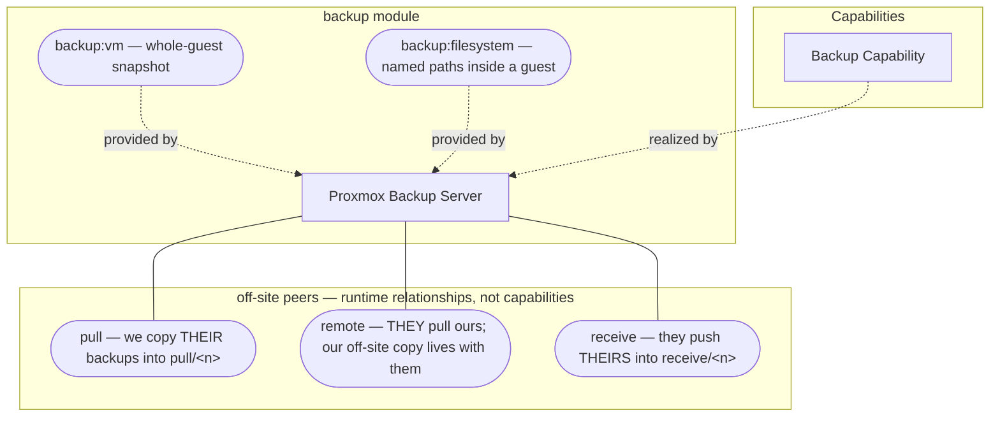

# backup

Primary audience: TAPPaaS admin.

Proxmox Backup Server (PBS) for TAPPaaS — automated, verified, deduplicated VM backups
with retention, restore tooling and off-site options.

## What you get

| Capability | Access from | How |
|------------|-------------|-----|
| Automated VM backups (daily 21:00) of every module that opted in | — | managed cluster backup job; opt in with `dependsOn: ["backup:vm"]`, or `integratesWith: ["backup:vm"]` for the foundation VMs that boot before the backup server (#501) |
| **File-level backup** of named paths inside a guest | tappaas-cicd | `backup:filesystem` + `backup.filesystemPaths` — a client-side-encrypted capture into `fs/<module>` (NixOS guests) |
| **Per-module schedules** — `daily` \| `weekly` \| `monthly` \| `HH:MM`, resolved Site → Environment → Module, capped at once a day | tappaas-cicd | `backup.schedule`; each distinct frequency gets its own cluster job |
| Retention (4 last / 14 daily / 8 weekly / 12 monthly / 6 yearly) with daily prune (02:00) and garbage collection (03:00) | tappaas-cicd | automatic; `backup-manage.sh prune` / `gc` on demand |
| Integrity verification: every new backup verified on arrival, daily verify-job (04:00) re-verifies anything older than 30 days | tappaas-cicd | automatic |
| PBS web GUI | `mgmt` zone | `https://backup.mgmt.internal:8007` (root@pam, or tappaas@pbs for backup ops) |
| VM restore, incl. to another node/storage, or **alongside the original** for a rehearsal | tappaas-cicd | `restore.sh --vmid <id> [--node <n>] [--storage <s>] [--target-vmid <new>]` |
| Manual/ad-hoc backups and job management | tappaas-cicd | `backup-manage.sh status \| run-now <vmid> \| run-now-all \| list-jobs \| verify <id>` |
| Multi-source vault: pull a buddy's PBS (`pull/<name>`) or receive a push from a system with no PBS (`receive/<name>`), in isolated namespaces | tappaas-cicd | `backup-manager peer add pull \| receive` |
| Placement that fits the site: PBS on a node, a datastore-less **shim** that still satisfies `dependsOn: backup`, or an **externally-managed PBS consumed by URL** (#456) | tappaas-cicd | install-resolved `placementState`; `backup-manage.sh use-external <url>` |
| Off-site copies of our own data | tappaas-cicd | `backup-manager peer add remote <n>` — they pull from us; we never push to another PBS (ADR-012 §1.4.1) |
| **Encryption-key escrow + the mandatory out-of-band copy** | tappaas-cicd | `backup-manager key list \| export <dest> \| import <src>` (ADR-012 §2.5.1) |
| Opt-in WORM-ish immutability (read-only ZFS snapshots of the datastore) | tappaas-cicd | `backup.json .immutableSnapshots` (ADR-012 §3.5) |

Reference docs in this directory:

- [RESTORE.md](./RESTORE.md) — **how to get a working system back**: a module rolled
  back, a module restored onto a fresh system, a lost node, and the special cases
  (`network`, `tappaas-cicd`, `cluster`/`templates`).
- [TEST.md](./TEST.md) — what the module tests cover (fast and deep tiers).

## Architecture



The Backup capability is realized by Proxmox Backup Server installed **natively on a
cluster node** — via apt on the Proxmox OS, not as a VM, because the datastore needs
direct access to a `tankc` ZFS pool ([DESIGN.md](./DESIGN.md) weighs the four
deployment options). Where it lands is not hardcoded: the install resolves it and
records the answer — adopting a PBS that already serves the site rather than installing a
second one beside it (#602) — and a site with no suitable pool still installs, as a shim.

What it offers modules is two capabilities; what it does with other PBS instances is
a separate set of operator-registered relationships. Both are detailed under
[Services provided](#services-provided).

## What is not included

- Backup is **opt-in and stays opt-in**. A module is backed up only if it declares
  `backup:vm` or `backup:filesystem` under `dependsOn` or `integratesWith`; hardware
  and test modules declare neither, deliberately. Foundation VMs reproducible from git
  are not covered — the exceptions (`network`, `tappaas-cicd`) declare
  `integratesWith: ["backup:vm"]` because their state is not in git.
  *(The old `alwaysBackup` list is deprecated and read for one release only.)*
- S3 Object Lock immutability — that stronger tier is provided by an ADR-010 `satellite`,
  not this module (local immutability is ZFS-snapshot based, opt-in).
- Automated restore verification — test restores are an operator practice (see
  [RESTORE.md](./RESTORE.md) and [TEST.md](./TEST.md)).

## Requirements

- A node with a `tankc` ZFS storage pool for the datastore. Discovery searches every
  node unless `backup.json` `.node` names one. Without any such pool the module
  installs a **shim** — no datastore, but `dependsOn: backup` stays satisfiable and it
  is promoted in place once storage appears. A site that already runs its own PBS can
  skip all of this and **consume it by URL** (`backup-manage.sh use-external`, #456).
- PBS is installed via apt **on the Proxmox node itself** (not a VM), from
  `http://download.proxmox.com/debian/pbs`.
- Zone: `mgmt` (DNS name `backup.mgmt.internal`).

## Services provided

Two capabilities, and a module picks the one that matches what it needs restored.
Declaring **neither** is a valid, deliberate choice — backup is opt-in, and
hardware or test modules should take nothing.

| Service | What it captures | A module opts in with |
|---------|------------------|-----------------------|
| [`backup:vm`](./services/vm/README.md) | the whole guest, as a PBS snapshot — the general answer | `dependsOn: ["backup:vm"]`, or `integratesWith` if it boots before the backup server (#501) |
| [`backup:filesystem`](./services/filesystem/README.md) | named paths **inside** a guest, captured from within it | the same, plus `backup.filesystemPaths`. NixOS guests only |

Both resolve retention and schedule through the Site → Environment → Module
cascade, and both are `in-place`: a change governs *future* backups and never
disturbs a running guest.

### Off-site peers are relationships, not capabilities

A peer is a relationship between **this site's PBS and someone else's**, set up
once by an operator. It is not something a module can depend on, which is why
`services/` no longer contains them: `services/` holds the two real capabilities
(`vm`, `filesystem`) that `provides` lists and that module-manager invokes on a
consuming module's behalf. The peer machinery lives in
[`scripts/`](./scripts/) alongside the module's other helper scripts.

| Kind | What it is | Namespace | Who holds which credential |
|---|---|---|---|
| **pull** | we pull a copy of **their** backups | `pull/<n>` on ours | we hold a **read-only** login on theirs |
| **remote** | **they** pull **ours** — where our off-site copies live | none (a read grant on data we already hold) | we grant them a **read-only** login; we hold nothing on them |
| **receive** | they **push** theirs into ours, having no PBS of their own | `receive/<n>` on ours | we **issue** them a write-no-delete login; we own the retention |

`pull` and `remote` are the same movement from opposite ends: to keep a copy of
our data with a buddy, we add **remote** and they add **pull**.

There is deliberately **no verb for sending our backups to another PBS**. A site
with no local datastore configures that as *placement* — `placementState:
external` + `pbsUrl` — and a TAPPaaS PBS never pushes to another PBS at all:
every inter-PBS copy is a pull, which is what makes the compromise isolation
structural rather than a matter of credential hygiene (§1.4.1).

```bash
backup-manager peer add pull    <name> --host <their-pbs> [--group-filter type:vm]
backup-manager peer add remote  <name> --auth-id <them>@pbs [--namespace NS]
backup-manager peer add receive <name>
backup-manager peer delete pull|remote|receive <name> [--purge]
backup-manager peers                      # what exists today
```

`peer delete` takes the kind because one name can hold two relationships at
once — a buddy is usually both a `pull` and a `remote`.

`peer add` writes the config and then onboards it, prompting for the credential
— which is **never** written to the config (§2.5). `--config-only` writes the
config and stops, for when the far PBS is not reachable yet.

## Day-to-day operations

```bash
# Coverage and policy
backup-manager list                  # every module: enabled, retention, in-job
backup-manager resolve <module>      # one module's effective policy + schedule bucket
backup-manager validate              # the site → environment → module hierarchy is sound
backup-manager placement             # where PBS lives; peers with `backup-manager peers`

# The datastore
scripts/backup-manage.sh status            # PBS overview   list-jobs  the scheduled jobs
scripts/backup-manage.sh run-now <vmid>    # back up one guest now (run-now-all for all)
scripts/backup-manage.sh prune             # apply retention  gc       reclaim chunks
scripts/backup-manage.sh verify <id>       # integrity-check one backup
scripts/backup-manage.sh list-sources      # namespaces and sync jobs on the PBS

# Off-site peers (prompt for their credential; never stored in config)
backup-manager peer add pull|remote|receive <name> …  # see "Off-site peers" above
backup-manager peer delete pull|remote|receive <name> [--purge]
scripts/backup-manage.sh use-external <url>          # consume a PBS this site did not provision (#456)

# Keys — the out-of-band copy is mandatory (ADR-012 §2.5.1)
backup-manager key list | key export <dest> | key import <src>
```

**Restoring anything is [RESTORE.md](./RESTORE.md).** PBS GUI:
`https://backup.mgmt.internal:8007` (`root@pam`, or `tappaas@pbs` for backup ops).

**Default retention** — 4 last · 14 daily · 8 weekly · 12 monthly · 6 yearly,
pruned 02:00, GC 03:00, verify 04:00; VM jobs at 21:00 (weekly `sun 21:00`,
monthly `*-*-01 21:00`), file captures 20:30.

## Dependencies

| Depends on | Purpose |
|------------|---------|
| — | `dependsOn` is empty: backup is the first module `rest-of-foundation.sh` installs, before identity and logging |

## Where to read next

| Document | For |
|----------|-----|
| [INSTALL.md](./INSTALL.md) | installing the module, and what the install actually does |
| [RESTORE.md](./RESTORE.md) | getting a working system back — per scenario, with what is rehearsed and what is not |
| [DESIGN.md](./DESIGN.md) | why it is built this way, incl. the deployment options weighed and rejected |
| [TEST.md](./TEST.md) | what the tests cover, and the live rehearsals worth running |
| [ADR-012](../../../docs/ADR/ADR-012-backup-enhancement.md) | the decisions behind placement, capabilities and schedules |
