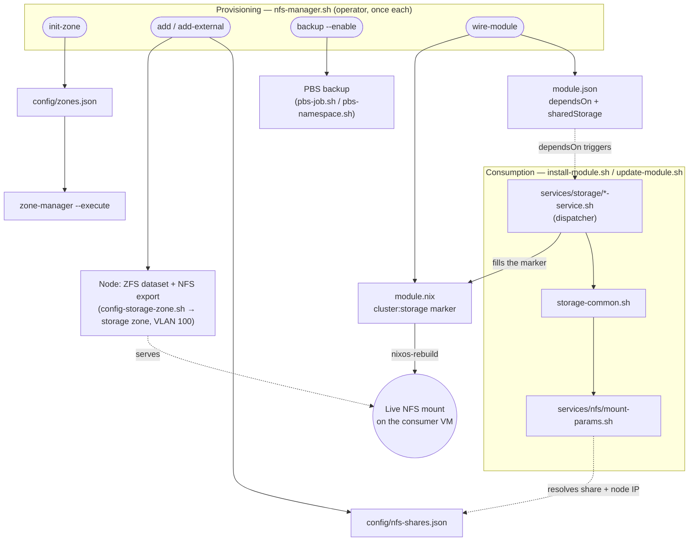

# cluster — Design notes

Implementation and reference detail for the cluster module. For the catalog entry see
[README.md](./README.md); for installation see [INSTALL.md](./INSTALL.md); for test
coverage see [TEST.md](./TEST.md).

Canonical online instructions: <https://tappaas.org/installation/foundation/cluster/>

## Capabilities

| Capability | Entry point | Purpose |
|------------|-------------|---------|
| `cluster:vm`  | `services/vm/*.sh` → `Create-TAPPaaS-VM.sh`   | Create/manage a VM guest for a consumer module |
| `cluster:lxc` | `services/lxc/*.sh` → `Create-TAPPaaS-LXC.sh` | Create/manage an LXC container guest |
| `cluster:ha`  | `services/ha/*.sh`                            | High-availability placement for a guest |

A consumer module opts in via `dependsOn`, e.g. `["cluster:vm", "cluster:ha"]`.
A guest is **either** a VM **or** a container, never both.

## Files

| File | Role |
|------|------|
| `install.sh` | Node bootstrap — run once per node from the Proxmox shell. Orchestrates the post-install + the three config phases below. Step [1/5] of `foundation/install.sh`. |
| `config-network.sh` | Phase 2 — build the `lan`/`wan` bridges from the physical ports (issue #141); also `--swap-gateway` / `--drop-upstream`. |
| `config-storage.sh` | Phase 3 — build the `tankXY` ZFS pools from the disks. |
| `sanity-check.sh` | Post-firewall health checks (gateway, DNS, internet) once the node is on the management network. |
| `install-platform.sh` | Run once on the first node after all nodes + firewall are up — imports the prebuilt NixOS template (vmid 8080) and builds the `tappaas-cicd` mothership (vmid 130). |
| `make-install-media.sh` | Build a preconfigured Proxmox install USB stick on your laptop (answers baked in; only the boot disk is asked on the target). |
| `Create-TAPPaaS-VM.sh` / `Create-TAPPaaS-LXC.sh` | Guest provisioners, distributed to every node and invoked by the `cluster:vm` / `cluster:lxc` services. |
| `reconcile-storage-nodes.sh` | Reconcile PVE storage node lists with reality. |
| `setup-ssd-lifecycle.sh` | Autotrim + TRIM/SMART cron jobs (#152). |
| `setup-realtek-nic.sh` | Realtek RTL8127 10GbE driver fix for MS-S1 MAX nodes (#308) — hardware-gated, idempotent. See [Node hardware quirks](#node-hardware-quirks). |
| `reboot-node.sh` / `reboot-cluster.sh` | Controlled HA node reboot (single node / orchestrated kernel-reboot pass) (#275). |
| `capture.sh` | Capture helper. |
| `update.sh` | Cluster module update — apt upgrade on all nodes and re-distribute the provisioners + `zones.json`; re-asserts the Realtek fix. |
| `test.sh` | Cluster regression tests (see [TEST.md](./TEST.md)). |
| `assets/` | Vendored binaries used at provision time (e.g. the pinned `r8127-dkms` `.deb`). |
| `lib/` | Shared helpers (`vm-net.sh` and its unit tests). |
| `snippets/` | Cloud-init snippets used by the provisioners. |

## install.sh — phases and flags

`install.sh` runs, in order:

1. **Base post-install** (first run only): disable enterprise repos, enable
   `pve-no-subscription`, remove the subscription nag, enable HA services, install helper
   scripts + `powertop`/`smartmontools` + SSD lifecycle, and `apt dist-upgrade`. Recorded
   by `/var/log/tappaas.step1`.
2. **Network phase** → `config-network.sh`
3. **Cluster phase** (create or join)
4. **Storage phase** → `config-storage.sh`
5. A **summary** of bridges, pools (with redundancy warnings) and cluster state. It also
   writes `~/tappaas/.cluster-role` (`created`/`joined`/`member`/`standalone`) for the
   `foundation/install.sh` orchestrator, which only chains the firewall + platform steps
   on the node that *created* the cluster.

The base step is skipped on re-runs (delete `/var/log/tappaas.step1` to force it); the
three config phases run every time and are individually idempotent.

```
install.sh [REPO] [BRANCH] --name <orgname>
           [--cluster|--join|--no-cluster] [--skip-network] [--skip-storage]
           [--lan-port <if>] [--wan-port <if>] [--pool <name=topo:disks>]...
           [--non-interactive]
```

| Flag | Effect |
|------|--------|
| `REPO` `BRANCH` | Positional; default `https://codeberg.org/TAPPaaS/TAPPaaS/raw/branch/` + `stable`. |
| `--name` | Org/system name → the Proxmox **cluster name** (falls back to `TAPPaaS` when run standalone without `--name`). |
| `--cluster` | Force-create the cluster on this node. |
| `--join` | Force this node to join an existing cluster (interactive). |
| `--no-cluster` | Leave the node standalone (no create, no join). |
| `--skip-network` / `--skip-storage` | Skip that phase. |
| `--lan-port` / `--wan-port` | NIC roles, forwarded to `config-network.sh` (needed for unattended runs). |
| `--pool name=topology:disks` | Pool specs, forwarded to `config-storage.sh` (repeatable). |
| `--non-interactive` | Never prompt. Phases that need choices do nothing unless given via flags; a cluster join prints the manual `pvecm add` command instead of prompting. |

`--skip-firewall`, `--skip-platform` and `--domain` are accepted for back-compat but
ignored here — those phases belong to `foundation/install.sh`.

Default cluster behaviour (no flag) is **auto**: `tappaas1` creates the cluster, every
other node joins it.

## Network (phase 2)

`config-network.sh` (issue #141) establishes the TAPPaaS bridge model:

- **`lan`** — VLAN-aware bridge (`bridge-vids 2-4094`) carrying the management network
  (untagged) plus every TAPPaaS VLAN as a trunk to the switch. Holds this node's
  management IP. The OPNsense firewall VM and all guest VLAN interfaces attach here.
- **`wan`** — plain bridge for the upstream/ISP uplink (the firewall VM's WAN).

It lists the physical ports with MAC / link state / speed so you can tell them apart,
you pick which port is LAN and which is WAN, and it rewrites `/etc/network/interfaces`
accordingly. The management IP/gateway default to the values already on the node (set
during the Proxmox install).

**Lockout protection:** applying the change arms a **90-second auto-rollback**. After it
applies you must type `keep` to make it permanent; if you get disconnected or do nothing,
the node reverts to the previous working config.

It is also the script behind the bootstrap's **gateway cutover** (`--swap-gateway`,
additive: keeps the upstream IP, points default route + DNS at the firewall) and the
later hardening step (`--drop-upstream`). It can be re-run any time to reassign ports.

```
config-network.sh [--lan-port <if>] [--wan-port <if>] [--mgmt-ip <CIDR>]
                  [--gateway <ip>] [--no-rollback] [--dry-run|--apply]
                  [--non-interactive]
```

| Flag | Effect |
|------|--------|
| `--lan-port` / `--wan-port` | Assign ports non-interactively. |
| `--mgmt-ip` / `--gateway` | Override the management IP / gateway (default: current). |
| `--dry-run` | Print the rendered config and exit without writing. |
| `--no-rollback` | Apply without the auto-rollback safety (not recommended). |
| `--non-interactive` | Fail rather than prompt (requires `--lan-port`). |

## Cluster (phase 3, runs before storage)

Runs **before** storage — a ZFS pool created on a standalone node (before it is a
cluster member) is not usable as HA-failover storage in Proxmox, so pools must be
created while the node already belongs to the cluster.

| Situation | Behaviour |
|-----------|-----------|
| Already a member | Detected via `pvecm status` and skipped. |
| `tappaas1` (or `--cluster`) | `pvecm create <orgname>` (fallback name `TAPPaaS`). |
| Any other node (or `--join`) | **Interactive join**: prompts for an existing node's address (default `tappaas1.mgmt.internal`) and runs `pvecm add`, which prompts for that node's root password. |
| `--no-cluster` | Skipped; node stays standalone. |

Node management IPs follow `tappaasN` → `10.0.0.<9+N>` (max 9 nodes — the firewall
reserves DNS + static IPs for `tappaas1`–`tappaas9` only; higher numbers abort).

In `--non-interactive` mode a join cannot supply the password, so the script prints the
`pvecm add tappaas1.mgmt.internal` command for you to run.

## Storage (phase 4)

`config-storage.sh` builds the TAPPaaS ZFS data pools and registers them with PVE
storage. Naming convention: `tankXY` where `X` is the tier/type (`a` = primary/fast,
`b`, `c`, …) and `Y` a sequence number.

Disk selection rules:

- The **boot disk** (the disk backing `/` and `/boot/efi`) is never offered and never
  touched. ZFS zvols and device-mapper/loop devices are excluded.
- **Every other disk is offered, including disks already in an existing
  `tanka1/b1/c1`** — tagged `[in zpool …]` — so a machine that used to belong to another
  TAPPaaS cluster can be wiped and re-provisioned.
- Any disk that **already contains data** requires an explicit confirmation before it is
  wiped. Pools are created with `ashift=12`, `autotrim=on`, `compression=lz4`,
  `atime=off`.

```
config-storage.sh [--pool <name>=<topology>:<disk>[,<disk>...]] [--list]
                  [--yes] [--non-interactive] [--no-pve-register]
```

| Flag | Effect |
|------|--------|
| `--list` | Print the selectable disks (with pool tags) and exit. |
| `--pool name=topology:disks` | Define a pool non-interactively (repeatable). `topology` ∈ `single` (1 disk), `stripe` (2+ disks, no redundancy), `mirror`, `raidz`, `raidz2`. E.g. `--pool tanka1=mirror:nvme0n1,nvme1n1` or `--pool tankc2=stripe:sdc,sdd`. |
| `--yes` | Assume "yes" to wipe confirmations — **destructive**; unattended use only. |
| `--non-interactive` | Fail rather than prompt (requires `--pool`). |
| `--no-pve-register` | Create the pools but do not add them to PVE storage. |

Interactively, it offers to build `tanka1`, `tankb1`, `tankc1` in turn; for each you pick
disks and a topology (existing pools are skipped).

## Storage design decisions

The rationale for the ZFS-based storage model and the pool tiers.

**ZFS as the storage manager.** ZFS meets the criteria for an efficient, scalable,
redundant, flexible and trustworthy storage solution, combined here with a standard
setup of snapshots and replication across cluster nodes. It gives TAPPaaS
enterprise-grade storage on commodity disks without dedicated (costly) SAN/NAS
hardware — in small to medium deployments this can cut storage hardware cost by up to
50%. The design stays hardware-agnostic on SSD vs HDD and caching layout. Growth paths:
add disks to a pool, add pools to a node, add nodes to the cluster. Redundancy is
layered: ZFS RAID within a node, snapshot + replication across nodes (`cluster:ha`),
and backup between local and remote installations (the `backup` module).

**Known limitation — no synchronous cross-node replication.** The `cluster:ha` service
uses asynchronous ZFS replication (default schedule `*/15`, i.e. up to 15 minutes of
data loss on failover; a module can tighten this via its `replicationSchedule`).
Providing a synchronous option (Ceph, Garage S3) is a roadmap item, recommended only
for large installations.

### Pool tiers

`tankXY`: `X` is the tier, `Y` a sequence number. Pools mount at `/<poolname>`
(e.g. `/tanka1`). The tier meanings (also printed by `config-storage.sh`):

| Tier | Purpose | Typical build |
|------|---------|---------------|
| `tanka` | Primary VM storage — VM virtual disks and HA replication live here | fast + redundant (mirrored SSDs) |
| `tankb` | Second-tier data: less-important services, S3 buckets, logging | no RAID redundancy, cheaper disks, no HA replication |
| `tankc` | Backup — the PBS datastore | cost-optimized, mostly single-stream write; typically on one node only (`tappaas3` in a 3-node cluster) |

Letters `d`, `e`, … remain free for specialized storage characteristics.

## Shared storage (`cluster:storage`)

A different layer from `config-storage.sh`'s `tankXY` pools above: those hold
**VM virtual disks** (one disk, one VM owner). `cluster:storage` instead
gives **multiple modules** concurrent access to a **named, foundation-owned
share** — no module owns the underlying disk or export. First backend: NFS,
via `nfs-manager.sh`. CephFS is a documented, deferred future backend (see
`~/.claude/plans/TODO-ceph-s3.md`) — nothing below changes when it lands; a
module only ever declares a share *name*, never a backend.

### Using it — three commands, in order

```bash
nfs-manager.sh init-zone                          # 1. once per site — provisions the storage VLAN
nfs-manager.sh add media --node tappaas1 --tank tankc1 --quota 500G --backup
                                                   # 2. once per share — ZFS dataset + export + registry + backup
nfs-manager.sh wire-module <module>.json media     # 3. once per consuming module — dependsOn + sharedStorage + .nix marker
```

Then `install-module.sh`/`update-module.sh <module>` as normal — no hand
editing of `zones.json`, module JSON, or `.nix` files anywhere in the loop.
Each command is idempotent (safe to re-run) and self-checking: `init-zone`
leaves an existing zone untouched, `wire-module` refuses to touch a `.nix`
file whose target mount point is already used elsewhere, and verifies its
own edit with `nix-instantiate --parse` before accepting it. A module can
declare more than one share — just call `wire-module` again with a different
share name; `dependsOn`/the marker are only ever added once, `sharedStorage`
accumulates.

### Component & dependency diagram



**Concurrent multi-module access is a first-class property, not a side
effect**: two independent modules can mount the same share simultaneously,
each able to read what the other writes, with no single module's
install/delete lifecycle affecting another's mount.

### Directory permissions

`nfs-manager.sh add ... --layout` pre-creates the declared folder structure
as `1777` (world rwx + sticky, like `/tmp`), not `root:root 755`. Every
consuming module runs its own unprivileged service account, uncoordinated
across VMs (no shared uid/gid scheme) — a locked-down root-owned tree would
let only root write, defeating the point of a share multiple non-root
modules write into. The sticky bit still stops one module's account from
deleting files it doesn't own.

### Network: the `storage` zone

A bare Proxmox node hosting an NFS export is not itself a VM/LXC, so it
can't get a zone IP the normal way (`cluster:vm`/`cluster:lxc`'s
tap/veth-plus-`trunks=` mechanism). Reaching it from a consumer zone
(`srvHome`, etc.) without exposing the whole `mgmt` control-plane subnet
(Tier-0 — no inbound pinholes, ever, see `zones.json`'s
`isolation_invariant`) needs a dedicated zone instead: `storage` (VLAN 100,
`10.1.0.0/24`).

Giving a node presence on this zone is split across the two canonical,
already-existing tools rather than any bespoke script:

- `proxmox-manager bridge-vids --apply` — the zones.json-driven bridge-trunk
  reconciler (already existed for VM trunks; also reconciles every node's
  own `lan` bridge-vids to the active VLAN set).
- `config-network.sh --zone-presence <name> --vlan-id <N> --zone-ip <CIDR>
  [--zone-gateway <ip>]` — the node's own tagged sub-interface + IP + policy
  routing, using the same backup/apply conventions as every other
  `config-network.sh` mode (idempotent, `ifreload`-applied, not a
  hand-rolled `ip`/`bridge` side script).

`cluster/config-storage-zone.sh` orchestrates both from `tappaas-cicd`:
resolves the zone's VLAN/CIDR from `zones.json` (`lib/storage-zone.sh`),
copies the current `config-network.sh` to the node and invokes
`--zone-presence`, then re-syncs the firewall VM's own trunk list
(`proxmox-manager trunks --apply`, same reconcile `network/update.sh`
already runs after any zone change, #194/#335).

**Optional dedicated NIC.** By default the storage zone rides a VLAN
sub-interface (`lan.100`) on the node's existing shared trunk — same physical
link as every other zone, including `mgmt`'s corosync heartbeat. All zones
share one physical NIC by default; there is no bandwidth isolation between
them. For heavier storage loads (large media transfers today; Ceph OSD
replication later, which can saturate a shared link fast with NVMe-backed
OSDs), a node can declare `hardware.nodes[].storageNic` in `site.json` — an
extra physical NIC dedicated to the `storage` zone's traffic only.
`config-network.sh --zone-presence` then takes `--physical-nic <ifname>` and
builds the VLAN sub-interface on that NIC instead of `lan`
(`config-storage-zone.sh` reads `storageNic` and passes it through
automatically when set). Purely additive — omitting the field keeps the
default shared-trunk behavior unchanged. The switch port the dedicated NIC
lands on still needs to carry the VLAN; for Ceph's own inter-node OSD mesh
(not this zone) the cheaper option at small node counts is direct-attach
cabling between nodes instead of a switch capable of the same throughput —
see `~/.claude/plans/TODO-ceph-s3.md`.

### Backup (optional, per-share, PBS-linked)

Backup is a property of the **share**, not any consuming module — set once,
independent of every module's own `backup:vm`:

```bash
nfs-manager.sh backup <name> --enable [--keep-daily N --keep-weekly N --keep-monthly N --keep-yearly N]
nfs-manager.sh backup <name> --disable   # pauses the schedule only — never deletes PBS history
```

Reuses `backup/lib/pbs-job.sh` + `pbs-namespace.sh` unchanged — the same
helpers `backup/services/external/install-service.sh` already uses to
onboard a non-VM backup source. A raw ZFS dataset has no VMID, so this is
`proxmox-backup-client`'s directory-backup mode (`backup <name>.pxar:<path>`),
not the VZDump path `backup:vm` uses. Provisioning creates a dedicated PBS
user (`nfs-<name>@pbs`) scoped to its own namespace
(`cluster-storage/<name>`), an admin-owned prune job, and a systemd
timer/template pair (`cluster-storage-backup@<name>.{service,timer}`, shared
across all shares via `%i` templating) that runs
`proxmox-backup-client backup` daily. The share's PBS credentials
(including the cert fingerprint — `proxmox-backup-client` reads
`PBS_FINGERPRINT` from its environment, there is no `--fingerprint` CLI flag)
live in `/root/.cluster-storage-pbs/<name>.env` on the node, mode 700.

## High Availability

HA keeps services running when a component fails. The cluster module covers the failure classes it
owns; the network-layer ones (firewall failover, load-balancing, internet/DNS survival) belong to
the **network** module.

| Failure | Protection |
|---------|-----------|
| **Disk failure** | ZFS redundancy within the pool — mirror for `tanka` (§Pool tiers) |
| **Node / hardware failure, planned reboots** | On a 3+-node cluster each HA-enabled service has a default fail-over node; Proxmox restarts it there from the replicated `tanka` copy (`cluster:ha`), typically within minutes |
| **Failover data gap** | replication is asynchronous, so up to the `replicationSchedule` window may be lost on failover (§Storage design decisions); a synchronous option (Ceph/Garage) is a roadmap item for large sites only |

A cluster is **optional** (a single node has no fail-over) but recommended beyond a small setup.
Outside the cluster's remit: **UPS / power paths** are site-specific and out of scope; **OPNsense
failover, reverse-proxy load-balancing, and internet-outage DNS survival** are the network module's
concern.

## Adding more nodes

The supported flow is `site-manager node add tappaasN --pxe` from the mothership (see
[INSTALL.md](./INSTALL.md) and the repo-root [INSTALL.md](../INSTALL.md) §2.2):
a TTL-limited PXE trap installs Proxmox unattended, then the node step runs served from
the mothership, joins the cluster and creates the declared pools. A manual install with
the stock ISO followed by `site-manager node add tappaasN` (no `--pxe`) is equivalent.

`update.sh` (run from the mothership) keeps the provisioners and `zones.json` in sync
across all nodes.

## Node hardware quirks

### Minisforum MS-S1 MAX — Realtek RTL8127 10GbE (issue #308)

The MS-S1 MAX's two 10GbE ports are Realtek **RTL8127** `[10ec:8127]`. The in-tree
**`r8169`** driver fails to re-initialise them across a **warm/soft reboot** — the NIC
drops off the PCIe bus and only a **full power cycle** brings it back. (Same chipset bug
seen on the NVIDIA DGX Spark.) Intel-`igc` nodes are unaffected.

The fix is codified in **`setup-realtek-nic.sh`** (run by `install.sh` at bootstrap and
re-asserted by `update.sh` every cycle; hardware-gated, idempotent): install Realtek's
**`r8127`** DKMS driver (vendored, SHA256-pinned, in `assets/`) and blacklist `r8169` —
but **only after** the `r8127` module is confirmed to build and load, so a future kernel
that can't build it never leaves the node driverless.

Two steps the OS cannot do for you (the script detects and instructs):

1. **Disable Secure Boot** in the BIOS — the unsigned DKMS module will not load
   otherwise (or MOK-sign it). The MS-S1 MAX ships with Secure Boot **enabled**.
2. **One power cycle** the first time — the node boots on `r8169`; only a full power
   cycle (drain), not a warm reboot, switches cleanly to `r8127`. After that, warm
   reboots (incl. the `#275` automated kernel-reboot pass) are safe.

Because `update.sh` re-runs the enforcer every cycle and DKMS rebuilds `r8127` for each
new kernel, ordinary updates **maintain** the fix rather than overwrite it; a
from-scratch reinstall re-applies it automatically via `install.sh`.

## Related issues

- #140 — automate cluster create/join in `install.sh`
- #141 — `config-network.sh` (lan/wan bridge setup, gateway cutover)
- #175 — robust downloads (`fetch()`): a failed download is now fatal, never a silent
  0-byte file reported as success
- #275 — controlled HA node reboots (`reboot-node.sh` / `reboot-cluster.sh`)
- #308 — Realtek RTL8127 NIC driver fix for MS-S1 MAX (`setup-realtek-nic.sh`)
