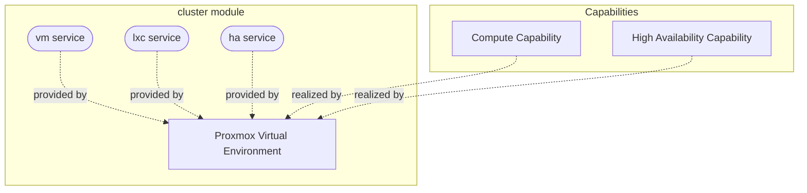

# cluster

Primary audience: TAPPaaS admin.

The Proxmox VE layer of TAPPaaS — turns commodity nodes into a cluster that provides the
VM, LXC and HA services every other TAPPaaS module builds on.

## What you get

| Capability | Access from | How |
|------------|-------------|-----|
| Proxmox VE cluster (1–9 nodes, `tappaas1`…`tappaas9`) | mgmt zone | `https://tappaas1.mgmt.internal:8006` (`10.0.0.10`) |
| VM provisioning (`cluster:vm`) | consumer modules | `dependsOn: ["cluster:vm"]` → `services/vm/` hooks |
| LXC provisioning (`cluster:lxc`) | consumer modules | `dependsOn: ["cluster:lxc"]` → `services/lxc/` hooks |
| HA placement + replication (`cluster:ha`) | consumer modules | `dependsOn: ["cluster:ha"]` → `services/ha/` hooks |
| `lan`/`wan` bridge model (VLAN-aware trunk) | nodes | built by `config-network.sh` at install |
| ZFS data pools (`tankXY`) | nodes | built by `config-storage.sh` at install |
| Controlled node/cluster reboots | TAPPaaS admin | `reboot-node.sh` / `reboot-cluster.sh` |

A guest is **either** a VM **or** an LXC container, never both.

## Architecture

The Compute and High Availability capabilities are realized by Proxmox VE, which
provides the `vm`, `lxc` and `ha` services (the module's `provides` in
`cluster.json`) that every other TAPPaaS module builds on.

## What is not included

- The firewall/router itself — that is the [`network`](../network/README.md) module
  (its VM runs on this cluster).
- The VM base images — the [`templates`](../templates/README.md) module.
- Backup, identity, logging — separate foundation modules.
- More than 9 nodes (the firewall reserves IPs/DNS for `tappaas1`–`tappaas9` only).
- General Proxmox administration guidance beyond the TAPPaaS conventions.

## Requirements

- One node (or three for a cluster) capable of running **Proxmox VE 9.1** (9.2 is not
  yet supported), each with **two NICs** (one WAN, one LAN).
- A dedicated **boot disk** (ext4/LVM) plus separate data disks for the `tankXY` pools.
- An existing network with a free IP, DHCP and internet for the bootstrap.
- Multi-node: a switch between the nodes — unmanaged works out of the box; a managed
  switch needs VLAN trunking configured first (see the repo-root
  [INSTALL.md](../../../INSTALL.md)).

## Alternatives considered

- XCP-ng — seems less polished and with fewer features (though it also seems more "free").
- FreeNAS/TrueNAS — good for storage (same ZFS underpinning) but not really a cloud
  platform: no clustering and HA like Proxmox.

Source: the TAPPaaS software-selection design (Documentation repo,
`docs/architecture/solution-design/software-selection.md`). Depth: see [DESIGN.md](./DESIGN.md).

## Dependencies

None — `cluster` is the bottom layer of the foundation (`dependsOn: []`). It provides
`vm`, `lxc` and `ha` to everything else.

For installation steps see [INSTALL.md](./INSTALL.md).

Design and implementation detail: [DESIGN.md](./DESIGN.md). Test coverage: [TEST.md](./TEST.md).
