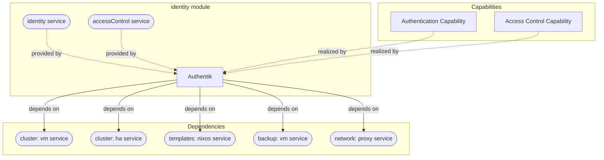

# identity

Primary audience: TAPPaaS admin.

Authentik SSO identity provider for TAPPaaS — one login per person, roles via groups,
single sign-on across all modules.

## What you get

| Capability | Access from | How |
|------------|-------------|-----|
| Authentik SSO web UI (login + admin) | internet (via reverse proxy) | `https://identity.<domain>` |
| Forward-auth gating for header-based apps (e.g. Open WebUI) | consumer modules | module declares `dependsOn: ["identity:accessControl"]` — wired automatically at its install |
| OIDC provider for native-OIDC apps (e.g. Nextcloud) | consumer modules | module declares `dependsOn: ["identity:identity"]` — OAuth2/OpenID provider, app, group bindings and VM secrets wired automatically |
| Role-based access (role groups reconciled by `people-manager`) | admin (tappaas-cicd) | `people-manager sync`; also manageable in the Authentik admin UI |
| Authentik API access for tooling | tappaas-cicd | `authentik-manager` with auto-bootstrapped `~/.authentik-credentials.txt` |

Reference docs in this directory:

- [USERS.md](./USERS.md) — users & roles operator guide (roles, scopes, credential
  delivery).
- [TEST.md](./TEST.md) — what the module tests cover (fast and deep tiers).

## Architecture

The Authentication and Access Control capabilities are realized by Authentik, which
provides the `identity` (OIDC) and `accessControl` (forward-auth) services (the
`provides` in `identity.json`) consumed by other modules; the VM itself is
provisioned, backed up and published by the foundation services it depends on.

## What is not included

- Emailed one-time enrollment links — deferred until SMTP is set up; the fallback is a
  printed temporary password (see [USERS.md](./USERS.md)).
- Role/user lifecycle — owned by `people-manager` (ADR-007), not by this module's
  scripts.
- Per-app authorization beyond group bindings — each app is gated per-app via its
  Authentik application (ADR-006).
- Never stack forward-auth and OIDC on the same app (double login — ADR-006 §4).

## Requirements

- TAPPaaS foundation base installed: cluster, network (OPNsense + Caddy), templates,
  tappaas-cicd, backup.
- A resolved domain (from `config/environments/` or legacy
  `configuration.json .tappaas.domain`).
- Sizing defaults: 2 cores, 4096 MB RAM, 32G disk on `tanka1` (VMID 140, zone `mgmt`,
  NixOS template 8080).

## Dependencies

| Depends on | Purpose |
|------------|---------|
| `cluster:vm` | Creates the identity VM (clone of template 8080) |
| `cluster:ha` | HA registration for the VM |
| `templates:nixos` | NixOS VM template |
| `backup:vm` | Registers the VM in the managed PBS backup job |
| `network:proxy` | Public HTTPS via Caddy (proxy port 9000, allowed from `internet`) |

Provides the `identity` and `accessControl` services consumed by other modules.

For installation steps see [INSTALL.md](./INSTALL.md).
