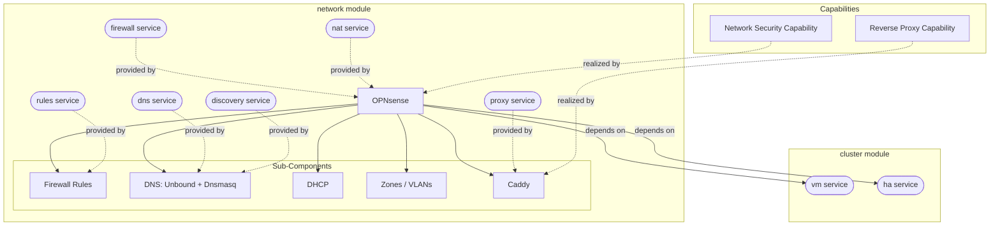

# network

Primary audience: TAPPaaS admin.

The TAPPaaS network VM (OPNsense) — routing, zones/VLANs, DNS, DHCP, NAT, per-module
firewall rules and the Caddy reverse proxy for every published service.

## What you get

| Capability | Access from | How |
|------------|-------------|-----|
| OPNsense firewall/router at `10.0.0.1` | mgmt zone | `https://10.0.0.1` (GUI), root password set at bootstrap |
| Zones/VLANs from `zones.json` | whole platform | `zone-manager` (driven by tappaas-cicd) |
| Internal DNS `<vmname>.<zone>.internal` | all zones | Unbound + Dnsmasq on the firewall |
| Reverse proxy (`network:proxy`) | consumer modules | `dependsOn: ["network:proxy"]` → Caddy entry `<service>.<domain>` |
| Per-module firewall rules (`network:rules`) | consumer modules | `dependsOn: ["network:rules"]` → `rules-manager` compiles `ports`/`ingress`/`egress` |
| Public HTTPS entry (Caddy :80/:443) | internet | for services with `proxyAllowedZones: ["internet"]` |
| Switch / WiFi-AP / Proxmox VLAN reconciliation (ADR-008) | TAPPaaS admin | `network-manager reconcile`, `switch-controller`, `ap-controller` — see [scripts/README.md](scripts/README.md) |
| Isolated test network on a spare NIC | TAPPaaS admin | `test-network.sh` — see [docs/test-network-setup.md](docs/test-network-setup.md) |

## Architecture



The Network Security and Reverse Proxy capabilities are realized by the OPNsense VM
and its Caddy plugin. The module provides the `firewall`, `proxy`, `rules`,
`discovery`, `dns` and `nat` services (the `provides` in `network.json`) that
consumer modules depend on; the VM itself is created and kept highly available by the
`cluster` module.

## What is not included

- TLS certificate issuance — run `acme-setup.sh` on the mothership after bootstrap
  (repo-root [INSTALL.md](../INSTALL.md) §2.3).
- Managing a non-OPNsense firewall: with `firewallType: "NONE"` the tooling only prints
  the rules for manual entry into your own firewall.
- Vendor automation for switches/APs beyond the shipped plugins (UniFi; `manual.sh` is
  the by-hand fallback for everything else).
- The admin VPN / satellite ingress — see the `satellite` module and
  [ADMIN-VPN.md](../tappaas-cicd/manager/network-manager/ADMIN-VPN.md) (`network-manager wgvpn`).

## Requirements

- A cluster node with the `lan`/`wan` bridges built (`cluster` module, `config-network.sh`).
- Internet on the WAN side to download the prebuilt firewall image at bootstrap.
- Defaults (from `network.json`): VM 110, 4 cores, 8 GB RAM, 32 GB disk on `tanka1`,
  `net0→lan` (trunk ALL), `net1→wan`.

## Alternatives considered

- pfSense — the original, but going more and more commercial.
- OpenWRT — seems less scalable and less feature-rich.
- Proxmox built-in firewall — would be easier (already built in), but less secure.

Source: the TAPPaaS curation criteria (Design Principles, tappaas.org
What → Principles). Depth: see [DESIGN.md](./DESIGN.md).

## Dependencies

| Depends on | Purpose |
|------------|---------|
| `cluster:vm` | Creates the OPNsense VM from the prebuilt image |
| `cluster:ha` | High-availability placement of the firewall VM |
| `network:proxy` | Registers the firewall's own GUI (`:8443`) behind Caddy |

## Split-horizon DNS — `network:proxy` (ADR-021)

A published service answers at **one URL** inside and out. Inside, Unbound holds the
override, and the answer is **always the DMZ gateway** — where `os-caddy` listens —
regardless of which zone asked (ADR-021 D2). One name, one answer, one writer.

The address comes from **one resolver**, which every writer calls rather than deriving
its own (D5):

```
network-manager split-horizon-target <domain>
    exit 0  → stdout is the address to register
    exit 3  → UNPUBLISHED: no public DNS for this name
    exit 1  → error: the site cannot express an answer (no dmz zone)
```

Before this, three code paths each transcribed the rule and disagreed on a live site
(#577): `network:proxy` resolved a *client* zone, while `acme-setup.sh` and
`environment-manager` resolved a *service* zone. Do not reintroduce a local
derivation, however small — that is precisely how the drift started.

**Reachability is not encoded in the address.** A client reaches the DMZ gateway via
the caddy-reach firewall rule (`/32`, tcp 80+443 — see network-manager's `ZONES.md`),
and *authorization* is Caddy's `proxyAllowedZones` ACL plus the Authentik identity
gate. No zone gets `access-to: dmz`; that would grant the whole DMZ subnet including
the firewall's own GUI and SSH (#618).

**A service with no public DNS record is supported, not broken** (R3). ACME cannot
issue for a name that does not resolve publicly, so there is no certificate and
nothing for Caddy to serve. Install and update **succeed**, publishing is skipped
cleanly, and the operator gets one line saying what was lost:

> `<module>` is not published (no external DNS for `<domain>`) — reachable only at
> `<module>.<zone>.internal`, without TLS and without the identity gate.

That is a different message from "I could not work out the address for a service that
should be published", and the two must not be conflated.

For installation steps see [INSTALL.md](./INSTALL.md).

Design and implementation detail: [DESIGN.md](./DESIGN.md). Test coverage:
[TEST.md](./TEST.md). Troubleshooting: the
[Unbound / DNSBL section of DESIGN.md](./DESIGN.md#troubleshooting-unbound--dnsbl).
