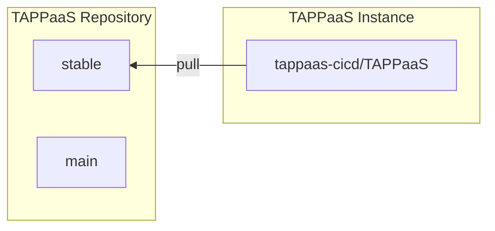
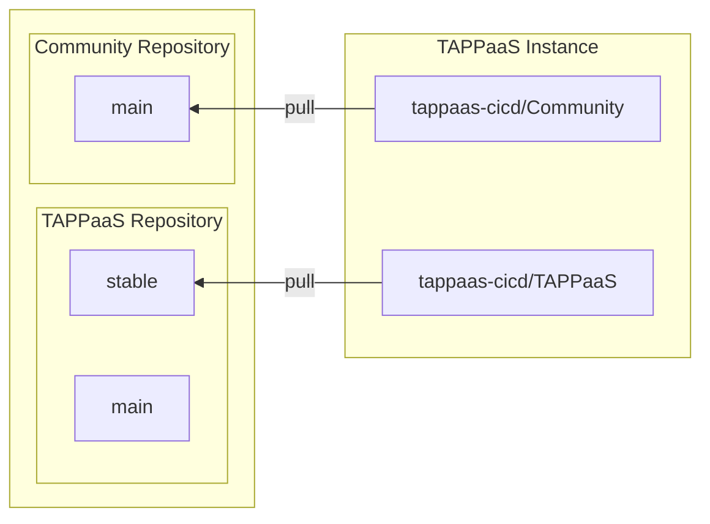
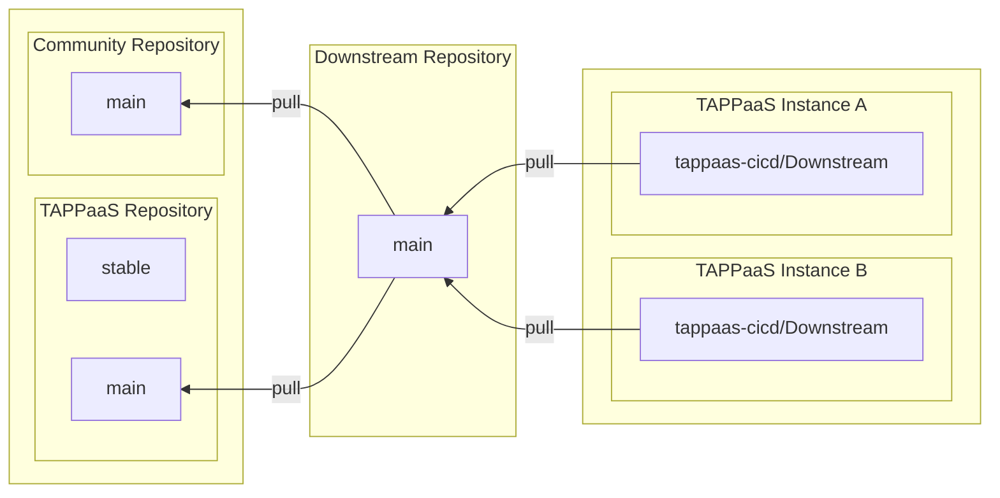
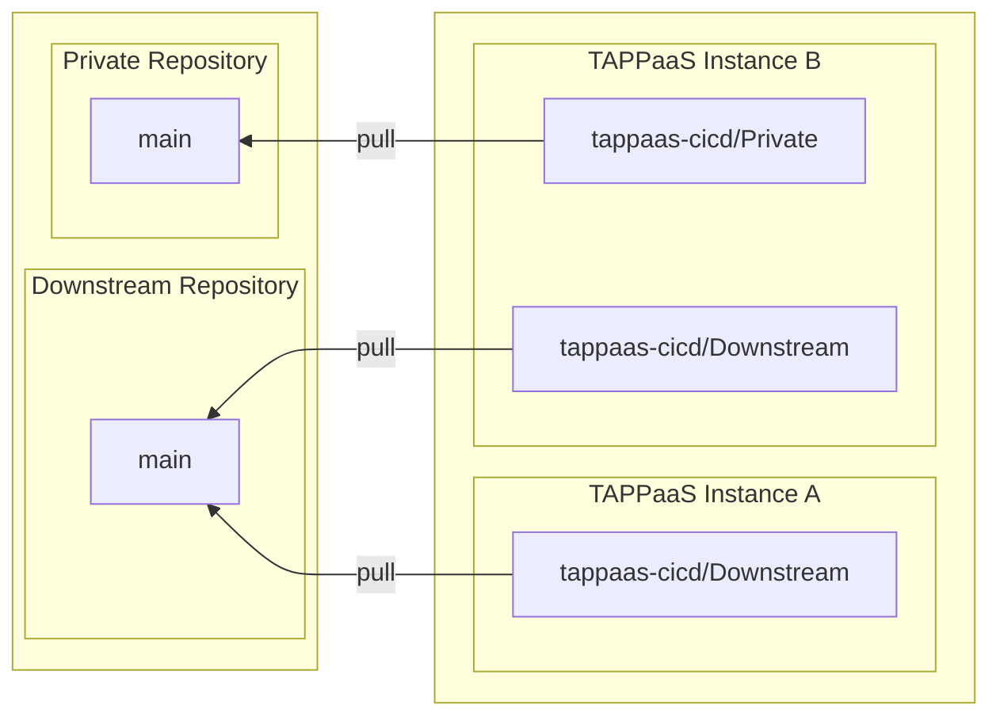
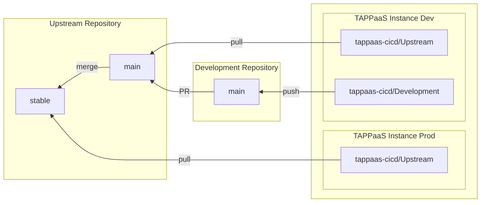

# tappaas-cicd — Git & repository topology (design notes)

How TAPPaaS gets its updates, and the repository patterns behind it. For the control-plane design
see [DESIGN.md](./DESIGN.md); catalog entry [README.md](./README.md).

Fundamentally TAPPaaS is **GitOps, pull-based**: on a schedule a running TAPPaaS pulls the latest
from an upstream repository and then runs an update operation on the instance based on the new
configuration. This is done by the **`tappaas-cicd`** module, which maintains a git clone of each
upstream repository it tracks.

The tracked repositories are the **`repositories`** list in `config/site.json` on the `tappaas`
user of the `tappaas-cicd` module, managed with **`site-manager repository add|delete|list`** (the
legacy `repository.sh` now delegates to it). There are four basic patterns, below; module and
application developers add a couple more variations (end of page).

---

## Basic TAPPaaS GitOps

The setup you get by following the install guide. The default upstream is the open-source TAPPaaS
repository (`codeberg.org/TAPPaaS/TAPPaaS`); you install the standard modules the project ships.

Pick the branch your system tracks: **`stable`** (released, supported) or **`main`** (ongoing
development — moves fast, for testing/staging). See the install *Preparation* branch-selection step.

---

## Community repositories

Add a community repository to expand the modules you can install.

---

## Downstream repositories

If you manage a fleet of TAPPaaS instances you can inject a **staging** repository between the
open-source repositories and your installations — controlling which modules are available and
changing default values to match your deployment.

---

## Private repositories

Finally, add your own private repositories to the mix.

---

## Developing TAPPaaS modules

When developing modules you want a **test** TAPPaaS instance in parallel with production. The
running instance can be any of the topologies above; the essence is a **private branch** — likely on
a private git system — upstream of the development instance.

The module in the development repo is tested on the dev system; when it's ready it's submitted to
the upstream repository via a Pull Request. Upstream can be TAPPaaS proper, a TAPPaaS community
repository, or kept as a private repository.

If a module is sufficiently stand-alone it can be developed on a **production** system — TAPPaaS's
isolation keeps development errors off production. The two key separations:

- a module gets its **own VM** with a defined resource envelope;
- a module can be deployed in a **separate zone** (a developer can enable a dedicated zone alongside
  `srv` so development traffic never touches production).

*Can the development repository be hosted on TAPPaaS itself?* Yes — it needs a git system. TAPPaaS
plans to ship **Forgejo** (the software behind Codeberg) as part of the DevOps stack (not available
yet).

---

## Developing applications to be deployed on TAPPaaS

Developing a TAPPaaS *module* is developing the deployment automation for an application. If instead
you want to develop the **application itself** and use TAPPaaS as a CI or CD system, that is also
possible: the intent is a stack of modules delivering a full DevOps pipeline. The **CD** aspect is
the pull-based system above; the **CI** part (Forgejo, pipeline runners, binary repositories) is
planned, and its build output can be pulled by the CD system.
