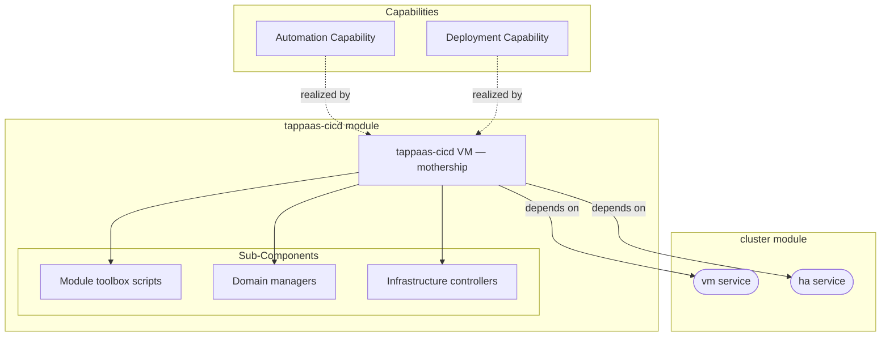

# tappaas-cicd

Primary audience: TAPPaaS admin.

The TAPPaaS "mothership" — the control-plane VM that installs, updates, tests and
configures every other module in the system.

## What you get

| Capability | Access from | How |
|------------|-------------|-----|
| Admin shell + module toolbox | mgmt zone | `ssh tappaas@tappaas-cicd`; `install-module.sh`, `update-module.sh`, `test-module.sh`, `delete-module.sh`, … in `~/bin` |
| Domain managers (config state) | mothership CLI | `site-manager`, `environment-manager`, `module-manager`, `network-manager`, `people-manager`, `health-manager`, … |
| Infrastructure controllers (runtime state) | mothership CLI | `opnsense-controller`, `proxmox-controller`, `switch-controller`, `identity-controller`, `node-provisioner`, … |
| Scheduled system updates | automatic | `update-tappaas` systemd timer (logs → journald → Loki) |
| System configuration store | mothership | `/home/tappaas/config` (`site.json`, `zones.json`, environments, module jsons) |
| Unattended node adding (PXE) | mothership CLI | `site-manager node add <name> --pxe` (netboot assets staged at install) |
| Admin VPN termination on OPNsense | anywhere (WireGuard) | set up at install; enrol devices per [ADMIN-VPN.md](./ADMIN-VPN.md) |
| Module store registration | mothership CLI | `repository.sh add <repo>` for community module stores |

## Architecture

The Automation and Deployment capabilities are realized by the mothership VM through
its toolbox scripts, domain managers and infrastructure controllers. The module
provides no `dependsOn` services of its own (`provides: []` in `tappaas-cicd.json`)
— it is the control plane that installs and drives every other module.

## What is not included

- The hypervisor layer (`cluster`), the firewall (`network`), the base images
  (`templates`) — this VM *drives* them, it does not contain them.
- Backup, identity and logging services — separate foundation modules that this VM
  installs (`rest-of-foundation.sh`).
- TLS certificate issuance — a post-install step (`acme-setup.sh`).

## Requirements

- The NixOS template (VM 8080) imported on the cluster (`templates` module).
- The OPNsense firewall at `10.0.0.1` (`network` module). Without it the platform is
  configured with `firewallType: "NONE"` and proxy/rules need manual handling.
- Defaults (from `tappaas-cicd.json`): VM 130 in zone `mgmt`, 4 cores, 16 GB RAM,
  32 GB disk on `tanka1`, HA replication every 15 min.

## Dependencies

| Depends on | Purpose |
|------------|---------|
| `cluster:vm` | Creates the mothership VM (clone of the NixOS template) |
| `cluster:ha` | HA placement + `*/15` replication of the VM |

For installation steps see [INSTALL.md](./INSTALL.md).

Design and implementation detail (component contract, manager/controller dispatch):
[DESIGN.md](./DESIGN.md). Test coverage: [TEST.md](./TEST.md). Remote admin access:
[ADMIN-VPN.md](./ADMIN-VPN.md). The `manager/` and `controller/` subtrees carry their
own READMEs.
