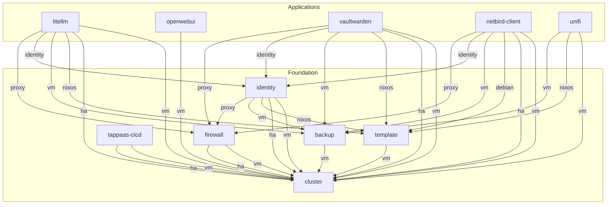

# TAPPaaS Module Dependency Graph

This document shows the service dependencies between TAPPaaS foundation and application modules.
Each arrow points from a **consumer** module to the **provider** module it depends on, labeled with the service name.

Generated: 2026-02-22

## Dependency Graph

## Module Summary

| Module | Category | Provides | Depends On |
|--------|----------|----------|------------|
| cluster | Foundation | vm, ha | _(none)_ |
| firewall | Foundation | firewall, proxy | cluster:vm, cluster:ha |
| tappaas-cicd | Foundation | _(none)_ | cluster:vm, cluster:ha |
| identity | Foundation | accessControl, identity | cluster:vm, cluster:ha, template:nixos, backup:vm, firewall:proxy |
| backup | Foundation | vm | cluster:vm |
| template | Foundation | nixos, debian | cluster:vm |
| litellm | Application | models | cluster:vm, cluster:ha, template:nixos, backup:vm, identity:identity, firewall:proxy |
| openwebui | Application | _(none)_ | cluster:vm |
| vaultwarden | Application | _(none)_ | cluster:vm, cluster:ha, template:nixos, backup:vm, identity:identity, firewall:proxy |
| netbird-client | Application | _(none)_ | cluster:vm, cluster:ha, template:debian, backup:vm, identity:identity, firewall:proxy |
| unifi | Application | _(none)_ | cluster:vm, template:nixos, backup:vm |

## Service Provider Summary

| Service | Provider | Consumed By |
|---------|----------|-------------|
| vm | cluster | firewall, tappaas-cicd, identity, backup, template, litellm, openwebui, vaultwarden, netbird-client, unifi |
| ha | cluster | firewall, tappaas-cicd, identity, litellm, vaultwarden, netbird-client |
| nixos | template | identity, litellm, vaultwarden, unifi |
| debian | template | netbird-client |
| vm | backup | identity, litellm, vaultwarden, netbird-client, unifi |
| proxy | firewall | identity, litellm, vaultwarden, netbird-client |
| identity | identity | litellm, vaultwarden, netbird-client |
| models | litellm | _(no consumers yet)_ |
| firewall | firewall | _(no consumers yet)_ |
| accessControl | identity | _(no consumers yet)_ |
