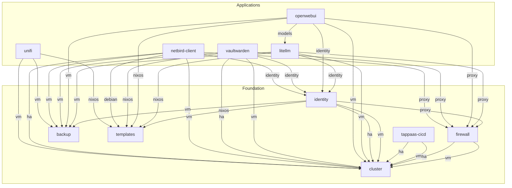

# TAPPaaS Module Dependency Graph

This document shows the service dependencies between TAPPaaS foundation and application modules.
Each arrow points from a **consumer** module to the **provider** module it depends on, labeled with the service name.

Generated: 2026-02-25

## Dependency Graph

```mermaid
graph TD
    subgraph Applications
        litellm[litellm]
        openwebui[openwebui]
        vaultwarden[vaultwarden]
        netbird-client[netbird-client]
        unifi[unifi]
    end

    subgraph Foundation
        firewall[firewall]
        tappaas-cicd[tappaas-cicd]
        identity[identity]
        backup[backup]
        templates[templates]
        cluster[cluster]
    end

    %% firewall depends on cluster
    firewall -->|vm| cluster
    firewall -->|ha| cluster

    %% tappaas-cicd depends on cluster
    tappaas-cicd -->|vm| cluster
    tappaas-cicd -->|ha| cluster

    %% identity depends on cluster, templates, backup, firewall
    identity -->|vm| cluster
    identity -->|ha| cluster
    identity -->|nixos| templates
    identity -->|vm| backup
    identity -->|proxy| firewall

    %% litellm depends on cluster, templates, backup, identity, firewall
    litellm -->|vm| cluster
    litellm -->|nixos| templates
    litellm -->|vm| backup
    litellm -->|identity| identity
    litellm -->|proxy| firewall

    %% openwebui depends on cluster, templates, backup, identity, firewall, litellm
    openwebui -->|vm| cluster
    openwebui -->|nixos| templates
    openwebui -->|vm| backup
    openwebui -->|identity| identity
    openwebui -->|proxy| firewall
    openwebui -->|models| litellm

    %% vaultwarden depends on cluster, templates, backup, identity, firewall
    vaultwarden -->|vm| cluster
    vaultwarden -->|ha| cluster
    vaultwarden -->|nixos| templates
    vaultwarden -->|vm| backup
    vaultwarden -->|identity| identity
    vaultwarden -->|proxy| firewall

    %% netbird-client depends on cluster, templates, backup, identity, firewall
    netbird-client -->|vm| cluster
    netbird-client -->|ha| cluster
    netbird-client -->|debian| templates
    netbird-client -->|vm| backup
    netbird-client -->|identity| identity
    netbird-client -->|proxy| firewall

    %% unifi depends on cluster, templates, backup
    unifi -->|vm| cluster
    unifi -->|nixos| templates
    unifi -->|vm| backup
```

## Module Summary

| Module | Category | Provides | Depends On |
|--------|----------|----------|------------|
| cluster | Foundation (provider-only) | vm, ha | _(none)_ |
| templates | Foundation (provider-only) | nixos, debian | _(none)_ |
| firewall | Foundation | firewall, proxy | cluster:vm, cluster:ha |
| tappaas-cicd | Foundation | _(none)_ | cluster:vm, cluster:ha |
| backup | Foundation | vm | _(none)_ |
| identity | Foundation | accessControl, identity | cluster:vm, cluster:ha, templates:nixos, backup:vm, firewall:proxy |
| litellm | Application | models | cluster:vm, templates:nixos, backup:vm, identity:identity, firewall:proxy |
| openwebui | Application | _(none)_ | cluster:vm, templates:nixos, backup:vm, identity:identity, firewall:proxy, litellm:models |
| vaultwarden | Application | _(none)_ | cluster:vm, cluster:ha, templates:nixos, backup:vm, identity:identity, firewall:proxy |
| netbird-client | Application | _(none)_ | cluster:vm, cluster:ha, templates:debian, backup:vm, identity:identity, firewall:proxy |
| unifi | Application | _(none)_ | cluster:vm, templates:nixos, backup:vm |

## Service Provider Summary

| Service | Provider | Consumed By |
|---------|----------|-------------|
| vm | cluster | firewall, tappaas-cicd, identity, litellm, openwebui, vaultwarden, netbird-client, unifi |
| ha | cluster | firewall, tappaas-cicd, identity, vaultwarden, netbird-client |
| nixos | templates | identity, litellm, openwebui, vaultwarden, unifi |
| debian | templates | netbird-client |
| vm | backup | identity, litellm, openwebui, vaultwarden, netbird-client, unifi |
| proxy | firewall | identity, litellm, openwebui, vaultwarden, netbird-client |
| identity | identity | litellm, openwebui, vaultwarden, netbird-client |
| models | litellm | openwebui |
| firewall | firewall | _(no consumers yet)_ |
| accessControl | identity | _(no consumers yet)_ |
