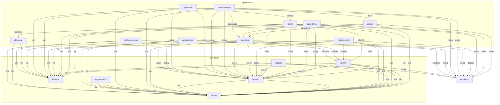

# TAPPaaS Module Dependency Graph

Arrows point from a **consumer** module to the **provider** module it depends on, labeled with the service used (`dependsOn: "provider:service"`). Foundation/provider modules sit at the bottom; applications at the top.

_Generated: 2026-06-23_

```mermaid
graph TD
    subgraph Applications
        litellm
        openwebui
        vllm-amd
        vaultwarden
        windows-server
        netbird-client
        nextcloud
        coturn
        nextcloud-hpb
        euro-office
    end
    subgraph Foundation
        network
        tappaas-cicd
        identity
        logging
        backup
        cluster
    end

    coturn -->|vm| backup
    coturn -->|vm| cluster
    coturn -->|rules| network
    coturn -->|fileservice| nextcloud
    coturn -->|nixos| templates
    euro-office -->|vm| backup
    euro-office -->|vm| cluster
    euro-office -->|proxy| network
    euro-office -->|rules| network
    euro-office -->|fileservice| nextcloud
    euro-office -->|nixos| templates
    identity -->|vm| backup
    identity -->|ha| cluster
    identity -->|vm| cluster
    identity -->|proxy| network
    identity -->|nixos| templates
    litellm -->|vm| backup
    litellm -->|vm| cluster
    litellm -->|identity| identity
    litellm -->|proxy| network
    litellm -->|rules| network
    litellm -->|nixos| templates
    litellm -->|inference| vllm-amd
    logging -->|vm| backup
    logging -->|vm| cluster
    logging -->|proxy| network
    logging -->|nixos| templates
    netbird-client -->|vm| backup
    netbird-client -->|ha| cluster
    netbird-client -->|vm| cluster
    netbird-client -->|identity| identity
    netbird-client -->|proxy| network
    netbird-client -->|debian| templates
    network -->|ha| cluster
    network -->|vm| cluster
    nextcloud -->|vm| backup
    nextcloud -->|vm| cluster
    nextcloud -->|identity| identity
    nextcloud -->|proxy| network
    nextcloud -->|rules| network
    nextcloud -->|nixos| templates
    nextcloud-hpb -->|vm| backup
    nextcloud-hpb -->|vm| cluster
    nextcloud-hpb -->|turn| coturn
    nextcloud-hpb -->|proxy| network
    nextcloud-hpb -->|rules| network
    nextcloud-hpb -->|fileservice| nextcloud
    nextcloud-hpb -->|nixos| templates
    openwebui -->|vm| backup
    openwebui -->|vm| cluster
    openwebui -->|models| litellm
    openwebui -->|proxy| network
    openwebui -->|rules| network
    openwebui -->|nixos| templates
    tappaas-cicd -->|ha| cluster
    tappaas-cicd -->|vm| cluster
    vaultwarden -->|vm| backup
    vaultwarden -->|ha| cluster
    vaultwarden -->|vm| cluster
    vaultwarden -->|identity| identity
    vaultwarden -->|proxy| network
    vaultwarden -->|nixos| templates
    vllm-amd -->|vm| backup
    vllm-amd -->|lxc| cluster
    windows-server -->|vm| backup
    windows-server -->|vm| cluster
    windows-server -->|proxy| network
    windows-server -->|windows| templates
```

## Module summary

| Module | Provides | Depends on |
|--------|----------|------------|
| network | firewall, proxy, rules, discovery, dns, nat | cluster:vm, cluster:ha, network:proxy |
| tappaas-cicd | — | cluster:vm, cluster:ha |
| identity | accessControl, identity | cluster:vm, cluster:ha, templates:nixos, backup:vm, network:proxy |
| logging | — | cluster:vm, templates:nixos, backup:vm, network:proxy |
| backup | vm, remote, external | — |
| litellm | models | cluster:vm, templates:nixos, backup:vm, identity:identity, network:proxy, network:rules, vllm-amd:inference |
| openwebui | — | cluster:vm, templates:nixos, backup:vm, network:proxy, litellm:models, network:rules |
| vllm-amd | inference | cluster:lxc, backup:vm |
| vaultwarden | — | cluster:vm, cluster:ha, templates:nixos, backup:vm, identity:identity, network:proxy |
| windows-server | — | cluster:vm, templates:windows, backup:vm, network:proxy |
| netbird-client | — | cluster:vm, cluster:ha, templates:debian, backup:vm, identity:identity, network:proxy |
| nextcloud | fileservice | cluster:vm, templates:nixos, backup:vm, network:proxy, network:rules, identity:identity |
| coturn | turn | backup:vm, cluster:vm, network:rules, nextcloud:fileservice, templates:nixos |
| nextcloud-hpb | — | backup:vm, cluster:vm, coturn:turn, network:proxy, network:rules, nextcloud:fileservice, templates:nixos |
| euro-office | — | cluster:vm, templates:nixos, backup:vm, network:proxy, network:rules, nextcloud:fileservice |
| cluster | vm, lxc, ha | — |

