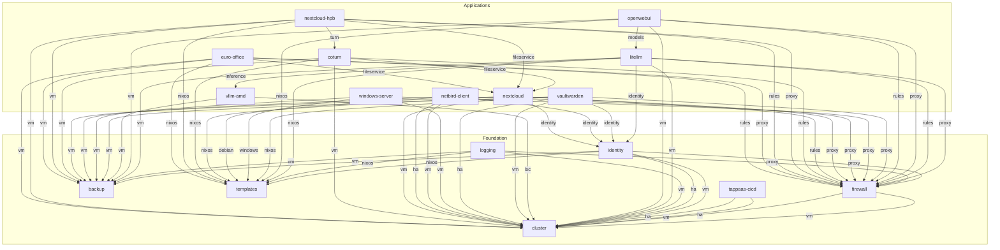

# TAPPaaS Module Dependency Graph

This graph shows the dependency relationships between all TAPPaaS foundation and
application modules. Each **arrow points from a consumer module down to the
provider module** it depends on, and is **labeled with the service** the consumer
uses (`consumer -->|service| provider`).

Modules are grouped into two subgraphs:

- **Applications** — application modules (the consumers, shown at the top)
- **Foundation** — foundation modules plus the provider-only `cluster` and
  `templates` modules (the lower-level providers, shown at the bottom)

> Generated: 2026-06-16

## Graph

```mermaid
graph TD
    subgraph Applications
        litellm
        openwebui
        vllm-amd
        vaultwarden
        windows-server
        netbird-client
        nextcloud
        coturn
        nextcloud-hpb
        euro-office
    end
    subgraph Foundation
        firewall
        tappaas-cicd
        identity
        logging
        backup
        templates
        cluster
    end

    firewall -->|vm| cluster
    firewall -->|ha| cluster
    tappaas-cicd -->|vm| cluster
    tappaas-cicd -->|ha| cluster
    identity -->|vm| cluster
    identity -->|ha| cluster
    identity -->|nixos| templates
    identity -->|vm| backup
    identity -->|proxy| firewall
    logging -->|vm| cluster
    logging -->|nixos| templates
    logging -->|vm| backup
    logging -->|proxy| firewall
    litellm -->|vm| cluster
    litellm -->|nixos| templates
    litellm -->|vm| backup
    litellm -->|identity| identity
    litellm -->|proxy| firewall
    litellm -->|rules| firewall
    litellm -->|inference| vllm-amd
    openwebui -->|vm| cluster
    openwebui -->|nixos| templates
    openwebui -->|vm| backup
    openwebui -->|proxy| firewall
    openwebui -->|rules| firewall
    openwebui -->|models| litellm
    vllm-amd -->|lxc| cluster
    vllm-amd -->|vm| backup
    vaultwarden -->|vm| cluster
    vaultwarden -->|ha| cluster
    vaultwarden -->|nixos| templates
    vaultwarden -->|vm| backup
    vaultwarden -->|identity| identity
    vaultwarden -->|proxy| firewall
    windows-server -->|vm| cluster
    windows-server -->|windows| templates
    windows-server -->|vm| backup
    windows-server -->|proxy| firewall
    netbird-client -->|vm| cluster
    netbird-client -->|ha| cluster
    netbird-client -->|debian| templates
    netbird-client -->|vm| backup
    netbird-client -->|identity| identity
    netbird-client -->|proxy| firewall
    nextcloud -->|vm| cluster
    nextcloud -->|nixos| templates
    nextcloud -->|vm| backup
    nextcloud -->|proxy| firewall
    nextcloud -->|rules| firewall
    nextcloud -->|identity| identity
    coturn -->|vm| backup
    coturn -->|vm| cluster
    coturn -->|rules| firewall
    coturn -->|fileservice| nextcloud
    coturn -->|nixos| templates
    nextcloud-hpb -->|vm| backup
    nextcloud-hpb -->|vm| cluster
    nextcloud-hpb -->|turn| coturn
    nextcloud-hpb -->|proxy| firewall
    nextcloud-hpb -->|rules| firewall
    nextcloud-hpb -->|fileservice| nextcloud
    nextcloud-hpb -->|nixos| templates
    euro-office -->|vm| cluster
    euro-office -->|nixos| templates
    euro-office -->|vm| backup
    euro-office -->|proxy| firewall
    euro-office -->|rules| firewall
    euro-office -->|fileservice| nextcloud
```

## Summary

| Module | Provides | Depends On |
|--------|----------|------------|
| **firewall** | firewall, proxy, rules, discovery, dns, nat | cluster:vm, cluster:ha, firewall:proxy |
| **tappaas-cicd** | — | cluster:vm, cluster:ha |
| **identity** | accessControl, identity | cluster:vm, cluster:ha, templates:nixos, backup:vm, firewall:proxy |
| **logging** | — | cluster:vm, templates:nixos, backup:vm, firewall:proxy |
| **backup** | vm, remote, external | — |
| **templates** | nixos, debian, windows | cluster:vm |
| **cluster** | vm, lxc, ha | — |
| **litellm** | models | cluster:vm, templates:nixos, backup:vm, identity:identity, firewall:proxy, firewall:rules, vllm-amd:inference |
| **openwebui** | — | cluster:vm, templates:nixos, backup:vm, firewall:proxy, litellm:models, firewall:rules |
| **vllm-amd** | inference | cluster:lxc, backup:vm |
| **vaultwarden** | — | cluster:vm, cluster:ha, templates:nixos, backup:vm, identity:identity, firewall:proxy |
| **windows-server** | — | cluster:vm, templates:windows, backup:vm, firewall:proxy |
| **netbird-client** | — | cluster:vm, cluster:ha, templates:debian, backup:vm, identity:identity, firewall:proxy |
| **nextcloud** | fileservice | cluster:vm, templates:nixos, backup:vm, firewall:proxy, firewall:rules, identity:identity |
| **coturn** | turn | backup:vm, cluster:vm, firewall:rules, nextcloud:fileservice, templates:nixos |
| **nextcloud-hpb** | — | backup:vm, cluster:vm, coturn:turn, firewall:proxy, firewall:rules, nextcloud:fileservice, templates:nixos |
| **euro-office** | — | cluster:vm, templates:nixos, backup:vm, firewall:proxy, firewall:rules, nextcloud:fileservice |

## Notes

- `unifi` is listed in `src/module-catalog.json` but has no JSON file on disk
  (`src/apps/unifi/` does not exist), so it is excluded from the graph.
- Dependencies reference a `templates` provider for the `nixos`, `debian`, and
  `windows` services. These are resolved to a single `templates` foundation node
  (the catalog's `proxmoxTemplates` `template.json` entry is stale / missing on
  disk; `templates.json` provides `nixos`/`debian` and `tappaas-winserver.json`
  provides `windows`).
- The `firewall -->|proxy| firewall` self-dependency is omitted from the graph as
  a self-loop carries no ordering information.
- Edges are deduplicated by `(consumer, provider, service)`.
