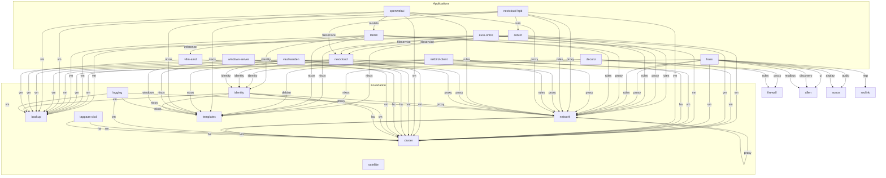

# TAPPaaS Module Dependency Graph

Arrows point from a **consumer** module to the **provider** module it depends on, labeled with the service used (`dependsOn: "provider:service"`). Foundation/provider modules sit at the bottom; applications at the top.

_Generated: 2026-07-11 by generate-module-dependencies.sh — do not edit by hand._

```mermaid
graph TD
    subgraph Applications
        coturn
        deconz
        euro-office
        hass
        litellm
        netbird-client
        nextcloud-hpb
        nextcloud
        openwebui
        vaultwarden
        vllm-amd
        windows-server
    end
    subgraph Foundation
        backup
        cluster
        identity
        logging
        network
        satellite
        tappaas-cicd
        templates
    end

    coturn -->|vm| backup
    coturn -->|vm| cluster
    coturn -->|rules| network
    coturn -->|fileservice| nextcloud
    coturn -->|nixos| templates
    deconz -->|vm| cluster
    deconz -->|nixos| templates
    deconz -->|vm| backup
    deconz -->|proxy| firewall
    deconz -->|rules| firewall
    euro-office -->|vm| cluster
    euro-office -->|nixos| templates
    euro-office -->|vm| backup
    euro-office -->|proxy| network
    euro-office -->|rules| network
    euro-office -->|fileservice| nextcloud
    hass -->|vm| cluster
    hass -->|vm| backup
    hass -->|proxy| network
    hass -->|rules| network
    hass -->|ui| alfen
    hass -->|discovery| alfen
    hass -->|modbus| alfen
    hass -->|audio| sonos
    hass -->|airplay| sonos
    hass -->|rtsp| reolink
    litellm -->|vm| cluster
    litellm -->|nixos| templates
    litellm -->|vm| backup
    litellm -->|identity| identity
    litellm -->|proxy| network
    litellm -->|rules| network
    litellm -->|inference| vllm-amd
    netbird-client -->|vm| cluster
    netbird-client -->|ha| cluster
    netbird-client -->|debian| templates
    netbird-client -->|vm| backup
    netbird-client -->|identity| identity
    netbird-client -->|proxy| network
    nextcloud-hpb -->|vm| backup
    nextcloud-hpb -->|vm| cluster
    nextcloud-hpb -->|turn| coturn
    nextcloud-hpb -->|proxy| network
    nextcloud-hpb -->|rules| network
    nextcloud-hpb -->|fileservice| nextcloud
    nextcloud-hpb -->|nixos| templates
    nextcloud -->|vm| cluster
    nextcloud -->|nixos| templates
    nextcloud -->|vm| backup
    nextcloud -->|proxy| network
    nextcloud -->|rules| network
    nextcloud -->|identity| identity
    openwebui -->|vm| cluster
    openwebui -->|nixos| templates
    openwebui -->|vm| backup
    openwebui -->|proxy| network
    openwebui -->|models| litellm
    openwebui -->|rules| network
    vaultwarden -->|vm| cluster
    vaultwarden -->|ha| cluster
    vaultwarden -->|nixos| templates
    vaultwarden -->|vm| backup
    vaultwarden -->|identity| identity
    vaultwarden -->|proxy| network
    vllm-amd -->|lxc| cluster
    vllm-amd -->|vm| backup
    windows-server -->|vm| cluster
    windows-server -->|windows| templates
    windows-server -->|vm| backup
    windows-server -->|proxy| network
    identity -->|vm| cluster
    identity -->|ha| cluster
    identity -->|nixos| templates
    identity -->|vm| backup
    identity -->|proxy| network
    logging -->|vm| cluster
    logging -->|nixos| templates
    logging -->|vm| backup
    logging -->|proxy| network
    network -->|vm| cluster
    network -->|ha| cluster
    network -->|proxy| network
    tappaas-cicd -->|vm| cluster
    tappaas-cicd -->|ha| cluster
```
