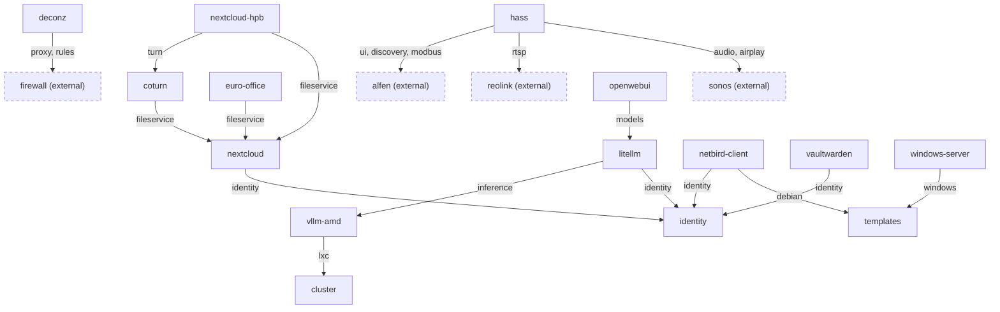

# TAPPaaS Module Dependency Model

Computed from every module's `<module>.json` (`dependsOn: "provider:service"`).
Three views: the platform plumbing every module uses, the application topology
worth drawing, and the complete per-module reference.

_Generated: 2026-07-11 by generate-module-dependencies.sh from 20 modules / 84 dependencies — do not edit by hand._

## 1. Platform plumbing

These foundation services are consumed near-universally; drawing them would
bury the interesting structure. A module uses them unless its entry in the
reference below says otherwise.

| Service | Consumers (of 20 modules) |
|---------|----------|
| `cluster:vm` | 15 |
| `backup:vm` | 14 |
| `network:proxy` | 12 |
| `templates:nixos` | 10 |
| `network:rules` | 7 |
| `cluster:ha` | 5 |

## 2. Application topology

Everything that is *not* plumbing — the dependencies that shape the platform.
Multiple services between the same pair are merged into one labeled edge;
providers marked `(external)` have no module in this repo yet.

```mermaid
graph TD
    coturn -->|"fileservice"| nextcloud
    deconz -->|"proxy, rules"| firewall
    euro-office -->|"fileservice"| nextcloud
    hass -->|"audio, airplay"| sonos
    hass -->|"rtsp"| reolink
    hass -->|"ui, discovery, modbus"| alfen
    litellm -->|"identity"| identity
    litellm -->|"inference"| vllm-amd
    netbird-client -->|"debian"| templates
    netbird-client -->|"identity"| identity
    nextcloud -->|"identity"| identity
    nextcloud-hpb -->|"fileservice"| nextcloud
    nextcloud-hpb -->|"turn"| coturn
    openwebui -->|"models"| litellm
    vaultwarden -->|"identity"| identity
    vllm-amd -->|"lxc"| cluster
    windows-server -->|"windows"| templates
    alfen["alfen (external)"]:::ext
    classDef ext stroke-dasharray: 5 5
    firewall["firewall (external)"]:::ext
    reolink["reolink (external)"]:::ext
    sonos["sonos (external)"]:::ext
```

## 3. Complete reference

Every dependency of every module, verbatim from the json contracts.

| Module | Depends on |
|--------|------------|
| **backup** | — |
| **cluster** | — |
| **coturn** | `backup:vm` `cluster:vm` `network:rules` `nextcloud:fileservice` `templates:nixos`  |
| **deconz** | `cluster:vm` `templates:nixos` `backup:vm` `firewall:proxy` `firewall:rules`  |
| **euro-office** | `cluster:vm` `templates:nixos` `backup:vm` `network:proxy` `network:rules` `nextcloud:fileservice`  |
| **hass** | `cluster:vm` `backup:vm` `network:proxy` `network:rules` `alfen:ui` `alfen:discovery` `alfen:modbus` `sonos:audio` `sonos:airplay` `reolink:rtsp`  |
| **identity** | `cluster:vm` `cluster:ha` `templates:nixos` `backup:vm` `network:proxy`  |
| **litellm** | `cluster:vm` `templates:nixos` `backup:vm` `identity:identity` `network:proxy` `network:rules` `vllm-amd:inference`  |
| **logging** | `cluster:vm` `templates:nixos` `backup:vm` `network:proxy`  |
| **netbird-client** | `cluster:vm` `cluster:ha` `templates:debian` `backup:vm` `identity:identity` `network:proxy`  |
| **network** | `cluster:vm` `cluster:ha` `network:proxy`  |
| **nextcloud** | `cluster:vm` `templates:nixos` `backup:vm` `network:proxy` `network:rules` `identity:identity`  |
| **nextcloud-hpb** | `backup:vm` `cluster:vm` `coturn:turn` `network:proxy` `network:rules` `nextcloud:fileservice` `templates:nixos`  |
| **openwebui** | `cluster:vm` `templates:nixos` `backup:vm` `network:proxy` `litellm:models` `network:rules`  |
| **satellite** | — |
| **tappaas-cicd** | `cluster:vm` `cluster:ha`  |
| **templates** | — |
| **vaultwarden** | `cluster:vm` `cluster:ha` `templates:nixos` `backup:vm` `identity:identity` `network:proxy`  |
| **vllm-amd** | `cluster:lxc` `backup:vm`  |
| **windows-server** | `cluster:vm` `templates:windows` `backup:vm` `network:proxy`  |
